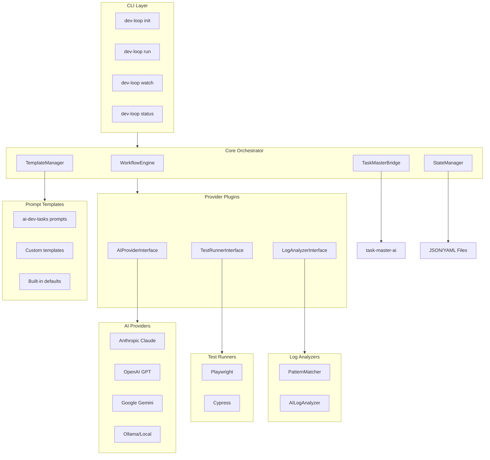
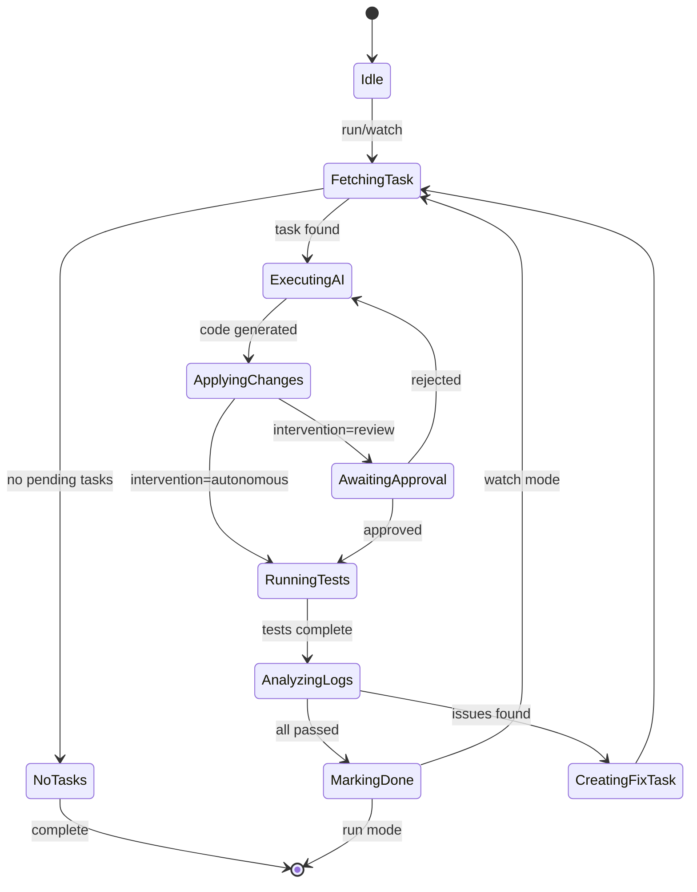

# dev-loop: Automated Development Workflow Orchestrator

## Summary

A TypeScript CLI application with daemon mode that wraps `task-master-ai` to orchestrate the PRD-to-validated-code workflow. Supports multiple AI providers, Playwright + Cypress testing, hybrid log analysis, configurable automation levels, and optional integration with [ai-dev-tasks](https://github.com/snarktank/ai-dev-tasks) prompt templates.

## Core Capability: Iterative Feature + Test Development

For any PRD in any project, dev-loop will:

1. Parse PRD into tasks that **bundle feature code + test code together**
2. Send each task to the AI provider with context for both implementation AND tests
3. Run tests immediately after code generation
4. Analyze logs for hidden errors
5. Create fix tasks when issues are found
6. Loop until PRD is 100% complete

## Architecture Overview




## Project Structure

```javascript
dev-loop/
├── package.json
├── tsconfig.json
├── Dockerfile
├── .github/
│   └── workflows/
│       └── ci.yml
├── src/
│   ├── index.ts                 # CLI entry point
│   ├── cli/
│   │   ├── commands/
│   │   │   ├── init.ts          # Interactive wizard
│   │   │   ├── run.ts           # Single execution
│   │   │   ├── watch.ts         # Daemon mode
│   │   │   └── status.ts        # Current state
│   │   └── prompts.ts           # Wizard prompts
│   ├── core/
│   │   ├── workflow-engine.ts   # Main orchestration loop
│   │   ├── task-bridge.ts       # task-master-ai wrapper
│   │   ├── state-manager.ts     # Local file persistence
│   │   ├── template-manager.ts  # Prompt template loading
│   │   └── intervention.ts      # Human approval gates
│   ├── providers/
│   │   ├── ai/
│   │   │   ├── interface.ts     # AIProvider interface
│   │   │   ├── anthropic.ts
│   │   │   ├── openai.ts
│   │   │   ├── gemini.ts
│   │   │   └── ollama.ts
│   │   ├── test-runners/
│   │   │   ├── interface.ts     # TestRunner interface
│   │   │   ├── playwright.ts
│   │   │   └── cypress.ts
│   │   └── log-analyzers/
│   │       ├── interface.ts     # LogAnalyzer interface
│   │       ├── pattern-matcher.ts
│   │       └── ai-analyzer.ts
│   ├── templates/
│   │   ├── index.ts             # Template registry
│   │   ├── builtin/
│   │   │   ├── create-prd.md    # Built-in PRD template
│   │   │   └── generate-tasks.md
│   │   └── ai-dev-tasks/        # Optional: bundled ai-dev-tasks
│   │       ├── create-prd.md
│   │       └── generate-tasks.md
│   ├── config/
│   │   ├── schema.ts            # Config validation (zod)
│   │   ├── loader.ts            # Load devloop.config.js
│   │   └── defaults.ts          # Sensible defaults
│   └── types/
│       └── index.ts             # Shared types
├── templates/
│   └── devloop.config.js        # Template config
└── tests/
    └── ...
```


## Key Components

### 1. CLI Commands (using Commander.js)

| Command | Description |

|---------|-------------|

| `dev-loop init` | Interactive wizard to create `devloop.config.js` |

| `dev-loop init --template ai-dev-tasks` | Use ai-dev-tasks prompts |

| `dev-loop run` | Execute one iteration of the workflow loop |

| `dev-loop watch` | Daemon mode - continuous execution until PRD complete |

| `dev-loop status` | Show current task progress and state |

| `dev-loop logs` | View/analyze recent logs |

### 2. Configuration File (`devloop.config.js`)

```javascript
module.exports = {
  // AI Provider configuration
  ai: {
    provider: 'anthropic',
    model: 'claude-sonnet-4-20250514',
    fallback: 'openai:gpt-4o',
  },

  // Prompt templates (NEW)
  templates: {
    source: 'ai-dev-tasks', // 'builtin' | 'ai-dev-tasks' | 'custom'
    customPath: './my-templates/', // Only if source: 'custom'
  },

  // Test runner configuration
  testing: {
    runner: 'playwright',
    command: 'npm test',
    timeout: 300000,
    artifactsDir: 'test-results',
  },

  // Log analysis configuration
  logs: {
    sources: [
      { type: 'file', path: '/var/log/app.log' },
      { type: 'command', command: 'ddev exec tail -100 /var/log/drupal.log' },
    ],
    patterns: {
      error: /Error|Exception|Fatal/i,
      warning: /Warning|Deprecated/i,
    },
    useAI: true,
  },

  // Intervention mode
  intervention: {
    mode: 'autonomous', // autonomous | review | hybrid
    approvalRequired: ['delete', 'schema-change'],
  },

  // Task Master integration
  taskMaster: {
    tasksPath: '.taskmaster/tasks/tasks.json',
  },
};
```


### 3. Template Manager

The TemplateManager loads prompt templates from configurable sources:

```typescript
interface TemplateManager {
  // Load PRD creation prompt
  getPRDTemplate(): Promise<string>;
  
  // Load task generation prompt  
  getTaskGenerationTemplate(): Promise<string>;
  
  // List available template sources
  listSources(): TemplateSource[];
}

// Sources:
// 1. 'builtin' - Minimal default prompts shipped with dev-loop
// 2. 'ai-dev-tasks' - Bundled prompts from snarktank/ai-dev-tasks
// 3. 'custom' - User-provided templates from customPath
```


### 4. Workflow Engine State Machine




## Implementation Phases

### Phase 1: Project Setup and Core Structure

- Initialize npm project with TypeScript, ESLint, Prettier
- Set up Commander.js CLI skeleton
- Create configuration schema with Zod validation
- Build interactive init wizard with Inquirer

### Phase 2: Template System

- Create TemplateManager for loading prompt templates
- Bundle ai-dev-tasks prompts as optional source
- Support custom template directories
- Wire templates into PRD parsing and task generation

### Phase 3: Task Master Integration

- Create TaskMasterBridge to wrap task-master-ai
- Implement StateManager for local JSON/YAML persistence
- Build workflow engine state machine

### Phase 4: AI Provider Abstraction

- Define AIProvider interface
- Implement Anthropic, OpenAI, Gemini, Ollama providers
- Build provider factory with fallback support

### Phase 5: Test Runner Integration

- Define TestRunner interface
- Implement Playwright and Cypress runners
- Handle artifacts collection

### Phase 6: Log Analysis

- Implement PatternMatcher for regex-based detection
- Implement AILogAnalyzer for intelligent analysis
- Build hybrid analyzer

### Phase 7: Intervention System and Daemon Mode

- Implement approval gates for review mode
- Implement watch command with file system monitoring
- Add graceful shutdown handling

### Phase 8: Distribution

- Configure npm publishing
- Create Dockerfile
- Create CI-agnostic output formats
- Write comprehensive README

## Dependencies

| Package | Purpose |

|---------|---------|

| `task-master-ai` | Task management (wrapped) |

| `commander` | CLI framework |

| `inquirer` | Interactive prompts |

| `zod` | Config validation |

| `@anthropic-ai/sdk` | Claude API |

| `openai` | GPT API |

| `@google/generative-ai` | Gemini API |

| `chalk` | Terminal colors |

| `ora` | Spinners |

| `chokidar` | File watching (daemon) |

## Output Formats (CI-Agnostic)

- `devloop-results.json` - Structured JSON with all task results
- `devloop-results.xml` - JUnit XML format for CI integration
- `devloop-summary.md` - Human-readable markdown summary