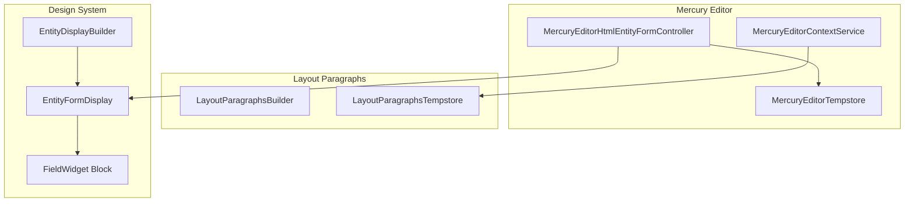
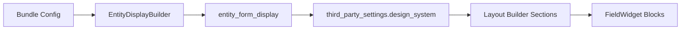
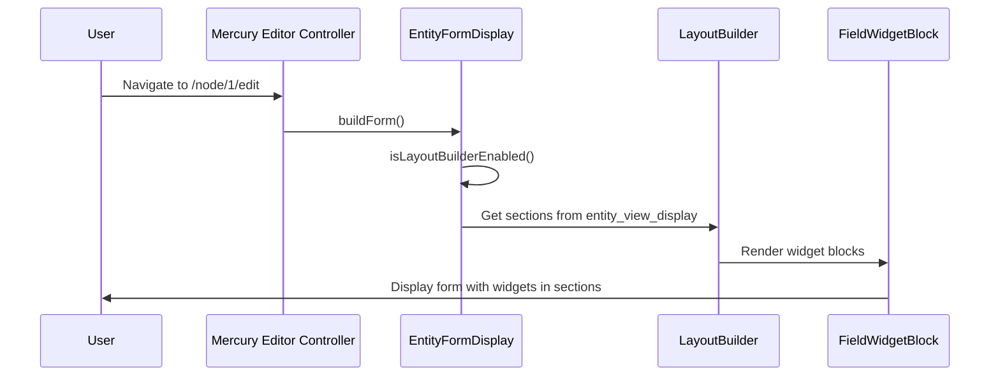

# Design System Implementation PRD

<!-- DEV-LOOP METADATA -->
<!--
prd_id: design_system
version: 1.0.0
status: ready
tasks_path: .taskmaster/tasks/tasks.json
test_directory: tests/playwright/design-system/
-->

## Overview

This PRD guides dev-loop through implementing, validating, and extending the Design System module. The system models **DOM as Content** - the Document Object Model is structured as content entities, enabling deterministic rendering where every pixel is known at every animated moment in time.

**Reference Documentation**: [docs/displays/design_system.md](../../docs/displays/design_system.md)

**Test Reference**: Tests in `tests/playwright/design-system/` serve as reference implementations. Agents should use these tests as starting points and extend them as needed during task implementation.

---

## Prerequisites

Before executing this PRD with dev-loop, complete the following setup:

### 1. Activate PRD

Move this PRD from planning to active docs:

```bash
mv .taskmaster/planning/design_system_prd.md .taskmaster/docs/design_system_prd.md
```

### 2. Update devloop.config.js

Update your `devloop.config.js` to include the full design_system configuration with the new schema:

```javascript
// devloop.config.js - Full configuration for design_system PRD
module.exports = {
  // Debug mode for detailed output
  debug: true,
  metrics: {
    enabled: true,
    path: '.devloop/metrics.json',
  },

  // AI Provider configuration
  ai: {
    provider: 'anthropic',
    model: 'claude-sonnet-4-20250514',
    fallback: 'openai:gpt-4o',
    apiKey: process.env.ANTHROPIC_API_KEY,
  },

  // Template configuration
  templates: {
    source: 'builtin',
  },

  // Test runner configuration
  testing: {
    runner: 'playwright',
    command: 'npx playwright test tests/playwright/design-system/',
    timeout: 300000, // 5 minutes
    artifactsDir: 'test-results',
  },

  // Smoke test validation
  validation: {
    enabled: true,
    baseUrl: 'https://sysf.ddev.site',
    urls: ['/node/30', '/theme_entity/21/edit', '/admin/structure/types'],
    timeout: 30000,
    authCommand: 'ddev exec drush uli',
  },

  // Log analysis configuration
  logs: {
    sources: [
      { type: 'command', command: 'ddev logs -s web --tail 100' },
    ],
    patterns: {
      error: /Error|Exception|Fatal|CRITICAL|PHP Fatal/i,
      warning: /Warning|Deprecated|Notice/i,
    },
    useAI: true,
  },

  // Intervention mode - fully autonomous for design_system
  intervention: {
    mode: 'autonomous',
    approvalRequired: [],
  },

  // Task Master integration
  taskMaster: {
    tasksPath: '.taskmaster/tasks/tasks.json',
  },

  // Lifecycle hooks
  hooks: {
    preTest: ['ddev exec bash -c "drush cr"'],
    postApply: ['ddev exec bash -c "drush cr"'],
  },

  // Codebase search configuration
  codebase: {
    searchDirs: [
      'docroot/modules/share/design_system',
      'docroot/modules/share/bd/src',
      'docroot/modules/share/openapi_entity/src',
      'config/default',
    ],
  },

  // Framework configuration for Drupal
  framework: {
    type: 'drupal',
    rules: [
      'Use #[Hook()] attributes instead of procedural hooks',
      'Use config_schema_subform for all configuration forms',
      'All plugins must extend EntityPluginBase',
      'Run drush cr after any code change',
    ],
  },

  // Enhanced context for better AI prompts
  context: {
    includeSkeleton: true,
    includeImports: true,
    maxHelperSignatures: 20,
  },

  // Pre-apply validation
  preValidation: {
    enabled: true,
    maxRetries: 2,
    validateSyntax: true,
  },

  // Pattern learning
  patternLearning: {
    enabled: true,
    patternsPath: '.devloop/patterns.json',
    useBuiltinPatterns: true,
  },

  // Autonomous execution
  autonomous: {
    enabled: true,
    skipInvestigation: true,
    testGeneration: {
      framework: 'playwright',
      testDir: 'tests/playwright/design-system',
    },
    maxIterations: 50,
    maxTaskRetries: 3,
  },

  // PRD configuration
  prd: {
    defaultPath: '.taskmaster/docs/design_system_prd.md',
    resolveDependencies: true,
    statusTracking: {
      enabled: true,
      outputPath: '.devloop/design-system-status.json',
    },
  },

  // ========================================
  // DESIGN SYSTEM MODULE CONFIGURATION
  // ========================================
  designSystem: {
    // Theme entity configuration
    themeEntity: {
      testEntityId: 21,
      editUrl: '/theme_entity/{id}/edit',
      tabs: ['Theme', 'Layout', 'Components', 'Elements', 'Colors', 'Fonts', 'Devices', 'Integrations'],
      fields: [
        { name: 'field_layout', type: 'entity_reference_revisions', required: false },
        { name: 'field_color_scheme', type: 'entity_reference', required: false },
        { name: 'field_dom_tag', type: 'entity_reference', required: false },
        { name: 'field_breakpoint', type: 'entity_reference', required: false },
        { name: 'field_font', type: 'entity_reference', required: false },
      ],
    },

    // Paragraph entity configuration
    paragraph: {
      containerField: {
        name: 'container',
        type: 'entity_reference_revisions',
        targetType: 'paragraph',
        maxDepth: 10,
      },
      layoutTypes: [
        { id: 'layout', label: 'Layout', regions: ['header', 'content', 'footer', 'sidebar_left', 'sidebar_right'] },
        { id: 'layout_row', label: 'Layout Row', regions: ['left', 'center', 'right'] },
        { id: 'region', label: 'Region', regions: [] },
      ],
    },

    // DOM entity configuration
    dom: {
      expectedBundleCount: 25,
      cssGeneration: {
        outputDir: 'public://design-system/auto/dom/',
        filePattern: '{id}.css',
        buildMethod: 'buildCss',
        bindMethod: 'bindToElement',
      },
    },

    // Device/breakpoint configuration
    device: {
      defaultBreakpoints: [
        { name: 'mobile', minWidth: 0, maxWidth: 767 },
        { name: 'tablet', minWidth: 768, maxWidth: 1023 },
        { name: 'desktop', minWidth: 1024 },
      ],
    },

    // IPE Builder configuration
    ipeBuilder: {
      fieldWidgetBlock: {
        pluginPrefix: 'field_widget:',
        expectedCount: 100,
        deriverClass: 'Drupal\\design_system\\Plugin\\Derivative\\FieldWidgetDeriver',
        blockClass: 'Drupal\\design_system\\Plugin\\Block\\FieldWidget',
      },
      mercuryEditor: {
        formOperation: 'mercury_editor',
        tempstoreService: 'mercury_editor.tempstore_repository',
        contextService: 'mercury_editor.context',
      },
    },

    // Playwright validation selectors
    playwrightValidation: {
      selectors: {
        domId: { selector: '[data-dom-id]', minCount: 1 },
        htmlDomId: { selector: 'html[data-dom-id]', minCount: 1 },
        region: { selector: '[data-region]', minCount: 3, expectedRegions: ['header', 'content', 'footer'] },
        themeTabs: { selector: '.vertical-tabs__menu-item', minCount: 8 },
        mercuryEditor: { container: '[data-mercury-editor]', toolbar: '.mercury-editor-toolbar' },
        layoutSection: { selector: '.layout-section', minCount: 1 },
      },
      pages: [
        {
          name: 'Frontend test node',
          url: '/node/30',
          assertions: [
            { selector: 'html', assertion: 'attribute', attribute: 'data-dom-id' },
            { selector: '[data-region="content"]', assertion: 'visible' },
          ],
        },
        {
          name: 'Theme entity edit',
          url: '/theme_entity/21/edit',
          assertions: [
            { selector: '.vertical-tabs__menu-item', assertion: 'count', expected: 8 },
            { selector: 'form', assertion: 'visible' },
          ],
        },
      ],
    },

    // Context files for AI
    contextFiles: {
      alwaysInclude: [
        'docroot/modules/share/design_system/src/DesignSystem.php',
        'docroot/modules/share/design_system/src/EntityDisplay.php',
        'docroot/modules/share/design_system/src/Preprocess.php',
        'docroot/modules/share/design_system/src/Entity/Entity/Dom.php',
        'docroot/modules/share/bd/src/Plugin/EntityPluginBase.php',
        'docroot/modules/share/bd/src/Service/EntityHelper.php',
      ],
      taskSpecific: {
        '701': [
          'docroot/modules/share/design_system/src/Plugin/Block/FieldWidget.php',
          'docroot/modules/share/design_system/src/Plugin/Derivative/FieldWidgetDeriver.php',
        ],
        '201': [
          'docroot/modules/share/design_system/src/EntityDisplay.php',
          'docroot/modules/share/openapi_entity/src/Hooks/OpenApiEntityHooks.php',
        ],
      },
    },

    // Error guidance mapping
    errorGuidance: {
      'Service .* not found': 'Check service name in design_system.services.yml, verify class exists, run drush cr',
      'PluginNotFoundException': 'Check plugin annotation syntax, verify deriver class, clear cache with drush cr',
      'Plugin .* was not found': 'Plugin may be commented out. Check FieldWidget.php for Task 7.1',
      'Entity type .* does not exist': 'Check bd.entity_type.*.yml exists in config/default, run drush cr',
      'CSS file not found': 'Check Dom::postSave() is called, verify public://design-system/ is writable',
      'networkidle.*timeout': 'Replace waitForLoadState("networkidle") with waitForLoadState("domcontentloaded")',
      'Allowed memory size': 'Find infinite loop - DO NOT restart DDEV. Check ddev logs -s web for stack trace',
    },

    // Test node for frontend validation
    testNode: {
      id: 30,
      url: '/node/30',
    },
  },
};
```

### 3. Parse PRD into Tasks

Generate tasks from this PRD:

```bash
task-master parse-prd --input=.taskmaster/docs/design_system_prd.md
```

### 4. Run Dev-Loop

Start dev-loop execution:

```bash
npx dev-loop watch
```

---

## Dev-Loop Agent Guidance

This section provides explicit guidance for dev-loop agents to avoid common pitfalls.

### Do NOT

- Use `page.waitForLoadState('networkidle')` - Drupal keeps connections alive, use `domcontentloaded` instead
- Create custom Form API forms - always use `config_schema_subform` element type
- Modify core/contrib code directly - use patches in `patches/` or hooks
- Restart DDEV to fix memory issues - find and fix the infinite loop in code
- Guess service names - check `*.services.yml` files first
- Create new entity classes - use `bd.entity_type.*.yml` configuration
- Add procedural hooks to `.module` files - use `#[Hook()]` attributes in service classes

### Always

- Run `ddev exec bash -c "drush cr"` after any code change
- Check `ddev logs -s web --tail 50` after failures
- Use `#[Hook('hook_name')]` attributes in service classes, not procedural hooks
- Extend existing services (DesignSystem.php, EntityDisplay.php, Preprocess.php) rather than creating new ones
- Search the codebase for existing implementations before writing new code
- Use `@entity.helper` service for entity operations
- Follow Drupal coding standards (2-space indentation, no closing PHP tags)
- Clear cache before running tests: `ddev exec bash -c "drush cr"`

### Playwright Test Patterns for Drupal

```typescript
// DO NOT use networkidle - Drupal keeps connections alive
await page.waitForLoadState('domcontentloaded').catch(() => {});

// Wait for AJAX completion via button state change
await page.waitForFunction(
  (oldText) => {
    const btn = document.querySelector('button[type="submit"]');
    return btn?.textContent !== oldText;
  },
  buttonText,
  { timeout: 60000 }
);

// Always scroll elements into view for long forms
await button.scrollIntoViewIfNeeded();
await expect(button).toBeVisible({ timeout: 10000 });

// Take screenshots at key verification points
await page.screenshot({ path: `test-results/${name}-${Date.now()}.png`, fullPage: true });
```

---

## Pattern Learning Configuration

Dev-loop's Pattern Learning System prevents agents from repeating common mistakes. Configure these patterns in `.devloop/patterns.json` or let dev-loop learn them automatically.

### Built-in Drupal/PHP Patterns

The following patterns should be seeded in `.devloop/patterns.json`:

```json
{
  "patterns": [
    {
      "id": "drupal-protected-method",
      "pattern": "Call to protected method",
      "fix": "Change method visibility from 'protected' to 'public'",
      "context": ["PHP", "Drupal"],
      "severity": "error"
    },
    {
      "id": "drupal-service-not-found",
      "pattern": "Service .* not found|You have requested a non-existent service",
      "fix": "Check service name in *.services.yml, verify class exists, run drush cr",
      "context": ["Drupal", "service"],
      "severity": "error"
    },
    {
      "id": "drupal-plugin-not-found",
      "pattern": "PluginNotFoundException|Plugin .* was not found",
      "fix": "Check plugin annotation, verify deriver class, run drush cr",
      "context": ["Drupal", "plugin"],
      "severity": "error"
    },
    {
      "id": "drupal-entity-not-found",
      "pattern": "Entity type .* does not exist",
      "fix": "Check bd.entity_type.*.yml exists, run drush cr",
      "context": ["Drupal", "entity"],
      "severity": "error"
    },
    {
      "id": "drupal-class-not-found",
      "pattern": "Class .* not found|does not exist",
      "fix": "Check namespace matches directory structure, run composer dump-autoload",
      "context": ["PHP", "autoload"],
      "severity": "error"
    },
    {
      "id": "playwright-networkidle",
      "pattern": "waitForLoadState.*networkidle|Timeout.*networkidle",
      "fix": "Replace networkidle with domcontentloaded - Drupal keeps connections alive",
      "context": ["Playwright", "test"],
      "severity": "warning"
    },
    {
      "id": "drupal-memory-exhausted",
      "pattern": "Allowed memory size .* exhausted",
      "fix": "Find infinite loop in code - DO NOT restart DDEV. Check recent changes for recursive calls.",
      "context": ["PHP", "Drupal"],
      "severity": "critical"
    },
    {
      "id": "drupal-form-api-direct",
      "pattern": "'#type' => 'textfield'|'#type' => 'select'",
      "fix": "Use config_schema_subform instead of direct Form API elements for configuration",
      "context": ["Drupal", "form"],
      "severity": "warning"
    },
    {
      "id": "drupal-hook-procedural",
      "pattern": "function .*_form_alter\\(|function .*_preprocess_",
      "fix": "Use #[Hook('hook_name')] attribute in service class instead of procedural hook",
      "context": ["Drupal", "hook"],
      "severity": "warning"
    }
  ]
}
```

### Design System Specific Patterns

```json
{
  "patterns": [
    {
      "id": "design-system-css-not-generated",
      "pattern": "CSS file not found|design-system/auto/dom/.*.css",
      "fix": "Check Dom::postSave() is called, verify CSS directory is writable",
      "context": ["design_system", "CSS"],
      "severity": "error"
    },
    {
      "id": "design-system-bind-element",
      "pattern": "data-dom-id.*missing|bindToElement not called",
      "fix": "Verify Preprocess::html() is executing and DOM entities are retrieved",
      "context": ["design_system", "DOM"],
      "severity": "error"
    },
    {
      "id": "design-system-field-widget",
      "pattern": "field_widget:.* not found|FieldWidget block missing",
      "fix": "Ensure FieldWidget.php is uncommented and cache cleared",
      "context": ["design_system", "block"],
      "severity": "error"
    }
  ]
}
```

---

## Log Analysis Configuration

Configure dev-loop's LogAnalyzer to detect design_system-specific issues.

### Log Sources

```javascript
logs: {
  sources: [
    { type: 'command', command: 'ddev logs -s web --tail 100' },
    { type: 'command', command: 'ddev exec cat /tmp/drupal-error.log 2>/dev/null || echo ""' }
  ],
  patterns: {
    error: /Error|Exception|Fatal|CRITICAL|PHP Fatal/i,
    warning: /Warning|Deprecated|Notice/i,
    drupal: /Drupal\\\\|\\[drupal\\]|\\[error\\]/i,
    designSystem: /design_system|Dom::|FieldWidget|EntityDisplay|Preprocess::/i,
    memory: /memory.*exhausted|Allowed memory size/i,
    plugin: /PluginNotFoundException|Plugin.*not found/i
  },
  useAI: true
}
```

### Expected Log Patterns by Task

| Task | Success Pattern | Failure Pattern |
|------|-----------------|-----------------|
| 1.1 | No errors after cache clear | "Bundle .* not found" |
| 2.1 | Theme entity saved successfully | "Form submission timeout" |
| 4.1 | CSS file created in public:// | "Permission denied", "Directory not writable" |
| 7.1 | "FieldWidget blocks discovered" | "PluginNotFoundException" |

---

## Code Context Configuration

Specify key files that should always be included in AI context for design_system tasks.

### Always Include Files

These files contain critical patterns and should always be in context:

```yaml
context_files:
  always_include:
    # Core design_system services
    - docroot/modules/share/design_system/src/DesignSystem.php
    - docroot/modules/share/design_system/src/EntityDisplay.php
    - docroot/modules/share/design_system/src/Preprocess.php
    - docroot/modules/share/design_system/src/Entity/Entity/Dom.php

    # BD framework essentials
    - docroot/modules/share/bd/src/Plugin/EntityPluginBase.php
    - docroot/modules/share/bd/src/Service/EntityHelper.php

    # Reference implementations
    - docroot/modules/share/openapi_entity/src/Hooks/OpenApiEntityHooks.php

  # Service definitions
  service_files:
    - docroot/modules/share/design_system/design_system.services.yml
    - docroot/modules/share/bd/bd.services.yml
```

### Key Method Signatures

Extract these signatures for AI guidance:

| Class | Method | Purpose |
|-------|--------|---------|
| `Dom` | `bindToElement()` | Applies DOM styles as attributes |
| `Dom` | `buildCss()` | Generates CSS from style entity |
| `EntityDisplay` | `alterThemeEntityForm()` | Theme entity form tabs |
| `Preprocess` | `recurseAttachContainer()` | Recursive container processing |
| `EntityPluginBase` | `buildConfigurationForm()` | Auto-generates plugin config forms |
| `EntityHelper` | `getViewBuilder()` | Gets entity view builder |

---

## Failure Recovery Strategies

When dev-loop encounters failures, use these recovery strategies.

| Failure Type | Detection Pattern | Recovery Strategy | Commands |
|--------------|-------------------|-------------------|----------|
| Cache corruption | "Cache rebuild failed" | Clear all caches, restart if needed | `ddev exec drush cr` or `ddev restart && ddev exec drush cr` |
| Memory exhaustion | "Allowed memory size" | Find infinite loop - DO NOT restart DDEV | Check `ddev logs -s web`, find recursive call, fix code |
| Plugin discovery | "PluginNotFoundException" | Check annotation, clear cache | `ddev exec drush cr`, verify annotation syntax |
| Test timeout | "Timeout exceeded" | Increase timeout, fix wait strategy | Replace `networkidle` with `domcontentloaded` |
| Service not found | "Service .* not found" | Check services.yml, clear cache | Verify service name, `ddev exec drush cr` |
| Class not found | "Class .* not found" | Fix namespace, rebuild autoload | `composer dump-autoload`, verify PSR-4 path |
| Form save timeout | "Form submission timeout" | Check for AJAX issues, reduce form complexity | Check browser console for JS errors |
| Config import fail | "Configuration import failed" | Export config, check for conflicts | `ddev exec drush cex -y`, resolve conflicts |

### Recovery Command Sequences

**After PHP Code Changes:**
```bash
ddev exec bash -c "drush cr"
```

**After Service Definition Changes:**
```bash
composer dump-autoload
ddev exec bash -c "drush cr"
```

**After Config Schema Changes:**
```bash
ddev exec bash -c "drush cr"
ddev exec bash -c "drush cex -y"
```

**After Complete Failure (Last Resort):**
```bash
ddev restart
ddev exec bash -c "drush cr"
ddev exec bash -c "drush updb -y"
```

---

## Success Metrics

Define measurable success criteria for each phase.

### Phase 1: Foundation Validation

| Metric | Target | Verification Command |
|--------|--------|---------------------|
| DOM bundles validated | 25 | `drush php:eval "echo count(\Drupal::entityTypeManager()->getStorage('dom')->loadMultiple());"` |
| Container field exists | true | `drush field:info paragraph --field=container` |
| Recursive depth supported | 3+ levels | Playwright test verification |

### Phase 2: Theme Entity Architecture

| Metric | Target | Verification Command |
|--------|--------|---------------------|
| Theme tabs visible | 8 | Playwright screenshot verification |
| Autotheme file generated | true | `test -f docroot/autotheme/autotheme__21.info.yml` |
| Theme in Drupal list | true | `drush pm:list --type=theme \| grep autotheme` |

### Phase 7: IPE Builder

| Metric | Target | Verification Command |
|--------|--------|---------------------|
| FieldWidget blocks count | >100 | `drush php:eval "echo count(array_filter(...))"` |
| Template route accessible | true | `drush route:debug design_system.entity_type.template` |
| Mercury Editor loads | true | Playwright test verification |

### Phase 8: End-to-End Validation

| Metric | Target | Verification Command |
|--------|--------|---------------------|
| All Playwright tests pass | true | `npx playwright test tests/playwright/design-system/` |
| Console errors | 0 | Browser console check in tests |
| CSS files loaded | >0 | Network request verification |
| data-dom-id attributes | >0 | `document.querySelectorAll('[data-dom-id]').length` |

---

## Test Artifacts Specification

Define expected screenshots and artifacts for each phase.

### Phase 2 Artifacts

| Task | Screenshots | Files to Verify |
|------|-------------|-----------------|
| 2.1 | `theme-entity-tabs.png`, `elements-tab-styles.png` | - |
| 2.2 | `theme-list.png` | `docroot/autotheme/autotheme__21.info.yml` |

### Phase 7 Artifacts

| Task | Screenshots | Files to Verify |
|------|-------------|-----------------|
| 7.1 | `block-placement-ui.png` | - |
| 7.2 | `template-editor-mercury.png` | `design_system.routing.yml` updated |

### Phase 8 Artifacts

| Task | Screenshots | Files to Verify |
|------|-------------|-----------------|
| 8.1 | `frontend-header.png`, `frontend-footer.png`, `responsive-mobile.png` | CSS files in `public://design-system/` |
| 8.2 | `mercury-editor-node.png`, `layout-sections.png` | - |
| 8.3 | `form-validation-errors.png`, `form-success.png` | - |
| 8.4 | `view-display-fields.png` | - |

---

## Executive Summary

The Design System module provides:
1. **DOM Entities** - 25 bundle types modeling all CSS/DOM concepts as content entities
2. **Theme Entities** - Content entities that become discoverable Drupal themes
3. **Layout Entities** - Hierarchical paragraphs (Layout → Rows → Regions) mapped to layout plugins
4. **CSS Generation Pipeline** - Automatic CSS file generation from DOM entity data on save
5. **Form Enhancements** - Handlers, AJAX behaviors, validation, autosave via EntityFormDisplay
6. **Recursive Container Components** - Paragraph container field for infinite wrapper nesting
7. **IPE Builder** - Mercury Editor integration for visual form/display layout editing

---

## Glossary

| Term | Definition |
|------|------------|
| DOM Entity | Content entity (type: `dom`) modeling CSS/DOM concepts with 25 bundle types |
| Theme Entity | Content entity (type: `theme_entity`) that becomes a discoverable Drupal theme |
| autotheme | Auto-generated Drupal theme files from a theme_entity (e.g., `autotheme__21`) |
| IPE Builder | In-Place Entity Builder - visual form/display editing using Mercury Editor |
| FieldWidget Block | Block plugin that renders a field widget in Mercury Editor regions |
| FieldBlock | Core layout_builder block plugin for field display (used for view displays) |
| bindToElement() | `Dom` entity method that applies styles as HTML data attributes |
| Container Field | Paragraph base field enabling recursive wrapper nesting |
| Layout Paragraph | Paragraph type defining page layout with rows and regions |
| Mercury Editor | Contrib module providing drag-and-drop visual editing |
| Layout Paragraphs | Contrib module providing paragraph-based layout editing (used by ME) |
| config_schema_subform | Form element type that auto-generates forms from schema definitions |
| EntityPluginBase | BD framework base class for plugins with automatic config form generation |

---

## Out of Scope

The following are explicitly NOT covered by this PRD:

- **Drupal core modifications** - All changes are in `docroot/modules/share/`
- **Contrib module modifications** - Use patches in `patches/` directory
- **New entity type creation** - Uses existing `bd.entity_type.*.yml` configuration
- **Frontend JavaScript frameworks** - No React/Vue/Angular integration
- **Performance optimization** - Focus is on functionality, not performance tuning
- **Accessibility (a11y) compliance** - Not validated in this phase
- **Multi-language support** - Translation configuration not included
- **Migration from existing themes** - New theme creation only

---

## Risk Assessment

| Risk | Likelihood | Impact | Mitigation |
|------|------------|--------|------------|
| Memory exhaustion from recursive containers | Medium | High | Add depth limit check in Container.php |
| FieldWidget block API deprecated in D11 | Low | High | Verify API compatibility before uncommenting |
| Mercury Editor version incompatibility | Medium | High | Test with installed ME version before Task 7.x |
| CSS generation performance degradation | Medium | Medium | Add caching layer in Dom::buildCss() |
| Theme entity save timeout | Medium | Medium | Optimize entity reference loading |
| Form validation errors across distributed widgets | Medium | Medium | Test thoroughly in Task 8.3 |
| Autotheme file permissions | Low | Medium | Verify file system permissions |
| Plugin discovery failures after uncommenting | Medium | Low | Clear all caches, verify annotations |

---

## Task Summary

| ID | Title | Phase | Priority | Dependencies | Status |
|----|-------|-------|----------|--------------|--------|
| 101 | DOM Bundle Fields | 1 | High | - | pending |
| 102 | Container Field | 1 | High | - | pending |
| 201 | Theme Entity Tabs | 2 | High | 101 | pending |
| 202 | Theme Auto-Registration | 2 | High | 201 | pending |
| 301 | Layout Hierarchy | 3 | High | 102 | pending |
| 302 | Layout Plugins | 3 | High | 301 | pending |
| 401 | CSS Generation | 4 | High | 101 | pending |
| 501 | Container Enhancement | 5 | Medium | 102, 301, 401 | pending |
| 601 | Form Handlers | 6 | Medium | - | pending |
| 701 | FieldWidget Block | 7 | High | - | pending |
| 702 | Template Form | 7 | High | 701 | pending |
| 703 | Entity Builder | 7 | High | 702 | pending |
| 704 | Display Builder | 7 | High | 703 | pending |
| 801 | Theme Validation | 8 | High | 202, 302, 401 | pending |
| 802 | ME Node Validation | 8 | High | 704 | pending |
| 803 | Form Display | 8 | High | 703, 201 | pending |
| 804 | View Display | 8 | High | 704 | pending |
| 901 | Integration Entity | 9 | Low | - | pending |
| 902 | Behavior Entity | 9 | Low | - | pending |
| 1001 | Unused Code Removal | 10 | Medium | All Phase 8 | pending |

---

## Architecture Context for Dev-Loop Agents

This section provides essential architectural guidance for dev-loop agents implementing tasks in this PRD.

### Module Structure

**Core Services:**
- `design_system/src/DesignSystem.php` - Layout config, component viewing, options provider
- `design_system/src/Preprocess.php` - Entity preprocessing, DOM style binding
- `design_system/src/EntityDisplay.php` - Form/display alterations, entity builder integration
- `design_system/src/Dom.php` - DOM entity operations (if exists as service)

**Entity Classes:**
- `design_system/src/Entity/Entity/Dom.php` - DOM entity class with CSS generation, bindToElement(), color brightness

**Plugin System:**
- All plugins extend `Drupal\bd\Plugin\EntityPluginBase` (automatic config form generation)
- Form handlers: `design_system/src/Plugin/FormHandler/` (Action, Message, Email, EcaTrigger)
- Array processors: `design_system/src/Plugin/ArrayProcessor/Container.php`
- Layout plugins: `design_system/src/Plugin/Layout/LayoutEntity.php`

**Extension System:**
- `design_system/src/Extension/ThemeExtensionList.php` - Auto-theme generation from theme_entity
- `design_system/src/Extension/ExtensionDiscovery.php` - Custom path scanning for autotheme

### Key Patterns

**See "Dev-Loop Agent Guidance" section above for complete do's and don'ts.**

Core patterns summary:
1. **Extend, Don't Create** - Always extend existing classes before creating new ones
2. **Service Injection** - Use constructor injection, register in `design_system.services.yml`
3. **Schema-Driven Forms** - Use `config_schema_subform`, never custom Form API
4. **Hook Attributes** - Use `#[Hook()]` in service classes, not procedural hooks
5. **Entity Operations** - Use `@entity.helper` service
6. **Config Processing** - Use `@config.processor` service

### Reference Implementations

**Form Alterations:**
- `design_system/src/EntityDisplay.php` - Form/display alterations
- `openapi_entity/src/Hooks/OpenApiEntityHooks.php::formAlter()` - Tab additions pattern

**Plugin Examples:**
- `design_system/src/Plugin/FormHandler/ActionHandler.php` - Form handler plugin pattern
- `design_system/src/Plugin/ArrayProcessor/Container.php` - Array processor pattern

**Service Patterns:**
- `design_system/src/DesignSystem.php` - Service with dependency injection
- `bd/src/Service/EntityHelper.php` - Entity operations service

**Context Mapping (for FieldWidget blocks):**
- `docroot/core/modules/layout_builder/src/Plugin/Derivative/FieldBlockDeriver.php` - Context definition pattern
- `docroot/core/modules/layout_builder/src/Plugin/Block/FieldBlock.php` - Block with entity context

### Common Implementation Patterns

#### Pattern 1: Extending Existing Services

**When**: Adding functionality to existing service

**Steps**:
1. Locate service class in `design_system/src/`
2. Add new method following existing method patterns (check method signatures, return types)
3. Inject dependencies via constructor (already done in existing services)
4. Register any new services in `design_system.services.yml` if creating new service

**Example**:
```php
// In design_system/src/EntityDisplay.php
public function alterThemeEntityForm(array &$form, FormStateInterface $form_state, $form_id): void {
  // Add new functionality here
}
```

#### Pattern 2: Adding Form Tabs

**When**: Adding tabs to entity edit forms

**Steps**:
1. Use `#[Hook('form_alter')]` in EntityDisplay.php or create Hook class
2. Check form_id matches target form (e.g., `theme_entity_edit_form`)
3. Add vertical_tabs element with tab definitions
4. Reference: `openapi_entity/src/Hooks/OpenApiEntityHooks.php::formAlter()` for tab structure

**Example**:
```php
#[Hook('form_alter')]
public function alterThemeEntityForm(array &$form, FormStateInterface $form_state, $form_id): void {
  if ($form_id !== 'theme_entity_edit_form') {
    return;
  }

  $form['tabs'] = [
    '#type' => 'vertical_tabs',
    '#weight' => 99,
  ];

  // Add tab groups here
}
```

#### Pattern 3: Uncommenting Code

**When**: Task requires uncommenting existing code (e.g., Task 7.1)

**Steps**:
1. Locate commented code blocks (search for `/*` or `//` blocks)
2. Uncomment ALL related code (not partial - check for related methods, properties)
3. Fix namespace declarations if needed (check `use` statements)
4. Update deprecated API calls to Drupal 11 equivalents
5. Fix any syntax errors introduced by uncommenting
6. Test immediately after uncommenting: `ddev exec bash -c "drush cr"`

**Known Commented Code**:
- `design_system/src/Plugin/Block/FieldWidget.php` - ~560 lines commented (deriver is already implemented)

#### Pattern 4: Creating New Form Classes

**When**: Adding new routes that need form classes (e.g., Task 7.2)

**Steps**:
1. Create form class extending `Drupal\Core\Form\FormBase` or `Drupal\Core\Entity\EntityForm`
2. Add route to `design_system/design_system.routing.yml`
3. Add task link to `design_system/design_system.links.task.yml` if needed
4. Use Mercury Editor integration patterns if applicable

#### Pattern 5: Using config_schema_subform

**When**: Creating configuration forms for plugins or settings

**Steps**:
1. Define schema in `bd.schema.yml` or `design_system.schema.yml`
2. Use `config_schema_subform` element type (NEVER custom Form API)
3. Reference: `bd/src/Element/ConfigSchemaSubform.php`

**Example**:
```php
$form['settings'] = [
  '#type' => 'config_schema_subform',
  '#config_schema_id' => 'plugin.plugin_configuration.form_handler.message',
  '#config_data' => $existing_settings,
  '#parents' => ['settings'],
];
```

### Service Registration

All services must be registered in `design_system/design_system.services.yml`:

```yaml
services:
  design_system.entity_display:
    class: Drupal\design_system\EntityDisplay
    arguments: ['@entity.helper', '@config.factory']
```

### Schema Definitions

Schema definitions go in:
- `bd/config/schema/bd.schema.yml` - For BD framework schemas (9345 lines)
- `design_system/config/schema/design_system.schema.yml` - For design_system-specific schemas (1332 lines)

---

## Comprehensive Schema Reference

This section documents all config schemas, plugin types, and entity configurations relevant to design_system implementation. **Always check these schemas before creating new ones.**

### bd.schema.yml - Core Schemas

#### Entity Type Definition Schema (`bd.entity_type.*`)

The primary schema for defining entity types. Key mappings:

| Property | Type | Description |
|----------|------|-------------|
| `label` | `label` | Human-readable entity type name |
| `id` | `machine_name` | Unique machine name (max 30 chars) |
| `type` | `option` | `content`, `config`, `alter`, or `template` |
| `base` | `option` | `normalized`, `normalized_content`, `normalized_config`, `normalized_bundle` |
| `revisionable` | `boolean` | Enable revision tracking |
| `translatable` | `boolean` | Enable translation support |
| `route` | `mapping` | Base paths and link templates |
| `menu` | `mapping` | Menu links, tasks, actions, route options |
| `handlers` | `mapping` | Entity handlers (form, list_builder, access, etc.) |
| `field` | `sequence` | Field definitions with templates |
| `entity_displays` | `mapping` | Display configuration overrides |
| `entity_forms` | `mapping` | Form configuration overrides |

#### Field Definition Third-Party Settings (`field_definition.third_party_settings.bd`)

Comprehensive field extension schema with 6 major sections:

| Section | Key Mappings | Purpose |
|---------|--------------|---------|
| `overview` | `general`, `options_provider`, `display_settings` | Field organization, dynamic options, rendering |
| `widget` | `widget_settings`, `autocomplete`, `ajax`, `display_settings` | Form widget configuration |
| `formatter` | `formatter_settings`, `display_settings` | Display formatter configuration |
| `field_values` | `default_value`, `empty_value`, `multi_value` | Value providers and multi-value handling |
| `field_access` | `roles_permissions`, `view`, `edit` | Role-based and condition-based access |
| `behavior` | `duplicate`, `dom` | Cloning behavior and DOM integration |

#### Field Display Settings (`field_display_settings`)

Reusable schema for label, description, value, and container rendering:

```yaml
field_display_settings:
  mapping:
    label:          # override, display_position, container
    description:    # override, display_position, container
    field_value:    # override
    field_item:     # container (for each item)
    field_items:    # container (for all items)
```

**Note**: Container types reference design_system component integration.

#### Computed Field Schema (`bd.computed_field.*`)

For bundle-specific computed field definitions:

| Property | Type | Description |
|----------|------|-------------|
| `cardinality` | `integer` | Max values (-1 = unlimited) |
| `plugin_field_type` | `plugin_instance` | Field type plugin (plugin_type: `field_type`) |
| `plugin_computed_field` | `plugin_instance` | Computation plugin (plugin_type: `computed_field`) |

#### Field Set Schema (`bd.field_set.*`)

For grouping related entity fields:

| Property | Type | Description |
|----------|------|-------------|
| `entity_type` | `option` | Target entity type |
| `bundle` | `bundle_id` | Optional bundle filter |
| `fields` | `sequence` | List of field names |
| `field_name_patterns` | `text` | Comma-separated patterns |
| `weight` | `string` | Display ordering |

### design_system.schema.yml - Module-Specific Schemas

#### Entity Display Third-Party Settings (`entity_display.third_party_settings.design_system`)

Comprehensive form enhancement configuration (720+ lines):

| Section | Key Mappings | Purpose |
|---------|--------------|---------|
| `general` | `form_display` (title, description, help_text) | Form header content |
| `handlers` | `sequence` of `plugin_instance` (plugin_type: `form_handler`) | Post-save handlers |
| `ajax` | `ajax_settings`, `behaviors` | AJAX submission configuration |
| `validation` | `error_display`, `required_fields` | Client-side validation |
| `client_side` | `focus_settings`, `scroll_settings` | JS enhancements |
| `submission_response` | `redirect_settings`, `message_settings`, `autosave` | Post-submit behavior |
| `security` | `general_security`, `time_based_limits`, `overall_limits` | Rate limiting, CSRF |
| `access` | `role_access`, `permission_access`, `access_denied_settings` | Form access control |
| `button_settings` | `new_entity_buttons`, `update_entity_buttons` | Submit button customization |
| `advanced` | `form_method_settings`, `browser_settings`, `debug_settings` | Low-level form config |

#### Component Schema (`component`)

For design_system component references with ARIA attributes:

```yaml
component:
  mapping:
    class: string
    id: string
    aria-label: string
    aria-description: string
    aria-role: string
    aria-*: ...        # Full ARIA support
    attributes: sequence  # Custom key-value attributes
```

### Plugin Type Reference

#### Form Handler Plugins (`plugin_type: form_handler`)

Existing plugins in `design_system/src/Plugin/FormHandler/`:

| Plugin ID | Schema | Purpose |
|-----------|--------|---------|
| `email` | `plugin.plugin_configuration.form_handler.email` | Send email notification |
| `action` | `plugin.plugin_configuration.form_handler.action` | Display message, log action |
| `message` | `plugin.plugin_configuration.form_handler.message` | Display status message |
| `eca_trigger` | `plugin.plugin_configuration.form_handler.eca_trigger` | Trigger ECA events |

#### AJAX Behavior Plugins (`plugin_type: ajax_behavior`)

Existing plugins in `spapp/src/Plugin/AjaxBehavior/`:

| Plugin ID | Schema | Purpose |
|-----------|--------|---------|
| `replace` | `plugin.plugin_configuration.ajax_behavior.replace` | Replace DOM content |
| `scroll` | `plugin.plugin_configuration.ajax_behavior.scroll` | Scroll to element |
| `invoke` | `plugin.plugin_configuration.ajax_behavior.invoke` | Call JS method |
| `show_message` | `plugin.plugin_configuration.ajax_behavior.show_message` | Display message |
| `open_modal` | `plugin.plugin_configuration.ajax_behavior.open_modal` | Open dialog |
| `refresh_form` | `plugin.plugin_configuration.ajax_behavior.refresh_form` | Refresh form state |
| `redirect` | `plugin.plugin_configuration.ajax_behavior.redirect` | Navigate to URL |
| `close_dialog` | `plugin.plugin_configuration.ajax_behavior.close_dialog` | Close modal |
| `trigger_event` | `plugin.plugin_configuration.ajax_behavior.trigger_event` | Fire JS event |
| `update_browser_url` | `plugin.plugin_configuration.ajax_behavior.update_browser_url` | Update URL without navigation |

#### Options Provider Plugins (`plugin_type: options_provider`)

Existing plugins for dynamic select/checkbox options:

| Plugin ID | Purpose |
|-----------|---------|
| `static` | Hardcoded option list |
| `entity_list` | Options from entity query |
| `entity_type` | Available entity types |
| `bundle` | Bundles for entity type |
| `entity_field` | Fields for entity type |
| `field_values` | Existing field values |
| `language` | Available languages |
| `permission` | Available permissions |
| `cache_context` | Cache context IDs |
| `context` | Available contexts |
| `extension_name` | Modules/themes/profiles |
| `entity_type_tag` | Entity types by tag |
| `config_property` | Config schema properties |
| `cache_bin` | Cache bin IDs |
| `plugin_id` | Plugins of specified type |
| `route_name` | Available routes |

#### Data Deriver Plugins (`plugin_type: data_deriver`)

For deriving multiple items from data sources:

| Plugin ID | Schema | Purpose |
|-----------|--------|---------|
| `entity_collection` | `plugin.plugin_configuration.data_deriver.entity_collection` | Derive from entity collection |
| `theme_region` | `plugin.plugin_configuration.data_deriver.theme_region` | Derive from theme regions |
| `theme_region_block_content` | `plugin.plugin_configuration.data_deriver.theme_region_block_content` | Blocks in theme region (references `theme_entity`) |
| `layout_region` | `plugin.plugin_configuration.data_deriver.layout_region` | Derive from layout regions |
| `clone_entity` | `plugin.plugin_configuration.data_deriver.clone_entity` | Clone entity variations (references `dom`) |
| `csv` | `plugin.plugin_configuration.data_deriver.csv` | Derive from CSV file |
| `plugin_collection` | `plugin.plugin_configuration.data_deriver.plugin_collection` | Derive from plugins |
| `field_value` | `plugin.plugin_configuration.data_deriver.field_value` | Derive from field values |

#### Value Provider Plugins (`plugin_type: value_provider`)

For computing/providing field values:

| Plugin ID | Purpose |
|-----------|---------|
| `callback` | Execute callback function |
| `clone_entity` | Clone existing entity |
| `data_deriver` | Derive via data_deriver plugin |
| `entity_field_value` | Extract from entity field |
| `static_value` | Static predefined values |
| `layout` | Extract from layout builder |

#### Entity Operation Plugins (`plugin_type: entity_operation`)

For entity-related operations:

| Plugin ID | Purpose |
|-----------|---------|
| `entity_list` | Load entity collection |
| `entity_view` | Render entity in view mode |
| `entity_form` | Render entity form |
| `view_display` | Display Views result |
| `normalized_serialized` | Serialize entity (JSON/XML/YAML) |

#### Computed Field Plugins (`plugin_type: computed_field`)

| Plugin ID | Purpose |
|-----------|---------|
| `layout_builder_component` | Extract from layout builder config |
| `entity_field_value` | Reference another field |
| `related_entity_field` | Reference related entity field |

### Entity Type Configurations (config/default/)

#### DOM Entity (`bd.entity_type.dom.yml`)

- **Class**: `Drupal\design_system\Entity\Entity\Dom`
- **Base**: `normalized_content`
- **Bundles**: 25 (see DOM Bundles section)
- **Key Fields**: `base_entity` (self-referencing for inheritance)
- **Routes**: `/admin/content/dom`
- **Menu Parent**: `system.themes_page`

#### Theme Entity (`bd.entity_type.theme_entity.yml`)

- **Class**: Default content entity
- **Base**: `normalized_content`
- **Bundles**: 1 (`default`)
- **Key Fields**: `base_entity` (references other theme_entity for inheritance)
- **Routes**: `/admin/content/theme_entity`, layout at `/theme_entity/{id}/layout`
- **Menu Tasks**: `layout` tab

#### Paragraph Entity (`bd.entity_type.paragraph.yml`)

- **Base**: `normalized_content`
- **Key Fields**: `container` (entity_reference_revisions to paragraph - recursive!)
- **Purpose**: Layout, rows, regions with recursive container wrapping

#### Integration Entity (`bd.entity_type.integration.yml`)

- **Bundles**: `theme` (integration.theme)
- **Purpose**: Third-party integrations
- **Status**: Incomplete - needs field definitions

### DOM Bundle Reference (25 Bundles)

All bundles defined as `bd.bundle.dom.{bundle_id}.yml`:

#### Core Bundles
| Bundle | Purpose | Key Fields |
|--------|---------|------------|
| `style` | CSS style properties | `field_background`, `field_padding`, `field_margin` |
| `color` | Color definitions | `field_color`, `field_opacity` |
| `breakpoint` | Media query breakpoints | `field_min_width`, `field_max_width` |

#### Structure Bundles
| Bundle | Purpose | Key Fields |
|--------|---------|------------|
| `collection` | Group DOM entities (recursive) | `field_dom` (targets: tag, collection, style) |
| `tag` | HTML tag definitions | `field_tag_name` |
| `tag_group` | Group tags together | `field_dom_tag` |
| `element` | Generic elements | - |
| `selector` | CSS selectors | `field_selector_value` |

#### CSS Bundles
| Bundle | Purpose |
|--------|---------|
| `pseudo_class` | `:hover`, `:focus`, etc. |
| `pseudo_element` | `::before`, `::after`, etc. |
| `transition` | CSS transitions |
| `transform` | CSS transforms |
| `keyframe` | Animation keyframes |
| `effect` | Visual effects |

#### Media Bundles
| Bundle | Purpose |
|--------|---------|
| `media_type` | Screen, print, etc. |
| `media_feature` | Width, resolution, etc. |
| `media_group` | Media query groups |

#### Utility Bundles
| Bundle | Purpose |
|--------|---------|
| `utility` | Utility classes |
| `property` | CSS properties |
| `property_group` | Property groupings |
| `attribute` | HTML attributes |

#### Typography Bundles
| Bundle | Purpose | Key Fields |
|--------|---------|------------|
| `font` | Font definitions | `field_font_family`, `field_font_weight` |
| `link_type` | Link styling types | - |

#### Layout & Theme Bundles
| Bundle | Purpose |
|--------|---------|
| `layout_section` | Layout builder sections |
| `collection_color` | Color collections for themes |

### Paragraph Bundle Reference

Layout-related paragraph bundles (in `config/default/`):

| Bundle | Purpose | Regions |
|--------|---------|---------|
| `layout` | Main layout wrapper | header, content, footer, sidebar_left, sidebar_right |
| `layout_row` | Horizontal row | left, center, right |
| `region` | Named content region | - |

### Theme Entity Fields (12 fields)

| Field Name | Type | Target/Purpose |
|------------|------|----------------|
| `field_layout` | `entity_reference_revisions` | Layout paragraphs |
| `field_color_scheme` | `entity_reference` | DOM color entities |
| `field_dom_tag` | `entity_reference` | DOM tag entities |
| `field_tag_group` | `entity_reference` | DOM tag_group entities |
| `field_selector` | `entity_reference` | DOM selector entities |
| `field_breakpoint` | `entity_reference` | DOM breakpoint entities |
| `field_font` | `entity_reference` | DOM font entities |
| `field_integration` | `entity_reference` | Integration entities |
| `base_entity` | `entity_reference` | Parent theme_entity (inheritance) |

### design_system @todo References in bd.schema.yml

The following schemas reference design_system integration (lines 1148-1631):

| Location | Schema Property | Purpose |
|----------|-----------------|---------|
| `field_display_settings.label.container` | `type: component` | Label container wrapping |
| `field_display_settings.description.container` | `type: component` | Description container |
| `field_display_settings.field_item.container` | `type: component` | Field item container |
| `field_display_settings.field_items.container` | `type: component` | Field items list container |
| `field_definition.third_party_settings.bd.behavior.dom` | `mapping` | DOM integration for fields |

**DOM Field Integration Settings** (lines 1596-1631):
```yaml
dom:
  attribute:      # Apply field value as HTML attribute
  attribute_key:  # Sub-key for complex attributes
  theme_hook:     # Override default theme hook
  selector:       # CSS selector for targeting
  key:            # Conditional theme hook key
  value:          # Conditional theme hook value
  auto_class:     # Auto-generate CSS classes
```

---

## Development Guidelines for Agents

**Important:** Review the "Dev-Loop Agent Guidance" section above for critical do's and don'ts before implementing any task.

### Extending Existing Code vs. New Code

**ALWAYS prefer extending existing code over creating new code.**

| Existing Component | Location | When to Extend |
|-------------------|----------|----------------|
| `Dom.php` entity class | `design_system/src/Entity/Entity/Dom.php` | Add methods for new CSS generation features |
| `DesignSystem` service | `design_system/src/DesignSystem.php` | Add methods for layout/theme config extraction |
| `Preprocess` service | `design_system/src/Preprocess.php` | Add preprocessing for new entity types/bundles |
| `EntityDisplay` service | `design_system/src/EntityDisplay.php` | Add form/display alterations |
| `ThemeExtensionList` | `design_system/src/Extension/ThemeExtensionList.php` | Modify theme file generation |
| `Container` processor | `design_system/src/Plugin/ArrayProcessor/Container.php` | Enhance container wrapping logic |
| `LayoutEntity` plugin | `design_system/src/Plugin/Layout/LayoutEntity.php` | Modify layout rendering |

**Create new files only when**:
- Adding a new plugin type or plugin instance
- Creating a new service with distinct responsibility
- Adding a new form class for a new route

### Test Strategy

Tests in `tests/playwright/design-system/` are **reference implementations**:
- Agents should run these tests to validate existing functionality
- Agents should extend tests as they implement new features
- Each task's TestStrategy shows the expected test pattern

---

## Current State Analysis

### Measurement Results (2025-12-28)

**Measurement Scripts Created:**
- `script/measure-design-system-state.php` - Measures all design_system components
- `script/measure-theme-entity-21.php` - Measures theme entity 21 state
- `script/measure-test-coverage.php` - Measures test coverage gaps

**Measurement Outputs:**
- `tmp/design-system-state.json` - Complete design_system module state
- `tmp/theme-entity-21-state.json` - Theme entity 21 before/after state
- `tmp/test-coverage-gaps.json` - Test coverage analysis

**Key Findings:**

1. **Service Classes**: All 4 service classes exist (DesignSystem, Preprocess, EntityDisplay, Dom)
2. **Plugin Discovery**:
   - Form handlers: 4 discovered (message, email, action, eca_trigger)
   - Array processors: 8 discovered (container, layout_builder_elements, etc.)
   - Layout plugins: Use `plugin.manager.core.layout` (not `plugin.manager.layout`)
   - Block plugins: 969 discovered (FieldWidget not found - likely commented)
3. **Theme Entity Fields**: All 12 fields exist and are configured
4. **DOM Bundles**: All 25 bundles validated
5. **Test Coverage**: 0 Playwright tests found in design-system directory (tests may be in different location)
6. **Theme Entity 21**:
   - Exists with label "Admin"
   - 7 of 12 fields populated before update
   - 13 entity references before update
   - Autotheme file does not exist (needs generation)

**Test Data Created:**
- 6 test nodes available for validation:
  - Node 30: Test Node 1 - Full Content (article) - **Primary test node for frontend validation**
  - Article 1 (ID 31): Full content
  - Article 2 (ID 32): Minimal content
  - Article 3 (ID 33): Medium content
  - Page 1 (ID 34): Full content
  - Page 2 (ID 35): Minimal content
- Output: `tmp/test-nodes.json`
- **Note**: Node 30 is the primary test node used for frontend style validation at `https://sysf.ddev.site/node/30`

**Theme Entity 21 Updated:**
- 16 entities created (layout paragraphs, DOM entities, breakpoints)
- 6 fields updated (field_layout, field_color_scheme, field_dom_tag, field_tag_group, field_selector, field_breakpoint)
- Output: `tmp/theme-entity-21-updated.json`
- Note: Font and integration entity types have constraints that prevented creation

### Existing Infrastructure (Validated)

| Component | Location | Status |
|-----------|----------|--------|
| DOM Entity Class | `design_system/src/Entity/Entity/Dom.php` | **Exists** - CSS generation, bindToElement(), color brightness |
| DesignSystem Service | `design_system/src/DesignSystem.php` | **Exists** - Layout config, component viewing, options |
| Theme Extension List | `design_system/src/Extension/ThemeExtensionList.php` | **Exists** - Auto-theme generation from theme_entity |
| Extension Discovery | `design_system/src/Extension/ExtensionDiscovery.php` | **Exists** - Custom path scanning for autotheme |
| Layout Entity Plugin | `design_system/src/Plugin/Layout/LayoutEntity.php` | **Exists** - Entity-derived layouts |
| Container Processor | `design_system/src/Plugin/ArrayProcessor/Container.php` | **Exists** (minimal - needs enhancement) |
| Preprocess Service | `design_system/src/Preprocess.php` | **Exists** - Entity preprocessing, DOM style binding |
| Form Handlers | `design_system/src/Plugin/FormHandler/` | **Exists** (4 handlers: Action, Message, Email, EcaTrigger) |
| AJAX Behaviors | `spapp/src/Plugin/AjaxBehavior/` | **Exists** (7+ plugins) |
| FieldWidget Block | `design_system/src/Plugin/Block/FieldWidget.php` | **Commented out** - ~560 lines to uncomment (Task 7.1) |
| FieldWidgetDeriver | `design_system/src/Plugin/Derivative/FieldWidgetDeriver.php` | **Working** - 70 lines, extends FieldBlockDeriver |

### DOM Bundles (25 defined, all exist in config)

All 25 bundles exist as `bd.bundle.dom.*.yml`:
- **Core**: style, color, breakpoint
- **Structure**: collection (recursive!), tag, tag_group, element, selector
- **CSS**: pseudo_class, pseudo_element, transition, transform, keyframe, effect
- **Media**: media_type, media_feature, media_group
- **Utility**: utility, property, property_group, attribute
- **Layout**: layout_section
- **Typography**: font, link_type
- **Theme**: collection_color

### Container Field on Paragraphs

The `container` base field exists on paragraph entity type (`bd.entity_type.paragraph.yml` lines 61-70):
- Field type: `entity_reference_revisions`
- Target type: `paragraph` (recursive)
- Purpose: Wrap any region, tag, or render element with arbitrary HTML structure

### Collection Bundle (Recursive)

The collection DOM bundle (`field.field.dom.collection.dom.yml`) supports recursive nesting:
- Targets: `tag`, `collection` (recursive!), `style`
- Purpose: Group related DOM entities for component libraries

### Style Entity Configuration on Elements Tab

Style entities can be configured on the "Elements" tab of theme entity forms (or similar configuration interface). When configured for specific elements like "body":
- Style entities apply DOM attribute styles on the front end
- Styles are applied via `Dom::bindToElement()` method
- Reference: `docroot/modules/share/design_system/src/Entity/Entity/Dom.php::bindToElement()`
- Reference: `docroot/modules/share/design_system/src/Preprocess.php::applyDomStyles()`
- Frontend rendering should show DOM attributes from style entities applied to configured elements

### Foundational Theme Entity Features (Validated 2025-12-29)

**Testing Summary**: All foundational theme entity features were tested in browser and confirmed working:

1. **Style Entities (Elements Tab)** - WORKING
   - Successfully added new style entity "Test Body Style" to body element
   - Style creation form opens correctly with all tabs (Style, Background, Padding, Margin, Layout, Position, Dimension, Border, Outline, Font, Text, Lists, Generated content, Animation)
   - Style entity appears in the list after creation
   - Edit, Duplicate, and Remove operations available

2. **Font Entities (Fonts Tab)** - WORKING
   - Successfully added new font "Abel regular (latin)" via font selection modal
   - Font selection interface works with filters (Font name, CSS Style, CSS Weight, Sort by, Order)
   - Font appears in Available Fonts list after selection
   - Enable/Disable, Remove, and Edit operations available

3. **Color Entities (Colors Tab)** - WORKING
   - Successfully added new color entity "Test Color"
   - Color creation form opens correctly with fields (DOM name, Description, Color, Opacity)
   - Color entity appears in Colors table after creation
   - Edit, Duplicate, and Remove operations available

4. **Layout Regions (Layout Tab)** - WORKING
   - Successfully added new region to layout
   - Region creation form opens correctly with fields (Paragraph name, Default region checkbox, Components section)
   - Region appears in Regions list after creation
   - Existing regions: Header, Primary menu, Footer, Content, Left sidebar, Right sidebar, Secondary menu, Highlighted, Post header, Help

**Test Entity**: Theme entity 21 ("Admin") at `/theme_entity/21/edit`

**Status**: All foundational features are functional. No broken functionality detected. Ready for further implementation tasks.

### Body and Region Styling Status (2025-12-29)

**Work Attempted:**
- Configured body style with background color (Info) and padding (20px) via browser UI on theme entity 21
- Attempted to configure region styles using Custom selectors section
- Save operation timed out, preventing changes from being persisted

**Current Issues Identified:**
1. **DOM Binding Not Working**:
   - HTML element does not have `data-dom-id` attributes on frontend pages
   - No design system CSS files are being loaded
   - Styles configured in Elements tab are not applying to frontend

2. **Region Styling Configuration**:
   - Custom selectors section allows adding DOM entities but selector type is not available in dropdown
   - Regions use `data-region` attribute and `.region` class in DOM (validated via code inspection)
   - Need to determine correct method for creating selector entities for regions

3. **CSS Generation Pipeline**:
   - CSS files are not being generated or loaded
   - `bindToElement()` method may not be called during page rendering
   - Theme entity styles may not be properly associated with active theme

**Validation Needed:**
1. Verify theme entity 21 is set as the active/default theme
2. Check if `Preprocess::html()` is being called and binding DOM entities
3. Verify CSS file generation is triggered on style entity save
4. Test region selector creation workflow
5. Validate that `data-dom-id` attributes are added to HTML element when theme entity is active

**Test Nodes Available:**
- Node 30: Test Node 1 - Full Content (article) - **Primary test node for frontend validation**
- Node 31-35: Additional test nodes created earlier (see Test Data Created section above)

**Next Steps for Dev-Loop Agents:**
1. Complete Task 2.1 validation to ensure Elements tab style configuration works end-to-end
2. Investigate why DOM binding is not occurring (check Preprocess::html() execution)
3. Verify CSS generation pipeline is working (check Dom::postSave() and CSS file creation)
4. Research and implement region selector creation method
5. Add validation tests for body and region styling in frontend

---

## IPE Builder Architecture

The **IPE Builder** (In-Place Entity Builder) is a unified solution for:
- **IPE Form Builder**: Extends `entity_form_displays` using FieldWidget blocks
- **IPE Display Builder**: Extends `entity_view_displays` using FieldBlock (core layout_builder)

### Template Inheritance Model

**Bundles inherit from entity type templates by default, but can override.**

```
Entity Type Template (node)
├── Bundle: article (inherits by default)
├── Bundle: page (inherits by default)
└── Bundle: blog (overrides with custom template)
```

### Context Mapping (like layout_builder)

The IPE Builder uses entity context similar to layout_builder's `FieldBlockDeriver`:

```php
// From core/modules/layout_builder/src/Plugin/Derivative/FieldBlockDeriver.php
$context_definition = EntityContextDefinition::fromEntityTypeId($entity_type_id)
  ->setLabel($entity_type_labels[$entity_type_id]);
$context_definition->addConstraint('Bundle', [$bundle]);
$derivative['context_definitions'] = [
  'entity' => $context_definition,
  'view_mode' => new ContextDefinition('string'),
];
```

**Context sources**:
- **Edit forms (existing entities)**: Entity context from route parameters
- **Add forms (new entities)**: Entity context from form state during creation

### FieldWidget Block Discovery

The `FieldWidgetDeriver` should derive blocks for **ALL entity types/bundles with fields** (like `layout_builder_expose_all_field_blocks`), not just IPE-enabled bundles. This maximizes flexibility.

---

## Mercury Editor Architecture

Mercury Editor is a contrib module that provides visual editing capabilities for Drupal content. Understanding its architecture is essential for IPE Builder implementation.

### How Mercury Editor Works

Mercury Editor **decorates** the core entity form controller and uses **Layout Paragraphs** for drag-and-drop editing:



### Key Mercury Editor Services

| Service | Class | Purpose |
|---------|-------|---------|
| `mercury_editor.tempstore_repository` | `MercuryEditorTempstore` | Stores in-progress edits before save |
| `mercury_editor.context` | `MercuryEditorContextService` | Provides editing context, integrates with Layout Paragraphs |
| `mercury_editor.controller.entity_form` | `MercuryEditorHtmlEntityFormController` | Decorates core entity form controller |
| `mercury_editor.dialog` | `DialogService` | Manages dialog/modal interactions |

### Mercury Editor Form Operation

Mercury Editor uses a custom form operation `mercury_editor` to enable visual editing:

```php
// From EntityTypeInfo.php
$form_object->getOperation() == 'mercury_editor'
```

**Enabling Mercury Editor for Entity Types:**

Mercury Editor is enabled per entity type via its settings. The module automatically provides the `mercury_editor` operation for content entities.

### Integration with Layout Paragraphs

Mercury Editor builds on Layout Paragraphs for its drag-and-drop interface:

1. **Layout Paragraphs Builder** - Provides the visual editing UI
2. **Layout Paragraphs Tempstore** - Stores paragraph structure during editing
3. **Mercury Editor Context** - Bridges ME tempstore with LP tempstore

**Reference Files:**
- `docroot/modules/contrib/mercury_editor/src/Controller/MercuryEditorHtmlEntityFormController.php`
- `docroot/modules/contrib/mercury_editor/src/MercuryEditorContextService.php`
- `docroot/modules/contrib/mercury_editor/mercury_editor.services.yml`

---

## Template Storage and EntityFormDisplay Integration

This section documents how entity form/display templates are stored and applied.

### Template Storage Mechanism

Templates are stored in `entity_form_display` and `entity_view_display` entities via third-party settings:



**Storage Location:**
- Form templates: `entity_form_display.{entity_type}.{bundle}.{mode}.third_party_settings.design_system`
- View templates: `entity_view_display.{entity_type}.{bundle}.{mode}.third_party_settings.design_system`

**Schema Reference:**
- `docroot/modules/share/design_system/config/schema/design_system.schema.yml` - `entity_display.third_party_settings.design_system`

### EntityFormDisplay Class

The custom `EntityFormDisplay` class (`design_system/src/Entity/Entity/EntityFormDisplay.php`) extends core's EntityFormDisplay to support Layout Builder for forms:

**Key Methods:**

| Method | Purpose |
|--------|---------|
| `buildForm()` | Builds form using Layout Builder sections when enabled |
| `isLayoutBuilderEnabled()` | Checks if LB mode is enabled for this display |
| `getEntityViewDisplay()` | Gets the paired entity_view_display for form layout |
| `recurseAttachMockFieldWidgetElements()` | Attaches field widgets to Layout Builder sections |

**How Layout Builder Mode Works for Forms:**

```php
// EntityFormDisplay::buildForm()
if (!$this->isLayoutBuilderEnabled()) {
  return parent::buildForm($entity, $form, $form_state);
}

// Use entity_view_display for layout, attach field widgets
$entity_view_builder = $this->entityHelper()->getViewBuilder($entity_type_id);
$form['#entity_view_display'] = $entity_view_builder->view($entity, $form_view_mode_id);
$this->recurseAttachMockFieldWidgetElements($form['#entity_view_display'], $form);
```

### Enabling Layout Builder for Entity Forms

To enable Layout Builder mode for entity forms, configure the entity type's display settings:

```yaml
# In bd.entity_type.{entity_type}.yml or bd.bundle.{entity_type}.{bundle}.yml
display:
  form:
    entity_view_display:
      enabled: true  # This enables LB mode for forms
```

**Reference Files:**
- `docroot/modules/share/design_system/src/Entity/Entity/EntityFormDisplay.php`
- `docroot/modules/share/design_system/src/EntityDisplayBuilder.php`
- `docroot/modules/share/design_system/src/Form/EntityDisplay/EntityDisplayFormTrait.php`

### Form Rendering Flow with IPE



### EntityDisplayBuilder Service

The `EntityDisplayBuilder` service (`design_system/src/EntityDisplayBuilder.php`) manages template generation:

**Key Method:**
```php
public function buildDisplayTemplate(
  $target_entity_type_id,
  $bundle_id,
  $display_context_id = 'form',
  $mode_id = 'form__default',
  $template_id = 'default'
)
```

**Current State:** The `buildDisplayTemplate()` method exists but template generation is incomplete. Tasks 7.2-7.4 address this.

---

## Required Contrib Module Dependencies

The IPE Builder depends on the following contrib modules:

| Module | Package | Purpose | Required For |
|--------|---------|---------|--------------|
| `mercury_editor` | `drupal/mercury_editor` | Visual drag-and-drop editing | IPE visual interface |
| `layout_paragraphs` | `drupal/layout_paragraphs` | Paragraph-based layouts | ME drag-drop functionality |
| `layout_builder` | Core | Section-based layouts | Form/display template storage |
| `paragraphs` | `drupal/paragraphs` | Paragraph entity type | Layout Paragraphs dependency |

**Verification Command:**
```bash
ddev exec bash -c "drush pm:list --status=enabled | grep -E 'mercury_editor|layout_paragraphs|layout_builder|paragraphs'"
```

---

## Current Implementation Gaps

This section documents what is NOT yet working and needs implementation:

### 1. FieldWidget Block (Task 7.1)

**Status:** Block plugin commented out, deriver is working

- `FieldWidgetDeriver.php` - **WORKING** (70 lines, fully implemented)
- `FieldWidget.php` - **COMMENTED OUT** (~560 lines need uncommenting)

**Note:** Only the block plugin needs uncommenting. The deriver already generates derivatives for all entity types/bundles/fields.

### 2. Template Inheritance (Task 7.2)

**Status:** Not implemented

- Entity type templates do not exist yet
- Bundle-level inheritance not implemented
- Route `/admin/structure/types/{entity_type_id}/template` does not exist
- `EntityTypeTemplateForm.php` does not exist

### 3. Entity Builder for Forms (Task 7.3)

**Status:** Partially implemented

- `EntityFormDisplay::recurseAttachMockFieldWidgetElements()` exists but may need enhancement
- `MercuryEditorFormBuilder.php` does not exist
- Field value collection from ME regions needs implementation

### 4. ME Form Context for New Entities (Task 7.3)

**Status:** Needs special handling

- Edit forms: Entity context from route parameters (works)
- Add forms: Entity context from form state during creation (needs implementation)
- The `$_ENV['SYS_TMP_ENTITY_DISPLAY_CONTEXT_FORM']` pattern is used for form context

### 5. Display Builder for Views (Task 7.4)

**Status:** Not started

- Uses core FieldBlock (already available)
- Template storage in third-party settings (schema exists)
- View display template editing not implemented

---

## Implementation Tasks

### Task ID Schema

| Phase | Task ID Range | Description |
|-------|---------------|-------------|
| Phase 1 | 101-199 | Foundation Validation |
| Phase 2 | 201-299 | Theme Entity Architecture |
| Phase 3 | 301-399 | Layout Entity Architecture |
| Phase 4 | 401-499 | CSS Generation Pipeline |
| Phase 5 | 501-599 | Container System Enhancement |
| Phase 6 | 601-699 | Form Enhancement System |
| Phase 7 | 701-799 | IPE Builder (Mercury Editor) |
| Phase 8 | 801-899 | End-to-End Validation |
| Phase 9 | 901-999 | Integration & Behavior Entities |
| Phase 10 | 1001-1099 | Unused Code Removal |

---

### Phase 1: Foundation Validation

#### Task 1.1: Validate DOM Bundle Fields
- **ID**: 101
- **Status**: pending
- **Priority**: high
- **Dependencies**: []
- **TestFile**: tests/playwright/design-system/dom-bundles.spec.ts

**Description:**
Verify each of the 25 DOM bundles has the required fields per documentation. This is a validation task to ensure all bundle configurations are correct before proceeding with implementation.

**Implementation Details:**

**Files to Reference (Read Only - No Modifications):**
- `config/default/bd.bundle.dom.*.yml` - Bundle definitions (25 files)
- `config/default/field.field.dom.*.yml` - Field definitions for each bundle
- `docs/displays/design_system.md` - Documentation of required fields per bundle

**Services to Use:**
- `@entity_type.manager` - To get entity type definitions
- `@entity_field.manager` - To get field definitions

**Code Patterns to Follow:**
- Use Drush commands for validation: `ddev exec bash -c "drush field:info dom --bundle={bundle} --format=json"`
- Reference existing test: `tests/playwright/design-system/dom-bundles.spec.ts`
- Use PHP helper script: `tests/playwright/helpers/get-dom-bundle-fields.php`

**Schema Changes:**
- None required for this validation task

**Validation Approach:**
1. For each of the 25 bundles, verify required fields exist
2. Compare against documentation in `docs/displays/design_system.md`
3. Document any missing fields (should be none if config is correct)

**TestStrategy:**
1. Clear cache: `ddev exec bash -c "drush cr"`
2. Run measurement: `ddev exec bash -c "drush php:script script/measure-design-system-state.php"` (validates DOM bundles)
3. Run existing test: `npx playwright test tests/playwright/design-system/dom-bundles.spec.ts` (if test exists)
4. Extend test to validate all 25 bundles if not already covered
5. Verify: All bundles have required fields per documentation
6. Expected: All tests pass, no missing fields reported

**Validation Script**: `script/measure-design-system-state.php` includes DOM bundle validation

**Validation Checklist:**
- [ ] All 25 DOM bundles validated
- [ ] Required fields exist for each bundle
- [ ] Playwright test passes: `npx playwright test tests/playwright/design-system/dom-bundles.spec.ts`
- [ ] No errors in logs: `ddev logs -s web --tail 50`
- [ ] Documentation matches actual field configuration

---

#### Task 1.2: Validate Paragraph Container Field and Recursive Configuration
- **ID**: 102
- **Status**: pending
- **Priority**: high
- **Dependencies**: []
- **TestFile**: tests/playwright/design-system/container-field.spec.ts

**Description:**
Verify the container field on paragraphs enables recursive wrapping. The container field allows any paragraph to wrap other paragraphs, creating infinite nesting capability. Additionally, validate that configuring recursive containers works correctly - containers can be nested within containers, and each level can have its own DOM style configuration.

**Implementation Details:**

**Files to Reference (Read Only - No Modifications):**
- `config/default/bd.entity_type.paragraph.yml` (lines 61-70) - Container base field definition
- `config/default/field.storage.paragraph.container.yml` - Field storage configuration
- `config/default/field.field.paragraph.*.container.yml` - Field instance configuration
- `docroot/modules/share/design_system/src/Plugin/ArrayProcessor/Container.php` - Container processing logic
- `docroot/modules/share/design_system/src/Preprocess.php` - Container preprocessing (recurseAttachContainer method)

**Services to Use:**
- `@entity_field.manager` - To get field definitions
- `@entity_type.manager` - To get entity type definitions

**Code Patterns to Follow:**
- Use PHP helper script: `tests/playwright/helpers/get-base-field-definition.php`
- Reference existing test: `tests/playwright/design-system/container-field.spec.ts`
- Verify field type is `entity_reference_revisions`
- Verify target type is `paragraph` (recursive)
- Reference: `Container.php::processContainer()` - Recursive container processing

**Schema Changes:**
- None required for this validation task

**Validation Approach:**
1. Verify container base field exists on paragraph entity type
2. Verify field type is `entity_reference_revisions`
3. Verify target type is `paragraph` (enables recursion)
4. Test recursive nesting capability:
   - Create paragraph A with container field pointing to paragraph B
   - Create paragraph B with container field pointing to paragraph C
   - Verify nested structure renders correctly
5. Test recursive container configuration:
   - Configure DOM styles on each container level
   - Verify styles apply correctly at each nesting level
   - Verify container wrapper tags render correctly

**TestStrategy:**
1. Clear cache: `ddev exec bash -c "drush cr"`
2. Run PHP helper: `ddev exec bash -c "drush php:script tests/playwright/helpers/get-base-field-definition.php -- paragraph container settings"` (if helper exists)
3. Verify output shows target_type: 'paragraph'
4. Create test recursive container structure:
   - Create paragraph with container field
   - Create nested paragraph with its own container field
   - Verify nesting works (3+ levels deep)
5. Configure DOM styles on containers:
   - Add style entities to container paragraphs via field_dom_style
   - Verify styles apply via bindToElement() on frontend
6. Run existing test: `npx playwright test tests/playwright/design-system/container-field.spec.ts` (if test exists)
7. Extend test to verify:
   - Recursive nesting (paragraph -> paragraph -> paragraph)
   - DOM styles apply at each nesting level
   - Container wrapper tags render correctly
   - Frontend rendering shows nested structure
8. Expected: Container field exists, target_type is 'paragraph', recursive nesting works, DOM styles apply correctly

**Validation**: Measurement scripts validate field existence and configuration

**Validation Checklist:**
- [ ] Container base field exists on paragraph entity type
- [ ] Field type is `entity_reference_revisions`
- [ ] Target type is `paragraph` (recursive)
- [ ] Recursive nesting works (3+ levels deep)
- [ ] DOM styles can be configured on container paragraphs
- [ ] Styles apply correctly via bindToElement() on frontend
- [ ] Container wrapper tags render correctly at each level
- [ ] Playwright test passes: `npx playwright test tests/playwright/design-system/container-field.spec.ts`
- [ ] No errors in logs: `ddev logs -s web --tail 50`
- [ ] Frontend rendering shows nested container structure

---

### Phase 2: Theme Entity Architecture

#### Task 2.1: Validate Theme Entity Form Tabs and Elements Tab Style Configuration
- **ID**: 201
- **Status**: pending
- **Priority**: high
- **Dependencies**: [101]
- **TestFile**: tests/playwright/design-system/theme-entity.spec.ts

**Description:**
Verify the theme entity edit form displays 8 tabs. If tabs are missing, implement form alterations to add them. Additionally, validate that configuring style entities on the "Elements" tab (such as "body") applies DOM attribute styles on the front end. Style entities configured on elements should use `bindToElement()` to apply styles as DOM attributes.

**Implementation Details:**

**Files to Modify:**
- `docroot/modules/share/design_system/src/EntityDisplay.php` - Add form tab alterations (if tabs missing)
- `docroot/modules/share/design_system/design_system.services.yml` - Register hook class if needed

**Services to Use:**
- `@entity.helper` - For entity operations
- `@config.factory` - For configuration access

**Code Patterns to Follow:**
- Reference: `openapi_entity/src/Hooks/OpenApiEntityHooks.php::formAlter()` - Tab addition pattern
- Use `#[Hook('form_alter')]` attribute in EntityDisplay.php or create Hook class
- Pattern: Check form_id, add vertical_tabs element, add tab groups

**Method Signature (if implementing):**
```php
#[Hook('form_alter')]
public function alterThemeEntityForm(array &$form, FormStateInterface $form_state, $form_id): void {
  if ($form_id !== 'theme_entity_edit_form') {
    return;
  }

  $form['tabs'] = [
    '#type' => 'vertical_tabs',
    '#weight' => 99,
  ];

  // Add 8 tab groups: Layout, Styles, Colors, Typography, Breakpoints, Media, Effects, Settings
}
```

**Schema Changes:**
- None required

**Expected Tabs:**
1. Layout
2. Styles
3. Colors
4. Typography
5. Breakpoints
6. Media
7. Effects
8. Settings

**Elements Tab Style Configuration:**
- The "Elements" tab (or similar) allows configuring style entities for specific elements (e.g., "body")
- Style entities configured here should apply DOM attribute styles on the front end
- Styles are applied via `Dom::bindToElement()` method
- Reference: `docroot/modules/share/design_system/src/Entity/Entity/Dom.php::bindToElement()`
- Reference: `docroot/modules/share/design_system/src/Preprocess.php::applyDomStyles()`

**TestStrategy:**
1. Clear cache: `ddev exec bash -c "drush cr"`
2. Run measurement: `ddev exec bash -c "drush php:script script/measure-theme-entity-21.php"` (validates current state)
3. Navigate to: `/theme_entity/21/edit` (theme entity 21 exists - see Test Data Reference)
4. Verify: All tabs are visible and clickable (Theme, Layout, Components, Elements, Colors, Fonts, Devices, Integrations)
5. Test Elements tab style configuration for body:
   - Navigate to Elements tab
   - Edit "body" collection
   - Edit or create "Body Style" style entity
   - Configure background color (e.g., "Info" or custom color)
   - Configure padding (e.g., "20px")
   - Save the style entity
   - Save the theme entity (ensure save completes successfully)
   - Verify style entity is saved correctly
6. Test Elements tab style configuration for regions:
   - In Custom selectors section, create selector entity for regions (e.g., `[data-region]` or `.region`)
   - Create style entity for regions with background color and padding
   - Associate style with selector
   - Save the theme entity
   - Verify selector and style entities are saved correctly
7. Verify theme entity is active:
   - Check if theme entity 21 is set as default theme: `ddev exec bash -c "drush config:get system.theme default"`
   - If not active, set as default: `ddev exec bash -c "drush config:set system.theme default autotheme__21"`
8. Test frontend style application:
   - Clear cache: `ddev exec bash -c "drush cr"`
   - Navigate to frontend page: `https://sysf.ddev.site/node/30` (test node exists)
   - Inspect HTML element: Verify `data-dom-id` attribute is present
   - Inspect `<body>` element: Verify computed styles show background color and padding from style entity
   - Inspect region elements: Verify regions have `data-region` attribute and `.region` class
   - Verify region styles (background color, padding) are applied
   - Check browser console for CSS file loading: Verify design system CSS files are loaded
   - Verify `bindToElement()` was called: Check for `data-dom-id-{entity_id}` attributes on styled elements
9. Debug if styles not applying:
   - Check logs: `ddev logs -s web --tail 50` for errors
   - Verify `Preprocess::html()` is being called: Check if DOM entities are being retrieved
   - Verify CSS generation: Check if CSS files exist in `public://design-system/auto/dom/{id}.css`
   - Verify library registration: Check if CSS libraries are being attached
10. Run Playwright: `npx playwright test tests/playwright/design-system/theme-entity.spec.ts` (if test exists)
11. Extend test to verify:
    - All tabs visible
    - Elements tab allows style entity configuration
    - Body style configuration saves and applies
    - Region style configuration saves and applies
    - Style entities apply DOM attributes on frontend
    - Styles render correctly via bindToElement()
    - CSS files are generated and loaded
    - `data-dom-id` attributes are present on HTML element
12. Expected: All tabs visible, style entities configurable on Elements tab, body and region styles apply on frontend, CSS files generated and loaded, `data-dom-id` attributes present, no console errors, form submission works

**Test Data**: Theme entity 21 exists with label "Admin" - see Test Data Reference section

**Specific Verification Criteria:**

| Verification | Selector/Command | Expected Result |
|--------------|------------------|-----------------|
| HTML data attribute | `document.querySelector('html').dataset.domId` | Non-empty string (e.g., `"123"`) |
| Body background | `getComputedStyle(document.body).backgroundColor` | Configured color value |
| Body padding | `getComputedStyle(document.body).padding` | Configured padding (e.g., `"20px"`) |
| Region attribute | `document.querySelectorAll('[data-region]').length` | > 0 |
| CSS file exists | `ddev exec test -f /var/www/html/docroot/sites/default/files/design-system/auto/dom/{id}.css` | File exists |
| No console errors | Browser console | No errors related to design_system |
| HTTP response | Frontend page load | 200 OK |

**Playwright Test Assertions:**
```typescript
// tests/playwright/design-system/theme-entity.spec.ts
test('body styles should apply from theme entity', async ({ page }) => {
  await page.goto('/node/30');

  // Verify HTML has data-dom-id attribute
  const htmlDomId = await page.locator('html').getAttribute('data-dom-id');
  expect(htmlDomId).toBeTruthy();

  // Verify body has expected computed styles
  const bodyBgColor = await page.evaluate(() =>
    getComputedStyle(document.body).backgroundColor
  );
  expect(bodyBgColor).not.toBe('rgba(0, 0, 0, 0)'); // Not transparent

  // Verify no console errors
  const errors: string[] = [];
  page.on('console', msg => {
    if (msg.type() === 'error') errors.push(msg.text());
  });
  expect(errors.filter(e => e.includes('design_system'))).toHaveLength(0);
});
```

**Validation Checklist:**
- [ ] All tabs visible on theme entity edit form (Theme, Layout, Components, Elements, Colors, Fonts, Devices, Integrations)
- [ ] Tabs are clickable and show correct content
- [ ] Form submission works with tabs (save completes successfully without timeout)
- [ ] Elements tab allows configuring style entities for body element
- [ ] Body style configuration saves correctly (background color, padding)
- [ ] Custom selectors section allows creating selector entities for regions
- [ ] Region style configuration saves correctly (background color, padding)
- [ ] Theme entity is set as active/default theme
- [ ] Frontend pages show `data-dom-id` attribute on HTML element
- [ ] Body element has computed styles matching configured style entity (background color, padding)
- [ ] Region elements have computed styles matching configured style entity (background color, padding)
- [ ] CSS files are generated in `public://design-system/auto/dom/{id}.css`
- [ ] CSS libraries are attached and loaded on frontend pages
- [ ] `bindToElement()` method is called during page rendering
- [ ] Playwright test passes: `npx playwright test tests/playwright/design-system/theme-entity.spec.ts`
- [ ] No errors in logs: `ddev logs -s web --tail 50`
- [ ] Manual verification: Navigate to theme entity edit form and verify tabs
- [ ] Manual verification: Navigate to `https://sysf.ddev.site/node/30` and verify styles are applied

---

#### Task 2.2: Validate Theme Auto-Registration
- **ID**: 202
- **Status**: pending
- **Priority**: high
- **Dependencies**: [201]
- **TestFile**: tests/playwright/design-system/theme-entity.spec.ts

**Description:**
Test that saving a theme_entity creates autotheme files. Verify the theme extension system automatically generates theme files when theme entities are saved.

**Implementation Details:**

**Files to Reference:**
- `docroot/modules/share/design_system/src/Extension/ThemeExtensionList.php` - Theme extension list implementation
- `docroot/modules/share/design_system/src/Extension/ExtensionDiscovery.php` - Custom path scanning
- `docroot/autotheme/autotheme__{id}.info.yml` - Generated theme info files

**Services to Use:**
- `@extension.list.theme` - Theme extension list (if ThemeExtensionList is registered)
- `@entity.helper` - For entity operations

**Code Patterns to Follow:**
- Reference: `design_system/src/Extension/ThemeExtensionList.php::getList()` - How themes are discovered
- Reference: `design_system/src/Extension/ExtensionDiscovery.php` - Custom path scanning logic
- Check entity hooks: `design_system.module` - entity_presave, entity_insert hooks

**Schema Changes:**
- None required

**Validation Approach:**
1. Create or edit a theme_entity
2. Save the entity
3. Verify autotheme files are generated:
   - `docroot/autotheme/autotheme__{id}.info.yml`
   - Theme files in `private://design-system/auto/theme/{id}/`
4. Verify theme appears in theme list

**TestStrategy:**
1. Clear cache: `ddev exec bash -c "drush cr"`
2. Run measurement: `ddev exec bash -c "drush php:script script/measure-theme-entity-21.php"` (checks autotheme file status)
3. Use theme entity 21 (exists - see Test Data Reference) or create new theme entity via UI or Drush
4. Save the entity
5. Verify file exists: `ddev exec test -f /var/www/html/docroot/autotheme/autotheme__21.info.yml && echo exists`
6. Verify theme appears in theme list: `ddev exec bash -c "drush pm:list --type=theme --status=enabled"`
7. Run Playwright: `npx playwright test tests/playwright/design-system/theme-entity.spec.ts` (if test exists)
8. Expected: Autotheme files generated, theme appears in list, no errors

**Current State**: Theme entity 21 exists but autotheme file does not exist (needs generation)

**Validation Checklist:**
- [ ] Autotheme info file created: `docroot/autotheme/autotheme__{id}.info.yml`
- [ ] Theme files generated in `private://design-system/auto/theme/{id}/`
- [ ] Theme appears in Drupal theme list
- [ ] Playwright test passes: `npx playwright test tests/playwright/design-system/theme-entity.spec.ts`
- [ ] No errors in logs: `ddev logs -s web --tail 50`
- [ ] Theme can be enabled and used

---

### Phase 3: Layout Entity Architecture

#### Task 3.1: Validate Layout Paragraph Hierarchy
- **ID**: 301
- **Status**: pending
- **Priority**: high
- **Dependencies**: [102]
- **TestFile**: tests/playwright/design-system/layout-hierarchy.spec.ts

**Description:**
Verify Layout -> Rows -> Regions paragraph structure.

**Existing code to reference**:
- `design_system/src/DesignSystem.php` (getLayoutEntityConfig method)
- Paragraph types: layout, layout_row, region

**TestStrategy**:
```typescript
// tests/playwright/design-system/layout-hierarchy.spec.ts (EXISTS - extend as needed)
test('layout paragraph type should exist', async () => {
  const result = execSync('ddev drush config:get paragraphs.paragraphs_type.layout id --format=string');
  expect(result.toString().trim()).toBe('layout');
});
```

---

#### Task 3.2: Validate Layout Plugin Generation
- **ID**: 302
- **Status**: pending
- **Priority**: high
- **Dependencies**: [301]
- **TestFile**: tests/playwright/design-system/layout-hierarchy.spec.ts

**Description:**
Verify layout entities become layout plugins. Test that paragraph layout entities are properly converted to Drupal layout plugins.

**Implementation Details:**

**Files to Reference:**
- `docroot/modules/share/design_system/src/DesignSystem.php` - `buildPluginDefinition()` method
- `docroot/modules/share/design_system/src/Plugin/Layout/LayoutEntity.php` - Layout plugin implementation

**Services to Use:**
- `@plugin.manager.core.layout` - Layout plugin manager
- `@entity.helper` - Entity operations

**Code Patterns to Follow:**
- Reference: `design_system/src/DesignSystem.php::buildPluginDefinition()` - Plugin definition building
- Reference: `design_system/src/Plugin/Layout/LayoutEntity.php` - Layout plugin implementation
- Verify plugins are discovered via layout plugin manager

**Schema Changes:**
- None required

**Validation Approach:**
1. Create a layout paragraph entity
2. Verify layout plugin is generated
3. Check plugin appears in layout plugin manager
4. Verify plugin can be used in layout builder

**TestStrategy:**
1. Clear cache: `ddev exec bash -c "drush cr"`
2. Create layout paragraph entity
3. Verify plugin discovered: `ddev exec bash -c "drush php:eval \"echo count(\\Drupal::service('plugin.manager.core.layout')->getDefinitions());\""`
4. Run existing test: `npx playwright test tests/playwright/design-system/layout-hierarchy.spec.ts`
5. Extend test to verify plugin generation if not covered
6. Expected: Layout plugins generated, discoverable, usable

**Validation Checklist:**
- [ ] Layout plugins generated from layout entities
- [ ] Plugins discoverable via layout plugin manager
- [ ] Plugins usable in layout builder
- [ ] Playwright test passes
- [ ] No errors in logs: `ddev logs -s web --tail 50`

---

### Phase 4: CSS Generation Pipeline

#### Task 4.1: Validate CSS Generation on Save
- **ID**: 401
- **Status**: pending
- **Priority**: high
- **Dependencies**: [101]
- **TestFile**: tests/playwright/design-system/css-generation.spec.ts

**Description:**
Test DOM style entity CSS generation.

**Existing code to reference**:
- `design_system/src/Entity/Entity/Dom.php` (buildCss, getCssBuildForEntity methods)

**TestStrategy**:
```typescript
// tests/playwright/design-system/css-generation.spec.ts (EXISTS - extend as needed)
test('DOM style entity should generate CSS file', async () => {
  const styleId = execSync(
    'ddev drush sql:query "SELECT id FROM dom_field_data WHERE bundle=\'style\' LIMIT 1"'
  ).toString().trim();
  const result = execSync(`ddev exec test -f /var/www/html/docroot/sites/default/files/design-system/auto/dom/${styleId}.css && echo exists`);
  expect(result.toString().trim()).toBe('exists');
});
```

---

### Phase 5: Container System Enhancement

#### Task 5.1: Enhance Container ArrayProcessor
- **ID**: 501
- **Status**: pending
- **Priority**: medium
- **Dependencies**: [102, 301, 401]
- **TestFile**: tests/playwright/design-system/recursive-containers.spec.ts

**Description:**
Enhance `Container.php` to support full DOM entity model and validate recursive container configuration.

**Existing code to extend** (DO NOT create new files):
- `design_system/src/Plugin/ArrayProcessor/Container.php`
- Consider consolidating logic from `design_system/src/Preprocess.php` (recurseAttachContainer method)

**Enhancements**:
1. Support tag entity references for wrapper tag selection (not just 'div')
2. Support style entity references via field_dom_style with bindToElement()
3. Support attribute entity references for data-*, aria-*, role attributes
4. Improve recursive container nesting logic
5. Validate recursive container configuration:
   - Containers can be nested within containers (paragraph -> paragraph -> paragraph)
   - Each container level can have its own DOM style configuration
   - Styles apply correctly at each nesting level via bindToElement()
   - Container wrapper tags render correctly at each level

**TestStrategy:**
1. Clear cache: `ddev exec bash -c "drush cr"`
2. Create test recursive container structure:
   - Create paragraph A with container field pointing to paragraph B
   - Create paragraph B with container field pointing to paragraph C
   - Configure DOM styles on each container paragraph
3. Test recursive configuration:
   - Verify nesting works (3+ levels deep)
   - Verify DOM styles apply at each level
   - Verify container wrapper tags render correctly
4. Test frontend rendering:
   - Render paragraph A on frontend
   - Inspect HTML structure
   - Verify nested container wrappers exist
   - Verify DOM attributes from style entities are applied
   - Verify styles are applied via bindToElement() at each level
5. Expected: Recursive containers work, DOM styles apply correctly, wrapper tags render at each level

---

### Phase 6: Form Enhancement System

#### Task 6.1: Validate Form Handler Plugins
- **ID**: 601
- **Status**: pending
- **Priority**: medium
- **Dependencies**: []
- **TestFile**: tests/playwright/design-system/form-handlers.spec.ts

**Description:**
Validate that all form handler plugins are properly discovered and functional. Verify the plugin system is working correctly.

**Implementation Details:**

**Files to Reference:**
- `docroot/modules/share/design_system/src/Plugin/FormHandler/ActionHandler.php` - Action handler
- `docroot/modules/share/design_system/src/Plugin/FormHandler/MessageHandler.php` - Message handler
- `docroot/modules/share/design_system/src/Plugin/FormHandler/EmailHandler.php` - Email handler
- `docroot/modules/share/design_system/src/Plugin/FormHandler/EcaTriggerHandler.php` - ECA trigger handler
- `docroot/modules/share/design_system/design_system.plugin_type.yml` - Plugin type definition

**Services to Use:**
- `@plugin.manager.form_handler` - Form handler plugin manager

**Code Patterns to Follow:**
- All handlers should extend `Drupal\bd\Plugin\EntityPluginBase`
- Verify plugin annotations are correct
- Check plugin type definition in `design_system.plugin_type.yml`

**Schema Changes:**
- None required

**Validation Approach:**
1. Verify all 4 handlers are discovered
2. Check plugin definitions are correct
3. Test handler functionality if possible

**TestStrategy:**
1. Clear cache: `ddev exec bash -c "drush cr"`
2. Verify handlers discovered: `ddev exec bash -c "drush php:eval \"echo count(\\Drupal::service('plugin.manager.form_handler')->getDefinitions());\""`
3. Expected: Count >= 4
4. Run existing test: `npx playwright test tests/playwright/design-system/form-handlers.spec.ts`
5. Extend test to verify each handler if not covered
6. Expected: All handlers discovered, tests pass

**Validation Checklist:**
- [ ] All 4 form handlers discovered
- [ ] Plugin definitions correct
- [ ] Playwright test passes: `npx playwright test tests/playwright/design-system/form-handlers.spec.ts`
- [ ] No errors in logs: `ddev logs -s web --tail 50`
- [ ] Handlers can be configured (if applicable)

---

### Phase 7: IPE Builder (Mercury Editor Integration)

#### Task 7.1: Uncomment FieldWidget Block
- **ID**: 701
- **Status**: pending
- **Priority**: high
- **Dependencies**: []
- **TestFile**: tests/playwright/design-system/field-widget-blocks.spec.ts

**Description:**
Uncomment the FieldWidget block plugin. This enables field widgets to be placed as blocks in Mercury Editor regions for IPE form building.

**IMPORTANT:** The `FieldWidgetDeriver.php` is **already fully implemented** (70 lines, not commented). Only `FieldWidget.php` needs uncommenting.

**Implementation Details:**

**Files to Modify:**
- `docroot/modules/share/design_system/src/Plugin/Block/FieldWidget.php` - Uncomment ~560 lines

**Files to Reference (Already Working - DO NOT MODIFY):**
- `docroot/modules/share/design_system/src/Plugin/Derivative/FieldWidgetDeriver.php` - Already implemented, extends `FieldBlockDeriver`

**Current Deriver State:**
The `FieldWidgetDeriver` is fully functional and already:
- Extends `FieldBlockDeriver` from layout_builder
- Generates derivatives for all entity types/bundles/fields
- Uses pattern: `field_widget:{entity_type_id}:{bundle}:{field_name}`
- Sets up context definitions correctly

**Services to Use:**
- `@plugin.manager.block` - Block plugin manager
- `@entity_type.manager` - Entity type manager
- `@entity_field.manager` - Field manager

**Code Patterns to Follow:**
- Reference: `docroot/core/modules/layout_builder/src/Plugin/Block/FieldBlock.php` - Block implementation pattern
- The existing deriver already handles context mapping correctly

**Updates Required for FieldWidget.php:**
1. Uncomment ALL code in FieldWidget.php (not partial)
2. Fix namespace declaration (check `use` statements)
3. Fix deprecated API calls to Drupal 11 equivalents:
   - Replace `BlockBase::getConfiguration()` patterns if deprecated
   - Update context handling to Drupal 11 API
4. Ensure block annotation references the existing deriver:
   ```php
   @Block(
     id = "field_widget",
     deriver = "\Drupal\design_system\Plugin\Derivative\FieldWidgetDeriver",
   )
   ```

**Method Signatures (Expected in FieldWidget.php):**
```php
class FieldWidget extends BlockBase implements ContextAwarePluginInterface, ContainerFactoryPluginInterface {
  public function build(): array {
    // Build field widget block
  }

  public function blockForm($form, FormStateInterface $form_state): array {
    // Widget configuration form
  }
}
```

**Schema Changes:**
- None required

**TestStrategy:**
1. First, verify deriver is already working:
   ```bash
   ddev exec bash -c "drush php:eval \"print_r(array_keys(\\Drupal::service('plugin.manager.block')->getDefinitions()))\" | grep field_widget | head -10"
   ```
   - If this shows `field_widget:*` entries, the deriver is working (skip to step 4)
   - If empty, the block plugin needs uncommenting first

2. Uncomment FieldWidget.php

3. Clear cache: `ddev exec bash -c "drush cr"`

4. Verify blocks are discovered:
   ```bash
   ddev exec bash -c "drush php:eval \"echo count(array_filter(array_keys(\\Drupal::service('plugin.manager.block')->getDefinitions()), fn(\\$k) => str_starts_with(\\$k, 'field_widget:')));\""
   ```
   - Expected: Count > 100 (blocks for all entity types/bundles/fields)

5. Verify specific block exists:
   ```bash
   ddev exec bash -c "drush php:eval \"echo \\Drupal::service('plugin.manager.block')->hasDefinition('field_widget:node:article:title') ? 'exists' : 'missing';\""
   ```
   - Expected: `exists`

6. Create Playwright test: `tests/playwright/design-system/field-widget-blocks.spec.ts`

7. Run test: `npx playwright test tests/playwright/design-system/field-widget-blocks.spec.ts`

8. Expected: All tests pass, blocks discoverable, no errors

**Validation Checklist:**
- [ ] Verify FieldWidgetDeriver is already working (check for field_widget:* block definitions)
- [ ] All code uncommented in FieldWidget.php
- [ ] Namespace declarations fixed in FieldWidget.php
- [ ] Deprecated API calls updated to Drupal 11
- [ ] Block count > 100 (verify with Drush command - deriver already works)
- [ ] Specific block exists: `field_widget:node:article:title`
- [ ] Playwright test created and passes
- [ ] No errors in logs: `ddev logs -s web --tail 50`
- [ ] Blocks appear in block placement UI

---

#### Task 7.2: Create Entity Type Template Form
- **ID**: 702
- **Status**: pending
- **Priority**: high
- **Dependencies**: [701]
- **TestFile**: tests/playwright/design-system/template-editor.spec.ts

**Description:**
Create the IPE template editor using Mercury Editor. This form allows administrators to visually edit entity type form/display templates using Mercury Editor's drag-and-drop interface.

**Implementation Details:**

**Files to Create:**
- `docroot/modules/share/design_system/src/Form/EntityTypeTemplateForm.php` - Form class
- `docroot/modules/share/design_system/design_system.routing.yml` - Add route
- `docroot/modules/share/design_system/design_system.links.task.yml` - Add task link

**Files to Modify:**
- `docroot/modules/share/design_system/design_system.services.yml` - Register form if needed

**Services to Use:**
- `@entity_type.manager` - Entity type manager
- `@config.factory` - Configuration factory
- `@mercury_editor.manager` - Mercury Editor manager (if available)

**Code Patterns to Follow:**
- Reference: Mercury Editor's form integration patterns (check mercury_editor module)
- Reference: `design_system/src/EntityDisplay.php` - Form alterations pattern
- Form class pattern: Extend `Drupal\Core\Form\FormBase` or `Drupal\Core\Entity\EntityForm`
- Route pattern: Follow existing routes in `design_system.routing.yml`

**Method Signatures (Expected):**
```php
namespace Drupal\design_system\Form;

use Drupal\Core\Form\FormBase;
use Drupal\Core\Form\FormStateInterface;

class EntityTypeTemplateForm extends FormBase {
  public function getFormId(): string {
    return 'entity_type_template_form';
  }

  public function buildForm(array $form, FormStateInterface $form_state, $entity_type_id = NULL): array {
    // Build form with Mercury Editor integration
  }

  public function submitForm(array &$form, FormStateInterface $form_state): void {
    // Save template to entity type third-party settings
  }
}
```

**Route Configuration:**
```yaml
# In design_system.routing.yml
design_system.entity_type.template:
  path: '/admin/structure/types/{entity_type_id}/template'
  defaults:
    _form: '\Drupal\design_system\Form\EntityTypeTemplateForm'
    _title: 'Template'
  requirements:
    _permission: 'administer entity types'
```

**Task Link Configuration:**
```yaml
# In design_system.links.task.yml
design_system.entity_type.template:
  route_name: design_system.entity_type.template
  base_route: entity.entity_type.edit_form
  title: 'Template'
  weight: 100
```

**Requirements:**
1. Route: `/admin/structure/types/{entity_type_id}/template`
2. Use Mercury Editor for visual layout editing
3. Store template in entity type third-party settings: `third_party_settings.design_system.template`
4. Support bundle inheritance (bundles inherit by default, can override)
5. Template format: Store layout configuration (regions, blocks) compatible with Mercury Editor

**Schema Changes:**
- Add schema for template storage in `design_system/config/schema/design_system.schema.yml`:
```yaml
entity_type.third_party.design_system.template:
  type: mapping
  mapping:
    layout:
      type: mapping
      # Mercury Editor layout configuration
```

**TestStrategy:**
1. Clear cache: `ddev exec bash -c "drush cr"`
2. Verify route exists: `ddev exec bash -c "drush route:debug design_system.entity_type.template"`
3. Navigate to: `/admin/structure/types/manage/article/template`
4. Verify: Template tab appears on entity type edit form
5. Verify: Mercury Editor loads on template form
6. Create Playwright test: `tests/playwright/design-system/template-editor.spec.ts`
7. Run test: `npx playwright test tests/playwright/design-system/template-editor.spec.ts`
8. Expected: Route exists, tab visible, Mercury Editor works, template saves

**Validation Checklist:**
- [ ] Form class created: `EntityTypeTemplateForm.php`
- [ ] Route added to `design_system.routing.yml`
- [ ] Task link added to `design_system.links.task.yml`
- [ ] Schema defined for template storage
- [ ] Route accessible: `/admin/structure/types/{entity_type_id}/template`
- [ ] Template tab appears on entity type forms
- [ ] Mercury Editor integrates correctly
- [ ] Template saves to third-party settings
- [ ] Playwright test created and passes
- [ ] No errors in logs: `ddev logs -s web --tail 50`

---

#### Task 7.3: Create Entity Builder for Forms
- **ID**: 703
- **Status**: pending
- **Priority**: high
- **Dependencies**: [702]
- **TestFile**: tests/playwright/design-system/entity-builder.spec.ts

**Description:**
Create entity builder to collect field values from ME regions.

**New file to create**:
- `design_system/src/Form/MercuryEditorFormBuilder.php`

**Existing code to extend**:
- `design_system/src/EntityDisplay.php` - Add entity builder attachment

**Requirements**:
1. Implement `buildEntity()` static method
2. Traverse ME regions for field_widget blocks
3. Extract values from widgets and apply to entity
4. Handle both route context (edit) and form state context (add)

**TestStrategy**:
```typescript
// tests/playwright/design-system/entity-builder.spec.ts (CREATE)
test('form with IPE template should save field values correctly', async ({ page }) => {
  await page.goto('/node/add/article');
  await page.fill('[name="title[0][value]"]', 'Test Article from IPE');
  await page.click('input[type="submit"]');
  await expect(page).toHaveURL(/\/node\/\d+/);
});

test('form validation should work across IPE regions', async ({ page }) => {
  await page.goto('/node/add/article');
  // Submit without required field
  await page.click('input[type="submit"]');
  // Verify error messages appear
  await expect(page.locator('.messages--error')).toBeVisible();
});
```

---

#### Task 7.4: Create Display Builder for Views
- **ID**: 704
- **Status**: pending
- **Priority**: high
- **Dependencies**: [703]
- **TestFile**: tests/playwright/design-system/view-display-validation.spec.ts

**Description:**
Extend IPE Builder for entity_view_displays using core FieldBlock.

**Existing code to reference**:
- `docroot/core/modules/layout_builder/src/Plugin/Block/FieldBlock.php`
- `docroot/core/modules/layout_builder/src/Plugin/Derivative/FieldBlockDeriver.php`

**Existing code to extend**:
- `design_system/src/EntityDisplay.php` - Add view display support

**Requirements**:
1. Support Mercury Editor for entity_view_displays
2. Use core FieldBlock (not custom) for field rendering
3. Store display template in entity type third-party settings
4. Support bundle inheritance (bundles inherit by default, can override)

---

### Phase 8: End-to-End Validation

All validation scenarios have **equal priority** and should be completed in parallel.

#### Task 8.1: Theme Entity Validation
- **ID**: 801
- **Status**: pending
- **Priority**: high
- **Dependencies**: [202, 302, 401]
- **TestFile**: tests/playwright/design-system/theme-validation.spec.ts

**Description:**
Configure a theme_entity with layout/blocks matching general layout patterns from modern SaaS sites.

**Validation criteria**:
- Theme entity configures header, footer, sidebar regions
- Global blocks placed in regions render correctly
- CSS from DOM entities applies to theme elements
- Responsive breakpoints work across devices

**Specific Verification Criteria:**

| Element | Selector | Expected |
|---------|----------|----------|
| Header region | `[data-region="header"]` | Visible, has content |
| Content region | `[data-region="content"]` | Visible, contains main content |
| Footer region | `[data-region="footer"]` | Visible, at page bottom |
| DOM styles present | `[data-dom-id]` | Count > 0 |
| CSS files loaded | Network requests for `*.css` | design-system CSS loaded |
| Responsive (mobile) | Viewport 375x667 | Layout adapts |
| Responsive (tablet) | Viewport 768x1024 | Layout adapts |
| Responsive (desktop) | Viewport 1440x900 | Full layout visible |

**TestStrategy**:
```typescript
// tests/playwright/design-system/theme-validation.spec.ts (CREATE)
import { test, expect, devices } from '@playwright/test';

test.describe('Theme Entity Validation', () => {
  test('theme entity with layout should render regions', async ({ page }) => {
    await page.goto('/');
    await expect(page.locator('[data-region="header"]')).toBeVisible();
    await expect(page.locator('[data-region="content"]')).toBeVisible();
    await expect(page.locator('[data-region="footer"]')).toBeVisible();
  });

  test('DOM styles should apply to theme elements', async ({ page }) => {
    await page.goto('/');
    // Verify data-dom-id attributes are present
    const domElements = await page.locator('[data-dom-id]').count();
    expect(domElements).toBeGreaterThan(0);

    // Verify HTML element has data-dom-id
    const htmlDomId = await page.locator('html').getAttribute('data-dom-id');
    expect(htmlDomId).toBeTruthy();
  });

  test('responsive breakpoints should work', async ({ page }) => {
    // Test mobile viewport
    await page.setViewportSize({ width: 375, height: 667 });
    await page.goto('/');
    await expect(page.locator('[data-region="content"]')).toBeVisible();

    // Test tablet viewport
    await page.setViewportSize({ width: 768, height: 1024 });
    await expect(page.locator('[data-region="content"]')).toBeVisible();

    // Test desktop viewport
    await page.setViewportSize({ width: 1440, height: 900 });
    await expect(page.locator('[data-region="header"]')).toBeVisible();
    await expect(page.locator('[data-region="footer"]')).toBeVisible();
  });

  test('CSS files should be loaded', async ({ page }) => {
    const cssRequests: string[] = [];
    page.on('request', request => {
      if (request.url().includes('.css')) {
        cssRequests.push(request.url());
      }
    });

    await page.goto('/');

    // Verify at least one design-system CSS file is loaded
    const designSystemCss = cssRequests.filter(url =>
      url.includes('design-system')
    );
    expect(designSystemCss.length).toBeGreaterThan(0);
  });
});
```

**Validation Checklist:**
- [ ] Theme entity 21 is set as active theme
- [ ] Header region renders with `[data-region="header"]`
- [ ] Content region renders with `[data-region="content"]`
- [ ] Footer region renders with `[data-region="footer"]`
- [ ] DOM style entities apply (`[data-dom-id]` attributes present)
- [ ] CSS files from design_system are loaded
- [ ] Responsive breakpoints work (mobile/tablet/desktop)
- [ ] No console errors on page load
- [ ] Playwright test passes: `npx playwright test tests/playwright/design-system/theme-validation.spec.ts`

---

#### Task 8.2: Mercury Editor Node Validation
- **ID**: 802
- **Status**: pending
- **Priority**: high
- **Dependencies**: [704]
- **TestFile**: tests/playwright/design-system/me-node-validation.spec.ts

**Description:**
Use Mercury Editor on a node to create complex layout matching general SaaS landing page patterns.

**Validation criteria**:
- Hero section with background image
- Multi-column content sections
- Call-to-action buttons with styling
- Responsive behavior

**TestStrategy**:
```typescript
// tests/playwright/design-system/me-node-validation.spec.ts (CREATE)
test('Mercury Editor should allow layout editing on node', async ({ page }) => {
  await page.goto('/node/1/edit');
  // Verify ME editor is available
  await expect(page.locator('[data-mercury-editor]')).toBeVisible();
});

test('ME layout changes should render on frontend', async ({ page }) => {
  await page.goto('/node/1');
  // Verify layout sections are rendered
  await expect(page.locator('.layout-section')).toBeVisible();
});
```

---

#### Task 8.3: Form Display Validation
- **ID**: 803
- **Status**: pending
- **Priority**: high
- **Dependencies**: [703, 201]
- **TestFile**: tests/playwright/design-system/form-display-validation.spec.ts

**Description:**
Configure article form display with IPE, test field widget blocks and validation.

**Validation criteria**:
- Field widgets placed in ME regions via FieldWidget blocks
- Form submission saves all field values correctly
- Validation errors display correctly across distributed widgets
- Required fields show proper indicators

**TestStrategy**:
```typescript
// tests/playwright/design-system/form-display-validation.spec.ts (CREATE)
test('article form with IPE should save all fields', async ({ page }) => {
  await page.goto('/node/add/article');
  await page.fill('[name="title[0][value]"]', 'Test Article');
  await page.fill('[name="body[0][value]"]', 'Test body content');
  await page.click('input[type="submit"]');
  await expect(page).toHaveURL(/\/node\/\d+/);
  await expect(page.locator('h1')).toContainText('Test Article');
});

test('form validation should show errors for required fields', async ({ page }) => {
  await page.goto('/node/add/article');
  await page.click('input[type="submit"]');
  await expect(page.locator('.form-item--error')).toBeVisible();
});
```

---

#### Task 8.4: View Display Validation
- **ID**: 804
- **Status**: pending
- **Priority**: high
- **Dependencies**: [704]
- **TestFile**: tests/playwright/design-system/view-display-validation.spec.ts

**Description:**
Configure article view display with IPE, verify field blocks render correctly.

**Validation criteria**:
- Field blocks placed in ME regions via core FieldBlock
- Fields render with correct formatters
- Frontend markup matches expected structure

**TestStrategy**:
```typescript
// tests/playwright/design-system/view-display-validation.spec.ts (CREATE)
test('article view display should render fields from IPE template', async ({ page }) => {
  await page.goto('/node/1');
  // Verify fields are rendered
  await expect(page.locator('.field--name-body')).toBeVisible();
});
```

---

### Phase 9: Integration & Behavior Entities (Low Priority)

#### Task 9.1: Enhance Integration Entity
- **ID**: 901
- **Status**: pending
- **Priority**: low
- **Dependencies**: []
- **TestFile**: tests/playwright/design-system/integration-entity.spec.ts

**Description:**
Add fields to Integration entity type.

---

#### Task 9.2: Enhance Behavior Entity
- **ID**: 902
- **Status**: pending
- **Priority**: low
- **Dependencies**: []
- **TestFile**: tests/playwright/design-system/behavior-entity.spec.ts

**Description:**
Add fields to Behavior entity type.

---

### Phase 10: Unused Code Removal

**IMPORTANT**: This phase should be executed AFTER all other phases are complete and validated. Remove unused code to keep the codebase clean.

#### Task 10.1: Remove Unused Code
- **ID**: 1001
- **Status**: pending
- **Priority**: medium
- **Dependencies**: [801, 802, 803, 804]
- **TestFile**: tests/playwright/design-system/

**Description:**
After all PRD tasks are complete, identify and remove unused code from the design_system module. This includes commented code blocks, unused methods, dead code paths, and unused configuration.

**Implementation Details:**

**Files to Review for Unused Code:**
- `docroot/modules/share/design_system/design_system.module` - Check for unused functions, empty hook implementations
- `docroot/modules/share/design_system/src/` - All service classes for unused methods
- `docroot/modules/share/design_system/src/Plugin/` - All plugin classes for unused code
- `docroot/modules/share/design_system/config/` - Unused configuration files

**Identification Strategy:**

1. **Commented Code Blocks:**
   - Search for large commented blocks (`/* ... */` or `// ...` blocks)
   - Verify code is not needed after PRD execution
   - Check if commented code was replaced by new implementation

2. **Unused Methods:**
   - Search for private/protected methods that are never called
   - Check for public methods not referenced anywhere
   - Use IDE "Find Usages" or grep to verify no references

3. **Dead Code Paths:**
   - Check for unreachable code (after return statements, in unreachable conditions)
   - Verify conditional branches that are never executed

4. **Unused Imports:**
   - Check `use` statements that are not used
   - Remove unused namespace imports

5. **Unused Configuration:**
   - Check for config files that are no longer referenced
   - Verify schema definitions that are unused

6. **Empty Functions:**
   - Check for hook implementations that do nothing
   - Remove empty functions or add TODO if placeholder

**Known Unused Code Locations:**

1. **Commented Code (After Task 7.1):**
   - Verify FieldWidget.php was fully uncommented in Task 7.1
   - Note: FieldWidgetDeriver.php was never commented (already implemented)
   - Check for any remaining commented blocks in FieldWidget.php

2. **design_system.module:**
   - Review hook implementations for empty or placeholder code
   - Check `design_system_system_breadcrumb_alter()` (lines 629-647) - appears incomplete
   - Check `design_system_block_alter()` (lines 652-665) - has empty map array
   - Check `design_system_entity_update()` (lines 688-781) - verify no duplicate logic

3. **Unused Services:**
   - Verify all services in `design_system.services.yml` are actually used
   - Check for service methods that are never called

**Removal Process:**

1. **Before Removal:**
   - Verify code is truly unused (search codebase for references)
   - Check git history to understand why code exists
   - Ensure removal won't break any functionality

2. **Safe Removal:**
   - Remove commented code blocks
   - Remove unused private/protected methods
   - Remove unused imports
   - Remove empty placeholder functions

3. **Careful Review Required:**
   - Public methods (may be called via reflection or dynamically)
   - Hook implementations (may be required by Drupal)
   - Configuration files (may be imported by other modules)

**TestStrategy:**
1. Clear cache: `ddev exec bash -c "drush cr"`
2. Run all Playwright tests: `npx playwright test tests/playwright/design-system/`
3. Verify no functionality broken
4. Check logs for errors: `ddev logs -s web --tail 100`
5. Manual verification: Test key features (theme entity, form handlers, IPE builder)
6. Expected: All tests pass, no errors, functionality intact

**Validation Checklist:**
- [ ] Commented code blocks removed (if not needed)
- [ ] Unused methods removed (verified no references)
- [ ] Unused imports removed
- [ ] Empty placeholder functions removed or documented
- [ ] All Playwright tests pass: `npx playwright test tests/playwright/design-system/`
- [ ] No errors in logs: `ddev logs -s web --tail 100`
- [ ] Manual verification: Key features work correctly
- [ ] Code review: Verify removal is safe and appropriate

---

## Playwright Test Files Summary

### Existing Tests (extend as needed)
- `tests/playwright/design-system/dom-bundles.spec.ts`
- `tests/playwright/design-system/container-field.spec.ts`
- `tests/playwright/design-system/theme-entity.spec.ts`
- `tests/playwright/design-system/css-generation.spec.ts`
- `tests/playwright/design-system/layout-hierarchy.spec.ts`
- `tests/playwright/design-system/form-handlers.spec.ts`
- `tests/playwright/design-system/hooks.spec.ts`

### Tests to Create
- `tests/playwright/design-system/field-widget-blocks.spec.ts`
- `tests/playwright/design-system/template-editor.spec.ts`
- `tests/playwright/design-system/entity-builder.spec.ts`
- `tests/playwright/design-system/theme-validation.spec.ts`
- `tests/playwright/design-system/me-node-validation.spec.ts`
- `tests/playwright/design-system/form-display-validation.spec.ts`
- `tests/playwright/design-system/view-display-validation.spec.ts`
- `tests/playwright/design-system/elements-tab-styles.spec.ts` - Test style entity configuration on Elements tab
- `tests/playwright/design-system/recursive-containers.spec.ts` - Test recursive container configuration and rendering

---

## PHP Helper Scripts

### Existing (in tests/playwright/helpers/)
- `get-base-field-definition.php`
- `get-dom-bundle-fields.php`
- `get-theme-entity-regions.php`
- `get-layout-plugin-definitions.php`
- `get-css-file-content.php`

### Scripts to Create (if needed)
- `test-elements-tab-styles.php` - Test style entity configuration on Elements tab
- `test-recursive-containers.php` - Test recursive container configuration and rendering

---

## Execution Order Summary

| Phase | Tasks | Priority | Dependencies |
|-------|-------|----------|--------------|
| 1 | 101, 102 (DOM Bundle Fields, Container Field) | High | None |
| 2 | 201, 202 (Theme Tabs, Auto-Registration) | High | 101 |
| 3 | 301, 302 (Layout Hierarchy, Layout Plugins) | High | 102 |
| 4 | 401 (CSS Generation) | High | 101 |
| 5 | 501 (Container Enhancement) | Medium | 102, 301, 401 |
| 6 | 601 (Form Handlers) | Medium | None |
| 7 | 701, 702, 703, 704 (FieldWidget Block, Template Form, Entity Builder, Display Builder) | High | None (7.1 has no deps, chain internally) |
| 8 | 801, 802, 803, 804 (Theme Validation, ME Node Validation, Form Validation, View Validation) | High | Phase 2, 3, 4, 7 |
| 9 | 901, 902 (Integration Entity, Behavior Entity) | Low | None |
| 10 | 1001 (Unused Code Removal) | Medium | All Phase 8 tasks |

---

## Key Architecture Decisions

1. **IPE Builder is unified** - Same solution for forms (FieldWidget blocks) and displays (FieldBlock)
2. **Bundles inherit by default** - Entity type templates apply to all bundles unless overridden
3. **Context from multiple sources** - Route parameters for edit, form state for add
4. **All entities get FieldWidget blocks** - Like layout_builder_expose_all_field_blocks
5. **Extend existing code** - Always prefer extending existing classes over creating new ones

---

## Files Reference

### Key Module Files

**Configuration:**
- `docroot/modules/share/design_system/design_system.module` - Module hooks (803 lines) - Review for unused code in Phase 10
- `docroot/modules/share/design_system/design_system.plugin_type.yml` - Plugin type definitions
- `docroot/modules/share/design_system/design_system.services.yml` - Service registrations
- `docroot/modules/share/design_system/design_system.routing.yml` - Route definitions
- `docroot/modules/share/design_system/design_system.links.task.yml` - Task links
- `docroot/modules/share/design_system/config/schema/design_system.schema.yml` - Schema definitions

### Key Service Classes (EXTEND THESE)

**Core Services:**
- `docroot/modules/share/design_system/src/DesignSystem.php` - Layout config, component viewing, options provider
  - Key methods: `getLayoutEntityConfig()`, `buildPluginDefinition()`
  - When to extend: Adding layout/theme config extraction methods

- `docroot/modules/share/design_system/src/Preprocess.php` - Entity preprocessing, DOM style binding
  - Key methods: `recurseAttachContainer()` (consider consolidating into Container.php)
  - When to extend: Adding preprocessing for new entity types/bundles

- `docroot/modules/share/design_system/src/EntityDisplay.php` - Form/display alterations, entity builder integration
  - Key methods: Form alterations, display alterations
  - When to extend: Adding form tabs, entity builder attachment, view display support

**Extension Services:**
- `docroot/modules/share/design_system/src/Extension/ThemeExtensionList.php` - Auto-theme generation from theme_entity
  - Key methods: `getList()` - Theme discovery
  - When to extend: Modifying theme file generation

- `docroot/modules/share/design_system/src/Extension/ExtensionDiscovery.php` - Custom path scanning for autotheme
  - When to extend: Modifying path scanning logic

### Key Entity Classes

- `docroot/modules/share/design_system/src/Entity/Entity/Dom.php` - DOM entity class
  - Key methods: `buildCss()`, `getCssBuildForEntity()`, `bindToElement()`, color brightness methods
  - When to extend: Adding methods for new CSS generation features

### Plugin Classes

**Layout Plugins:**
- `docroot/modules/share/design_system/src/Plugin/Layout/LayoutEntity.php` - Entity-derived layouts
  - When to extend: Modifying layout rendering

**Array Processors:**
- `docroot/modules/share/design_system/src/Plugin/ArrayProcessor/Container.php` - Container wrapping logic (minimal - needs enhancement)
  - When to extend: Enhancing container to support full DOM entity model (Task 5.1)
  - Consider: Consolidating logic from `Preprocess.php::recurseAttachContainer()`

**Form Handlers:**
- `docroot/modules/share/design_system/src/Plugin/FormHandler/ActionHandler.php` - Action handler
- `docroot/modules/share/design_system/src/Plugin/FormHandler/MessageHandler.php` - Message handler
- `docroot/modules/share/design_system/src/Plugin/FormHandler/EmailHandler.php` - Email handler
- `docroot/modules/share/design_system/src/Plugin/FormHandler/EcaTriggerHandler.php` - ECA trigger handler

**Block Plugins:**
- `docroot/modules/share/design_system/src/Plugin/Block/FieldWidget.php` - FieldWidget block (~560 lines commented) - UNCOMMENT in Task 7.1
- `docroot/modules/share/design_system/src/Plugin/Derivative/FieldWidgetDeriver.php` - FieldWidget deriver (ALREADY IMPLEMENTED - 70 lines, extends FieldBlockDeriver)

### Core Reference Files

**Context Mapping Pattern:**
- `docroot/core/modules/layout_builder/src/Plugin/Block/FieldBlock.php` - Block with entity context
- `docroot/core/modules/layout_builder/src/Plugin/Derivative/FieldBlockDeriver.php` - Context definition pattern (lines 124-130)

**Hook Implementation Pattern:**
- `docroot/modules/share/openapi_entity/src/Hooks/OpenApiEntityHooks.php` - Hook attributes pattern, form alterations with tabs

### Generated File Locations

**Theme Files:**
- `docroot/autotheme/autotheme__{id}.info.yml` - Auto-generated theme info files
- `private://design-system/auto/theme/{id}/` - Theme files directory

**CSS Files:**
- `public://design-system/auto/dom/{id}.css` - Auto-generated CSS files from DOM entities

### When to Modify vs. Extend

**Modify (Direct Changes):**
- Configuration files (routing.yml, services.yml, links.task.yml)
- Schema files (design_system.schema.yml)
- Uncommenting code (Task 7.1)

**Extend (Add Methods/Functionality):**
- Service classes (DesignSystem.php, Preprocess.php, EntityDisplay.php)
- Entity classes (Dom.php)
- Plugin classes (Container.php, LayoutEntity.php)

**Create New:**
- New form classes (EntityTypeTemplateForm.php - Task 7.2)
- New service classes (only if distinct responsibility)
- New plugin instances (not new plugin types)
