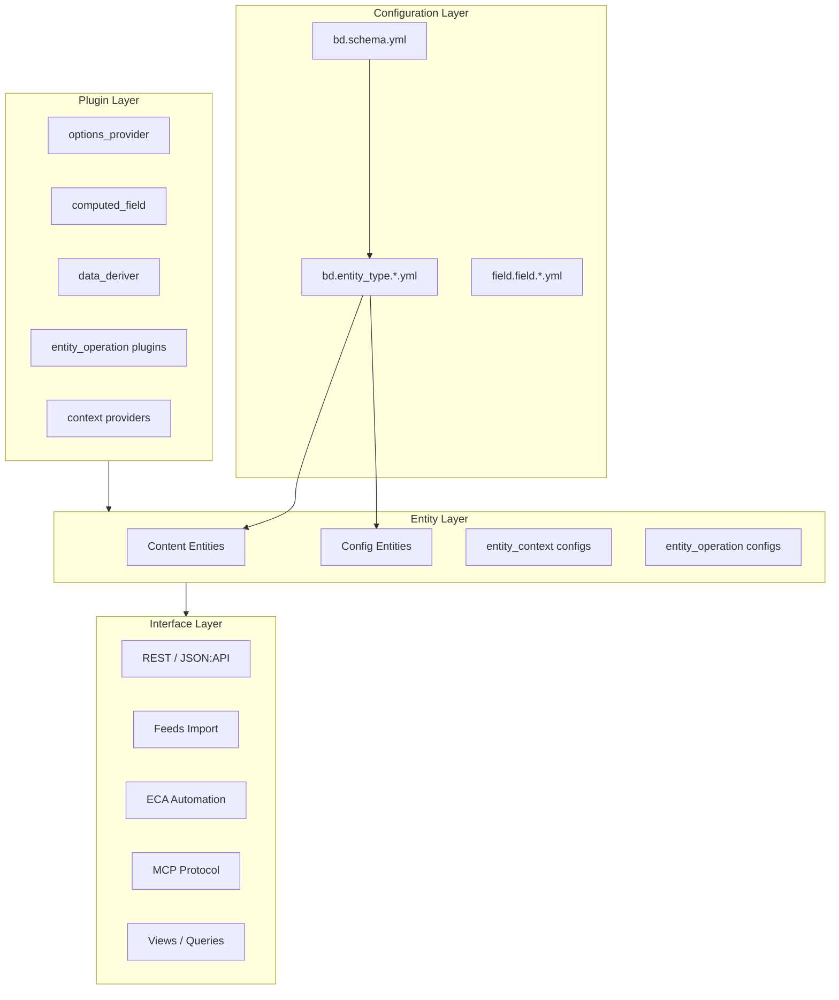
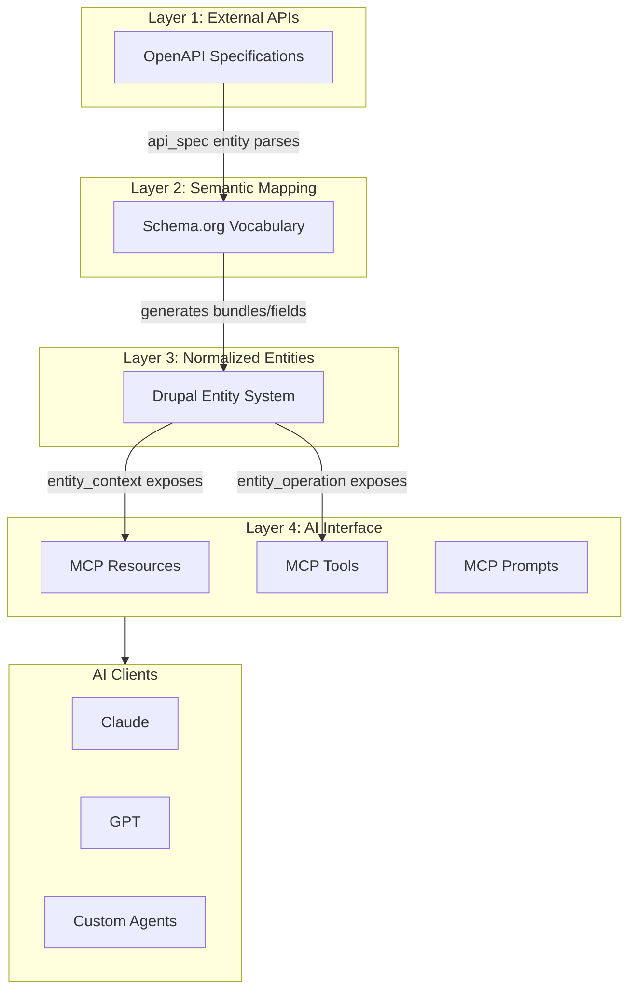
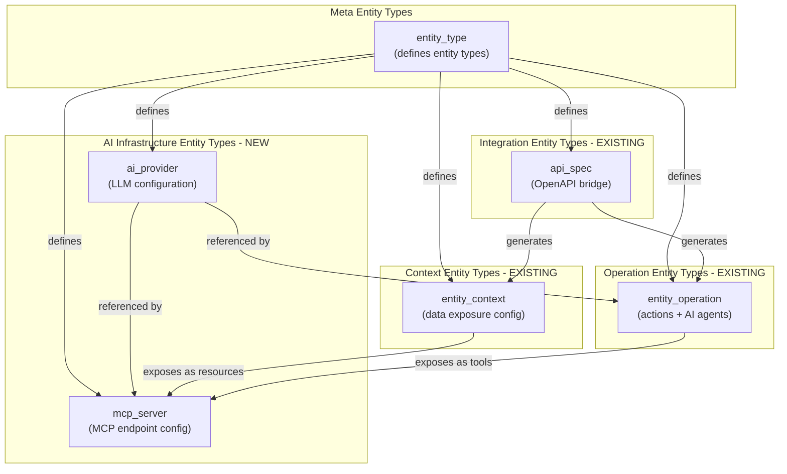
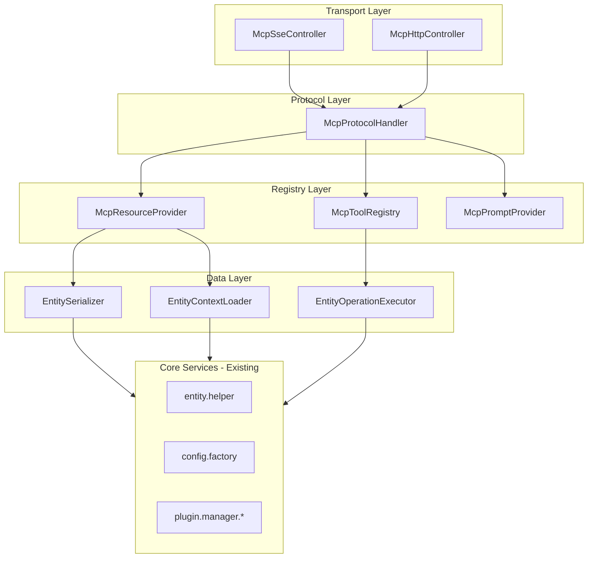
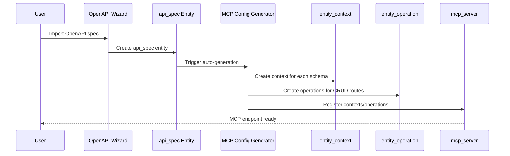
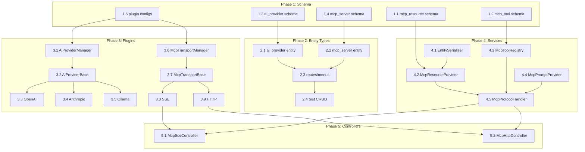

# MCP Entity Bridge PRD v5.0

<!-- DEV-LOOP METADATA -->
<!--
prd_id: mcp_entity_bridge
version: 5.0.0
status: ready
tasks_path: .taskmaster/tasks/tasks.json
test_directory: tests/playwright/mcp-entity-bridge/
-->

## Executive Summary

This PRD defines the implementation of **Model Context Protocol (MCP)** as an interface layer within the normalized entity architecture. MCP provides a standardized API for AI clients to access the system's bidirectional sync capabilities, entity data, and operations.

**Key Insight**: The `openapi_entity` module already provides stateful 2-way push/pull sync with external systems—capabilities that far exceed what MCP alone provides. MCP serves as one of several interface layers (alongside REST/JSON:API, Feeds, ECA) through which AI clients can interact with the normalized entity system.

---

## Part 1: System Architecture Context

### The Normalized Entity Architecture

The `bd` module implements a **config-driven entity system** where everything is defined through YAML configuration and processed by a unified schema system:



**Key Architectural Principles**:

1. **Configuration over Code**: Entity types, fields, and behaviors are defined in YAML configuration files, not PHP classes. The `bd.schema.yml` file (9000+ lines) defines all configuration schemas.

2. **Plugin-Based Extensibility**: Functionality is extended through plugin types (`options_provider`, `computed_field`, `data_deriver`, `entity_operation`, etc.) that follow the `EntityPluginBase` pattern with automatic form generation via `config_schema_subform`.

3. **Unified Schema System**: All configuration follows patterns defined in `bd.schema.yml`, ensuring consistency across entity types, field configurations, and plugin settings.

4. **Multiple Interface Layers**: The normalized entity system is accessible through multiple interfaces—REST/JSON:API, Views, ECA automation, Feeds import/export, and now MCP. Each interface exposes the same underlying data and operations.

### OpenAPI Entity Bridge as Superset of MCP

The `openapi_entity` module provides **stateful bidirectional sync** with external systems—capabilities that exceed what MCP alone provides:

```mermaid
flowchart LR
    subgraph external [External Systems]
        Asana[Asana API]
        Trello[Trello API]
        Salesforce[Salesforce API]
        Custom[Custom APIs]
    end

    subgraph openapi [OpenAPI Entity Bridge]
        ApiSpec["api_spec Entity"]
        Feeds["Feeds Integration"]
        Webhooks["Webhook Listeners"]
        ECA["ECA Rules"]
        SyncState["Sync State Tracking"]
    end

    subgraph normalized [Normalized Entity System]
        Bundles[Entity Bundles]
        Fields[Typed Fields]
        SchemaOrg[Schema.org Mapping]
    end

    subgraph interfaces [Interface Layer]
        MCP["MCP Protocol"]
        JSONAPI["JSON:API"]
        GraphQL["GraphQL"]
    end

    external <-->|"2-way sync"| openapi
    openapi --> normalized
    normalized --> interfaces
    interfaces -->|"AI Clients"| Claude[Claude/GPT/etc]
```



**Capability Comparison**:

| Capability | MCP Alone | OpenAPI Entity + MCP |
|------------|-----------|----------------------|
| Read external data | Yes (resources) | Yes + normalized + Schema.org semantic mapping |
| Write to external systems | Yes (tools) | Yes + state tracking + conflict resolution + retry logic |
| Real-time updates | No | Yes (webhooks + Feeds polling) |
| Change tracking | No | Yes (sync state entity tracks deltas) |
| Transformation rules | No | Yes (ECA rules + data deriver plugins) |
| Semantic mapping | No | Yes (Schema.org vocabulary mapping) |
| Unified queries | No | Yes (Views + entity queries across all synced data) |
| Multi-source aggregation | No | Yes (combine data from multiple APIs) |

**MCP's Role in the Architecture**:

MCP provides a **standardized AI client interface** to the already-capable openapi_entity sync system. AI clients (Claude, GPT, custom agents) use MCP to:

1. **Discover Resources**: List normalized entities synced from external APIs, exposed via `entity_context` configurations
2. **Execute Tools**: Trigger operations defined in `entity_operation` configs—including sync triggers that push/pull from external systems
3. **Access Prompts**: Use pre-defined prompt templates for working with the data

The key insight is that MCP is **not replacing** our sync capabilities—it's providing a well-defined interface that AI clients understand. Our system does the heavy lifting of bidirectional sync, Schema.org mapping, and entity normalization; MCP simply exposes these capabilities in a format AI assistants can use.

### The Three-Layer Data Flow



---

## Part 2: Entity Type Relationships

### How Entity Types Relate

The MCP implementation builds on existing entity types and introduces two new ones:



### entity_context: Data Exposure Configuration

`entity_context` is an **existing config entity type** that defines **what data is available** to AI systems. It configures how to extract, format, and expose entity data as context for AI operations.

**Existing context_type options** (already in bd.schema.yml lines 5186-7800+):

| Context Type | Purpose | Example Use |
|--------------|---------|-------------|
| `entity` | Extract data from Drupal entities | Expose node content with specific fields |
| `document` | Extract content from files/media | Parse PDF documents for context |
| `search` | Provide search results | Fulltext or semantic search results |
| `rag` | Vector embeddings and semantic search | RAG from Pinecone/Weaviate/pgvector |
| `knowledge_base` | Structured knowledge graphs | Ontology-based context |
| `external` | External API data | Live data from third-party APIs |
| `session` | User session data | Current user context and history |
| `tool` | Available tool definitions | Tools the AI can call |
| `composite` | Combine multiple contexts | Aggregate from multiple sources |

**MCP Extension**: Add `mcp_resource` mapping to expose contexts as MCP resources:

```yaml
# Extension to bd.entity_context.* schema (add after line ~7800)
mcp_resource:
  type: mapping
  label: 'MCP Resource Configuration'
  description: 'Expose this context as an MCP resource for AI clients.'
  form:
    type: details
    open: false
  mapping:
    enabled:
      type: boolean
      label: 'Expose as MCP resource'
      description: 'When enabled, this entity_context will be exposed as an MCP resource.'
      default_value: false
    uri_template:
      type: string
      label: 'URI template'
      description: 'URI pattern with Twig variables. Available: {{ context_type }}, {{ entity_type }}, {{ bundle }}, {{ id }}'
      default_value: 'drupal://entity/{{ entity_type }}/{{ bundle }}/{{ id }}'
    mime_type:
      type: option
      label: 'MIME type'
      description: 'Content type for serialized resource data.'
      default_value: 'application/ld+json'
      option:
        plugin_id: static
        plugin_config:
          options:
            application/ld+json:
              label: 'JSON-LD (Schema.org)'
              description: 'JSON-LD with Schema.org vocabulary for semantic interoperability.'
            application/json:
              label: 'JSON'
              description: 'Standard JSON serialization.'
            text/markdown:
              label: 'Markdown'
              description: 'Markdown formatted text for human-readable context.'
            text/plain:
              label: 'Plain text'
              description: 'Plain text extraction.'
    list_capability:
      type: mapping
      label: 'List capability'
      description: 'Configuration for listing multiple resources.'
      mapping:
        enabled:
          type: boolean
          label: 'Enable resource listing'
          description: 'Allow listing multiple entities matching this context.'
          default_value: true
        pagination:
          type: integer
          label: 'Items per page'
          description: 'Maximum items returned per list request.'
          default_value: 50
        filters:
          type: sequence
          label: 'Available filters'
          description: 'Field names that can be used to filter list results.'
          sequence:
            type: string
            label: 'Filter field'
    annotations:
      type: mapping
      label: 'MCP annotations'
      description: 'MCP resource annotations for AI client hints.'
      mapping:
        audience:
          type: option
          label: 'Audience'
          description: 'Intended audience for this resource.'
          multiple: true
          option:
            plugin_id: static
            plugin_config:
              options:
                user:
                  label: 'End users'
                  description: 'Resource intended for human end users.'
                assistant:
                  label: 'AI assistants'
                  description: 'Resource intended for AI processing.'
        priority:
          type: float
          label: 'Priority hint'
          description: '0.0-1.0 importance for AI context selection. Higher priority resources are preferred.'
          default_value: 0.5
```

### entity_operation: Actions and AI Agents

`entity_operation` is an **existing config entity type** that defines **what actions can be performed**. It already includes comprehensive AI agent configuration—MCP simply exposes these operations as tools.

**Existing AI-related mappings** (already in bd.schema.yml lines 3496-4794):

| Mapping | Purpose |
|---------|---------|
| `model` | AI model configuration (provider, model_id, temperature, top_p, etc.) |
| `api_config` | API authentication, endpoints, timeout, retries |
| `prompts` | System prompt, user prompt templates, prompt variables |
| `conversation` | Multi-turn conversation management, history, context window |
| `streaming` | SSE/WebSocket streaming configuration |
| `tools` | Function calling definitions (available_tools, tool_choice, max_tool_rounds) |
| `memory` | Short-term memory, long-term memory, RAG integration |
| `multi_agent` | Agent orchestration, delegation, handoff protocol |
| `safety` | Input/output filtering, guardrails, content policy |
| `human_in_loop` | Approval workflows, escalation triggers |
| `agent_identity` | Name, avatar, persona, communication tone |
| `agent_behavior` | Goals, constraints, response guidelines, capabilities |

**MCP Extension**: Add `mcp_tool` mapping to expose operations as MCP tools:

```yaml
# Extension to bd.entity_operation.* schema (add after line ~4794)
mcp_tool:
  type: mapping
  label: 'MCP Tool Configuration'
  description: 'Expose this operation as an MCP tool for AI clients.'
  form:
    type: details
    open: false
  mapping:
    enabled:
      type: boolean
      label: 'Expose as MCP tool'
      description: 'When enabled, this entity_operation will be exposed as an MCP tool.'
      default_value: false
    tool_name:
      type: machine_name
      label: 'Tool name'
      description: 'Override the tool name exposed to MCP. Defaults to entity_operation ID if empty.'
    tool_description:
      type: text
      label: 'Tool description'
      description: 'Description for AI clients explaining when and how to use this tool. Should be clear and actionable.'
    input_schema_source:
      type: option
      label: 'Input schema source'
      description: 'How to generate the JSON Schema for tool input parameters.'
      default_value: 'auto'
      option:
        plugin_id: static
        plugin_config:
          options:
            auto:
              label: 'Auto-generate from context_mapping.parameters'
              description: 'Generate JSON Schema automatically from the operation context mapping.'
            custom:
              label: 'Custom JSON Schema'
              description: 'Provide a custom JSON Schema for tool input.'
    custom_input_schema:
      type: text_format
      label: 'Custom input schema'
      description: 'JSON Schema for tool input parameters. Only used when input_schema_source is "custom".'
      format: code
    output_format:
      type: option
      label: 'Output format'
      description: 'Format for tool output returned to AI clients.'
      default_value: 'json'
      option:
        plugin_id: static
        plugin_config:
          options:
            json:
              label: 'JSON'
              description: 'Standard JSON object.'
            jsonld:
              label: 'JSON-LD'
              description: 'JSON-LD with Schema.org vocabulary.'
            text:
              label: 'Plain text'
              description: 'Plain text response.'
            markdown:
              label: 'Markdown'
              description: 'Markdown formatted response.'
    annotations:
      type: mapping
      label: 'MCP tool annotations'
      description: 'Hints for AI clients about tool behavior.'
      mapping:
        title:
          type: string
          label: 'Display title'
          description: 'Human-readable title for the tool.'
        readOnlyHint:
          type: boolean
          label: 'Read-only hint'
          description: 'Hint that this tool does not modify any state.'
          default_value: false
        destructiveHint:
          type: boolean
          label: 'Destructive hint'
          description: 'Hint that this tool may permanently delete or destroy data.'
          default_value: false
        idempotentHint:
          type: boolean
          label: 'Idempotent hint'
          description: 'Hint that calling this tool multiple times with same input has same effect as calling once.'
          default_value: false
        openWorldHint:
          type: boolean
          label: 'Open world hint'
          description: 'Hint that this tool interacts with external systems outside Drupal.'
          default_value: false
```

---

## Part 3: New Entity Types

### ai_provider Entity Type

A new configuration entity for LLM and embedding provider configuration. This centralizes API credentials and model settings, allowing multiple `entity_operation` configs to reference the same provider.

**Entity Type Definition** (`config/default/bd.entity_type.ai_provider.yml`):

```yaml
label: 'AI Provider'
id: ai_provider
type: config
plural_label: 'AI Providers'
description: 'LLM and embedding provider configuration for AI operations.'
route:
  base_path_content: '/admin/config/services/ai-providers'
handlers:
  list_builder: Drupal\bd\Entity\EntityListBuilder
  form:
    default: Drupal\bd\Form\ConfigEntityForm
    add: Drupal\bd\Form\ConfigEntityForm
    edit: Drupal\bd\Form\ConfigEntityForm
    delete: Drupal\Core\Entity\EntityDeleteForm
  route_provider:
    html: Drupal\Core\Entity\Routing\AdminHtmlRouteProvider
menu:
  items:
    - menu_type: link
      title: 'AI Providers'
      parent: system.admin_config_services
      weight: 10
```

**Schema Definition** (`bd.ai_provider.*` in bd.schema.yml):

```yaml
bd.ai_provider.*:
  type: config_entity
  label: 'AI Provider'
  description: 'Configuration for LLM and embedding providers (OpenAI, Anthropic, Ollama, etc.).'
  form:
    type: vertical_tabs
    group:
      overview:
        label: 'Overview'
        type: details
        open: true
        weight: -1000
      general:
        label: 'General'
        type: details
        open: true
        group: overview
      connection:
        label: 'Connection'
        type: details
        open: true
      models:
        label: 'Models'
        type: details
        open: false
      defaults:
        label: 'Defaults'
        type: details
        open: false
  mapping:
    label:
      type: label
      label: 'Label'
      required: true
      description: 'Human-readable name for this AI provider configuration.'
      group: general
    id:
      type: machine_name
      label: 'Machine name'
      required: true
      description: 'Unique identifier for this provider. Used in entity_operation references.'
      group: general
      constraints:
        UniquePropertyValue: {}
        Length:
          max: 30
    description:
      type: description
      label: 'Description'
      description: 'Description of this provider configuration and its intended use.'
      group: general
    status:
      type: boolean
      label: 'Enabled'
      description: 'Whether this provider is active and can be used.'
      default_value: true
      group: general
    provider_type:
      type: plugin_instance
      label: 'Provider type'
      description: 'The LLM provider backend (OpenAI, Anthropic, Ollama, etc.).'
      plugin_type: ai_provider
      configurable: true
      required: true
      group: connection
    connection:
      type: mapping
      label: 'Connection settings'
      description: 'API connection and authentication configuration.'
      group: connection
      mapping:
        base_url:
          type: uri
          label: 'Base URL'
          description: 'API base URL. Leave empty to use provider default.'
        api_key_source:
          type: option
          label: 'API key source'
          description: 'Where to retrieve the API key from.'
          default_value: 'environment'
          option:
            plugin_id: static
            plugin_config:
              options:
                environment:
                  label: 'Environment variable'
                  description: 'Read API key from environment variable (recommended).'
                key_module:
                  label: 'Key module'
                  description: 'Store API key in the Key module for secure storage.'
                config:
                  label: 'Configuration'
                  description: 'Store in config (NOT recommended for production).'
        api_key_name:
          type: string
          label: 'API key name'
          description: 'Environment variable name (e.g., OPENAI_API_KEY) or Key module key ID.'
        organization:
          type: string
          label: 'Organization ID'
          description: 'Organization identifier (for OpenAI, Azure, etc.).'
        timeout:
          type: integer
          label: 'Timeout (seconds)'
          description: 'Request timeout in seconds.'
          default_value: 60
        max_retries:
          type: integer
          label: 'Max retries'
          description: 'Maximum retry attempts for failed requests.'
          default_value: 3
    models:
      type: mapping
      label: 'Model configuration'
      description: 'Default models and available model list.'
      group: models
      mapping:
        chat_model:
          type: string
          label: 'Default chat model'
          description: 'Model ID for chat completions (e.g., gpt-4, claude-3-opus).'
        embedding_model:
          type: string
          label: 'Default embedding model'
          description: 'Model ID for embeddings (e.g., text-embedding-3-small).'
        available_models:
          type: sequence
          label: 'Available models'
          description: 'List of models available from this provider for selection in entity_operation.'
          sequence:
            type: mapping
            label: 'Model'
            mapping:
              model_id:
                type: string
                label: 'Model ID'
                description: 'The model identifier used in API calls.'
                required: true
              label:
                type: string
                label: 'Display label'
                description: 'Human-readable name for this model.'
              capabilities:
                type: option
                label: 'Capabilities'
                description: 'What this model can do.'
                multiple: true
                option:
                  plugin_id: static
                  plugin_config:
                    options:
                      chat:
                        label: 'Chat completions'
                      embeddings:
                        label: 'Embeddings'
                      vision:
                        label: 'Vision/images'
                      function_calling:
                        label: 'Function/tool calling'
                      streaming:
                        label: 'Streaming responses'
              context_window:
                type: integer
                label: 'Context window (tokens)'
                description: 'Maximum tokens in context window.'
    defaults:
      type: mapping
      label: 'Default parameters'
      description: 'Default generation parameters. Can be overridden per entity_operation.'
      group: defaults
      mapping:
        temperature:
          type: float
          label: 'Temperature'
          description: 'Sampling temperature (0.0 to 2.0). Higher = more random.'
          default_value: 0.7
        max_tokens:
          type: integer
          label: 'Max tokens'
          description: 'Maximum tokens to generate.'
        top_p:
          type: float
          label: 'Top P'
          description: 'Nucleus sampling parameter (0.0 to 1.0).'
        frequency_penalty:
          type: float
          label: 'Frequency penalty'
          description: 'Reduce repetition (-2.0 to 2.0).'
        presence_penalty:
          type: float
          label: 'Presence penalty'
          description: 'Encourage new topics (-2.0 to 2.0).'
```

### mcp_server Entity Type

A new configuration entity for MCP endpoint configuration. This aggregates `entity_context` references (resources) and `entity_operation` references (tools) into a single MCP server endpoint.

**Entity Type Definition** (`config/default/bd.entity_type.mcp_server.yml`):

```yaml
label: 'MCP Server'
id: mcp_server
type: config
plural_label: 'MCP Servers'
description: 'Model Context Protocol server endpoint configuration.'
route:
  base_path_content: '/admin/config/services/mcp'
handlers:
  list_builder: Drupal\bd\Entity\EntityListBuilder
  form:
    default: Drupal\bd\Form\ConfigEntityForm
    add: Drupal\bd\Form\ConfigEntityForm
    edit: Drupal\bd\Form\ConfigEntityForm
    delete: Drupal\Core\Entity\EntityDeleteForm
  route_provider:
    html: Drupal\Core\Entity\Routing\AdminHtmlRouteProvider
menu:
  items:
    - menu_type: link
      title: 'MCP Servers'
      parent: system.admin_config_services
      weight: 5
```

**Schema Definition** (`bd.mcp_server.*` in bd.schema.yml):

```yaml
bd.mcp_server.*:
  type: config_entity
  label: 'MCP Server'
  description: 'Model Context Protocol server endpoint configuration.'
  form:
    type: vertical_tabs
    group:
      overview:
        label: 'Overview'
        type: details
        open: true
        weight: -1000
      general:
        label: 'General'
        type: details
        open: true
        group: overview
      endpoint:
        label: 'Endpoint'
        type: details
        open: true
      resources:
        label: 'Resources'
        type: details
        open: false
      tools:
        label: 'Tools'
        type: details
        open: false
      prompts:
        label: 'Prompts'
        type: details
        open: false
      auth:
        label: 'Authentication'
        type: details
        open: false
  mapping:
    label:
      type: label
      label: 'Label'
      required: true
      description: 'Human-readable name for this MCP server.'
      group: general
    id:
      type: machine_name
      label: 'Machine name'
      required: true
      description: 'Unique identifier. Used in endpoint URL.'
      group: general
      constraints:
        UniquePropertyValue: {}
        Length:
          max: 30
    description:
      type: description
      label: 'Description'
      description: 'Description of this MCP server and its purpose.'
      group: general
    status:
      type: boolean
      label: 'Enabled'
      description: 'Whether this MCP server is active.'
      default_value: true
      group: general

    # Endpoint configuration
    endpoint:
      type: mapping
      label: 'Endpoint Configuration'
      description: 'MCP transport and endpoint settings.'
      group: endpoint
      mapping:
        transport:
          type: plugin_instance
          label: 'Transport'
          description: 'MCP transport protocol (SSE, HTTP, stdio).'
          plugin_type: mcp_transport
          configurable: true
        base_path:
          type: string
          label: 'Base path'
          description: 'URL path for this MCP server. Supports {{ id }} token.'
          default_value: '/api/mcp/{{ id }}'
        server_info:
          type: mapping
          label: 'Server info'
          description: 'MCP server metadata returned in initialize response.'
          mapping:
            name:
              type: string
              label: 'Server name'
              description: 'Name exposed to MCP clients.'
            version:
              type: string
              label: 'Version'
              default_value: '1.0.0'
        capabilities:
          type: option
          label: 'Capabilities'
          description: 'MCP capabilities this server supports.'
          multiple: true
          default_value:
            - resources
            - tools
          option:
            plugin_id: static
            plugin_config:
              options:
                resources:
                  label: 'Resources'
                  description: 'Expose resources via resources/list, resources/read.'
                tools:
                  label: 'Tools'
                  description: 'Expose tools via tools/list, tools/call.'
                prompts:
                  label: 'Prompts'
                  description: 'Expose prompts via prompts/list, prompts/get.'
                logging:
                  label: 'Logging'
                  description: 'Support logging/setLevel.'

    # Resources configuration
    resources:
      type: mapping
      label: 'Resources Configuration'
      description: 'Entity contexts to expose as MCP resources.'
      group: resources
      mapping:
        entity_contexts:
          type: sequence
          label: 'Entity contexts'
          description: 'entity_context config IDs to expose as MCP resources.'
          sequence:
            type: string
            label: 'Entity context ID'
        auto_expose:
          type: mapping
          label: 'Auto-expose settings'
          description: 'Automatically expose entities matching criteria.'
          mapping:
            enabled:
              type: boolean
              label: 'Enable auto-expose'
              description: 'Automatically expose entity types with Schema.org mappings.'
              default_value: false
            entity_types:
              type: option
              label: 'Entity types'
              description: 'Entity types to auto-expose.'
              multiple: true
              option:
                plugin_id: entity_type
            bundles:
              type: option
              label: 'Bundles'
              description: 'Bundles to auto-expose (within selected entity types).'
              multiple: true
              option:
                plugin_id: bundle
        uri_scheme:
          type: string
          label: 'URI scheme'
          description: 'URI scheme for resources (e.g., drupal://entity/node/article/123).'
          default_value: 'drupal'

    # Tools configuration
    tools:
      type: mapping
      label: 'Tools Configuration'
      description: 'Entity operations to expose as MCP tools.'
      group: tools
      mapping:
        entity_operations:
          type: sequence
          label: 'Entity operations'
          description: 'entity_operation config IDs to expose as MCP tools.'
          sequence:
            type: string
            label: 'Entity operation ID'
        builtin_tools:
          type: option
          label: 'Built-in tools'
          description: 'Enable built-in generic tools.'
          multiple: true
          option:
            plugin_id: static
            plugin_config:
              options:
                entity_query:
                  label: 'Entity Query'
                  description: 'Query entities with conditions (Views-like).'
                entity_read:
                  label: 'Entity Read'
                  description: 'Read single entity by ID.'
                entity_create:
                  label: 'Entity Create'
                  description: 'Create new entity.'
                entity_update:
                  label: 'Entity Update'
                  description: 'Update existing entity.'
                entity_delete:
                  label: 'Entity Delete'
                  description: 'Delete entity.'
                sync_trigger:
                  label: 'Sync Trigger'
                  description: 'Trigger sync from external API (openapi_entity).'
                views_execute:
                  label: 'Views Execute'
                  description: 'Execute a Drupal View.'

    # Prompts configuration
    prompts:
      type: mapping
      label: 'Prompts Configuration'
      description: 'MCP prompts (reusable prompt templates).'
      group: prompts
      mapping:
        items:
          type: sequence
          label: 'Prompt templates'
          description: 'Prompt templates available via prompts/list and prompts/get.'
          sequence:
            type: mapping
            label: 'Prompt'
            mapping:
              name:
                type: machine_name
                label: 'Name'
                description: 'Prompt identifier.'
                required: true
              description:
                type: text
                label: 'Description'
                description: 'What this prompt does.'
              arguments:
                type: sequence
                label: 'Arguments'
                description: 'Arguments the prompt accepts.'
                sequence:
                  type: mapping
                  label: 'Argument'
                  mapping:
                    name:
                      type: string
                      label: 'Name'
                      description: 'Argument name.'
                    description:
                      type: string
                      label: 'Description'
                      description: 'Argument description.'
                    required:
                      type: boolean
                      label: 'Required'
                      default_value: false
              template:
                type: text_format
                label: 'Prompt template'
                description: 'Prompt text with {{ argument }} placeholders.'
                format: full_html

    # Authentication
    auth:
      type: mapping
      label: 'Authentication'
      description: 'Authentication requirements for MCP clients.'
      group: auth
      mapping:
        required:
          type: boolean
          label: 'Require authentication'
          description: 'Whether clients must authenticate.'
          default_value: true
        method:
          type: option
          label: 'Authentication method'
          default_value: 'drupal_session'
          option:
            plugin_id: static
            plugin_config:
              options:
                drupal_session:
                  label: 'Drupal session'
                  description: 'Use Drupal user session (for browser-based clients).'
                api_key:
                  label: 'API key'
                  description: 'Header-based API key authentication.'
                oauth2:
                  label: 'OAuth 2.0'
                  description: 'OAuth 2.0 bearer token.'
                jwt:
                  label: 'JWT'
                  description: 'JSON Web Token.'
        api_key_header:
          type: string
          label: 'API key header'
          description: 'Header name for API key authentication.'
          default_value: 'X-API-Key'
        permissions:
          type: option
          label: 'Required permissions'
          description: 'Drupal permissions required to access this MCP server.'
          multiple: true
          option:
            plugin_id: permission
```

---

## Part 4: Plugin Types

### ai_provider Plugin Type

Plugin type for LLM provider implementations. Each plugin provides the connection logic for a specific AI provider.

**Plugin Manager**: `Drupal\bd\Plugin\AiProvider\AiProviderManager`

**Base Class**: `Drupal\bd\Plugin\AiProvider\AiProviderBase` (extends `EntityPluginBase`)

**Interface Methods**:

```php
interface AiProviderInterface extends PluginInspectionInterface, ConfigurableInterface {
  /**
   * Send a chat completion request.
   */
  public function chat(array $messages, array $options = []): ChatResponse;

  /**
   * Generate embeddings for text.
   */
  public function embed(string|array $input, array $options = []): EmbeddingResponse;

  /**
   * Stream a chat completion.
   */
  public function streamChat(array $messages, array $options = []): \Generator;

  /**
   * List available models.
   */
  public function listModels(): array;

  /**
   * Check if provider is available.
   */
  public function isAvailable(): bool;
}
```

**Plugin Configuration Schemas**:

```yaml
# OpenAI provider
plugin.plugin_configuration.ai_provider.openai:
  type: mapping
  label: 'OpenAI'
  description: 'OpenAI API provider (GPT-4, GPT-3.5, embeddings).'
  mapping:
    api_version:
      type: string
      label: 'API version'
      default_value: 'v1'

# Anthropic provider
plugin.plugin_configuration.ai_provider.anthropic:
  type: mapping
  label: 'Anthropic'
  description: 'Anthropic API provider (Claude models).'
  mapping:
    api_version:
      type: string
      label: 'API version'
      default_value: '2023-06-01'
    beta_features:
      type: option
      label: 'Beta features'
      multiple: true
      option:
        plugin_id: static
        plugin_config:
          options:
            computer_use:
              label: 'Computer use'
            prompt_caching:
              label: 'Prompt caching'

# Ollama provider (local models)
plugin.plugin_configuration.ai_provider.ollama:
  type: mapping
  label: 'Ollama'
  description: 'Local Ollama instance for open-source models.'
  mapping:
    host:
      type: string
      label: 'Host'
      default_value: 'http://localhost:11434'
    gpu_layers:
      type: integer
      label: 'GPU layers'
      description: 'Number of layers to offload to GPU (-1 for all).'

# Azure OpenAI provider
plugin.plugin_configuration.ai_provider.azure_openai:
  type: mapping
  label: 'Azure OpenAI'
  description: 'Azure OpenAI Service.'
  mapping:
    resource_name:
      type: string
      label: 'Resource name'
      description: 'Azure resource name.'
      required: true
    deployment_id:
      type: string
      label: 'Deployment ID'
      description: 'Model deployment identifier.'
      required: true
    api_version:
      type: string
      label: 'API version'
      default_value: '2024-02-15-preview'
```

### mcp_transport Plugin Type

Plugin type for MCP transport implementations. Each plugin handles a specific transport protocol.

**Plugin Manager**: `Drupal\bd\Plugin\McpTransport\McpTransportManager`

**Base Class**: `Drupal\bd\Plugin\McpTransport\McpTransportBase` (extends `EntityPluginBase`)

**Interface Methods**:

```php
interface McpTransportInterface extends PluginInspectionInterface, ConfigurableInterface {
  /**
   * Handle an incoming request.
   */
  public function handleRequest(Request $request): Response;

  /**
   * Send a message to client.
   */
  public function send(array $message): void;

  /**
   * Get transport type identifier.
   */
  public function getTransportType(): string;

  /**
   * Check if transport supports streaming.
   */
  public function supportsStreaming(): bool;
}
```

**Plugin Configuration Schemas**:

```yaml
# SSE transport (streaming)
plugin.plugin_configuration.mcp_transport.sse:
  type: mapping
  label: 'Server-Sent Events'
  description: 'SSE transport for streaming MCP responses.'
  mapping:
    keepalive_interval:
      type: integer
      label: 'Keepalive interval (seconds)'
      description: 'Send keepalive comments at this interval.'
      default_value: 15
    connection_timeout:
      type: integer
      label: 'Connection timeout (seconds)'
      description: 'Close idle connections after this time.'
      default_value: 300

# HTTP transport (request/response)
plugin.plugin_configuration.mcp_transport.http:
  type: mapping
  label: 'HTTP'
  description: 'Standard HTTP request/response transport.'
  mapping:
    batch_requests:
      type: boolean
      label: 'Allow batch requests'
      description: 'Allow multiple JSON-RPC requests in single HTTP request.'
      default_value: false

# stdio transport (CLI)
plugin.plugin_configuration.mcp_transport.stdio:
  type: mapping
  label: 'Standard I/O'
  description: 'stdio transport for CLI/subprocess usage.'
  mapping:
    buffer_size:
      type: integer
      label: 'Buffer size'
      description: 'Read buffer size in bytes.'
      default_value: 65536
```

---

## Part 5: Service Architecture

### Service Layer Overview



### Service Specifications

| Service | Responsibility | Key Methods | Dependencies |
|---------|---------------|-------------|--------------|
| `McpProtocolHandler` | Parse JSON-RPC messages, route to appropriate handlers, build responses | `handleMessage(array $message): array`, `buildResponse(mixed $result): array`, `buildError(int $code, string $message): array` | ResourceProvider, ToolRegistry, PromptProvider |
| `McpResourceProvider` | Load entity_context configs, serialize entities as MCP resources | `listResources(string $serverId): array`, `readResource(string $uri): array`, `getResourceTemplates(): array` | EntitySerializer, EntityContextLoader, ConfigFactory |
| `McpToolRegistry` | Load entity_operation configs, build tool definitions | `listTools(string $serverId): array`, `callTool(string $name, array $arguments): array`, `getToolSchema(string $name): array` | EntityOperationExecutor, ConfigFactory |
| `McpPromptProvider` | Load mcp_server prompt configs | `listPrompts(string $serverId): array`, `getPrompt(string $name, array $arguments): array` | ConfigFactory |
| `EntitySerializer` | Serialize entities to JSON-LD with Schema.org | `serialize(EntityInterface $entity, array $options = []): array`, `serializeList(array $entities): array` | EntityHelper, SchemaOrgMapper |
| `EntityContextLoader` | Load data according to entity_context config | `loadContext(string $contextId, array $parameters = []): array` | EntityHelper, Views, SearchAPI |
| `EntityOperationExecutor` | Execute entity_operation | `execute(string $operationId, array $input): array` | EntityHelper, PluginManager |
| `AiProviderManager` | Plugin manager for ai_provider plugins | `createInstance(string $pluginId, array $configuration): AiProviderInterface` | PluginManagerBase |
| `McpTransportManager` | Plugin manager for mcp_transport plugins | `createInstance(string $pluginId, array $configuration): McpTransportInterface` | PluginManagerBase |

### Service Registration

Add to `bd.services.yml`:

```yaml
services:
  # MCP Protocol
  bd.mcp.protocol_handler:
    class: Drupal\bd\Mcp\McpProtocolHandler
    arguments:
      - '@bd.mcp.resource_provider'
      - '@bd.mcp.tool_registry'
      - '@bd.mcp.prompt_provider'
      - '@logger.factory'

  bd.mcp.resource_provider:
    class: Drupal\bd\Mcp\McpResourceProvider
    arguments:
      - '@config.factory'
      - '@bd.mcp.entity_serializer'
      - '@bd.mcp.entity_context_loader'
      - '@entity_type.manager'

  bd.mcp.tool_registry:
    class: Drupal\bd\Mcp\McpToolRegistry
    arguments:
      - '@config.factory'
      - '@bd.mcp.entity_operation_executor'
      - '@entity_type.manager'

  bd.mcp.prompt_provider:
    class: Drupal\bd\Mcp\McpPromptProvider
    arguments:
      - '@config.factory'
      - '@renderer'

  bd.mcp.entity_serializer:
    class: Drupal\bd\Mcp\EntitySerializer
    arguments:
      - '@entity.helper'
      - '@serializer'
      - '@schemadotorg.mapping_manager'

  bd.mcp.entity_context_loader:
    class: Drupal\bd\Mcp\EntityContextLoader
    arguments:
      - '@config.factory'
      - '@entity.helper'
      - '@views.executable'

  bd.mcp.entity_operation_executor:
    class: Drupal\bd\Mcp\EntityOperationExecutor
    arguments:
      - '@config.factory'
      - '@entity.helper'
      - '@plugin.manager.entity_operation'

  # Plugin Managers
  plugin.manager.ai_provider:
    class: Drupal\bd\Plugin\AiProvider\AiProviderManager
    parent: default_plugin_manager

  plugin.manager.mcp_transport:
    class: Drupal\bd\Plugin\McpTransport\McpTransportManager
    parent: default_plugin_manager
```

---

## Part 6: OpenAPI Entity Integration

The `openapi_entity` module can auto-generate MCP configurations when syncing external APIs:

### Auto-Exposure Flow



### Auto-Generated entity_context

When an `api_spec` syncs data from an external API, auto-create an `entity_context` with MCP enabled:

```yaml
# Example: Auto-generated for Asana projects
id: asana_project_context
label: 'Asana Projects'
description: 'Projects synced from Asana API via openapi_entity.'
entity_type: task
bundle: asana_project
context_type: entity
entity_data:
  source_entity: query
  view_id: asana_projects
  fields:
    - field_name: field_gid
      context_key: gid
    - field_name: field_name
      context_key: name
    - field_name: field_owner
      context_key: owner
  include_metadata: true
  include_url: true
mcp_resource:
  enabled: true
  uri_template: 'drupal://asana/project/{{ id }}'
  mime_type: application/ld+json
  list_capability:
    enabled: true
    pagination: 50
    filters:
      - field_workspace
      - field_status
  annotations:
    audience:
      - assistant
    priority: 0.8
```

### Auto-Generated entity_operation

For each CRUD operation on the API, create an `entity_operation` with MCP tool enabled:

```yaml
# Example: Sync trigger operation
id: sync_asana_projects
label: 'Sync Asana Projects'
description: 'Trigger synchronization of Asana projects from the API.'
entity_type: task
bundle: asana_project
build:
  entity_operation:
    plugin_id: custom_action
    plugin_config:
      service: openapi_entity.sync_manager
      method: triggerSync
      arguments:
        api_spec_id: asana
        schema_name: ProjectCompact
context_mapping:
  parameters:
    - label: 'Workspace ID'
      machine_name: workspace_id
      type: string
      optional: true
mcp_tool:
  enabled: true
  tool_name: sync_asana_projects
  tool_description: 'Fetch latest projects from Asana and synchronize to Drupal. Use this when you need fresh data from Asana.'
  input_schema_source: auto
  output_format: json
  annotations:
    openWorldHint: true
    idempotentHint: true
```

```yaml
# Example: Create project operation (pushes to Asana)
id: create_asana_project
label: 'Create Asana Project'
description: 'Create a new project in Asana via the API.'
entity_type: task
bundle: asana_project
build:
  entity_operation:
    plugin_id: entity_form
    plugin_config:
      form_mode: default
      create_new: true
context_mapping:
  parameters:
    - label: 'Name'
      machine_name: name
      type: string
      optional: false
    - label: 'Workspace'
      machine_name: workspace_id
      type: string
      optional: false
mcp_tool:
  enabled: true
  tool_name: create_asana_project
  tool_description: 'Create a new project in Asana. The project will be synced to the external API.'
  annotations:
    destructiveHint: false
    openWorldHint: true
```

---

## Part 7: Implementation Phases

### Phase 1: Schema Extensions (15 hours)

| Task ID | Task | Description | Effort | Dependencies |
|---------|------|-------------|--------|--------------|
| 1.1 | Add `mcp_resource` to entity_context | Extend bd.entity_context.* schema with mcp_resource mapping | 3h | None |
| 1.2 | Add `mcp_tool` to entity_operation | Extend bd.entity_operation.* schema with mcp_tool mapping | 3h | None |
| 1.3 | Define `bd.ai_provider.*` schema | Complete config entity schema for AI providers | 4h | None |
| 1.4 | Define `bd.mcp_server.*` schema | Complete config entity schema for MCP servers | 4h | None |
| 1.5 | Add plugin configuration schemas | ai_provider and mcp_transport plugin configs | 1h | 1.3, 1.4 |

**Acceptance Criteria**:
- Cache clear succeeds without schema errors
- Forms auto-generate for new config fields
- Existing entity_context and entity_operation configs remain valid

### Phase 2: Entity Types (8 hours)

| Task ID | Task | Description | Effort | Dependencies |
|---------|------|-------------|--------|--------------|
| 2.1 | Create ai_provider entity type | bd.entity_type.ai_provider.yml config | 2h | 1.3 |
| 2.2 | Create mcp_server entity type | bd.entity_type.mcp_server.yml config | 2h | 1.4 |
| 2.3 | Configure routes and menus | Admin routes, menu links, permissions | 2h | 2.1, 2.2 |
| 2.4 | Test entity CRUD | Verify create/read/update/delete via admin UI | 2h | 2.3 |

**Acceptance Criteria**:
- Admin UI shows AI Providers and MCP Servers pages
- Can create, edit, delete config entities
- Forms display all configured fields

### Phase 3: Plugin Implementation (28 hours)

| Task ID | Task | Description | Effort | Dependencies |
|---------|------|-------------|--------|--------------|
| 3.1 | Create AiProviderManager | Plugin manager following bd patterns | 3h | 1.5 |
| 3.2 | Create AiProviderBase | Base plugin class extending EntityPluginBase | 2h | 3.1 |
| 3.3 | Implement OpenAI plugin | OpenAI API integration | 4h | 3.2 |
| 3.4 | Implement Anthropic plugin | Anthropic API integration | 4h | 3.2 |
| 3.5 | Implement Ollama plugin | Ollama local model integration | 3h | 3.2 |
| 3.6 | Create McpTransportManager | Plugin manager for transports | 3h | 1.5 |
| 3.7 | Create McpTransportBase | Base plugin class | 2h | 3.6 |
| 3.8 | Implement SSE transport | Server-Sent Events transport | 4h | 3.7 |
| 3.9 | Implement HTTP transport | HTTP request/response transport | 3h | 3.7 |

**Acceptance Criteria**:
- Plugins appear in plugin selector dropdowns
- OpenAI/Anthropic can make successful API calls
- SSE transport streams responses correctly

### Phase 4: Service Layer (24 hours)

| Task ID | Task | Description | Effort | Dependencies |
|---------|------|-------------|--------|--------------|
| 4.1 | Create EntitySerializer | JSON-LD serialization with Schema.org | 4h | None |
| 4.2 | Create McpResourceProvider | Load entity_context, serialize resources | 4h | 4.1, 1.1 |
| 4.3 | Create McpToolRegistry | Load entity_operation, build tool definitions | 4h | 1.2 |
| 4.4 | Create McpPromptProvider | Load and render prompt templates | 2h | 1.4 |
| 4.5 | Create McpProtocolHandler | JSON-RPC parsing and routing | 6h | 4.2, 4.3, 4.4 |
| 4.6 | Register services | Add to bd.services.yml | 1h | 4.1-4.5 |
| 4.7 | Create integration hooks | Hook class for events | 3h | 4.6 |

**Acceptance Criteria**:
- Services load without dependency errors
- Protocol handler routes messages correctly
- Resources and tools serialize to valid MCP format

### Phase 5: Controllers and Routes (12 hours)

| Task ID | Task | Description | Effort | Dependencies |
|---------|------|-------------|--------|--------------|
| 5.1 | Create McpSseController | SSE endpoint controller | 4h | 3.8, 4.5 |
| 5.2 | Create McpHttpController | HTTP endpoint controller | 3h | 3.9, 4.5 |
| 5.3 | Define routes | bd.routing.yml additions | 1h | 5.1, 5.2 |
| 5.4 | Create admin list builders | Entity list pages | 2h | 2.1, 2.2 |
| 5.5 | Test with MCP client | End-to-end testing | 2h | 5.3 |

**Acceptance Criteria**:
- MCP endpoints respond to initialize request
- resources/list returns configured resources
- tools/call executes operations

### Phase 6: OpenAPI Integration (12 hours)

| Task ID | Task | Description | Effort | Dependencies |
|---------|------|-------------|--------|--------------|
| 6.1 | Auto-generate entity_context | Create from api_spec on sync | 4h | 1.1, 2.4 |
| 6.2 | Auto-generate entity_operation | Create from api_spec operations | 4h | 1.2, 2.4 |
| 6.3 | Sync trigger tool | Tool to trigger external sync | 2h | 4.3 |
| 6.4 | Integration tests | Test full flow | 2h | 6.1-6.3 |

**Acceptance Criteria**:
- New api_spec auto-creates MCP configs
- Sync trigger works via MCP tool call
- Synced entities appear as MCP resources

### Phase 7: Testing and Documentation (18 hours)

| Task ID | Task | Description | Effort | Dependencies |
|---------|------|-------------|--------|--------------|
| 7.1 | PHPUnit tests for services | Unit tests for all services | 6h | Phase 4 |
| 7.2 | Kernel tests for entity types | Entity type integration tests | 4h | Phase 2 |
| 7.3 | Playwright E2E tests | Browser-based end-to-end tests | 6h | Phase 5 |
| 7.4 | Documentation | Update docs with MCP usage | 2h | All |

**Acceptance Criteria**:
- All tests pass
- Documentation covers setup and usage
- Example configurations provided

### Summary

| Phase | Tasks | Effort |
|-------|-------|--------|
| 1. Schema Extensions | 5 tasks | 15h |
| 2. Entity Types | 4 tasks | 8h |
| 3. Plugin Implementation | 9 tasks | 28h |
| 4. Service Layer | 7 tasks | 24h |
| 5. Controllers and Routes | 5 tasks | 12h |
| 6. OpenAPI Integration | 4 tasks | 12h |
| 7. Testing and Documentation | 4 tasks | 18h |
| **Total** | **38 tasks** | **~117h** |

---

## Part 8: Files to Create/Modify

### Schema Extensions

| File | Action | Description |
|------|--------|-------------|
| `docroot/modules/share/bd/config/schema/bd.schema.yml` | Modify | Add mcp_resource to entity_context, mcp_tool to entity_operation, ai_provider schema, mcp_server schema, plugin configs |

### Entity Type Configs

| File | Action | Description |
|------|--------|-------------|
| `config/default/bd.entity_type.ai_provider.yml` | Create | AI provider entity type definition |
| `config/default/bd.entity_type.mcp_server.yml` | Create | MCP server entity type definition |

### Plugin Managers

| File | Action | Description |
|------|--------|-------------|
| `docroot/modules/share/bd/src/Plugin/AiProvider/AiProviderManager.php` | Create | Plugin manager for AI providers |
| `docroot/modules/share/bd/src/Plugin/McpTransport/McpTransportManager.php` | Create | Plugin manager for MCP transports |

### Plugin Base Classes

| File | Action | Description |
|------|--------|-------------|
| `docroot/modules/share/bd/src/Plugin/AiProvider/AiProviderBase.php` | Create | Base class for AI provider plugins |
| `docroot/modules/share/bd/src/Plugin/AiProvider/AiProviderInterface.php` | Create | Interface for AI provider plugins |
| `docroot/modules/share/bd/src/Plugin/McpTransport/McpTransportBase.php` | Create | Base class for transport plugins |
| `docroot/modules/share/bd/src/Plugin/McpTransport/McpTransportInterface.php` | Create | Interface for transport plugins |

### Provider Plugins

| File | Action | Description |
|------|--------|-------------|
| `docroot/modules/share/bd/src/Plugin/AiProvider/OpenAI.php` | Create | OpenAI provider implementation |
| `docroot/modules/share/bd/src/Plugin/AiProvider/Anthropic.php` | Create | Anthropic provider implementation |
| `docroot/modules/share/bd/src/Plugin/AiProvider/Ollama.php` | Create | Ollama provider implementation |
| `docroot/modules/share/bd/src/Plugin/AiProvider/AzureOpenAI.php` | Create | Azure OpenAI provider implementation |

### Transport Plugins

| File | Action | Description |
|------|--------|-------------|
| `docroot/modules/share/bd/src/Plugin/McpTransport/Sse.php` | Create | SSE transport implementation |
| `docroot/modules/share/bd/src/Plugin/McpTransport/Http.php` | Create | HTTP transport implementation |
| `docroot/modules/share/bd/src/Plugin/McpTransport/Stdio.php` | Create | stdio transport implementation |

### Services

| File | Action | Description |
|------|--------|-------------|
| `docroot/modules/share/bd/src/Mcp/EntitySerializer.php` | Create | JSON-LD entity serialization |
| `docroot/modules/share/bd/src/Mcp/McpResourceProvider.php` | Create | MCP resource provider service |
| `docroot/modules/share/bd/src/Mcp/McpToolRegistry.php` | Create | MCP tool registry service |
| `docroot/modules/share/bd/src/Mcp/McpPromptProvider.php` | Create | MCP prompt provider service |
| `docroot/modules/share/bd/src/Mcp/McpProtocolHandler.php` | Create | MCP JSON-RPC protocol handler |
| `docroot/modules/share/bd/src/Mcp/EntityContextLoader.php` | Create | Entity context data loader |
| `docroot/modules/share/bd/src/Mcp/EntityOperationExecutor.php` | Create | Entity operation executor |

### Controllers

| File | Action | Description |
|------|--------|-------------|
| `docroot/modules/share/bd/src/Controller/McpSseController.php` | Create | SSE endpoint controller |
| `docroot/modules/share/bd/src/Controller/McpHttpController.php` | Create | HTTP endpoint controller |

### Configuration

| File | Action | Description |
|------|--------|-------------|
| `docroot/modules/share/bd/bd.services.yml` | Modify | Add MCP services |
| `docroot/modules/share/bd/bd.routing.yml` | Modify | Add MCP routes |
| `docroot/modules/share/bd/bd.permissions.yml` | Modify | Add MCP permissions |
| `docroot/modules/share/bd/bd.links.menu.yml` | Modify | Add admin menu links |

### Tests

| File | Action | Description |
|------|--------|-------------|
| `docroot/modules/share/bd/tests/src/Unit/Mcp/McpProtocolHandlerTest.php` | Create | Protocol handler unit tests |
| `docroot/modules/share/bd/tests/src/Kernel/Entity/AiProviderTest.php` | Create | AI provider entity tests |
| `docroot/modules/share/bd/tests/src/Kernel/Entity/McpServerTest.php` | Create | MCP server entity tests |
| `tests/playwright/mcp-entity-bridge/mcp-server.spec.ts` | Create | E2E tests for MCP |

### Documentation

| File | Action | Description |
|------|--------|-------------|
| `docs/integration/mcp_entity_bridge.md` | Create | MCP integration documentation |

---

## Glossary

| Term | Definition |
|------|------------|
| `ai_provider` | Config entity for LLM provider configuration (API keys, models, defaults) |
| `mcp_server` | Config entity for MCP endpoint configuration (resources, tools, prompts) |
| `entity_context` | Existing config entity defining data exposure for AI contexts → MCP resources |
| `entity_operation` | Existing config entity defining operations/actions → MCP tools |
| `mcp_transport` | Plugin type for MCP transport protocols (SSE, HTTP, stdio) |
| MCP | Model Context Protocol - standardized AI client interface |
| JSON-RPC | Remote procedure call protocol used by MCP |
| SSE | Server-Sent Events - streaming transport for MCP |
| Schema.org | Vocabulary for semantic markup, used for JSON-LD serialization |
| openapi_entity | Module providing bidirectional sync with external APIs |
| api_spec | Entity storing OpenAPI specification and sync configuration |

---

## Part 9: Dev-Loop Execution Context

This section provides configuration and guidance for dev-loop to execute this PRD effectively.

### Proposed devloop.config.js Additions

Add the following `mcp` section to `devloop.config.js` to guide MCP implementation:

```javascript
// MCP Entity Bridge configuration
mcp: {
  // === ENTITY TYPES ===
  entityTypes: {
    aiProvider: {
      id: 'ai_provider',
      schemaPath: 'bd.ai_provider.*',
      configPath: 'config/default/bd.entity_type.ai_provider.yml',
      adminUrl: '/admin/config/services/ai-providers',
      keyFields: ['provider_type', 'connection.api_key_source', 'models.chat_model'],
    },
    mcpServer: {
      id: 'mcp_server',
      schemaPath: 'bd.mcp_server.*',
      configPath: 'config/default/bd.entity_type.mcp_server.yml',
      adminUrl: '/admin/config/services/mcp',
      keyFields: ['endpoint.transport', 'endpoint.base_path', 'resources.entity_contexts', 'tools.entity_operations'],
    },
  },

  // === SCHEMA EXTENSIONS ===
  schemaExtensions: {
    entityContext: {
      mapping: 'mcp_resource',
      insertAfter: '# End of entity_context mapping',
      schemaLineHint: 7800,
    },
    entityOperation: {
      mapping: 'mcp_tool',
      insertAfter: '# End of entity_operation mapping',
      schemaLineHint: 4794,
    },
  },

  // === PLUGIN TYPES ===
  pluginTypes: {
    aiProvider: {
      manager: 'Drupal\\bd\\Plugin\\AiProvider\\AiProviderManager',
      base: 'Drupal\\bd\\Plugin\\AiProvider\\AiProviderBase',
      interface: 'Drupal\\bd\\Plugin\\AiProvider\\AiProviderInterface',
      namespace: 'Drupal\\bd\\Plugin\\AiProvider',
      annotation: 'AiProvider',
      implementations: ['OpenAI', 'Anthropic', 'Ollama', 'AzureOpenAI'],
    },
    mcpTransport: {
      manager: 'Drupal\\bd\\Plugin\\McpTransport\\McpTransportManager',
      base: 'Drupal\\bd\\Plugin\\McpTransport\\McpTransportBase',
      interface: 'Drupal\\bd\\Plugin\\McpTransport\\McpTransportInterface',
      namespace: 'Drupal\\bd\\Plugin\\McpTransport',
      annotation: 'McpTransport',
      implementations: ['Sse', 'Http', 'Stdio'],
    },
  },

  // === SERVICES ===
  services: {
    namespace: 'Drupal\\bd\\Mcp',
    prefix: 'bd.mcp.',
    required: [
      'McpProtocolHandler',
      'McpResourceProvider',
      'McpToolRegistry',
      'McpPromptProvider',
      'EntitySerializer',
      'EntityContextLoader',
      'EntityOperationExecutor',
    ],
  },

  // === MCP PROTOCOL ===
  protocol: {
    version: '2024-11-05',
    methods: [
      'initialize',
      'resources/list',
      'resources/read',
      'resources/templates/list',
      'tools/list',
      'tools/call',
      'prompts/list',
      'prompts/get',
      'logging/setLevel',
    ],
    transports: ['sse', 'http', 'stdio'],
  },

  // === ENDPOINTS ===
  endpoints: {
    sse: '/api/mcp/{server_id}/sse',
    http: '/api/mcp/{server_id}/messages',
    admin: '/admin/config/services/mcp',
  },

  // === PLAYWRIGHT VALIDATION ===
  playwrightValidation: {
    selectors: {
      mcpServerForm: {
        selector: '[data-drupal-selector="edit-mcp-server"]',
        description: 'MCP server config entity form',
      },
      aiProviderForm: {
        selector: '[data-drupal-selector="edit-ai-provider"]',
        description: 'AI provider config entity form',
      },
      verticalTabs: {
        selector: '.vertical-tabs__menu-item',
        minCount: 5,
        description: 'Config entity form tabs',
      },
      pluginSelector: {
        selector: '[data-drupal-selector*="provider-type"], [data-drupal-selector*="transport"]',
        description: 'Plugin instance selector',
      },
    },
    pages: [
      {
        name: 'MCP Server List',
        url: '/admin/config/services/mcp',
        assertions: [
          { selector: '.view-content, .view-empty', assertion: 'visible' },
          { selector: 'a[href*="/add"]', assertion: 'visible' },
        ],
      },
      {
        name: 'AI Provider List',
        url: '/admin/config/services/ai-providers',
        assertions: [
          { selector: '.view-content, .view-empty', assertion: 'visible' },
          { selector: 'a[href*="/add"]', assertion: 'visible' },
        ],
      },
    ],
  },

  // === CONTEXT FILES ===
  contextFiles: {
    alwaysInclude: [
      'docroot/modules/share/bd/config/schema/bd.schema.yml',
      'docroot/modules/share/bd/src/Plugin/EntityPluginBase.php',
      'docroot/modules/share/bd/src/Service/EntityHelper.php',
      'docroot/modules/share/bd/src/Form/ConfigEntityForm.php',
      'docroot/modules/share/bd/src/Element/ConfigSchemaSubform.php',
      'docroot/modules/share/bd/bd.services.yml',
      'docroot/modules/share/openapi_entity/src/Service/SyncManager.php',
    ],
    taskSpecific: {
      'schema': [
        'docroot/modules/share/bd/config/schema/bd.schema.yml',
      ],
      'plugin': [
        'docroot/modules/share/bd/src/Plugin/EntityPluginBase.php',
        'docroot/modules/share/bd/src/Plugin/OptionsProvider/Base.php',
      ],
      'service': [
        'docroot/modules/share/bd/bd.services.yml',
        'docroot/modules/share/bd/src/Service/EntityHelper.php',
      ],
      'controller': [
        'docroot/modules/share/bd/src/Controller/EntityController.php',
        'docroot/modules/share/bd/bd.routing.yml',
      ],
      'mcp-protocol': [
        'docs/integration/openapi_entity.md',
      ],
    },
    methodSignatures: [
      { class: 'EntityPluginBase', method: 'buildConfigurationForm', purpose: 'Auto-generates plugin config forms from schema' },
      { class: 'EntityPluginBase', method: 'defaultConfiguration', purpose: 'Returns default plugin configuration' },
      { class: 'ConfigSchemaSubform', method: 'processConfigSchemaSubform', purpose: 'Processes config schema into form elements' },
      { class: 'EntityHelper', method: 'loadEntity', purpose: 'Loads entities by type and ID' },
      { class: 'SyncManager', method: 'triggerSync', purpose: 'Triggers sync from external API' },
    ],
  },

  // === ERROR GUIDANCE ===
  errorGuidance: {
    // Schema errors
    'Schema .* is invalid': 'Check YAML indentation in bd.schema.yml. Use 2 spaces. Verify type is valid (mapping, sequence, string, etc.)',
    'Unknown schema type': 'Valid types: mapping, sequence, string, integer, float, boolean, label, machine_name, option, plugin_instance, entity_reference',
    'Config schema missing': 'Add schema to bd.schema.yml before creating config entity. Follow bd.entity_type.* pattern.',

    // Plugin errors
    'Plugin .* not found': 'Check plugin annotation matches schema plugin_type. Verify namespace follows PSR-4. Clear cache with drush cr.',
    'PluginNotFoundException': 'Check @AiProvider or @McpTransport annotation. Verify plugin ID matches schema reference.',
    'No plugin manager for': 'Register plugin manager in bd.services.yml with parent: default_plugin_manager',

    // Service errors
    'Service .* not found': 'Add service definition to bd.services.yml. Check class namespace matches file path.',
    'Circular reference detected': 'Service has dependency loop. Use setter injection or lazy loading for circular deps.',

    // Entity errors
    'Entity type .* does not exist': 'Create bd.entity_type.*.yml in config/default/. Run drush cr.',
    'No entity form found': 'Check handlers.form.default in entity type config. Use Drupal\\bd\\Form\\ConfigEntityForm.',

    // MCP-specific errors
    'Invalid JSON-RPC': 'Check message format: { jsonrpc: "2.0", method: "...", params: {...}, id: 1 }',
    'Unknown MCP method': 'Valid methods: initialize, resources/list, resources/read, tools/list, tools/call, prompts/list, prompts/get',
    'SSE connection failed': 'Check Content-Type is text/event-stream. Verify no output buffering. Check connection timeout.',
    'Tool not found': 'Verify entity_operation exists and has mcp_tool.enabled: true. Check mcp_server.tools.entity_operations includes it.',
    'Resource not found': 'Verify entity_context exists and has mcp_resource.enabled: true. Check URI matches template.',

    // Common Drupal errors
    'Allowed memory size': 'Find infinite loop - DO NOT restart DDEV. Check ddev logs -s web for stack trace.',
    'Call to protected method': 'Change method visibility from protected to public.',
    'Class .* not found': 'Check namespace matches directory (PSR-4). Run composer dump-autoload.',
  },

  // === PATTERN SEEDS ===
  patternSeeds: [
    {
      id: 'mcp-schema-extension',
      pattern: 'mcp_resource|mcp_tool',
      fix: 'Ensure mapping is added to correct parent schema (entity_context or entity_operation). Check indentation.',
      context: ['schema', 'config'],
      severity: 'error',
    },
    {
      id: 'mcp-plugin-annotation',
      pattern: '@AiProvider|@McpTransport',
      fix: 'Use correct annotation format with plugin_type, id, label, description properties.',
      context: ['plugin', 'PHP'],
      severity: 'error',
    },
    {
      id: 'mcp-sse-buffering',
      pattern: 'SSE.*buffer|output.*flush',
      fix: 'Disable output buffering: while (ob_get_level()) ob_end_flush(); Set header: X-Accel-Buffering: no',
      context: ['SSE', 'streaming'],
      severity: 'warning',
    },
    {
      id: 'mcp-jsonrpc-format',
      pattern: 'jsonrpc.*2\\.0|JSON-RPC',
      fix: 'All MCP messages must be valid JSON-RPC 2.0: { jsonrpc: "2.0", method: "...", params: {...}, id: int|string }',
      context: ['MCP', 'protocol'],
      severity: 'info',
    },
    {
      id: 'mcp-entity-plugin-base',
      pattern: 'extends.*PluginBase|implements.*PluginInterface',
      fix: 'All MCP plugins MUST extend EntityPluginBase, not PluginBase. This enables config_schema_subform.',
      context: ['plugin', 'PHP'],
      severity: 'error',
    },
    {
      id: 'mcp-form-api-violation',
      pattern: "'#type' => 'textfield'|'#type' => 'select'",
      fix: 'NEVER use Form API directly for plugin config. Use config_schema_subform with schema definition.',
      context: ['Drupal', 'form'],
      severity: 'error',
    },
    {
      id: 'mcp-service-injection',
      pattern: '\\Drupal::service|\\Drupal::entityTypeManager',
      fix: 'Use dependency injection via constructor, not static service calls. Add to services.yml arguments.',
      context: ['Drupal', 'service'],
      severity: 'warning',
    },
  ],
},
```

### Critical Execution Rules

Dev-loop MUST follow these rules when implementing this PRD:

#### 1. Schema-First Development

**ALWAYS define schema before writing PHP code:**

```
1. Add schema to bd.schema.yml
2. Run: ddev exec drush cr
3. Verify no schema errors in logs
4. THEN write PHP implementation
```

#### 2. Plugin Implementation Pattern

**All plugins MUST extend EntityPluginBase:**

```php
// CORRECT - extends EntityPluginBase
namespace Drupal\bd\Plugin\AiProvider;

/**
 * @AiProvider(
 *   plugin_type = "ai_provider",
 *   id = "openai",
 *   label = @Translation("OpenAI"),
 *   description = @Translation("OpenAI API provider."),
 * )
 */
class OpenAI extends AiProviderBase {
  // EntityPluginBase auto-generates config form from schema
}

// WRONG - extends PluginBase
class OpenAI extends PluginBase implements AiProviderInterface {
  // This bypasses config_schema_subform!
}
```

#### 3. Service Registration Pattern

**Follow bd.services.yml patterns:**

```yaml
services:
  # Plugin managers use parent
  plugin.manager.ai_provider:
    class: Drupal\bd\Plugin\AiProvider\AiProviderManager
    parent: default_plugin_manager

  # Services use explicit arguments
  bd.mcp.protocol_handler:
    class: Drupal\bd\Mcp\McpProtocolHandler
    arguments:
      - '@bd.mcp.resource_provider'
      - '@bd.mcp.tool_registry'
      - '@logger.factory'
```

#### 4. Entity Type Config Pattern

**Follow bd.entity_type.* pattern:**

```yaml
# config/default/bd.entity_type.mcp_server.yml
label: 'MCP Server'
id: mcp_server
type: config
plural_label: 'MCP Servers'
route:
  base_path_content: '/admin/config/services/mcp'
handlers:
  list_builder: Drupal\bd\Entity\EntityListBuilder
  form:
    default: Drupal\bd\Form\ConfigEntityForm
```

#### 5. Hook Attribute Pattern

**Use Hook attributes, not procedural hooks:**

```php
// CORRECT - Hook attribute in service class
namespace Drupal\bd\Mcp;

use Drupal\Core\Hook\Attribute\Hook;

class McpHooks {
  #[Hook('entity_presave')]
  public function entityPresave(EntityInterface $entity): void {
    // Hook implementation
  }
}

// WRONG - Procedural hook in .module file
function bd_entity_presave(EntityInterface $entity) {
  // Don't do this
}
```

### Test Generation Patterns

For Playwright tests, use these patterns:

```typescript
// tests/playwright/mcp-entity-bridge/mcp-server.spec.ts
import { test, expect } from '@playwright/test';
import { DrupalAPI } from '../helpers/drupal-api';
import { AuthHelper } from '../helpers/auth';

test.describe('MCP Server Configuration', () => {
  let api: DrupalAPI;
  let auth: AuthHelper;

  test.beforeEach(async ({ page, request }) => {
    api = new DrupalAPI(request, process.env.BASE_URL || 'https://sysf.ddev.site');
    auth = new AuthHelper(page, api);
    await auth.login();
  });

  test('can create MCP server config entity', async ({ page }) => {
    await page.goto('/admin/config/services/mcp/add');
    await page.waitForLoadState('domcontentloaded');

    // Fill form fields
    await page.locator('[data-drupal-selector="edit-label"]').fill('Test MCP Server');
    await page.locator('[data-drupal-selector="edit-id"]').fill('test_mcp');

    // Select transport plugin
    await page.locator('[data-drupal-selector*="transport"]').selectOption('sse');

    // Save
    await page.locator('[data-drupal-selector="edit-submit"]').click();
    await page.waitForLoadState('domcontentloaded');

    // Verify success
    await expect(page.locator('.messages--status')).toBeVisible();
  });

  test('MCP SSE endpoint responds to initialize', async ({ request }) => {
    const response = await request.post('/api/mcp/test_mcp/messages', {
      headers: { 'Content-Type': 'application/json' },
      data: {
        jsonrpc: '2.0',
        method: 'initialize',
        params: {
          protocolVersion: '2024-11-05',
          capabilities: {},
          clientInfo: { name: 'test', version: '1.0.0' }
        },
        id: 1
      }
    });

    expect(response.ok()).toBeTruthy();
    const body = await response.json();
    expect(body.result.protocolVersion).toBe('2024-11-05');
  });
});
```

### Validation Checkpoints

After each phase, dev-loop should validate:

#### Phase 1 (Schema)
```bash
ddev exec drush cr
ddev logs -s web | grep -i "schema\|error"
# Should be empty
```

#### Phase 2 (Entity Types)
```bash
ddev exec drush entity:types | grep -E "ai_provider|mcp_server"
# Should show both entity types
```

#### Phase 3 (Plugins)
```bash
ddev exec drush php:eval "print_r(array_keys(\Drupal::service('plugin.manager.ai_provider')->getDefinitions()));"
# Should list: openai, anthropic, ollama, azure_openai
```

#### Phase 4 (Services)
```bash
ddev exec drush php:eval "\Drupal::service('bd.mcp.protocol_handler');"
# Should not throw exception
```

#### Phase 5 (Endpoints)
```bash
curl -X POST https://sysf.ddev.site/api/mcp/default/messages \
  -H "Content-Type: application/json" \
  -d '{"jsonrpc":"2.0","method":"initialize","params":{},"id":1}'
# Should return valid JSON-RPC response
```

### Task Dependencies Graph



---

## Related Documentation

- [docs/integration/openapi_entity.md](../../docs/integration/openapi_entity.md) - OpenAPI Entity Bridge architecture
- [docs/foundation/schema_system.md](../../docs/foundation/schema_system.md) - bd.schema.yml patterns
- [docs/foundation/config_schema_subform.md](../../docs/foundation/config_schema_subform.md) - Form generation from schema
- [MCP Specification](https://spec.modelcontextprotocol.io/) - Official MCP protocol specification
- [FastMCP](https://github.com/jlowin/fastmcp) - Reference implementation patterns
