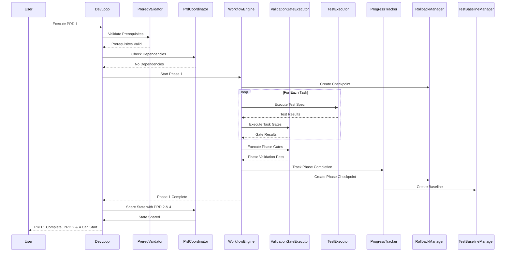
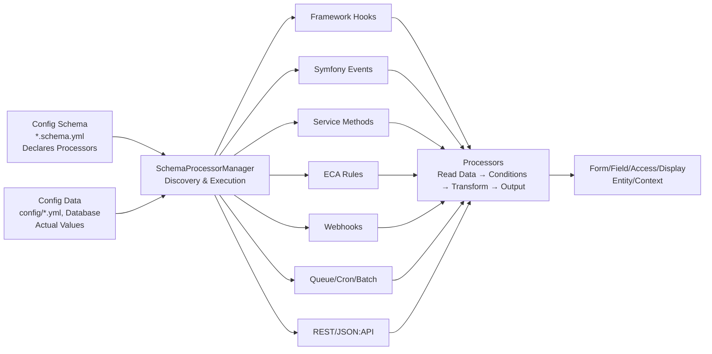
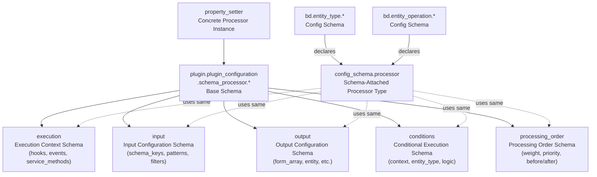
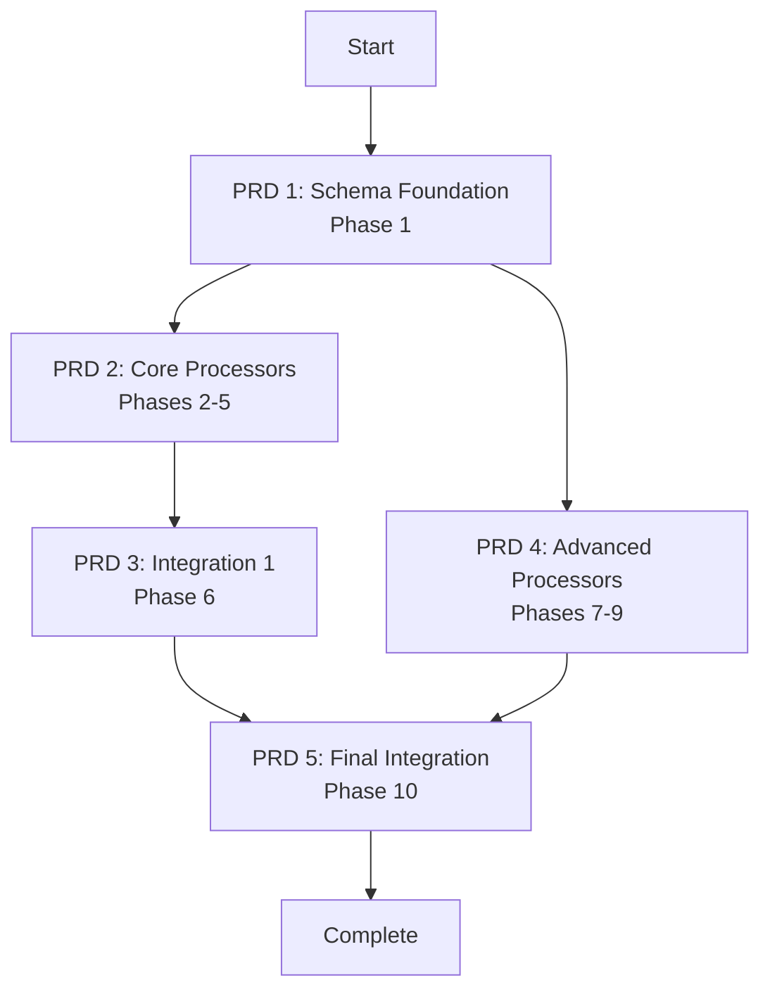

# Schema Processor Refactoring - PRD Index

## Autonomous Execution Flow for Schema Processor PRD



This directory contains 5 phased PRDs that collectively implement the schema processor refactoring project.

## Project Purpose

Features are built **entirely through declarative configuration schema** instead of code. The system enables:

1. **Schema-Driven Development**: Define features via configuration schema with processor declarations
2. **Reusability**: Reuse existing processors or create new ones via configuration
3. **AI Pattern Recognition**: AI analyzes schema patterns and generates reusable processors
4. **Rapid Development**: Features deployed through schema changes without code deployment

## Schema Processor Architecture

Schema processors are reusable plugins that process configuration declaratively:

1. **Schema files** (`*.schema.yml`) declare processors with execution contexts, inputs, outputs, and conditions
2. **SchemaProcessorManager** discovers processors by execution context and orchestrates execution
3. **Execution contexts** trigger processor discovery and execution
4. **Processors** read config data, evaluate conditions, transform data based on schema-defined rules, and produce outputs
5. **Outputs** are applied to forms, field definitions, access results, display components, entities, and custom contexts

**Execution Contexts**: Processors run in:
1. Events and framework API
3. Service methods
4. ECA rules engine
5. Webhooks
6. Queue/cron/batch
7. REST/JSON:API
8. Custom events



**Execution Flow**:
1. Schema declares processors
2. Manager discovers by execution context
3. Context triggers execution
4. Processors evaluate conditions
5. Transform configuration
6. Apply outputs

### Schema Processor Schema

Schema processors use a hierarchical schema structure where the base schema references component schemas. Schema-attached processors use the same structure and are automatically discovered alongside plugin-based processors, with auto-inference reducing boilerplate.



```yaml
# Part of plugin.plugin_configuration.schema_processor.* schema
plugin.plugin_configuration.schema_processor.*:
  type: mapping
  mapping:
    execution: <execution_schema>
    input: <input_schema>
    output: <output_schema>
    conditions: <conditions_schema>
    processing_order: <processing_order_schema>
  # ... additional properties
```

**Component Schemas** (abbreviated - each has additional properties):

```yaml
# Component schemas (part of plugin.plugin_configuration.schema_processor.*)
execution:
  mapping:
    hooks: type: sequence
    events: type: sequence
    service_methods: type: sequence
    dry_run_safe: type: boolean
  # ... additional properties

input:
  mapping:
    schema_keys: type: sequence
    schema_patterns: type: sequence
    third_party_settings: type: sequence
    auto_infer: type: boolean
    filters: type: mapping
  # ... additional properties

output:
  mapping:
    form_array: type: boolean
    field_definition: type: boolean
    entity_type: type: boolean
    entity_operation: type: boolean
    idempotent: type: boolean
  # ... additional properties

conditions:
  mapping:
    context: type: sequence
    entity_type: type: mapping
    bundle: type: mapping
    field_type: type: mapping
    custom: type: sequence
    condition_logic: type: option
  # ... additional properties

processing_order:
  mapping:
    weight: type: integer
    priority: type: option
    before: type: sequence
    after: type: sequence
  # ... additional properties
```

**Example: Property Setter Processor** (concrete instance):

```yaml
# Part of plugin.plugin_configuration.schema_processor.property_setter schema
plugin.plugin_configuration.schema_processor.property_setter:
  type: mapping
  mapping:
    execution:
      mapping:
        hooks: type: sequence
    input:
      mapping:
        schema_keys: type: sequence
        auto_infer: type: boolean
    output:
      mapping:
        form_array: type: boolean
    conditions:
      mapping:
        context: type: sequence
    processing_order:
      mapping:
        weight: type: integer
    property_operations: type: sequence  # Processor-specific
  # ... additional properties
```

**Schema-Attached Processors** are declared directly in config schema files using `config_schema.processor` type, which references the same component schemas:

```yaml
# Part of config_schema.processor type definition
config_schema.processor:
  type: mapping
  mapping:
    plugin_id: type: string
    execution: <execution_schema>
    input: <input_schema>
    output: <output_schema>
    conditions: <conditions_schema>
    processing_order: <processing_order_schema>
  # ... processor-specific properties
```

**Binding Examples** - Processors declared in config schemas:

```yaml
# Example 1: Part of bd.entity_type.* schema
bd.entity_type.*:
  type: config_schema_set
  mapping:
    route:
      mapping:
        link_templates:
          mapping:
            processors:
              - plugin_id: property_setter
                execution:
                  hooks: [entity_type_definition_alter]
                input:
                  auto_infer: true
                  schema_keys: [route.link_templates]
                output:
                  entity_type: true
                property_operations: [...]
  # ... additional properties

# Example 2: Part of bd.entity_operation.* schema
bd.entity_operation.*:
  type: config_schema_set
  mapping:
    menu_item:
      mapping:
        title:
          type: string
          processors:
            - plugin_id: property_setter
              execution:
                hooks: [entity_operation_definition_alter]
              input:
                auto_infer: true
                schema_keys: [menu_item.title]
              output:
                entity_operation: true
              conditions:
                include_entity_types: [node, user]
  # ... additional properties
```

## Terminology

- **Config Schema**: Schema definition files (`*.schema.yml`) that define structure, types, validation rules, and processor declarations
- **Config Data**: Actual configuration values stored in YAML files (`config/install/*.yml`, `config/default/*.yml`) or database
- **Schema Processors**: Plugins that process config data based on processor declarations in config schema files

## PRD Overview & Execution

The project is split into 5 PRDs:

| PRD | Name | Sequence | Dependencies | Phases | Status |
|-----|------|----------|--------------|--------|--------|
| [PRD 1](./1-schema-foundation.md.yml) | Schema Foundation | 1 | None | Phase 1 | Ready |
| [PRD 2](./2-core-processors.md.yml) | Core Processors | 2 | PRD 1 | Phases 2-5 | Ready |
| [PRD 3](./3-integration.md.yml) | Integration 1 | 3 | PRD 2 | Phase 6 | Ready |
| [PRD 4](./4-advanced-processors.md.yml) | Advanced Processors | 4 | PRD 1 | Phases 7-9 | Ready |
| [PRD 5](./5-final-integration.md.yml) | Final Integration | 5 | PRD 3, PRD 4 | Phase 10 | Ready |



**Execution Order**:
1. PRD 1 (must complete first)
2. PRD 2 and PRD 4 (can run in parallel after PRD 1)
3. PRD 3 (after PRD 2)
4. PRD 5 (after PRD 3 and PRD 4)

## Schema Sets Covered

This PRD suite covers 7 major config schema sets:

| Schema Set | Key Features |
|------------|--------------|
| **bd.entity_type.*** | Entity type definition processing, template separation, handler merging, route generation |
| **bd.computed_field.*** | Computed field plugin processing, field type processing |
| **bd.field_set.*** | Field set grouping and organization |
| **bd.entity_operation.*** | Route generation, context mapping, access control, menu building with nested sequences and plugin chains |
| **bd.entity_context.*** | Entity data extraction, pre-processing pipeline, context aggregation, multi-format field processing |
| **bd.entity_field.*** | Options provider, widget, formatter, value provider, access control, validation with context-aware processing |
| **bd.entity_display.*** | Display context, component settings, widget/formatter settings sync with config schema set patterns |

**Common Patterns**:
1. Plugin instance processing
2. Conditional logic (AND/OR/XOR)
3. Context-aware processing
4. Nested sequences
5. Recursive mapping structures

## PRD Details

### [PRD 1: Schema Foundation](./1-schema-foundation.md.yml)

**Key Deliverables**:
1. Enhanced schema processor plugin schema
2. Condition/ValidationRule plugin types
3. Updated SchemaProcessor classes
4. Enhanced SchemaProcessorManager
5. Schema-attached processor support

**Tasks**: TASK-101 through TASK-117 (17 tasks)

### [PRD 2: Core Processors](./2-core-processors.md.yml)

**Key Deliverables**:
1. Core processors for entity display, field features, field definitions, entity operations, and entity contexts (Phases 2-5)
2. Refactored service methods and hook implementations

**Tasks**: TASK-201 through TASK-267 (67 tasks)

### [PRD 3: Integration 1](./3-integration.md.yml)

**Key Deliverables**:
1. All Playwright test suites passing
2. Integration tests for nested sequences, plugin chains, conditional logic, context-aware processing, and config_schema_set patterns
3. Regression fixes

**Tasks**: TASK-501 through TASK-512 (12 tasks)

### [PRD 4: Advanced Processors](./4-advanced-processors.md.yml)

**Key Deliverables**:
1. Entity type, computed field, and field set schema processors (Phases 7-9)
2. Refactored EntityHelper and EntityFieldHelper service methods

**Tasks**: TASK-601 through TASK-805

### [PRD 5: Final Integration](./5-final-integration.md.yml)

**Key Deliverables**:
1. All test suites passing
2. Cross-processor validation
3. System-wide performance validation
4. Production readiness
5. Complete documentation

**Tasks**: TASK-801 through TASK-806 (6 tasks)

## Validation Infrastructure

### Pre-Execution Validation

Before executing any PRD, run the prerequisite validation script:

```bash
ddev exec bash -c "php script/validate-prd-prerequisites.php"
```

This validates:
- Pre-existing modules, classes, and services
- Drupal environment readiness
- Test infrastructure availability

### Schema Validation

Validate all schema files, plugin types, and service definitions:

```bash
ddev exec bash -c "php script/validate-schema.php"
```

This validates:
- YAML syntax for all `*.schema.yml` files
- Schema structure against Drupal TypedConfigManager
- Plugin type definitions in `bd.plugin_type.yml`
- Service definitions in `bd.services.yml`

### Validation Gates

Validation gates use the `validate-gates.php` helper script:

```bash
# Check for PHP fatal errors
php script/validate-gates.php no-php-errors

# Validate schema files
php script/validate-gates.php schema-validates

# Check plugin types are discoverable
php script/validate-gates.php plugin-types-discoverable

# Check methods exist on a service
php script/validate-gates.php methods-exist plugin.manager.schema_processor getAllProcessorsForHook discoverSchemaAttachedProcessors
```

### Test File Structure

All validation tests are organized by PRD and phase:

```
tests/playwright/bd/
├── schema-processor-foundation.spec.ts          # PRD 1: Schema Foundation
├── schema-processor-core-processors.spec.ts     # PRD 2: Core Processors
├── schema-processor-integration-1.spec.ts       # PRD 3: Integration 1
├── schema-processor-advanced-processors.spec.ts # PRD 4: Advanced Processors
├── schema-processor-final-integration.spec.ts   # PRD 5: Final Integration
└── helpers/
    ├── schema-helper.ts                         # Schema validation helpers
    ├── plugin-helper.ts                        # Plugin discovery helpers
    ├── service-helper.ts                        # Service existence helpers
    ├── processor-helper.ts                      # Processor execution helpers
    └── integration-helper.ts                    # Integration test helpers
```

### Test Execution Strategy

1. **Phase-Level Tests**: Run after each phase completes within a PRD
2. **PRD-Level Tests**: Run after entire PRD completes
3. **Integration Tests**: Run after PRDs 2 and 3 complete (first integration round)
4. **Final Integration Tests**: Run after PRD 5 completes (final integration)

### Troubleshooting

#### Schema Validation Failures

- **YAML syntax errors**: Check file encoding and indentation
- **Schema not discoverable**: Clear Drupal cache with `ddev exec bash -c "drush cr"`
- **Plugin type not found**: Verify `bd.plugin_type.yml` syntax and service registration

#### Validation Gate Failures

- **no-php-errors**: Check Drupal logs with `ddev logs -s web`
- **schema-validates**: Run `script/validate-schema.php` directly to see detailed errors
- **plugin-types-discoverable**: Verify plugin type is defined in `bd.plugin_type.yml` and cache is cleared
- **methods-exist**: Check service class exists and method is defined

#### Test Failures

- **Service not found**: Verify service is registered in `bd.services.yml`
- **Processor not discovered**: Check processor plugin annotation and hook registration
- **Test timeout**: Increase timeout in test configuration or check for infinite loops

## Quick Reference

### Dev-Loop PRD Schema Structure

All PRDs use dev-loop PRD schema v1.2 with enhanced frontmatter around prompts:

| Enhancement | Key Properties | Config Location |
|-------------|----------------|-----------------|
| **Execution Configuration** | `mode` (hybrid/autonomous), `intervention.pauseOn`, `intervention.riskyPatterns`, `parallelism.*`, `retry.*`, `rollback.*` | `execution` |
| **Context Providers** | `requiredFiles`, `searchPatterns`, `frameworkPatterns` | `config.context.codeContext` |
| **Pattern Learning** | `enabled`, `patternsPath`, `learnFrom`, `injectGuidance` | `config.context.patternLearning` |
| **Debugging Strategy** | `strategy`, `framework`, `errorClassification`, `rootCauseAnalysis` | `config.context.debugging` |
| **Validation Gates** | `gates[].phase`, `gates[].tests`, `gates[].assertions` | `config.validation.gates` |
| **Error Handling** | `typeSpecific[errorType].retry`, `typeSpecific[errorType].diagnostics` | `config.errorHandling` |
| **AI Configuration** | `provider`, `contextInjection`, `customInstructions` | `config.ai` |
| **Progress Tracking** | `tracking`, `metrics.path`, `metrics.track`, `checkpoints` | `config.progress` |
| **Integration Coordination** | `prdDependencies.trackState`, `stateSharing.enabled`, `stateSharing.sharedKeys` | `config.integration` |
| **Testing Strategy** | `directory`, `framework`, `parallel`, `workers`, `bundledTests`, `timeout`, `retries` | `testing` |
| **Test Generation** | `enabled`, `templates`, `patterns` | `config.testGeneration` |
| **Test Artifacts** | `cleanup`, `preserve` | `config.testArtifacts` |
| **Test Execution** | `retryFailed`, `maxRetries`, `timeout` | `config.testExecution` |
| **Test Coverage** | `required`, `thresholds`, `perPhase` | `config.testCoverage` |
