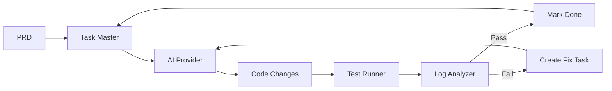
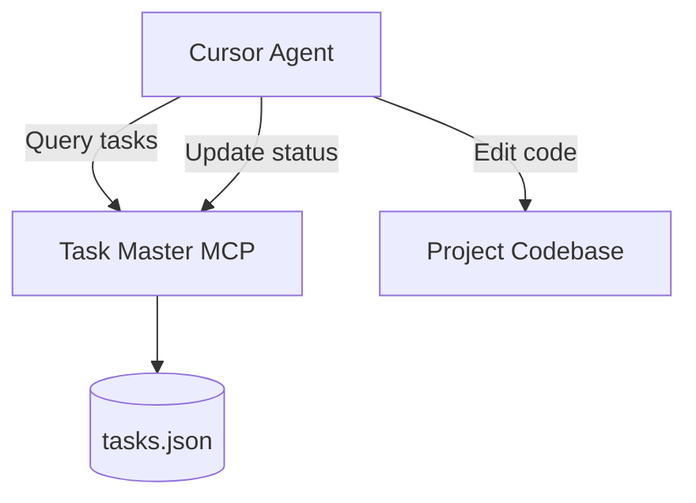
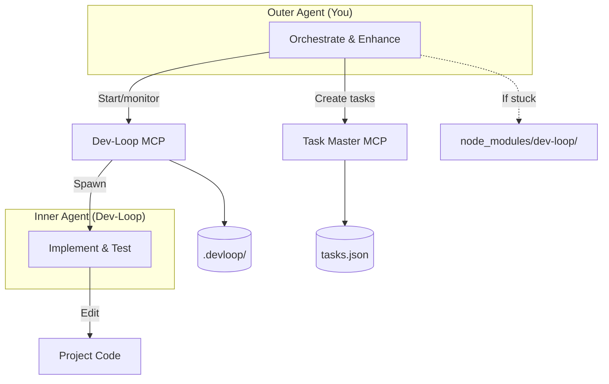
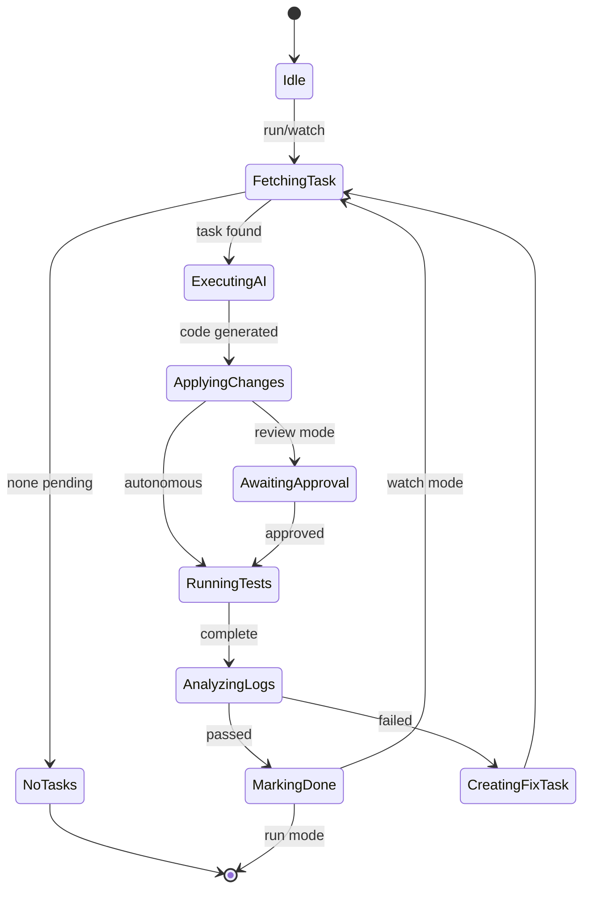

# dev-loop

Autonomous development orchestrator that transforms PRDs into validated code through a continuous loop of AI code generation, test execution, and log analysis.

## Table of Contents

- [Documentation](#documentation)
- [Core Concept](#core-concept)
- [Operating Modes](#operating-modes)
- [Quick Start](#quick-start)
- [Configuration](#configuration)
- [CLI Reference](#cli-reference)
- [MCP Integration](#mcp-integration)
- [Architecture](#architecture)
- [Framework Plugins](#framework-plugins)
- [AI-Enhanced Pattern Detection](#ai-enhanced-pattern-detection)
- [Code Quality Scanning](#code-quality-scanning)
- [File Structure](#file-structure)
- [Troubleshooting](#troubleshooting)
- [Development](#development)
- [Roadmap](#roadmap)

## Documentation

**For Users:** See [`docs/users/README.md`](docs/users/README.md) - Complete user documentation, CLI reference, and configuration guide.

**Metrics & Reporting:** See [`docs/users/METRICS.md`](docs/users/METRICS.md), [`docs/users/REPORTS.md`](docs/users/REPORTS.md), and [`docs/users/ARCHIVE.md`](docs/users/ARCHIVE.md) - Comprehensive guides for metrics, reports, and archiving.

**For AI Agents:** See [`docs/ai/README.md`](docs/ai/README.md) - AI agent onboarding guide for creating PRDs and leveraging dev-loop features.

**For Contributors:** See [`docs/contributing/README.md`](docs/contributing/README.md) - Contribution guide, architecture, and development workflow.

**Quick Lookup:** See [`docs/ai/INDEX.md`](docs/ai/INDEX.md) - Documentation index with task → doc mappings, feature guides, and problem solutions.

**PRD Documentation:**
- [`docs/ai/PRD_SCHEMA.md`](docs/ai/PRD_SCHEMA.md) - Complete schema reference with validation rules
- [`docs/ai/PRD_FEATURES.md`](docs/ai/PRD_FEATURES.md) - Comprehensive guide to all 17 dev-loop features
- [`docs/ai/PRD_TEMPLATE.md`](docs/ai/PRD_TEMPLATE.md) - Copy-paste PRD template with all optional sections

### Documentation Discovery

All documentation files include YAML frontmatter metadata for discoverability. AI agents can:

1. **Index-Based Discovery**: Use [`docs/ai/INDEX.md`](docs/ai/INDEX.md) to find docs by task, feature, or problem
2. **Metadata Filtering**: Filter by `type` (reference, guide, template), `category` (prd, features), or `audience` (ai, user, both)
3. **Keyword Matching**: Match task keywords to document keywords for relevant content
4. **Workflow Guidance**: Follow recommended documentation sequences for common workflows

**Metadata Fields:**
- `type` - reference | guide | tutorial | template | index
- `category` - prd | cli | architecture | features
- `audience` - ai | user | both
- `keywords` - Searchable keywords array
- `related_docs` - Links to related documentation
- `prerequisites` - Prerequisite docs to load first
- `estimated_read_time` - Minutes to read

**Discovery Examples:**
- **Creating PRD**: Start with `PRD_TEMPLATE.md` (template), validate with `PRD_SCHEMA.md` (reference)
- **Configuring features**: Load `PRD_FEATURES.md` (guide, category: features)
- **Validation errors**: Check `PRD_SCHEMA.md` (reference, keywords: validation)

## Core Concept

Dev-loop implements a **test-driven development loop**:



**Key principle**: Every task bundles feature code + test code. The loop continues until all tests pass.

## Operating Modes

### Standard Mode (Default)

You implement tasks directly. Dev-loop provides task management and diagnostics.



### Contribution Mode

Two-agent architecture for contributing to dev-loop itself.



| Aspect | Standard | Contribution |
|--------|----------|--------------|
| Who implements | You | Inner agent |
| Your role | Direct coding | Orchestration |
| Code you edit | All files | Only `node_modules/dev-loop/` |

#### Intervention Modes

Control whether the inner agent requires approval:

| Mode | Behavior |
|------|----------|
| `autonomous` | Fully automated |
| `review` | Human approves each change |
| `hybrid` | Auto for safe changes, review for risky (`delete`, `schema-change`) |

#### CLI Commands

| Command | Description |
|---------|-------------|
| `dev-loop contribution start --prd <path>` | Start contribution mode |
| `dev-loop contribution status` | Check contribution mode status |
| `dev-loop contribution stop` | Stop contribution mode |
| `dev-loop contribution validate` | Validate contribution mode boundaries |
| `dev-loop contribution boundaries` | List active boundaries |

#### Workflow

1. Start contribution mode (CLI or MCP)
2. Create/update tasks via Task Master
3. Monitor via `devloop_contribution_status` or `dev-loop contribution status`
4. If inner agent stuck: enhance `node_modules/dev-loop/` code
5. Build, commit, push dev-loop changes
6. Validate improvements via metrics

#### Event Streaming & Observability

Dev-loop emits structured events for efficient contribution mode monitoring:

- **Event Types**: `file:filtered`, `validation:failed`, `task:blocked`, `change:unauthorized`, `change:reverted`, `contribution:issue_detected`, `intervention:triggered`, `intervention:successful`, `intervention:failed`, `intervention:rolled_back`
- **MCP Tools**: Use `devloop_events_poll`, `devloop_events_latest`, `devloop_blocked_tasks`, `devloop_filtered_files`, `devloop_issues`
- **Proactive Event Monitoring**: Automated event monitoring service that triggers interventions when thresholds are exceeded
- **Enhanced Observation Tools**: Pattern detection, session analysis, context gap detection, dependency graph visualization
- **Early File Filtering**: Files outside `targetModule` are filtered before validation, reducing error noise
- **Comprehensive Issue Detection**: 14 issue types automatically detected and alerted via event streaming (module confusion, session pollution, boundary violations, context loss, code generation degradation, context window inefficiency, task dependency deadlock, test generation quality, validation over-blocking, AI provider instability, resource exhaustion, phase progression stalling, pattern learning inefficacy, schema validation consistency)

**Proactive Monitoring Tools:**
- `devloop_event_monitor_start` - Start proactive event monitoring service
- `devloop_event_monitor_stop` - Stop monitoring service
- `devloop_event_monitor_status` - Get monitoring status and intervention statistics
- `devloop_event_monitor_configure` - Configure intervention thresholds and actions
- `devloop_event_monitor_interventions` - Get list of recent interventions and outcomes

**Enhanced Observation Tools:**
- `devloop_pattern_detection` - Detect recurring patterns in failures/blocked tasks
- `devloop_codebase_health` - Analyze codebase health metrics (Phase 3 placeholder)
- `devloop_session_analysis` - Analyze session pollution patterns
- `devloop_context_gap_detection` - Identify missing context causing task failures
- `devloop_dependency_graph` - Visualize task and code dependencies

See [`docs/contributing/EVENT_STREAMING.md`](docs/contributing/EVENT_STREAMING.md) for complete event streaming guide.  
See [`docs/contributing/PROACTIVE_MONITORING.md`](docs/contributing/PROACTIVE_MONITORING.md) for proactive monitoring and intervention guide.  
See [`docs/contributing/OBSERVATION_TOOLS.md`](docs/contributing/OBSERVATION_TOOLS.md) for enhanced observation tools reference.

#### When to Enhance Dev-Loop vs Create Task

| Scenario | Action |
|----------|--------|
| One-off bug fix | Create task |
| Repeated pattern | Add to PatternLearningSystem |
| Missing context | Enhance CodeContextProvider |
| Better prompts | Update templates |

**Keep dev-loop framework-agnostic.** Project-specific behavior goes in `devloop.config.js`, `.taskmaster/templates/`, or project rules.

**Documentation:** See [`docs/contributing/`](docs/contributing/README.md) for complete contribution mode guide, state schema, and boundary enforcement.

## Quick Start

```bash
# Prerequisites: Node.js 20+, AI API key

# Install
npm install -g dev-loop

# Setup
echo "ANTHROPIC_API_KEY=your_key" > .env
dev-loop init
task-master init

# Run
task-master parse-prd --input=prd.md   # Create tasks from PRD
dev-loop run                            # Execute one iteration
dev-loop watch                          # Continuous mode
```

## Configuration

Create `devloop.config.js`:

```javascript
module.exports = {
  ai: {
    provider: 'anthropic',              // 'anthropic' | 'openai' | 'gemini' | 'ollama' | 'cursor'
    model: 'claude-sonnet-4-20250514',
    fallback: 'openai:gpt-4o',
  },
  testing: {
    runner: 'playwright',               // 'playwright' | 'cypress'
    command: 'npm test',
    timeout: 300000,
  },
  intervention: {
    mode: 'autonomous',                 // 'autonomous' | 'review' | 'hybrid'
  },
  taskMaster: {
    tasksPath: '.taskmaster/tasks/tasks.json',
  },
  cursor: {
    requestsPath: 'files-private/cursor',
    agentName: 'DevLoopCodeGen',
    model: 'auto',
    agents: {
      enabled: true,                    // Enable agent auto-generation
      autoGenerate: true,               // Automatically generate agent configs
      autoProcess: true,                // Auto-process chat requests in watch mode
      watchMode: true,                  // Enable file watching
      processInterval: 2000,            // Polling interval (ms)
      useBackgroundAgent: true,         // Use --print mode for headless operation
      agentOutputFormat: 'json',        // Output format: 'json', 'text', 'stream-json'
      // Session management for context persistence
      sessionManagement: {
        enabled: true,                  // Enable session persistence (default: true)
        maxSessionAge: 3600000,         // Max session age in ms (default: 1 hour)
        maxHistoryItems: 50,          // Max history entries per session (default: 50)
        sessionsPath: '.devloop/cursor-sessions.json', // Session storage path
      },
    },
  },
  debug: false,
  metrics: { enabled: true, path: '.devloop/metrics.json' },
  patternLearning: { enabled: true, patternsPath: '.devloop/patterns.json' },
};
```

**Advanced configuration:**
- [AI Pattern Detection](#ai-enhanced-pattern-detection) — `aiPatterns` config for embeddings and LLM analysis
- [Code Quality Scanning](#code-quality-scanning) — `scan` config for static analysis and tech debt
- [Framework Plugins](#framework-plugins) — `framework` config for framework-specific behavior
- [Cursor Multi-Agent Integration](#cursor-multi-agent-integration) — `cursor.agents` config for automatic agent generation and chat creation

## CLI Reference

### Core Commands

| Command | Description |
|---------|-------------|
| `dev-loop init` | Initialize project |
| `dev-loop run [--task ID] [--debug]` | Execute one iteration |
| `dev-loop watch [--debug]` | Continuous execution |
| `dev-loop status` | Current progress |
| `dev-loop pause` / `resume` | Control execution |

### Task Commands

| Command | Description |
|---------|-------------|
| `dev-loop list [--pending\|--done]` | List tasks |
| `dev-loop show <id>` | Task details |
| `dev-loop reset <id>` | Reset to pending |
| `task-master parse-prd --input=<file>` | Create tasks from PRD |
| `task-master add-task --prompt="..."` | Add single task |
| `task-master set-status --id=<id> --status=done` | Update status |

### Metrics and Reporting Commands

| Command | Description |
|---------|-------------|
| `dev-loop metrics [--prd-set <id>] [--prd <id>] [--phase <prdId:phaseId>]` | View hierarchical metrics |
| `dev-loop metrics --compare <id1>:<id2>` | Compare two PRDs or PRD sets |
| `dev-loop metrics --trends` | Show trends over time |
| `dev-loop metrics --features` | Show feature usage metrics |
| `dev-loop metrics --schema` | Show schema operation metrics |
| `dev-loop report [--prd <id>] [--prd-set <id>] [--phase <prdId:phaseId>]` | Generate execution reports |
| `dev-loop report --latest` | Generate report for most recent PRD |
| `dev-loop report --all` | Generate reports for all PRDs |
| `dev-loop archive [--prd-name <name>] [--compress]` | Archive state files |

See [`docs/users/METRICS.md`](docs/users/METRICS.md), [`docs/users/REPORTS.md`](docs/users/REPORTS.md), and [`docs/users/ARCHIVE.md`](docs/users/ARCHIVE.md) for detailed guides.

### Debugging Commands

| Command | Description |
|---------|-------------|
| `dev-loop diagnose [<id>]` | Analyze failures |
| `dev-loop trace <id>` | Execution trace |
| `dev-loop logs [--follow]` | View logs |
| `dev-loop metrics [--summary]` | Debug metrics (task-level) |
| `dev-loop validate` | Check config/environment |
| `dev-loop validate-prd <prd-path>` | Validate PRD frontmatter against schema |

### Code Quality & AI Commands

| Command | Description |
|---------|-------------|
| `dev-loop scan [--type TYPE]` | Run code quality scans |
| `dev-loop recommend [--ai]` | Generate abstraction recommendations |
| `dev-loop feedback <id> [--accept\|--reject]` | Provide feedback on AI recommendations |

## Cursor Multi-Agent Integration

Dev-loop uses Cursor background agents (headless execution) as the primary method for autonomous code generation. This enables:

- **Background agent execution** - Headless, autonomous code generation using `cursor agent --print` mode
- **Session persistence** - Context and conversation history maintained across tasks
- **100% automated execution** - No manual intervention required
- **Parallel execution support** - Multiple PRD sets and phases execute simultaneously with isolated sessions
- **Optional observability** - Visible agent configs can be created for monitoring (optional, non-blocking)

### Quick Start

1. **Enable in config**:
   ```javascript
   cursor: {
     agents: {
       enabled: true,
       autoProcess: true,
     }
   }
   ```

2. **Start watch mode**:
   ```bash
   dev-loop watch
   ```

3. **Validate setup**:
   ```bash
   dev-loop validate-cursor-agents
   ```

### Session Persistence

Background agents maintain context between calls using session management:

- **Automatic session creation**: Sessions are created per PRD/phase combination
- **Conversation history**: Previous prompts and responses are included in context
- **Context window continuity**: Agents can build on previous interactions
- **Session statistics**: Track success rates, JSON parsing errors, and call counts

**Configuration:**
```javascript
cursor: {
  agents: {
    sessionManagement: {
      enabled: true,              // Enable session persistence
      maxSessionAge: 3600000,     // 1 hour (milliseconds)
      maxHistoryItems: 50,        // Max conversation history entries
      sessionsPath: '.devloop/cursor-sessions.json',
    },
  },
}
```

**How it works:**
1. First task in a PRD/phase creates a new session
2. Subsequent tasks in the same PRD/phase resume the session
3. Conversation history is included in prompts for context
4. Sessions are automatically cleaned up after `maxSessionAge`
5. Statistics are tracked per session (calls, errors, JSON parsing failures)

**MCP Tools:**
- `devloop_background_agent_status()` - Query session state and statistics
- `devloop_logs(analyze: true)` - Get categorized background agent errors
- `devloop_metrics()` - View execution metrics including background agent operations

### Reliability Features

Dev-loop includes comprehensive reliability features for Cursor background agents:

- **Timeout handling** - Configurable timeouts with progressive extension and heartbeat monitoring
- **Retry logic** - Automatic retries with strict JSON prompts on failure (3 attempts by default)
- **Enhanced JSON parsing** - Robust extraction from various response formats, including "already complete" detection

### Background Agent JSON Parsing

Dev-loop uses a robust JSON parsing strategy to extract code changes from Cursor background agent responses. The parser handles various response formats and edge cases:

**Parsing Strategy:**
1. **Raw JSON first**: Attempts to parse JSON without modification (JSON should already be valid)
2. **Double-escaping detection**: Only unescapes when double-escaping is detected (e.g., `\\\\n` → `\\n`)
3. **Multiple extraction strategies**:
   - JSON code blocks (```json ... ```)
   - CodeChanges structure in text
   - Files key extraction with brace counting
   - Triple-escaped JSON handling
   - "Already complete" response detection

**Key Improvements:**
- **Fixed control character errors**: No longer incorrectly unescapes valid JSON escape sequences
- **Better error handling**: Detailed logging with context snippets for debugging
- **Shared parser utility**: Centralized parsing logic in `cursor-json-parser.ts` for consistency
- **Prefix stripping**: Automatically removes prefixes like "Here is the JSON:"

**Architecture:**
```
CursorProvider
  └─> CursorChatOpener
       ├─> CursorSessionManager (session persistence)
       └─> cursor-json-parser (shared JSON parsing)
```

The refactored architecture eliminates code duplication by centralizing JSON parsing logic in a shared utility module used by both `CursorProvider` and `CursorChatOpener`.

See [`docs/CURSOR_INTEGRATION.md`](docs/CURSOR_INTEGRATION.md) for detailed documentation on timeout handling, retry logic, and session management.

## MCP Integration

Both Task Master and Dev-Loop run as MCP servers for direct AI assistant integration.

### Setup

Create `.cursor/mcp.json`:

```json
{
  "mcpServers": {
    "task-master-ai": {
      "command": "npx",
      "args": ["-y", "task-master-ai@0.40.0"],
      "env": { "ANTHROPIC_API_KEY": "${ANTHROPIC_API_KEY}" }
    },
    "dev-loop": {
      "command": "node",
      "args": ["packages/dev-loop/dist/mcp/server.js"],
      "env": { "ANTHROPIC_API_KEY": "${ANTHROPIC_API_KEY}" }
    }
  }
}
```

### MCP Tools

**Task Master MCP** (task management):
- `parse_prd`, `add_task`, `list_tasks`, `next_task`, `get_task`, `set_status`, `expand_task`

**Dev-Loop MCP** (workflow orchestration):
- Core: `devloop_run`, `devloop_status`, `devloop_prd`, `devloop_list_tasks`
- Debug: `devloop_diagnose`, `devloop_trace`, `devloop_logs`, `devloop_metrics`
- Control: `devloop_pause`, `devloop_resume`, `devloop_reset`, `devloop_validate`
- Contribution: `devloop_contribution_start`, `devloop_contribution_status`, `devloop_contribution_stop`, `devloop_contribution_validate`, `devloop_contribution_boundaries`
- Events: `devloop_events_poll`, `devloop_events_latest`, `devloop_blocked_tasks`, `devloop_filtered_files`, `devloop_issues`
- Event Monitoring: `devloop_event_monitor_start`, `devloop_event_monitor_stop`, `devloop_event_monitor_status`, `devloop_event_monitor_configure`, `devloop_event_monitor_interventions`
- Observation: `devloop_pattern_detection`, `devloop_codebase_health`, `devloop_session_analysis`, `devloop_context_gap_detection`, `devloop_dependency_graph`

### Common Workflows

**Start a PRD (Contribution Mode):**
```
1. devloop_contribution_start(prd: "path/to/prd.md")
2. devloop_contribution_validate() — validate boundaries
3. task-master: parse_prd(input: "path/to/prd.md")
4. devloop_prd(prdPath: "path/to/prd.md", debug: true)
5. devloop_contribution_status() — monitor until complete
6. devloop_contribution_stop() — stop when done
```

**Debug a failure:**
```
1. devloop_diagnose(taskId: "123")
2. devloop_logs(analyze: true)
3. devloop_trace(taskId: "123")
```

## Architecture

### Workflow State Machine



### Core Components

| Component | Purpose |
|-----------|---------|
| **WorkflowEngine** | Main orchestration loop, state machine |
| **TaskMasterBridge** | Wrapper around task-master-ai |
| **StateManager** | JSON/YAML persistence, state recovery |
| **CodeContextProvider** | Extract file signatures, imports, error context |
| **ValidationGate** | Pre-apply validation, syntax checking |
| **PatternLearningSystem** | Learn from outcomes, inject guidance |
| **ParallelMetrics** | Parallel execution tracking and concurrency metrics ([Architecture](docs/contributing/ARCHITECTURE.md#parallel-execution-system)) |
| **ProgressTracker** | Real-time progress updates during execution ([Architecture](docs/contributing/ARCHITECTURE.md#session-management-system)) |
| **SessionBoundaryManager** | Provider-agnostic session boundary enforcement ([Architecture](docs/contributing/ARCHITECTURE.md#session-management-system)) |
| **ContextBuilder** | Unified context building for all AI providers ([Architecture](docs/contributing/ARCHITECTURE.md#context-discovery-system)) |
| **TimeoutHandler** | Provider-agnostic timeout handling ([Architecture](docs/contributing/ARCHITECTURE.md#ai-provider-reliability)) |
| **ReportGenerator** | Comprehensive execution reporting ([Architecture](docs/contributing/ARCHITECTURE.md#parallel-execution-system)) |
| **EventMonitorService** | Proactive event monitoring and automated intervention system ([Architecture](docs/contributing/ARCHITECTURE.md#monitoring--intervention-system)) |
| **IssueClassifier** | Event classification and confidence calculation ([Architecture](docs/contributing/ARCHITECTURE.md#monitoring--intervention-system)) |
| **ActionExecutor** | Automated fix execution and effectiveness monitoring ([Architecture](docs/contributing/ARCHITECTURE.md#monitoring--intervention-system)) |
| **InterventionMetricsTracker** | Intervention metrics tracking and effectiveness analysis ([Architecture](docs/contributing/ARCHITECTURE.md#monitoring--intervention-system)) |

### Provider Interfaces

| Interface | Implementations |
|-----------|-----------------|
| **AIProvider** | Anthropic, OpenAI, Gemini, Ollama |
| **TestRunner** | Playwright, Cypress |
| **LogAnalyzer** | PatternMatcher (regex), AILogAnalyzer |

### Analysis Components

For complex issues, dev-loop provides:

- **FrameworkPatternLibrary** — Framework-specific patterns (Drupal, React)
- **DebuggingStrategyAdvisor** — Classify errors, suggest investigation vs direct fix
- **ExecutionOrderAnalyzer** — Detect timing/ordering issues
- **ComponentInteractionAnalyzer** — Map component boundaries and conflicts
- **RootCauseAnalyzer** — Track partial fixes, identify systemic issues

## Framework Plugins

Dev-loop uses a plugin architecture to support different frameworks. Each plugin provides framework-specific templates, error patterns, file discovery rules, and configuration defaults.

### Built-in Plugins

| Plugin | Description | Auto-detects |
|--------|-------------|--------------|
| **drupal** | Drupal 10/11 with DDEV integration | Yes |
| **django** | Django 5+ with Docker/DRF support | Yes |
| **react** | React + TypeScript + Vite | Yes |
| **browser-extension** | Chrome/Firefox extensions with manifest V3 | Yes |
| **composite** | Multi-framework projects (auto-created) | No |
| **generic** | Fallback for any project | Fallback only |

### Auto-Detection

When `framework.type` is not specified in `devloop.config.js`, dev-loop auto-detects frameworks:

1. Checks built-in plugins (Drupal, Django, React, Browser Extension)
2. If multiple detected → creates `CompositePlugin`
3. If single detected → uses that plugin
4. If none detected → uses `GenericPlugin`

Example: A project with both Django backend and React frontend automatically gets a `CompositePlugin` that merges both frameworks' configurations.

### Multi-Framework Projects

For projects like allthriveai (Django + React + Extension), dev-loop automatically:
- Detects all frameworks
- Creates a `CompositePlugin` with merged configurations
- Combines templates and error patterns
- Merges file discovery rules (search dirs, extensions, excludes)

**Example Configuration:**
```javascript
// devloop.config.js - optional, auto-detection works without this
module.exports = {
  framework: {
    type: 'composite', // Or let auto-detection handle it
  },
};
```

### Creating Custom Framework Plugins

#### Project-Local Plugin

Create a plugin in your project at `.devloop/frameworks/{name}/plugin.json`:

```json
{
  "name": "myframework",
  "version": "1.0.0",
  "description": "Custom framework plugin",
  "fileExtensions": ["ts", "tsx"],
  "searchDirs": ["src"],
  "excludeDirs": ["node_modules"],
  "templates": {
    "task": "templates/task.md"
  },
  "errorPatterns": {
    "MyError": "Helpful guidance for this error"
  },
  "cacheCommand": "npm run build"
}
```

#### NPM Plugin

Publish an npm package `@dev-loop/framework-{name}` that exports a `FrameworkPlugin` implementation:

```typescript
import { FrameworkPlugin } from '@dev-loop/core';

export class MyFrameworkPlugin implements FrameworkPlugin {
  readonly name = 'myframework';
  readonly version = '1.0.0';
  readonly description = 'My framework plugin';

  async detect(projectRoot: string): Promise<boolean> {
    // Detection logic
  }

  getTaskTemplate(): string {
    // Return template string
  }

  // ... implement other required methods
}

export default new MyFrameworkPlugin();
```

### FrameworkPlugin Interface

```typescript
interface FrameworkPlugin {
  readonly name: string;
  readonly version: string;
  readonly description: string;

  // Detection
  detect(projectRoot: string): Promise<boolean>;

  // Configuration
  getDefaultConfig(): FrameworkDefaultConfig;
  getSchemaExtension?(): z.ZodObject<any>;

  // Templates
  getTaskTemplate(): string;
  getTestTemplate?(): string | undefined;
  getPrdTemplate?(): string;

  // File Discovery
  getFileExtensions(): string[];
  getSearchDirs(): string[];
  getExcludeDirs(): string[];

  // Error Handling
  getErrorPatterns(): Record<string, string>;
  getIdentifierPatterns(): RegExp[];
  getErrorPathPatterns?(): RegExp[];

  // Lifecycle Hooks
  onBeforeApply?(changes: CodeChanges): Promise<CodeChanges>;
  onAfterApply?(changes: CodeChanges): Promise<void>;
  onTestFailure?(error: string): Promise<string>;

  // Commands
  getCacheCommand?(): string | undefined;
  getBuildCommand?(): string | undefined;

  // Code Quality (optional)
  getCodeQualityTools?(): CodeQualityTool[];
  getTechDebtIndicators?(): TechDebtIndicator[];
  getRecommendationPatterns?(): RecommendationPattern[];
}
```

### Supporting Types

```typescript
/** Framework-specific code quality tool */
interface CodeQualityTool {
  name: string;                    // e.g., 'phpstan', 'eslint', 'mypy'
  purpose: 'static-analysis' | 'duplicate-detection' | 'security' |
           'complexity' | 'tech-debt' | 'dependency-audit';
  command: string;                 // Command to run the tool
  outputFormat: 'json' | 'xml' | 'text' | 'sarif';
  installCommand?: string;         // How to install the tool
  configPath?: string;             // Path to tool config file
  description: string;
}

/** Tech debt pattern for regex-based detection */
interface TechDebtIndicator {
  pattern: string;                 // Regex pattern to match
  severity: 'low' | 'medium' | 'high';
  category: 'deprecated-api' | 'todo' | 'fixme' | 'hack' |
            'obsolete-pattern' | 'missing-test' | 'security' | 'tech-debt';
  description: string;
  remediation?: string;            // Suggested fix
}

/** Abstraction pattern detected in codebase */
interface AbstractionPattern {
  id: string;
  type: 'code-block' | 'config-structure' | 'class-pattern' |
        'function-pattern' | 'plugin-pattern';
  signature: string;
  files: string[];
  similarity: number;              // 0-1 score
  occurrences: number;
  suggestedAbstraction: 'plugin' | 'config-schema' | 'base-class' |
                        'service' | 'utility' | 'entity-type' | 'field';
  suggestedName?: string;
  evidence: string[];
}
```

See `src/frameworks/interface.ts` for full interface definition and examples in `src/frameworks/drupal/`, `src/frameworks/django/`, `src/frameworks/react/`, and `src/frameworks/browser-extension/`.

## AI-Enhanced Pattern Detection

Dev-loop includes AI-powered pattern detection for identifying abstraction opportunities and code quality improvements.

### Features

- **Semantic Code Analysis**: Uses embeddings to find functionally similar code blocks
- **Pattern Clustering**: Groups similar patterns across files for abstraction recommendations
- **LLM Analysis**: Deep analysis of patterns for implementation suggestions
- **Feedback Learning**: Learns from user feedback to improve future recommendations
- **Framework-Specific**: Tailored recommendations for Drupal, Django, React, and Browser Extensions

### Configuration

> **Note:** Pattern detection uses `aiPatterns` config (separate from code generation `ai` config).

```javascript
// devloop.config.js
module.exports = {
  // AI for code generation (separate from pattern detection)
  ai: {
    provider: 'anthropic',
    model: 'claude-sonnet-4-20250514',
  },

  // AI for pattern detection and abstraction recommendations
  aiPatterns: {
    enabled: true,
    provider: 'auto',  // 'anthropic' | 'openai' | 'ollama' | 'auto'
    providers: {
      anthropic: { apiKey: process.env.ANTHROPIC_API_KEY },
      openai: { apiKey: process.env.OPENAI_API_KEY },
      ollama: { baseUrl: 'http://localhost:11434' },
    },
    analysis: {
      mode: 'hybrid',           // 'embeddings-only' | 'llm-only' | 'hybrid'
      similarityThreshold: 0.85,
      minOccurrences: 3,
    },
    costs: {
      maxTokensPerScan: 100000,
      maxRequestsPerScan: 50,
      enableCaching: true,
      batchSize: 10,
    },
    learning: {
      enabled: true,
      feedbackFile: '.devloop/ai-feedback.json',
    },
  },
};
```

### Usage

```bash
# Run AI-enhanced pattern detection
dev-loop recommend --ai

# Use embeddings only (cheaper, faster)
dev-loop recommend --ai --ai-mode embeddings-only

# Full LLM analysis (more accurate, higher cost)
dev-loop recommend --ai --ai-mode llm-only

# Incremental scan (only changed files)
dev-loop recommend --ai --incremental

# Provide feedback on a recommendation
dev-loop feedback rec-123 --accept
dev-loop feedback rec-456 --reject --notes "Pattern is intentional"
```

### Abstraction Types

| Framework | Recommended Abstractions |
|-----------|-------------------------|
| **Drupal** | Plugins, config schemas, entity types, fields, services |
| **Django** | Base serializers, viewsets, abstract models, services |
| **React** | Custom hooks, HOCs, context providers, utility functions |
| **Browser Extension** | Message handlers, content script utilities, background services |

### Cost Controls

- **Token limits**: Set maximum tokens per scan
- **Caching**: Embeddings cached in `.devloop/embeddings.json`
- **Batching**: Efficient API calls with configurable batch sizes
- **Incremental scans**: Only analyze changed files

## Code Quality Scanning

Dev-loop includes framework-aware code quality scanning for static analysis, security, and tech debt detection.

### Configuration

```javascript
// devloop.config.js
module.exports = {
  scan: {
    enabled: true,
    schedule: 'manual',           // 'manual' | 'pre-commit' | 'nightly'
    tools: {
      staticAnalysis: true,
      duplicateDetection: true,
      security: true,
      complexity: false,
      techDebt: true,
    },
    thresholds: {
      maxDuplicateLines: 10,
      maxComplexity: 15,
      failOnSecurityVulnerability: true,
    },
    output: {
      path: '.devloop/scan-results',
      formats: ['json', 'markdown'],  // Also supports 'sarif'
    },
    taskCreation: {
      enabled: false,             // Auto-create tasks from findings
      minSeverity: 'warning',     // 'info' | 'warning' | 'error'
      groupBy: 'rule',            // 'file' | 'rule' | 'severity'
    },
  },
};
```

### Usage

```bash
# Run all enabled scans
dev-loop scan

# Run specific scan type
dev-loop scan --type static-analysis
dev-loop scan --type security
dev-loop scan --type tech-debt

# Output to specific format
dev-loop scan --format sarif
```

### Framework-Specific Tools

Each framework plugin provides its own code quality tools:

| Framework | Static Analysis | Security | Duplicate Detection |
|-----------|-----------------|----------|---------------------|
| **Drupal** | PHPStan, PHPCS | Security Advisories | PHPCPD |
| **Django** | mypy, pylint | Bandit, Safety | - |
| **React** | ESLint, TypeScript | npm audit | jscpd |
| **Browser Extension** | ESLint, TypeScript | CSP validation | jscpd |

## File Structure

### Project Structure

```
project/
├── devloop.config.js           # Dev-loop config
├── .env                        # API keys
├── .taskmaster/
│   ├── tasks/tasks.json        # Task definitions
│   └── docs/                   # PRDs
├── .devloop/
│   ├── metrics.json            # Execution metrics
│   ├── patterns.json           # Learned patterns
│   ├── embeddings.json         # Cached code embeddings (AI)
│   ├── ai-feedback.json        # User feedback on recommendations
│   └── scan-results/           # Code quality scan output
├── tests/playwright/           # Test specs
└── test-results/               # Artifacts, screenshots
```

### Dev-Loop Source Code Structure

The `src/core/` directory has been reorganized into logical subdirectories with clear separation of concerns:

```
src/
├── core/
│   ├── metrics/                # Metrics tracking system
│   │   ├── types.ts            # Type definitions and interfaces
│   │   ├── debug.ts            # Debug metrics
│   │   ├── prd.ts              # PRD-level metrics
│   │   ├── prd-set.ts          # PRD set-level metrics
│   │   ├── phase.ts            # Phase-level metrics
│   │   ├── observation.ts      # Observation metrics
│   │   ├── pattern.ts          # Pattern metrics
│   │   ├── parallel.ts         # Parallel execution metrics
│   │   └── analyzer.ts         # Metrics analyzer
│   ├── analysis/               # Code and error analysis
│   │   ├── error/              # Error analysis (unified)
│   │   ├── code/               # Code intelligence and quality scanning
│   │   └── pattern/            # Pattern learning and detection
│   ├── testing/                # Test execution and management
│   ├── validation/             # Validation gates and scripts
│   ├── generation/             # Code generation
│   ├── execution/              # Workflow and task execution
│   ├── reporting/              # Report generation
│   ├── tracking/               # Progress and observation tracking
│   ├── prd/                    # PRD parsing and management
│   │   ├── parser/             # PRD parsing (parser, config-parser, manifest-parser, planning-doc-parser)
│   │   ├── set/                # PRD set management (discovery, validator, orchestrator, generator, metrics, progress-tracker, error-handler)
│   │   ├── coordination/       # PRD coordination and context
│   │   └── validation/         # Cross-PRD validation
│   ├── config/                 # Configuration management
│   │   └── merger.ts           # Hierarchical config merger (schema consistency)
│   └── utils/                  # Shared utilities (logger, state, dependency-graph, event-stream, etc.)
├── config/
│   ├── schema/                 # Modular schema structure (8 files)
│   │   ├── base.ts             # Common schema fragments
│   │   ├── core.ts             # Core configuration schema
│   │   ├── framework.ts        # Framework configuration schema
│   │   ├── prd.ts              # PRD-related schemas (factory function)
│   │   ├── overlays.ts         # Configuration overlay schemas (factory function)
│   │   ├── phase.ts            # Phase definition schema
│   │   ├── validation.ts       # Validation functions
│   │   └── index.ts            # Main entry point (re-exports)
│   └── schema.ts               # Backward-compatible re-export wrapper
├── cli/                        # CLI commands
├── mcp/                        # MCP server implementation
├── providers/                  # AI, test runner, log analyzer providers
├── frameworks/                 # Framework plugins
└── templates/                  # Code generation templates
```

**Schema Modular Refactoring (Complete)**: The monolithic `schema.ts` file has been refactored into a modular `schema/` directory structure with 8 organized files. All existing imports continue to work via the backward-compatible `schema.ts` re-export wrapper.

## CI Output

- `devloop-results.json` — Structured results
- `devloop-results.xml` — JUnit XML
- `devloop-summary.md` — Human-readable summary

## Troubleshooting

| Issue | Fix |
|-------|-----|
| Test timeout | Fix wait strategy, increase timeout |
| AI not implementing | Check API key and config |
| Form not advancing | Wait for button text/URL change |
| Flaky tests | Add explicit waits, retry logic |

## Best Practices

1. Bundle features with tests
2. Run tests after each change
3. Check logs with every test run
4. Take screenshots liberally
5. Create atomic fix tasks
6. Commit working states
7. Verify AI changes with `git diff`

## Development

```bash
npm install          # Install dependencies
npm run build        # Build
npm run dev          # Watch mode
npm test             # Test
```

**Requirements:** Node.js >= 20.0.0

## Dependencies

| Package | Purpose |
|---------|---------|
| `task-master-ai` | Task management |
| `commander` | CLI framework |
| `zod` | Config validation |
| `@anthropic-ai/sdk` | Claude API |
| `openai` | GPT API |
| `@google/generative-ai` | Gemini API |

## Roadmap

### Complete
- Workflow engine with state machine
- Multi-provider AI support
- Playwright/Cypress test runners
- Pattern learning system
- Pre-apply validation
- Framework pattern library
- Error classification & root cause analysis
- MCP integration (Task Master + Dev-Loop)
- Contribution mode with boundary enforcement
- Unified contribution mode rules and state management
- **AI-enhanced pattern detection** (embeddings, LLM analysis, feedback learning)
- **Code quality scanning** (static analysis, duplicate detection, security, tech debt)
- **Abstraction recommendations** (framework-specific suggestions for DRY improvements)

### In Progress
- Smart scheduling with dependency resolution
- Proactive pattern application
- Context gap detection

### Complete (Previously Planned)
- **Parallel task execution** (dependency level grouping, concurrent execution)
- **Provider-agnostic session management** (boundary specifications, context snapshotting)
- **AI provider reliability** (timeout handling, retry logic, enhanced JSON parsing)

### Planned
- Git workflow integration
- Rich HTML reports
- Shell completion scripts

## See Also

- [HANDOFF.md](./HANDOFF.md) — Implementation handoff
- [AI Dev Tasks](https://github.com/snarktank/ai-dev-tasks) — Prompt templates
- [Task Master AI](https://www.npmjs.com/package/task-master-ai) — Task management

## License

MIT
