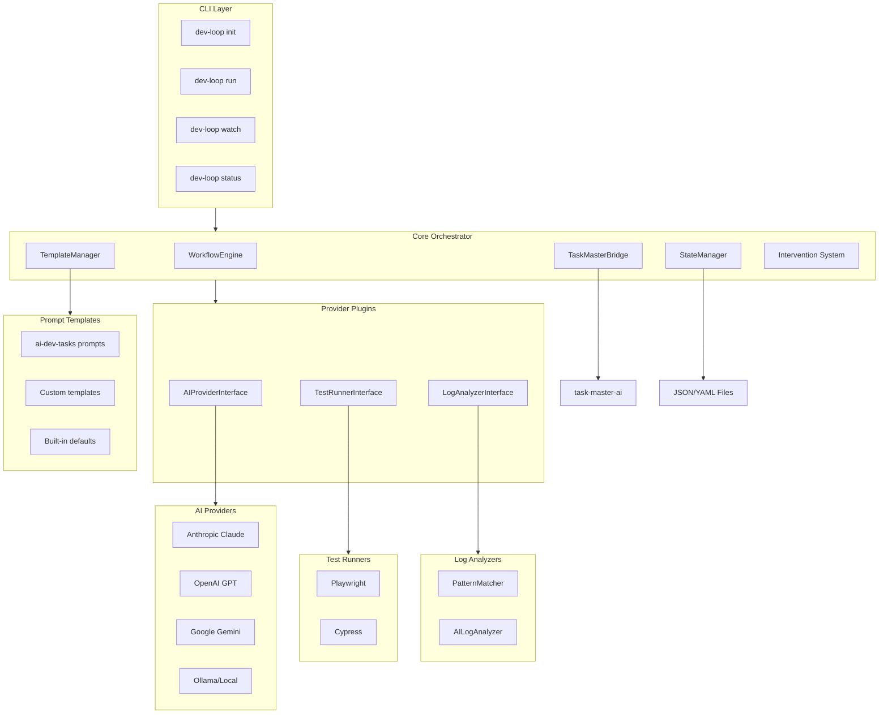
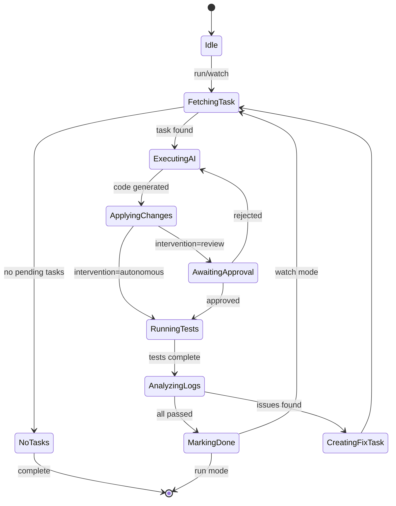
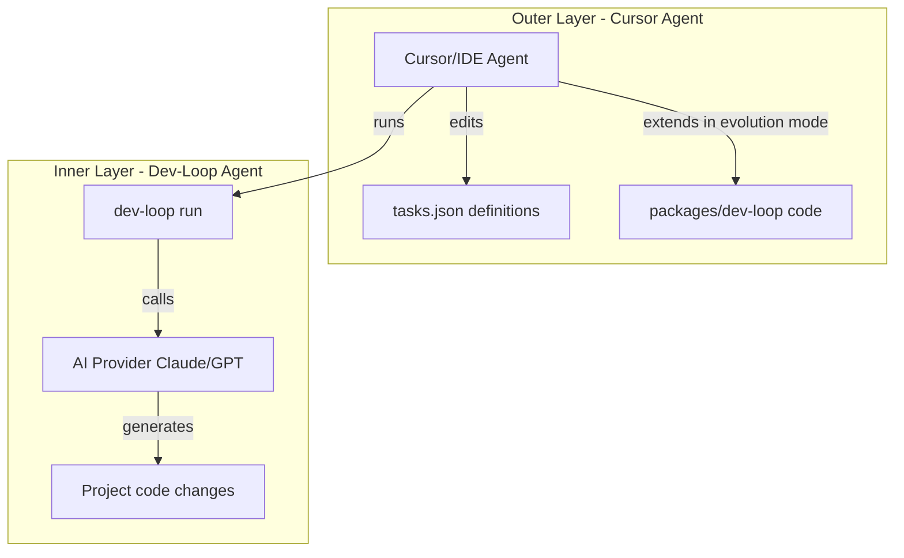

# dev-loop

dev-loop transforms PRDs into validated code by orchestrating AI providers, test runners, and log analyzers in a continuous loop. Key features include multi-provider AI support, Playwright/Cypress test runners, hybrid log analysis, pattern learning from failures, observation-driven evolution, pre-apply validation, debug metrics, framework pattern matching, execution order analysis, component interaction detection, and root cause analysis.

## Quick Start

### Prerequisites

- **Node.js 20+** - Required for Task Master and modern dependencies
- **AI API Key** - Anthropic, OpenAI, or other provider API key
- **Test Framework** - Playwright or Cypress (depending on your config)

### Installation

```bash
# Install globally
npm install -g dev-loop

# Or use locally
npm install
npm run build
npm start -- --help
```

### Setup

```bash
# Ensure Node.js 20+ is active
nvm use 20

# Create .env with API key
echo "ANTHROPIC_API_KEY=your_key_here" > .env

# Initialize dev-loop in your project
dev-loop init
```

### First Run

```bash
# Initialize Task Master (if not already done)
task-master init

# Parse PRD into tasks
task-master parse-prd --input=path/to/prd.md

# Run one iteration
dev-loop run

# Or run in daemon mode (continuous)
dev-loop watch
```

## Configuration

Create a `devloop.config.js` file in your project root. Here's a comprehensive configuration example:

```
┌─────────────────────────────────────────────────────────────────────────────┐
│                         PRD (Product Requirements)                          │
│                         ┌──────────────────────┐                           │
│                         │  Feature Requirements │                           │
│                         │  Test Requirements    │                           │
│                         └──────────────────────┘                           │
└─────────────────────────────────────────────────────────────────────────────┘
                                      │
                                      ▼
┌─────────────────────────────────────────────────────────────────────────────┐
│                    TASK MASTER (via TaskMasterBridge)                        │
│  ┌─────────────────────────────────────────────────────────────────────┐   │
│  │  Parse PRD → Create Tasks (Feature + Test bundled together)        │   │
│  │  ┌─────────────┐  ┌─────────────┐  ┌─────────────┐              │   │
│  │  │   Task 1    │  │   Task 2    │  │   Task N    │              │   │
│  │  │  Feature A  │  │  Feature B  │  │   Fix Task  │              │   │
│  │  │  + Test A   │  │  + Test B   │  │   + Tests   │              │   │
│  │  └─────────────┘  └─────────────┘  └─────────────┘              │   │
│  └─────────────────────────────────────────────────────────────────────┘   │
└─────────────────────────────────────────────────────────────────────────────┘
                                      │
                                      ▼
┌─────────────────────────────────────────────────────────────────────────────┐
│                    WORKFLOW ENGINE (Orchestration Loop)                      │
│  ┌─────────────────────────────────────────────────────────────────────┐   │
│  │  1. Fetch next pending task                                          │   │
│  │  2. Set status: pending → in-progress                                │   │
│  │  3. Load task context (codebase, tests, logs)                        │   │
│  └─────────────────────────────────────────────────────────────────────┘   │
└─────────────────────────────────────────────────────────────────────────────┘
                                      │
                                      ▼
┌─────────────────────────────────────────────────────────────────────────────┐
│                    AI PROVIDER (Code Generation)                           │
│  ┌─────────────────────────────────────────────────────────────────────┐   │
│  │  • Receive task prompt + context                                    │   │
│  │  • Generate feature code + test code together                       │   │
│  │  • Return code changes (diffs/patches)                             │   │
│  └─────────────────────────────────────────────────────────────────────┘   │
└─────────────────────────────────────────────────────────────────────────────┘
                                      │
                                      ▼
┌─────────────────────────────────────────────────────────────────────────────┐
│                    INTERVENTION SYSTEM (Optional Approval)                  │
│  ┌─────────────────────────────────────────────────────────────────────┐   │
│  │  Mode: autonomous → skip                                            │   │
│  │  Mode: review/hybrid → show diff, await approval                    │   │
│  └─────────────────────────────────────────────────────────────────────┘   │
└─────────────────────────────────────────────────────────────────────────────┘
                                      │
                                      ▼
┌─────────────────────────────────────────────────────────────────────────────┐
│                    CODEBASE (Apply Changes)                                 │
│  ┌─────────────────────────────┐  ┌─────────────────────────────────────┐ │
│  │      Feature Code            │  │        Test Code                     │ │
│  │  • Controllers/Services      │  │  • Playwright/Cypress tests           │ │
│  │  • Forms/Handlers            │  │  • Unit tests                          │ │
│  │  • Entity definitions        │  │  • Integration tests                 │ │
│  └─────────────────────────────┘  └─────────────────────────────────────┘ │
└─────────────────────────────────────────────────────────────────────────────┘
                                      │
                                      ▼
┌─────────────────────────────────────────────────────────────────────────────┐
│                    TEST RUNNER (Validation)                                 │
│  ┌───────────────────┐  ┌───────────────────┐  ┌───────────────────────┐   │
│  │  Execute Tests    │  │  Collect Artifacts│  │  Parse Results         │   │
│  │  • Playwright     │  │  • Screenshots    │  │  • Pass/Fail status   │   │
│  │  • Cypress        │  │  • Videos         │  │  • Test coverage       │   │
│  │  • Unit tests     │  │  • Logs           │  │  • Error details       │   │
│  └───────────────────┘  └───────────────────┘  └───────────────────────┘   │
└─────────────────────────────────────────────────────────────────────────────┘
                                      │
                                      ▼
┌─────────────────────────────────────────────────────────────────────────────┐
│                    LOG ANALYZER (Issue Detection)                          │
│  ┌───────────────────┐  ┌───────────────────┐  ┌───────────────────────┐   │
│  │  Pattern Matcher  │  │  AI Analyzer      │  │  Hybrid Analysis      │   │
│  │  • Regex patterns │  │  • Root cause     │  │  • Combine results   │   │
│  │  • Fast detection │  │  • Suggestions     │  │  • Issue prioritization│   │
│  └───────────────────┘  └───────────────────┘  └───────────────────────┘   │
└─────────────────────────────────────────────────────────────────────────────┘
                                      │
                          ┌───────────┴───────────┐
                          ▼                       ▼
                   ┌─────────────┐         ┌─────────────┐
                   │    PASS     │         │    FAIL     │
                   │             │         │             │
                   │ All tests   │         │ Issues      │
                   │ pass        │         │ detected    │
                   │ Logs clean  │         │             │
                   └─────────────┘         └─────────────┘
                          │                       │
                          │                       ▼
                          │              ┌─────────────────────┐
                          │              │  Create Fix Task    │
                          │              │  (via TaskMaster)   │
                          │              └─────────────────────┘
                          │                       │
                          │                       │
                          ▼                       ▼
                   ┌─────────────────────────────────────┐
                   │  STATE MANAGER (Update Status)      │
                   │  • Mark task as done                │
                   │  • Save execution history           │
                   │  • Update workflow state             │
                   └─────────────────────────────────────┘
                                      │
                          ┌───────────┴───────────┐
                          ▼                       ▼
                   ┌─────────────┐         ┌─────────────┐
                   │  Next Task   │         │  Fix Task   │
                   │  (if any)    │         │  (loop back)│
                   └─────────────┘         └─────────────┘
                          │                       │
                          └───────────┬─────────┘
                                      │
                                      ▼
                          ┌─────────────────────┐
                          │  Watch Mode?        │
                          │  • Yes → Loop       │
                          │  • No → Complete    │
                          └─────────────────────┘
                                      │
                                      ▼
                          ┌─────────────────────┐
                          │  PRD 100% COMPLETE  │
                          │  All features done  │
                          │  All tests passing  │
                          └─────────────────────┘
```

## Architecture

### System Architecture

The dev-loop system is built with a layered architecture that separates concerns and enables extensibility:



### Workflow Engine State Machine

The core orchestration follows a state machine pattern:



**State Transitions:**
- **Idle** → **FetchingTask**: When `run` or `watch` command is executed
- **FetchingTask** → **ExecutingAI**: When a pending task is found
- **ExecutingAI** → **ApplyingChanges**: After AI generates code
- **ApplyingChanges** → **AwaitingApproval**: In review/hybrid mode for risky operations
- **ApplyingChanges** → **RunningTests**: In autonomous mode or after approval
- **RunningTests** → **AnalyzingLogs**: After test execution completes
- **AnalyzingLogs** → **MarkingDone**: When all tests pass and logs are clean
- **AnalyzingLogs** → **CreatingFixTask**: When issues are detected
- **MarkingDone** → **FetchingTask**: In watch mode (continuous loop)
- **MarkingDone** → **Idle**: In run mode (single iteration)

### Component Architecture

#### Core Components

1. **WorkflowEngine** (`src/core/workflow-engine.ts`)
   - Main orchestration loop implementing the state machine
   - Coordinates all providers and manages task lifecycle
   - Handles error recovery and retry logic
   - Manages state transitions and workflow execution

2. **TaskMasterBridge** (`src/core/task-bridge.ts`)
   - Wrapper around `task-master-ai@0.40.0`
   - Provides unified interface for task CRUD operations
   - Manages task status transitions (pending → in-progress → done)
   - Integrates with task-master-ai CLI or programmatic API

3. **StateManager** (`src/core/state-manager.ts`)
   - Local JSON/YAML file persistence
   - Tracks workflow state across restarts
   - Manages task state and execution history
   - Provides state recovery after interruptions

4. **TemplateManager** (`src/core/template-manager.ts`)
   - Loads prompt templates from multiple sources
   - Supports `builtin`, `ai-dev-tasks`, and `custom` sources
   - Provides PRD and task generation templates
   - Handles template resolution and caching

5. **Intervention System** (`src/core/intervention.ts`)
   - Approval gates for review mode
   - Hybrid mode logic for selective approval
   - Terminal-based approval UI
   - Risk assessment for code changes

6. **CodeContextProvider** (`src/core/code-context-provider.ts`) - NEW
   - Extracts structured context from target files
   - Provides function/class signatures to AI
   - Shows import patterns for accurate references
   - Generates file-specific guidance prompts
   - Prevents AI from using non-existent functions
   - **Enhanced**: Extracts execution context from errors (execution path, trigger, missing state, components)
   - **Enhanced**: Generates "error story" narratives for better AI understanding
   - **Enhanced**: Identifies component interactions from error messages

7. **ValidationGate** (`src/core/validation-gate.ts`) - NEW
   - Pre-apply validation before filesystem changes
   - Verifies patch search strings exist in files
   - TypeScript syntax validation
   - Suggests fixes for validation errors
   - Prevents wasted iterations from invalid patches

8. **PatternLearningSystem** (`src/core/pattern-learner.ts`) - NEW
   - Remembers common failure patterns
   - Injects "do not repeat" guidance into prompts
   - Built-in patterns for common AI errors
   - Records patterns from test failures
   - Persists learned patterns in `.devloop/patterns.json`

9. **FrameworkPatternLibrary** (`src/core/framework-pattern-library.ts`) - NEW
   - Framework-specific execution pattern knowledge
   - Drupal patterns: form handler order, hook execution, entity lifecycle, widget interactions
   - React patterns: component lifecycle, useEffect dependencies
   - Generic patterns: async sequencing, event handler order
   - Matches errors to known patterns and provides framework-specific guidance

10. **DebuggingStrategyAdvisor** (`src/core/debugging-strategy-advisor.ts`) - NEW
    - Classifies errors: timing-order, missing-state, component-interaction, simple-bug
    - Suggests debugging strategy: add-logging, fix-root-cause, add-validation, refactor-interaction
    - Determines when investigation is needed vs direct fix
    - Generates targeted debug code snippets for investigation

11. **InvestigationTaskGenerator** (`src/core/investigation-task-generator.ts`) - NEW
    - Creates investigation tasks before fix tasks for complex issues
    - Generates framework-specific investigation tasks (e.g., Drupal form handler order)
    - Provides debug code templates for strategic logging
    - Ensures proper investigation → analysis → fix workflow

12. **ExecutionOrderAnalyzer** (`src/core/execution-order-analyzer.ts`) - NEW
    - Analyzes code for execution order/timing issues
    - Detects form handler order problems (array_push vs array_unshift)
    - Identifies hook execution order issues
    - Generates execution flow diagrams for AI prompts

13. **ComponentInteractionAnalyzer** (`src/core/component-interaction-analyzer.ts`) - NEW
    - Identifies component boundaries and interactions
    - Detects common interaction problems (entity lifecycle, widget-entity conflicts)
    - Maps component interaction flows (e.g., widget → entity → bundle lifecycle)
    - Suggests fixes based on interaction patterns

14. **RootCauseAnalyzer** (`src/core/root-cause-analyzer.ts`) - NEW
    - Analyzes why partial fixes fail
    - Identifies which code paths are fixed vs broken
    - Suggests comprehensive fixes addressing all execution paths
    - Tracks fix attempt patterns to identify systemic issues

#### Provider Interfaces

All providers implement standardized interfaces for pluggability:

1. **AIProvider Interface** (`src/providers/ai/interface.ts`)
   - `generateCode(context, task)`: Generate implementation code
   - `analyzeError(error, context)`: Analyze and suggest fixes
   - `fallback()`: Support for provider fallback chains
   - Implementations: Anthropic, OpenAI, Gemini, Ollama

2. **TestRunner Interface** (`src/providers/test-runners/interface.ts`)
   - `runTests(options)`: Execute test suite
   - `collectArtifacts()`: Gather screenshots, videos, logs
   - `parseResults(output)`: Extract pass/fail status
   - Implementations: Playwright, Cypress

3. **LogAnalyzer Interface** (`src/providers/log-analyzers/interface.ts`)
   - `analyze(logs, context)`: Analyze log content
   - `detectIssues()`: Identify errors and warnings
   - `suggestFixes()`: Provide remediation recommendations
   - Implementations: PatternMatcher, AILogAnalyzer

### Project Structure

```
dev-loop/
├── package.json
├── tsconfig.json
├── .eslintrc.json
├── .prettierrc
├── .gitignore
├── src/
│   ├── index.ts                 # CLI entry point
│   ├── cli/
│   │   ├── commands/
│   │   │   ├── init.ts          # Interactive wizard
│   │   │   ├── run.ts           # Single execution
│   │   │   ├── watch.ts         # Daemon mode
│   │   │   ├── status.ts        # Current state
│   │   │   └── logs.ts          # Log viewing
│   │   └── prompts.ts           # Wizard prompts
│   ├── core/
│   │   ├── workflow-engine.ts   # Main orchestration
│   │   ├── task-bridge.ts       # task-master-ai wrapper
│   │   ├── state-manager.ts     # File persistence
│   │   ├── template-manager.ts  # Template loading
│   │   ├── intervention.ts      # Approval gates
│   │   ├── code-context-provider.ts  # File context extraction
│   │   ├── validation-gate.ts  # Pre-apply validation
│   │   ├── pattern-learner.ts  # Pattern learning system
│   │   ├── framework-pattern-library.ts  # Framework patterns
│   │   ├── debugging-strategy-advisor.ts  # Error classification
│   │   ├── investigation-task-generator.ts  # Investigation tasks
│   │   ├── execution-order-analyzer.ts  # Execution order analysis
│   │   ├── component-interaction-analyzer.ts  # Component interactions
│   │   └── root-cause-analyzer.ts  # Root cause analysis
│   ├── providers/
│   │   ├── ai/
│   │   │   ├── interface.ts     # AIProvider interface
│   │   │   ├── factory.ts       # Provider factory
│   │   │   ├── anthropic.ts     # Claude provider
│   │   │   ├── openai.ts        # GPT provider
│   │   │   ├── gemini.ts        # Gemini provider
│   │   │   └── ollama.ts        # Local provider
│   │   ├── test-runners/
│   │   │   ├── interface.ts     # TestRunner interface
│   │   │   ├── playwright.ts    # Playwright runner
│   │   │   └── cypress.ts       # Cypress runner
│   │   └── log-analyzers/
│   │       ├── interface.ts     # LogAnalyzer interface
│   │       ├── pattern-matcher.ts  # Regex analysis
│   │       └── ai-analyzer.ts   # AI analysis
│   ├── templates/
│   │   ├── index.ts             # Template registry
│   │   ├── builtin/
│   │   │   ├── create-prd.md    # Basic PRD template
│   │   │   └── generate-tasks.md  # Task generation
│   │   └── ai-dev-tasks/
│   │       ├── create-prd.md    # Bundled prompts
│   │       └── generate-tasks.md  # Bundled prompts
│   ├── config/
│   │   ├── schema.ts            # Zod validation
│   │   ├── loader.ts            # Config loader
│   │   └── defaults.ts          # Default values
│   └── types/
│       └── index.ts              # TypeScript types
├── templates/
│   └── devloop.config.js         # Config template
├── tests/
├── Dockerfile
└── README.md
```

## Design Patterns

### 1. Task Master AI Integration

The project wraps `task-master-ai@0.40.0` through the TaskMasterBridge:
- Uses task-master-ai CLI commands via child processes OR
- Imports and uses task-master-ai programmatically if it exports APIs
- Handles task CRUD operations
- Manages task status transitions (pending → in-progress → done)
- Provides abstraction layer for task management

### 2. AI Provider Pattern

All AI providers implement the `AIProvider` interface:
- Support code generation with context
- Support error analysis and suggestions
- Handle API errors gracefully with retry logic
- Support fallback to another provider
- Implement consistent error handling and rate limiting

**Provider Factory:**
- Registers available providers
- Creates provider instances based on configuration
- Manages fallback chains
- Handles provider-specific configuration

### 3. Test Runner Pattern

Test runners implement the `TestRunner` interface:
- Execute tests via child processes
- Parse output for pass/fail status
- Collect artifacts (screenshots, videos, logs)
- Handle timeouts gracefully
- Support parallel execution
- Provide structured test results

### 4. Log Analysis Pattern

The hybrid log analyzer combines multiple approaches:
- **PatternMatcher**: Fast regex-based detection for known error patterns
- **AILogAnalyzer**: Intelligent analysis for complex issues
- **Hybrid Mode**: Uses pattern matching first, then AI analysis if patterns match or `useAI: true`
- Combines results from both approaches for comprehensive issue detection

### 5. Configuration Pattern

The config system provides:
- Zod-based validation with helpful error messages
- Support for `devloop.config.js` (JavaScript module) and `devloop.config.json` (JSON)
- Merges default config with user config
- Environment variable support via `.env` files
- Type-safe configuration access

### 6. Template System Pattern

Templates are loaded from multiple sources:
- **`builtin`**: Minimal defaults shipped with dev-loop
- **`ai-dev-tasks`**: Bundled prompts from snarktank/ai-dev-tasks repo
- **`custom`**: User-provided templates from `customPath`
- Template resolution follows priority: custom > ai-dev-tasks > builtin
- Supports template caching for performance

### 7. Intervention System Pattern

The intervention system provides three modes:
- **Autonomous**: Fully automated, no human intervention
- **Review**: AI proposes changes, human approves each
- **Hybrid**: Autonomous for safe changes, review for risky operations
- Risk assessment based on change type (delete, schema-change, migration, etc.)
- Terminal-based approval UI with diff preview

### 8. State Management Pattern

StateManager provides:
- Local JSON/YAML file persistence
- Workflow state tracking across restarts
- Task state and execution history
- State recovery after interruptions
- Atomic state updates to prevent corruption

### 9. Framework Pattern Library Pattern

FrameworkPatternLibrary provides framework-specific execution pattern knowledge:
- **Pattern Matching**: Matches errors to known framework patterns (form handlers, hooks, lifecycle)
- **Framework Detection**: Identifies framework from config or codebase
- **Pattern Guidance**: Provides framework-specific solution guidance
- **Extensible**: Easy to add patterns for new frameworks
- Supports Drupal, React, and generic patterns

### 10. Error Classification & Strategy Pattern

DebuggingStrategyAdvisor classifies errors and suggests debugging approach:
- **Error Classification**: Timing-order, missing-state, component-interaction, simple-bug
- **Strategy Selection**: Determines when to investigate vs fix directly
- **Investigation Guidance**: Generates targeted debug code snippets
- **Framework-Aware**: Considers framework context when classifying

### 11. Investigation-First Pattern

InvestigationTaskGenerator creates investigation tasks before fix tasks:
- **Complex Issue Detection**: Identifies when investigation is needed
- **Investigation Templates**: Provides framework-specific investigation code
- **Sequential Workflow**: Investigation → Analysis → Fix task sequence
- **Strategic Logging**: Adds targeted logging, not random debug statements

### 12. Execution Order Analysis Pattern

ExecutionOrderAnalyzer detects and analyzes timing/order issues:
- **Code Analysis**: Parses code to identify execution dependencies
- **Order Detection**: Finds potential race conditions or ordering problems
- **Framework Patterns**: Recognizes framework-specific execution patterns
- **Fix Suggestions**: Suggests execution order fixes (weight, priority, dependencies)

### 13. Component Interaction Analysis Pattern

ComponentInteractionAnalyzer understands multi-component interactions:
- **Component Identification**: Identifies component boundaries (modules, services, widgets, entities)
- **Interaction Mapping**: Maps how components interact (widget → entity → bundle)
- **Problem Detection**: Detects common interaction problems (lifecycle, conflicts, ordering)
- **Fix Guidance**: Suggests fixes based on interaction patterns

### 14. Root Cause Analysis Pattern

RootCauseAnalyzer analyzes why fixes don't work completely:
- **Fix Tracking**: Tracks fix attempts and their outcomes
- **Partial Fix Detection**: Identifies fixes that work for one path but not others
- **Path Analysis**: Maps code paths and identifies which are fixed vs broken
- **Comprehensive Solutions**: Suggests fixes addressing all execution paths

## Configuration

Create a `devloop.config.js` file in your project root:

```javascript
module.exports = {
  // Debug mode - enable verbose output and metrics tracking
  debug: false,
  metrics: {
    enabled: true,
    path: '.devloop/metrics.json',
  },
  // AI Provider configuration
  ai: {
    provider: 'anthropic', // 'anthropic' | 'openai' | 'gemini' | 'ollama'
    model: 'claude-sonnet-4-20250514',
    fallback: 'openai:gpt-4o', // Optional fallback
    apiKey: process.env.ANTHROPIC_API_KEY, // Or set in .env
  },

  // Prompt templates
  templates: {
    source: 'ai-dev-tasks', // 'builtin' | 'ai-dev-tasks' | 'custom'
    customPath: './my-templates/', // Only if source: 'custom'
  },

  // Test runner configuration
  testing: {
    runner: 'playwright', // 'playwright' | 'cypress'
    command: 'npm test',
    timeout: 300000, // 5 minutes
    artifactsDir: 'test-results',
  },

  // Log analysis configuration
  logs: {
    sources: [
      { type: 'file', path: '/var/log/app.log' },
      { type: 'command', command: 'tail -100 /var/log/application.log' },
    ],
    patterns: {
      error: /Error|Exception|Fatal/i,
      warning: /Warning|Deprecated/i,
    },
    useAI: true, // Enable AI-powered analysis
  },

  // Intervention mode
  intervention: {
    mode: 'autonomous', // 'autonomous' | 'review' | 'hybrid'
    approvalRequired: ['delete', 'schema-change'], // Actions needing approval
  },

  // Task Master integration
  taskMaster: {
    tasksPath: '.taskmaster/tasks/tasks.json',
  },

  // Enhanced context for better AI prompts (NEW)
  context: {
    includeSkeleton: true,      // Include file skeleton showing available helpers
    includeImports: true,       // Include import section explicitly
    maxHelperSignatures: 20,    // Max helper signatures to show
  },

  // Pre-apply validation to catch errors before filesystem changes (NEW)
  preValidation: {
    enabled: true,              // Enable pre-apply validation
    maxRetries: 2,              // Retries before creating fix task
    validateSyntax: true,       // TypeScript syntax validation
  },

  // Pattern learning to prevent repeating mistakes (NEW)
  patternLearning: {
    enabled: true,              // Enable pattern learning
    patternsPath: '.devloop/patterns.json',
    useBuiltinPatterns: true,   // Include common patterns
  },
};
```

## CLI Commands

### Core Commands

```bash
# Initialize project
dev-loop init [--template ai-dev-tasks]

# Run one iteration
dev-loop run
dev-loop run --task <id>      # Run specific task
dev-loop run --all            # Run all pending tasks
dev-loop run --debug          # Enable verbose output

# Run in daemon mode (continuous)
dev-loop watch
dev-loop watch --debug

# Check current status
dev-loop status

# Pause/resume execution
dev-loop pause
dev-loop resume

# View/analyze logs
dev-loop logs
dev-loop logs --tail 100
dev-loop logs --follow
dev-loop logs --clear

# View debug metrics and trends
dev-loop metrics
dev-loop metrics --last 10
dev-loop metrics --task 122
dev-loop metrics --summary
dev-loop metrics --json
dev-loop metrics --clear
```

### Task Management Commands

```bash
# List all tasks
dev-loop list
dev-loop list --pending       # Show pending only
dev-loop list --done          # Show completed
dev-loop list --blocked       # Show blocked
dev-loop list --tree          # Show dependency tree
dev-loop list --json          # Output as JSON

# Show task details
dev-loop show <taskId>
dev-loop show <taskId> --history

# Reset tasks to pending
dev-loop reset <taskId>       # Reset specific task
dev-loop reset --all-failed   # Reset all blocked tasks
dev-loop reset --all          # Reset all tasks

# Re-run a task
dev-loop replay <taskId>
dev-loop replay <taskId> --dry-run
dev-loop replay <taskId> --compare
```

### Debugging Commands

```bash
# Diagnose failures
dev-loop diagnose             # Analyze all failures
dev-loop diagnose <taskId>    # Analyze specific task
dev-loop diagnose --suggest   # Include fix suggestions
dev-loop diagnose --auto-fix  # Attempt automatic fixes

# Trace task execution
dev-loop trace <taskId>
dev-loop trace <taskId> --tokens  # Include token usage
```

### Template & Pattern Commands

```bash
# Templates
dev-loop template list
dev-loop template show <name>

# Patterns
dev-loop pattern list
```

### Configuration & Validation

```bash
# Show configuration
dev-loop config show
dev-loop config show ai.provider

# Validate setup
dev-loop validate
dev-loop validate --config-only
dev-loop validate --tasks
dev-loop validate --environment
dev-loop validate --fix
```

### Session Handoff

```bash
# Create handoff document
dev-loop handoff create
dev-loop handoff create -o path/to/output.md

# View handoffs
dev-loop handoff show
dev-loop handoff list
```

### Task Master Commands (via wrapper)

```bash
# Initialize Task Master
task-master init

# Parse PRD into tasks
task-master parse-prd --input=prd.md

# View all tasks with progress
task-master list

# Get next task to work on
task-master next

# Show task details
task-master show <id>

# Update task status
task-master set-status --id=<id> --status=<pending|in-progress|done>

# Add new task (feature + test)
task-master add-task --prompt="..." --priority=<high|medium|low>

# Expand task into subtasks
task-master expand --id=<id>

# Update task details
task-master update-task --id=<id> --prompt="..."
```

## Features

- 🤖 **Multi-Provider AI Support**: Anthropic Claude, OpenAI GPT, Google Gemini, Ollama
- 🧪 **Test Runners**: Playwright and Cypress support
- 📊 **Hybrid Log Analysis**: Pattern matching + AI-powered analysis
- 🔄 **Flexible Automation**: Autonomous, review, or hybrid intervention modes
- 📝 **Template System**: Built-in, ai-dev-tasks, or custom prompt templates
- 🔁 **Daemon Mode**: Continuous execution until PRD complete
- 📤 **CI Integration**: JSON, JUnit XML, and Markdown output formats
- 📈 **Debug Metrics**: Track execution trends over time
- 🔍 **Complex Issue Analysis**: Framework pattern matching, execution order analysis, component interaction detection
- 🧩 **Multi-Component Understanding**: Automatically handles complex issues involving multiple components (widgets, entities, services, etc.)
- 🎯 **Strategic Debugging**: Classifies errors and suggests investigation vs fix approach
- 🔬 **Root Cause Analysis**: Analyzes why partial fixes fail and suggests comprehensive solutions

## Advanced Features

### Debug Mode

Debug mode provides detailed output and metrics tracking to help understand system behavior.

**Enable via config:**
```javascript
module.exports = {
  debug: true,
  metrics: {
    enabled: true,
    path: '.devloop/metrics.json',
  },
};
```

**Enable via CLI:**
```bash
dev-loop run --debug
dev-loop watch --debug
```

**Debug output includes:**
- Full AI prompts (system and user prompts)
- Token usage (input/output tokens)
- API request/response details
- File discovery and context gathering details
- Patch search/replace strings
- Validation step details
- Pattern learning matches
- Timing for each phase (AI call, test run, log analysis)

**View metrics:**
```bash
# View summary and recent runs
dev-loop metrics

# View last N runs
dev-loop metrics --last 10

# View metrics for specific task
dev-loop metrics --task 122

# View summary only
dev-loop metrics --summary

# Output as JSON
dev-loop metrics --json

# Clear all metrics
dev-loop metrics --clear
```

Metrics are stored in `.devloop/metrics.json` and track:
- Timing: AI call duration, test run duration, log analysis duration, total duration
- Tokens: Input and output tokens per run
- Context: Context size, files included, files truncated
- Patches: Attempted, succeeded, failed counts
- Validation: Pre-validation results, syntax errors
- Patterns: Patterns matched and applied

### Code Context Provider

Automatically extracts rich context from target files:
- Function/class signatures
- Import patterns
- File skeletons showing available helpers
- File-specific guidance for AI

### Pre-Apply Validation

Validates code changes before applying to filesystem:
- Verifies patch search strings exist in files
- TypeScript/PHP syntax validation
- Function reference checking
- Prevents wasted iterations from invalid patches

### Pattern Learning System

Remembers common failure patterns and injects "do not repeat" guidance:
- Built-in patterns for common AI errors
- Records patterns from test failures, log analysis, and validation errors
- Persists learned patterns in `.devloop/patterns.json`
- Automatically applies relevant patterns to subsequent prompts

### Complex Issue Analysis

dev-loop now includes sophisticated analysis capabilities for complex multi-component issues:

#### Framework Pattern Library

Understands framework-specific execution patterns:
- **Drupal**: Form handler execution order, hook execution order, entity lifecycle, widget-entity interactions
- **React**: Component lifecycle, useEffect dependencies, state update batching
- **Generic**: Event handler ordering, async operation sequencing

When errors match known patterns, dev-loop provides framework-specific guidance (e.g., "Use array_unshift() for Drupal form handlers that need to run first").

#### Error Classification & Strategy

Automatically classifies errors and suggests appropriate debugging strategy:
- **Timing/Order Issues**: Creates investigation tasks to verify execution order
- **Missing State**: Suggests validation or state creation fixes
- **Component Interaction**: Analyzes multi-component interactions and suggests refactoring
- **Simple Bugs**: Fixes directly without investigation

#### Investigation Task Generation

For complex issues, dev-loop creates investigation tasks before fix tasks:
- Adds strategic debug logging to verify execution order
- Checks component interaction flows
- Verifies state availability at interaction time
- Provides framework-specific investigation templates

#### Execution Order Analysis

Detects and analyzes execution order/timing issues:
- Identifies form handler order problems (array_push vs array_unshift)
- Detects hook execution order issues
- Maps execution dependencies
- Suggests execution order fixes (weight adjustments, priority changes)

#### Component Interaction Detection

Understands how multiple components interact:
- Identifies component boundaries (modules, services, widgets, entities)
- Maps component interactions (widget → entity → bundle lifecycle)
- Detects common interaction problems:
  - Entity lifecycle issues (creating fields before bundles exist)
  - Widget → Entity save conflicts
  - Event subscriber ordering
  - Form handler conflicts

#### Root Cause Analysis

Analyzes why partial fixes fail:
- Tracks fix attempts and their outcomes
- Identifies partial fixes (works for one path, not others)
- Maps code paths and identifies which paths are fixed vs broken
- Suggests comprehensive fixes addressing all execution paths

**Example**: For a multi-component timing issue, dev-loop would:
1. Detect multi-component timing issue from error message
2. Match framework-specific pattern (e.g., "form handler order" for Drupal)
3. Create investigation task to add debug logging for execution order
4. Analyze execution order and identify handler execution sequence
5. Create fix task to adjust handler order (e.g., array_unshift for Drupal, priority adjustment for React)
6. Understand why partial fix failed (only fixed direct path, not widget path)

## Intervention Modes (Inner Agent Approval Settings)

Intervention modes control whether the *inner* dev-loop agent requires human approval for code changes. This is configured in `devloop.config.js` and is independent of the outer Cursor agent's role.

### Autonomous Mode

Fully automated - no human intervention:

```javascript
intervention: {
  mode: 'autonomous',
}
```

### Review Mode

AI proposes changes, human approves each:

```javascript
intervention: {
  mode: 'review',
}
```

### Hybrid Mode

Autonomous for safe changes, review for risky operations:

```javascript
intervention: {
  mode: 'hybrid',
  approvalRequired: ['delete', 'schema-change', 'migration'],
}
```

> **Note:** Intervention modes (autonomous/review/hybrid) control whether the *inner* dev-loop agent requires human approval for code changes. This is independent of Evolution Mode, which defines the *outer* Cursor agent's role. You can run evolution mode with any intervention setting.

## Cursor Agent Integration (Outer Agent Role)

The Cursor/IDE agent operates in one of two roles when working with dev-loop:

### Default Behavior (Operator Mode)

In the default operator role, the Cursor agent:
- Runs dev-loop commands (`npx dev-loop run`, `npx dev-loop watch`)
- Observes output and logs
- Validates results in browser when tasks complete
- Updates task definitions in `tasks.json` if needed
- Does NOT directly edit project code (Drupal/tests) - that's the inner agent's job

This is the standard workflow where dev-loop's inner agent handles all code generation and fixes.

### Evolution Mode

Evolution mode is for improving dev-loop itself based on **real-world use cases across different projects** and **systematic observation of agent outcomes**. This is activated explicitly by the human operator in their IDE chat (e.g., "Enter evolution mode for dev-loop").

**Why Evolution Mode?**

Different projects reveal different failure patterns and use cases:
- **Drupal projects** expose schema/config issues, entity type generation challenges, and Drush command patterns
- **React projects** reveal import/type issues, component structure problems, and build configuration needs
- **Node.js projects** show module resolution issues, async/await patterns, and API integration challenges

By aggregating observations across projects, you can identify **generic improvements** that benefit all users:
- Patterns observed in one project type can improve dev-loop for all projects
- Metrics reveal inefficiencies (high token usage, repeated validation failures, slow test runs)
- Real-world validation ensures improvements work against actual workflows, not theoretical scenarios

When in evolution mode, the Cursor agent has additional responsibilities:
- All operator mode responsibilities (run, observe, validate)
- **Plus**: Extend dev-loop codebase (`packages/dev-loop/`) to improve capabilities
- **Plus**: Enhance patterns, templates, validation, or context providers based on observed outcomes
- **Plus**: Track and analyze metrics across runs to identify improvement opportunities

The inner dev-loop agent's scope remains unchanged - it still implements project code (Drupal/PHP/tests).

#### Two-Layer Architecture



#### Operator Role vs Evolution Mode Role

| Aspect | Operator Role (Default) | Evolution Mode Role |
|--------|-------------------------|---------------------|
| **What it is** | Default Cursor agent behavior | Explicit mode for improving dev-loop |
| **Activation** | Always active unless user says "enter evolution mode" | User explicitly requests in IDE chat |
| **Cursor agent scope** | Run dev-loop, observe, validate in browser | Same + extend dev-loop codebase |
| **Inner agent scope** | Implements project code (Drupal/tests) | Same (unchanged) |
| **Intervention mode** | Configured separately in `devloop.config.js` | Same (orthogonal setting) |

### The Evolution Loop

The evolution loop is a systematic process for improving dev-loop based on observation and analysis:

1. **Observe**: Review metrics, patterns, and outcomes across multiple runs
   - Check `dev-loop metrics` for trends (token usage, success rates, failure patterns)
   - Review `dev-loop evolve insights` for automated improvement suggestions
   - Analyze failure patterns across different project types
   - Identify recurring issues that could be prevented

2. **Analyze**: Identify trends and patterns
   - "Validation failures increased 50% in last 10 runs" → suggests validation needs improvement
   - "Token usage spiking for Drupal tasks" → suggests context extraction could be optimized
   - "Repeated patch-not-found errors" → suggests pattern learning needs enhancement
   - "Test failures decreasing after pattern addition" → confirms improvement effectiveness

3. **Enhance**: Make targeted improvements based on observations
   - Add patterns to PatternLearningSystem when failures repeat
   - Improve CodeContextProvider when context is insufficient
   - Enhance ValidationGate checks when pre-validation fails frequently
   - Update templates when success rates are low
   - Optimize metrics collection when insights are missing

4. **Validate**: Test improvements against real project workflows
   - Run `npx dev-loop run --debug` to test changes
   - Monitor metrics to verify improvements (lower token usage, higher success rates)
   - Check that patterns are being applied correctly
   - Ensure improvements work across different project types

When in evolution mode, the human operator:

1. **Run dev-loop iteration**: `npx dev-loop run --debug`
2. **Review observations**: `dev-loop evolve insights` to see automated suggestions
3. **Analyze metrics**: `dev-loop metrics --summary` to identify trends
4. **Enhance dev-loop code** (if needed):
   - Implement suggestions from observation tracker
   - Add patterns based on failure analysis
   - Improve components based on efficiency metrics
5. **Build and push**: `npm run build && git commit && git push`
6. **Validate**: Run again and verify improvements in metrics

The evolution loop continues until PRD is 100% validated, but the focus is on improving dev-loop capabilities that benefit all projects, not just implementing features for the current project.

### Instructions for Cursor/IDE Agents

When the human operator activates evolution mode:

**You are the OUTER agent (supervisor). Dev-loop contains the INNER agent (implementer).**

```
┌─────────────────────────────────────────────┐
│ OUTER AGENT (You - Cursor)                  │
│ - Runs dev-loop commands                    │
│ - Reads output and logs                     │
│ - Extends dev-loop code if needed           │
│ - Updates tasks.json and PRD files          │
│                                             │
│    ┌─────────────────────────────────────┐  │
│    │ INNER AGENT (dev-loop AI)           │  │
│    │ - Generates project code changes    │  │
│    │ - Fixes Drupal/PHP/Test code        │  │
│    │ - Runs in sandboxed context         │  │
│    └─────────────────────────────────────┘  │
└─────────────────────────────────────────────┘
```

**Correct Workflow for Fixing Issues**:

1. Observe failure: "Playwright test has shell quoting error"
2. **WRONG**: Edit wizard-validation-browser.spec.ts directly
3. **RIGHT**:
   - Option A: Add task to tasks.json describing the fix needed
   - Option B: Extend dev-loop's PatternLearningSystem with shell quoting patterns
   - Run `npx dev-loop run` to let inner agent fix it

**When to Extend Dev-Loop vs Create Task**:

| Scenario | Action |
|----------|--------|
| One-off bug fix | Create task in tasks.json |
| Repeated pattern | Add to PatternLearningSystem |
| Missing context | Enhance CodeContextProvider |
| Better prompts needed | Update templates |

### When to Extend Dev-Loop

Extend dev-loop when:
- Agents repeatedly make the same mistake (add better prompts/validation)
- A new generic capability would improve outcomes across projects
- Validation reveals patterns dev-loop should handle differently
- Log parsing misses important error patterns
- Task execution needs new hooks or lifecycle events

### Extension Process

```bash
# Make changes to src/
cd packages/dev-loop  # or wherever dev-loop is located

# Rebuild TypeScript after changes
npm run build

# Test the improvement
npx dev-loop run

# Commit and push incrementally
git add -A && git commit -m "Description of improvement"
git push
```

### What NOT to Add to Dev-Loop

Keep dev-loop framework-agnostic. Do NOT add:
- Framework-specific logic (Drupal, React, etc.)
- Project-specific code
- Project-specific paths or patterns

Instead, configure project-specific behavior in:
- `devloop.config.js` - Hooks, log sources, test commands
- `.taskmaster/templates/` - PRD and task templates
- Project rules files (CLAUDE.md, .cursorrules) - Rules injected into prompts

## CI Output Formats

dev-loop generates CI-agnostic output formats:

- **`devloop-results.json`** - Structured JSON with all task results, test outcomes, and log analysis
- **`devloop-results.xml`** - JUnit XML format for CI integration (Jenkins, GitHub Actions, etc.)
- **`devloop-summary.md`** - Human-readable markdown summary with progress and issues

## Dependencies

| Package | Purpose | Version |
|---------|---------|---------|
| `task-master-ai` | Task management (wrapped) | ^0.40.0 |
| `commander` | CLI framework | ^11.1.0 |
| `inquirer` | Interactive prompts | ^9.2.12 |
| `zod` | Config validation | ^3.22.4 |
| `@anthropic-ai/sdk` | Claude API | ^0.20.0 |
| `openai` | GPT API | ^4.20.0 |
| `@google/generative-ai` | Gemini API | ^0.2.1 |
| `chalk` | Terminal colors | ^4.1.2 |
| `ora` | Spinners | ^5.4.1 |
| `chokidar` | File watching (daemon) | ^3.5.3 |
| `fs-extra` | File system utilities | ^11.1.1 |
| `yaml` | YAML parsing | ^2.3.4 |

## Installation

```bash
# Install globally
npm install -g dev-loop

# Or use locally
npm install
npm run build
npm start -- --help
```

### Prerequisites

- **Node.js 20+** - Required for Task Master and modern dependencies
- **Task Master AI** - Will be initialized automatically, or install globally: `npm install -g task-master-ai`
- **AI API Key** - Anthropic, OpenAI, or other provider API key
- **Test Framework** - Playwright or Cypress (depending on your config)

### Setup

```bash
# Ensure Node.js 20+ is active
nvm use 20

# Create .env with API key
echo "ANTHROPIC_API_KEY=your_key_here" > .env

# Initialize dev-loop in your project
dev-loop init
```

## Quick Start

### 1. Initialize Project

```bash
# Interactive wizard to create devloop.config.js
dev-loop init

# Or use ai-dev-tasks templates
dev-loop init --template ai-dev-tasks
```

### 2. Parse PRD into Tasks

```bash
# Initialize Task Master (if not already done)
task-master init

# Parse PRD - dev-loop creates both feature AND test tasks
task-master parse-prd --input=path/to/prd.md

# Or manually create feature+test tasks
task-master add-task --prompt="
Implement user login flow with:
- Email/password authentication
- Session management
- Error handling for invalid credentials

Include Playwright tests for:
- Successful login redirects to dashboard
- Invalid credentials shows error message
- Empty fields show validation errors
- Session persists across page reloads
" --priority=high
```

### 3. Run Workflow

```bash
# Run one iteration
dev-loop run

# Run in daemon mode (continuous until PRD complete)
dev-loop watch

# Check current status
dev-loop status
```

## Workflow Execution

The complete workflow is shown in the [PRD to Feature Lifecycle](#prd-to-feature-lifecycle) diagram above. Here's how to use it:

### Creating Tasks

When creating tasks from the PRD, each feature task should include its test:

```bash
# Good: Feature and test together
task-master add-task --prompt="Implement wizard Step 7 Schema.org mapping pre-population.
Include Playwright test that:
1. Navigates to wizard Step 7
2. Verifies Schema.org mappings are auto-populated
3. Checks for success messages
4. Takes screenshots at each verification point"
```

The AI agent implements **BOTH** the feature code and test code together.

### Expanding Complex Tasks

```bash
# Break down into subtasks (both feature and test subtasks)
task-master expand --id=1
```

### Running the Workflow

The WorkflowEngine automatically handles the complete lifecycle:
- Fetches pending tasks via TaskMasterBridge
- Generates code via AI Provider
- Optionally requires approval via Intervention System
- Executes tests via Test Runner
- Analyzes logs via Log Analyzer
- Updates state via State Manager
- Creates fix tasks when issues are detected
- Loops until PRD is 100% complete

### Manual Testing

While dev-loop runs tests automatically, you can also run them manually:

```bash
# Run all tests
npm test

# Run specific test file
npm test -- tests/playwright/login.spec.ts --timeout=300000

# Run with visible browser for debugging
npm test -- --headed
```

## Test Evolution Pattern

Tests evolve alongside features:

| Iteration | Feature State | Test State |
|-----------|---------------|------------|
| 1 | Basic implementation | Smoke test - feature loads |
| 2 | Core logic complete | Functional tests - verify behavior |
| 3 | Edge cases handled | Edge case tests added |
| 4 | Bug fixes applied | Regression tests added |
| 5 | Feature complete | Full test coverage |

## Playwright Test Patterns

### Test File Structure

```typescript
// tests/playwright/feature-name.spec.ts
import { test, expect, Page } from '@playwright/test';

test.describe('Feature Name - User Stories', () => {
  test.beforeEach(async ({ page }) => {
    // Setup: login, navigate to starting point
    await login(page);
    await page.goto('/feature-url');
  });

  test('should complete primary user flow', async ({ page }) => {
    // Arrange
    await page.fill('#input-field', 'test value');

    // Act
    await page.click('button:has-text("Submit")');

    // Assert
    await expect(page.locator('.success-message')).toBeVisible();

    // Document
    await takeScreenshot(page, 'primary-flow-success');
  });

  test('should handle error cases', async ({ page }) => {
    // Test error handling
  });

  test('should validate edge cases', async ({ page }) => {
    // Test edge cases
  });
});
```

### Wait Strategies for Drupal/Ajax

```typescript
// Don't use networkidle - Drupal keeps connections alive
await page.waitForLoadState('domcontentloaded').catch(() => {});

// Wait for step transition via button text change
await page.waitForFunction(
  (oldText) => {
    const btn = document.querySelector('button[type="submit"]');
    return btn?.textContent !== oldText;
  },
  buttonText,
  { timeout: 60000 }
);

// Scroll buttons into view for long forms
await button.scrollIntoViewIfNeeded();
await expect(button).toBeVisible({ timeout: 10000 });
```

### Screenshot Debugging

```typescript
async function takeScreenshot(page: Page, name: string) {
  const timestamp = new Date().toISOString().replace(/[:.]/g, '-');
  const path = `test-results/${name}-${timestamp}.png`;
  await page.screenshot({ path, fullPage: true });
  console.log(`📸 Screenshot: ${path}`);
}

// Use liberally throughout tests
await takeScreenshot(page, 'step-1-initial-state');
await page.click('#submit');
await takeScreenshot(page, 'step-2-after-submit');
```

## Common Issues and Fixes

| Issue | Symptom | Fix |
|-------|---------|-----|
| Protected method error | `Call to protected method` in logs | Change method visibility to `public` |
| Test timeout | Test never logs next step | Fix wait strategy, increase timeout |
| Entity not found | `PluginNotFoundException` | Clean orphaned config: `drush config:delete` |
| Form not advancing | Screenshot shows same step | Wait for button text/URL change |
| AI not implementing | Tasks done but no code | Check AI provider API key and config |
| Flaky tests | Intermittent failures | Add explicit waits, retry logic |

## File Structure

```
project/
├── devloop.config.js        # dev-loop configuration
├── .env                     # API keys
├── .taskmaster/
│   ├── config.json          # Task Master configuration
│   ├── tasks/
│   │   └── tasks.json       # All tasks (features + tests)
│   └── ai-responses/        # Saved AI agent responses
├── tests/
│   └── playwright/
│       ├── helpers/
│       │   └── auth.ts      # Shared test utilities
│       ├── feature-a.spec.ts # Feature A tests
│       ├── feature-b.spec.ts # Feature B tests
│       └── integration.spec.ts # Integration tests
├── test-results/            # Screenshots, videos, artifacts
│   ├── devloop-results.json  # Structured results
│   ├── devloop-results.xml   # JUnit XML format
│   └── devloop-summary.md    # Human-readable summary
└── docs/
    ├── workflow.md           # Workflow documentation
    └── prd.md               # Product requirements
```

## Best Practices

1. **Bundle features with tests** - Every feature task includes its tests
2. **Run tests after each change** - Catch regressions immediately
3. **Check logs with every test run** - Surface hidden backend errors
4. **Take screenshots liberally** - Debug failures visually
5. **Create atomic fix tasks** - One issue per task
6. **Use generous timeouts** - Ajax-heavy apps need patience
7. **Verify AI changes** - Check `git diff` after agent runs
8. **Commit working states** - Save progress after each passing test
9. **Iterate incrementally** - Small changes, frequent validation
10. **Document as you go** - Tests serve as living documentation

## Development

```bash
# Install dependencies
npm install

# Build
npm run build

# Watch mode
npm run dev

# Lint
npm run lint

# Format
npm run format

# Test
npm test
```

## Requirements

- Node.js >= 20.0.0
- npm >= 9.0.0

## License

MIT

## Roadmap

### Phase 1: Core Stability (Current)

- Logging system with configurable output path
- Basic task execution with retry logic
- Pattern learning foundation
- Pre-apply validation gate

### Phase 2: Command Expansion

- `replay` - Re-run tasks for debugging
- `diagnose` - Failure analysis with suggestions
- `trace` - Execution trace with token usage
- `template list/show/create/edit` - Template management
- `pattern list/learn/score` - Pattern learning commands
- `metrics` - Basic dashboard with task/token stats
- `handoff create/resume` - Session handoff automation
- `session start/end` - Session tracking

### Phase 3: Intelligence Layer

- `evolve` - Self-improvement mode
- Context gap detection from failure analysis
- Template A/B testing with `template compare`
- Pattern effectiveness scoring with `pattern score`
- Multi-agent specialization with `agent create`
- Automatic pattern application

### Phase 4: Developer Experience

- `debug --step` - Interactive step-by-step debugging
- `test --task <id>` - Task-scoped testing
- `git commit/branch/pr` - Git workflow integration
- `git changelog` - Changelog generation from tasks
- `report --format html` - Rich HTML reports
- Shell completion scripts

### Phase 5: Full Autonomy

- `watch` - Smart scheduling with dependency resolution
- `run --parallel` - Parallel task execution
- Self-healing on common failure patterns
- Proactive pattern application before execution
- `prd expand` - AI-powered PRD expansion
- Automatic subtask generation with `split`

## See Also

- [HANDOFF.md](./HANDOFF.md) - Implementation handoff document
- [AI Dev Tasks](https://github.com/snarktank/ai-dev-tasks) - Prompt templates repository
- [Task Master AI](https://www.npmjs.com/package/task-master-ai) - Task management system
