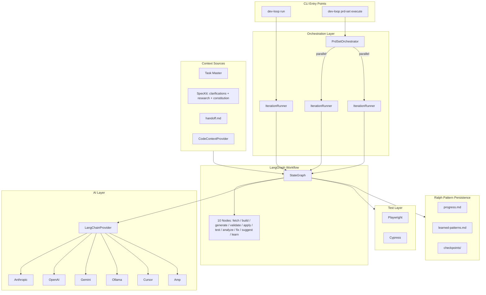

# dev-loop

Autonomous development orchestrator that implements test-driven development in a loop. AI generates code, tests validate it, failures create fix tasks, and the loop continues until all tests pass.

Built on **LangGraph** for workflow orchestration, **LangChain.js** for unified AI provider access, and the **Ralph pattern** for fresh context per iteration.

## How It Works

dev-loop runs a TDD loop where each iteration:

1. **Fetches a task** from Task Master
2. **Generates code** via LangChain.js (6 AI providers supported)
3. **Validates syntax** before applying changes
4. **Runs tests** (Playwright/Cypress)
5. **On failure**: Analyzes errors, creates fix task, loops back
6. **On success**: Captures learnings, proceeds to next task

The **Ralph pattern** resets AI context each iteration to prevent context pollution. State persists to files (`handoff.md`, `progress.md`) instead of accumulating in the AI's context window.



## Quick Start

```bash
# Configure AI provider
echo "ANTHROPIC_API_KEY=sk-ant-..." > .env

# Initialize
dev-loop init && task-master init

# Execute PRD set (loop behavior determined by PRD set schema)
dev-loop prd-set execute .taskmaster/planning/my-feature/

# Single iteration (for debugging)
dev-loop run
```

## PRD Sets: Parallel Autonomous Execution

For large-scope development, dev-loop supports **PRD sets** - collections of related PRDs executed in parallel with dependency-aware scheduling.

**PRD Set structure**:

```
.taskmaster/planning/my-feature/
├── index.md.yml          # Manifest with dependencies
├── api-layer.md          # PRD 1
├── data-model.md         # PRD 2 (depends on api-layer)
├── ui-components.md      # PRD 3 (parallel with data-model)
└── .speckit/             # Autonomous context
    ├── clarifications.json   # Resolved design decisions
    ├── research.json         # Codebase research findings
    └── constitution.json     # Project rules/patterns
```

**PrdSetOrchestrator** builds a dependency graph and executes PRDs in levels:
- **Level 1**: Independent PRDs run in parallel (isolated IterationRunner per PRD)
- **Level 2+**: PRDs wait for their dependencies to complete

**SpecKit** enables fully autonomous execution by pre-resolving:
- **Clarifications**: Design decisions answered before execution
- **Research**: Codebase findings (existing patterns, APIs, conventions)
- **Constitution**: Project rules from `.cursorrules` or similar

## Key Dependencies

| Package | Role in TDD Loop |
|---------|------------------|
| `@langchain/langgraph` | 10-node workflow StateGraph with conditional edges and file-based checkpointing |
| `@langchain/core` | Unified interface for all AI providers |
| `@langchain/anthropic` | Claude models for code generation |
| `zod` | Type-safe structured output from AI (code changes, analysis) |
| `fastmcp` | MCP server exposing dev-loop tools to outer AI agents |
| `task-master-ai` | Task management, PRD parsing, dependency tracking |

## The Ralph Pattern

Long-running AI sessions accumulate errors. The Ralph pattern solves this:

- **Fresh context each iteration**: No token accumulation across iterations
- **State in files**: `handoff.md` captures current state, `progress.md` logs history
- **Pattern learning**: Discoveries with 3+ occurrences promote to `learned-patterns.md`
- **Crash recovery**: LangGraph checkpoints in `.devloop/checkpoints/`

## LangGraph Nodes

| Node | TDD Role |
|------|----------|
| `fetchTask` | Get next pending task from Task Master |
| `buildContext` | Gather relevant code context for AI |
| `generateCode` | AI code generation via LangChainProvider |
| `validateCode` | Pre-apply syntax/lint validation |
| `applyChanges` | Write code changes to files |
| `runTests` | Execute test suite (the "T" in TDD) |
| `analyzeFailure` | AI analysis of test failures |
| `createFixTask` | Create fix task (loops back for retry) |
| `suggestImprovements` | Escalate on repeated failures |
| `captureLearnings` | Persist learnings (Ralph pattern) |

## AI Providers

All providers use LangChain.js with Zod schemas for structured output:

| Provider | Package | Notes |
|----------|---------|-------|
| Anthropic | `@langchain/anthropic` | Recommended (claude-sonnet-4) |
| OpenAI | `@langchain/openai` | gpt-4o, gpt-4-turbo |
| Azure OpenAI | `@langchain/openai` | Enterprise Azure deployments |
| Google Gemini | `@langchain/google-genai` | gemini-1.5-pro, gemini-2.0-flash |
| Ollama | `@langchain/ollama` | Local models (llama3.1, codellama) |
| Cursor | Custom adapter | IDE integration |
| Amp | Custom adapter | ampcode.com CLI agent |

### Azure OpenAI Configuration

For Azure OpenAI, set these environment variables:

```bash
AZURE_OPENAI_API_KEY=<your-api-key>
AZURE_OPENAI_ENDPOINT=https://<resource-name>.openai.azure.com/
AZURE_OPENAI_API_VERSION=2024-02-15-preview
AZURE_OPENAI_DEPLOYMENT_NAME=gpt-4
```

Then configure in `devloop.config.js`:

```javascript
module.exports = {
  ai: {
    provider: 'azure',
    model: 'gpt-4',  // Your deployment name
  },
};
```

## For AI Agents: MCP Tools

dev-loop exposes ~50 MCP tools for outer agent integration:

```json
{ "mcpServers": { "dev-loop": { "command": "dev-loop-mcp" } } }
```

| Category | Example Tools |
|----------|---------------|
| Core | `get_task`, `complete_task`, `get_pending_tasks` |
| Control | `pause_execution`, `resume_execution`, `stop` |
| Debug | `get_logs`, `analyze_error`, `get_state` |
| Playwright | `run_test`, `get_test_results` |
| Events | `subscribe_events` (real-time workflow observability) |

## CLI Reference

| Command | Purpose |
|---------|---------|
| `dev-loop prd-set execute <path>` | Execute PRD set (primary method) |
| `dev-loop run` | Single iteration (debugging) |
| `dev-loop status` | Current state |
| `dev-loop logs -f` | Follow logs |
| `dev-loop pause` / `resume` / `stop` | Workflow control |

## Framework Plugins

Auto-detected plugins inject framework-specific context:

| Framework | Detection | Provides |
|-----------|-----------|----------|
| Drupal | `composer.json` with drupal/core | Module patterns, config schema |
| Django | `manage.py` | App structure, migrations |
| React | `package.json` with react | Component patterns, hooks |
| Browser Extension | `manifest.json` | Content scripts, messaging |

## Project Structure

```
.devloop/
├── checkpoints/        # LangGraph crash recovery
├── handoff.md          # Current iteration context (Ralph pattern)
├── progress.md         # Iteration history
└── learned-patterns.md # Discovered patterns

.taskmaster/
├── tasks.json          # Task list
└── planning/           # PRD sets
```

## Documentation

- [`docs/ai/`](docs/ai/) - AI agent integration
- [`docs/users/`](docs/users/) - User guide
- [`docs/contributing/`](docs/contributing/) - Architecture details

## See Also

- [LangGraph](https://langchain-ai.github.io/langgraph/) - Workflow orchestration
- [LangChain.js](https://js.langchain.com/) - AI model interface
- [Task Master AI](https://www.npmjs.com/package/task-master-ai) - Task management
- [Model Context Protocol](https://modelcontextprotocol.io/) - AI tool integration

## License

MIT
