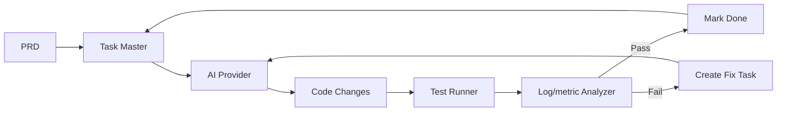
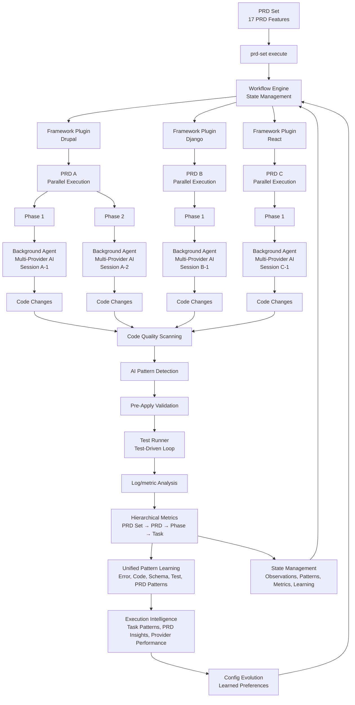

# dev-loop

Autonomous development orchestrator that transforms PRDs into validated code through a continuous loop of AI code generation, test execution, and Log/metric Analysis.

## Table of Contents

- [Documentation](#documentation)
- [Core Concept](#core-concept)
- [Operating Modes](#operating-modes)
- [Quick Start](#quick-start)
- [Configuration](#configuration)
- [Key Features](#key-features)
- [Architecture](#architecture)
- [Development](#development)
- [See Also](#see-also)

## Documentation

Dev-loop documentation is organized by audience and topic. Choose the documentation that matches your needs:

**For Users:**
- [`docs/users/README.md`](docs/users/README.md) - Complete user guide with CLI reference, configuration, and all features
- [`docs/users/PRD_BUILDING.md`](docs/users/PRD_BUILDING.md) - PRD building guide (convert/enhance/create)
- [`docs/users/METRICS.md`](docs/users/METRICS.md) - Metrics and reporting guide
- [`docs/users/REPORTS.md`](docs/users/REPORTS.md) - Report generation guide
- [`docs/users/PATTERNS.md`](docs/users/PATTERNS.md) - Unified pattern system guide
- [`docs/users/INIT_COMMAND.md`](docs/users/INIT_COMMAND.md) - Init command with execution intelligence
- [`docs/users/CONFIG.md`](docs/users/CONFIG.md) - Complete configuration reference

**For AI Agents:**
- [`docs/ai/README.md`](docs/ai/README.md) - AI agent onboarding guide for creating PRDs
- [`docs/ai/INDEX.md`](docs/ai/INDEX.md) - Documentation index with task → doc mappings
- [`docs/ai/PRD_SCHEMA.md`](docs/ai/PRD_SCHEMA.md) - Complete PRD schema reference
- [`docs/ai/PRD_FEATURES.md`](docs/ai/PRD_FEATURES.md) - Guide to all 17 dev-loop features
- [`docs/ai/PRD_TEMPLATE.md`](docs/ai/PRD_TEMPLATE.md) - Copy-paste PRD template

**For Contributors:**
- [`docs/contributing/README.md`](docs/contributing/README.md) - Contribution guide overview
- [`docs/contributing/CONTRIBUTION_MODE.md`](docs/contributing/CONTRIBUTION_MODE.md) - Contribution mode guide
- [`docs/contributing/ARCHITECTURE.md`](docs/contributing/ARCHITECTURE.md) - Architecture documentation
- [`docs/contributing/QUICK_START.md`](docs/contributing/QUICK_START.md) - Quick-start scenarios

**Specialized Topics:**
- [`docs/CURSOR_INTEGRATION.md`](docs/CURSOR_INTEGRATION.md) - Complete Cursor integration guide
- [`docs/contributing/EVENT_STREAMING.md`](docs/contributing/EVENT_STREAMING.md) - Event streaming guide
- [`docs/contributing/PROACTIVE_MONITORING.md`](docs/contributing/PROACTIVE_MONITORING.md) - Proactive monitoring guide
- [`docs/MIGRATION_PATTERNS.md`](docs/MIGRATION_PATTERNS.md) - Pattern schema migration guide

**Documentation Discovery:** All documentation files include YAML frontmatter metadata. See [`docs/ai/README.md`](docs/ai/README.md) for AI agent discovery strategies.

## Core Concept

Dev-loop implements a **test-driven development loop**:

**Key principle**: Every task bundles feature code + test code. The loop continues until all tests pass.

## Key Features

| Feature | Description | Documentation |
|---------|-------------|---------------|
| **Multi-Provider AI** | Anthropic, OpenAI, Gemini, Ollama, Cursor support | [`docs/users/README.md`](docs/users/README.md) |
| **Parallel Execution** | Multiple PRD sets and phases execute simultaneously with isolated sessions | [`docs/CURSOR_INTEGRATION.md`](docs/CURSOR_INTEGRATION.md#parallel-execution) |
| **Test-Driven Loop** | Playwright/Cypress test runners with automatic retry and fix | [`docs/users/README.md`](docs/users/README.md) |
| **Pre-Apply Validation** | Syntax checking before code changes are applied | [`docs/contributing/ARCHITECTURE.md`](docs/contributing/ARCHITECTURE.md) |
| **Log/metric Analysis** | Automatic Log/metric Analysis and error detection | [`docs/users/README.md`](docs/users/README.md) |
| **State Management** | JSON/YAML persistence, state recovery | [`docs/contributing/ARCHITECTURE.md`](docs/contributing/ARCHITECTURE.md) |
| **Framework Plugins** | Drupal, Django, React, Browser Extension with auto-detection | [`docs/users/README.md`](docs/users/README.md#framework-plugins) |
| **AI Pattern Detection** | Semantic code analysis with abstraction recommendations | [`docs/users/README.md`](docs/users/README.md#ai-enhanced-pattern-detection) |
| **Code Quality Scanning** | Static analysis, security, tech debt, and duplicate detection | [`docs/users/README.md`](docs/users/README.md#code-quality-scanning) |
| **Pattern Learning** | Unified pattern system learns from outcomes to improve code generation | [`docs/users/PATTERNS.md`](docs/users/PATTERNS.md) |
| **Execution Intelligence** | Learns from task execution and PRD generation to optimize configuration | [`docs/users/INIT_COMMAND.md`](docs/users/INIT_COMMAND.md) |
| **Config Evolution** | Learns from manual config edits to improve suggestions | [`docs/users/CONFIG.md`](docs/users/CONFIG.md) |
| **PRD Building** | Convert planning docs, enhance PRD sets, or create interactively | [`docs/users/PRD_BUILDING.md`](docs/users/PRD_BUILDING.md) |
| **17 PRD Features** | Framework config, test generation, error guidance, and more | [`docs/ai/PRD_FEATURES.md`](docs/ai/PRD_FEATURES.md) |
| **MCP Integration** | Task Master and Dev-Loop MCP servers for AI assistant integration | [`docs/users/README.md`](docs/users/README.md#mcp-integration) |
| **Contribution Mode** | Two-agent architecture for contributing to dev-loop | [`docs/contributing/CONTRIBUTION_MODE.md`](docs/contributing/CONTRIBUTION_MODE.md) |
| **Hierarchical Metrics** | PRD Set → PRD → Phase → Task level tracking with cost analysis | [`docs/users/METRICS.md`](docs/users/METRICS.md) |

## Architecture

### PRD Set Execution with Parallel Background Agents

Dev-loop executes PRD sets through parallel background agents, enabling concurrent execution of multiple PRDs and phases:

The architecture enables parallel execution of multiple PRD sets through background agents, with validation, testing, and metrics collection at each stage. See [`docs/contributing/ARCHITECTURE.md`](docs/contributing/ARCHITECTURE.md) for complete architecture documentation including implementation details, core components, and provider interfaces.

## Contribution

See [`docs/contributing/README.md`](docs/contributing/README.md) for development workflow and contribution guide.

## See Also

- [`docs/users/README.md`](docs/users/README.md) - Complete user documentation
- [`docs/ai/README.md`](docs/ai/README.md) - AI agent guide
- [`docs/contributing/README.md`](docs/contributing/README.md) - Contribution guide
- [Task Master AI](https://www.npmjs.com/package/task-master-ai) - Task management

## License

MIT
