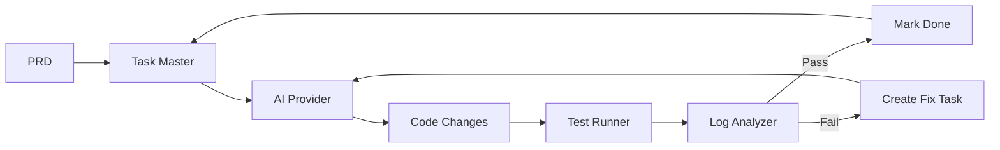
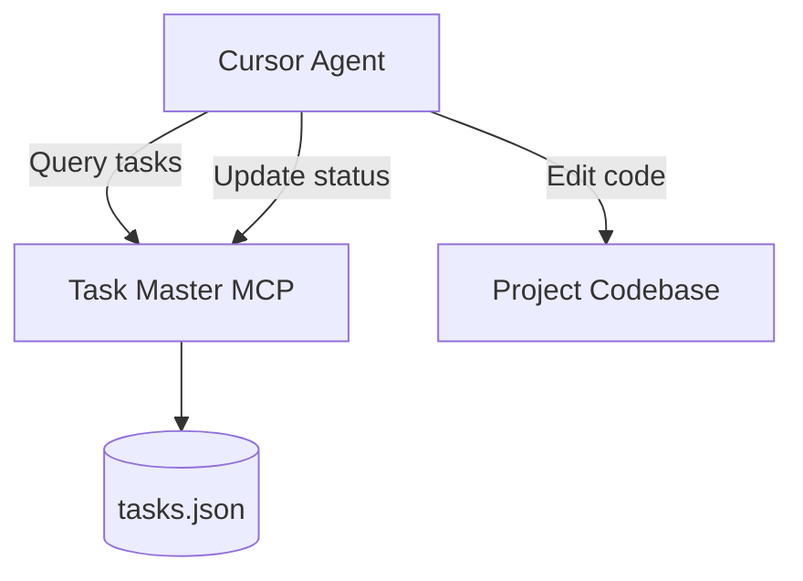
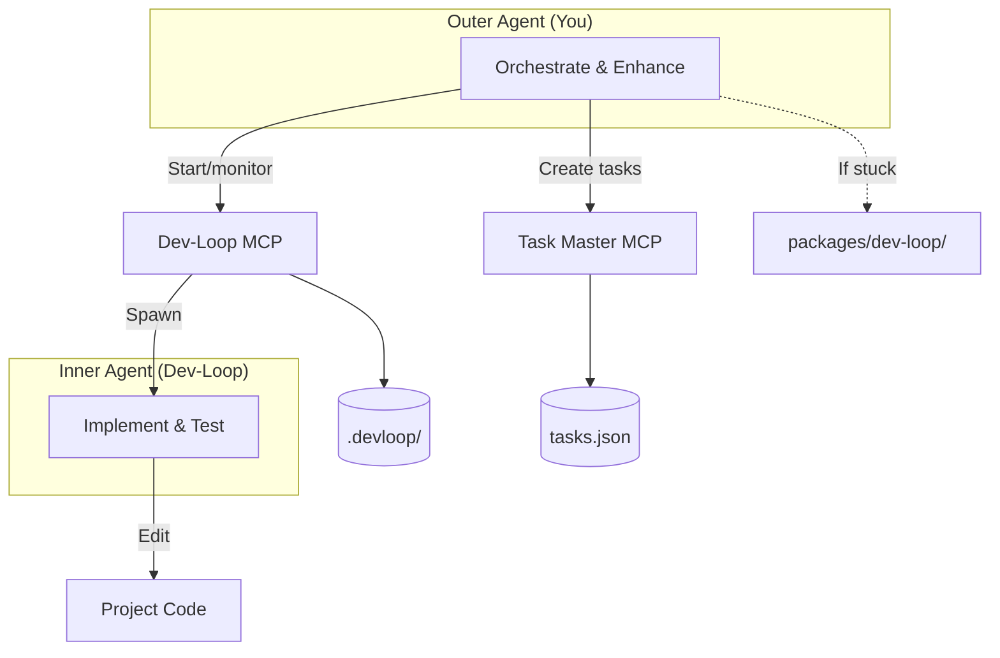
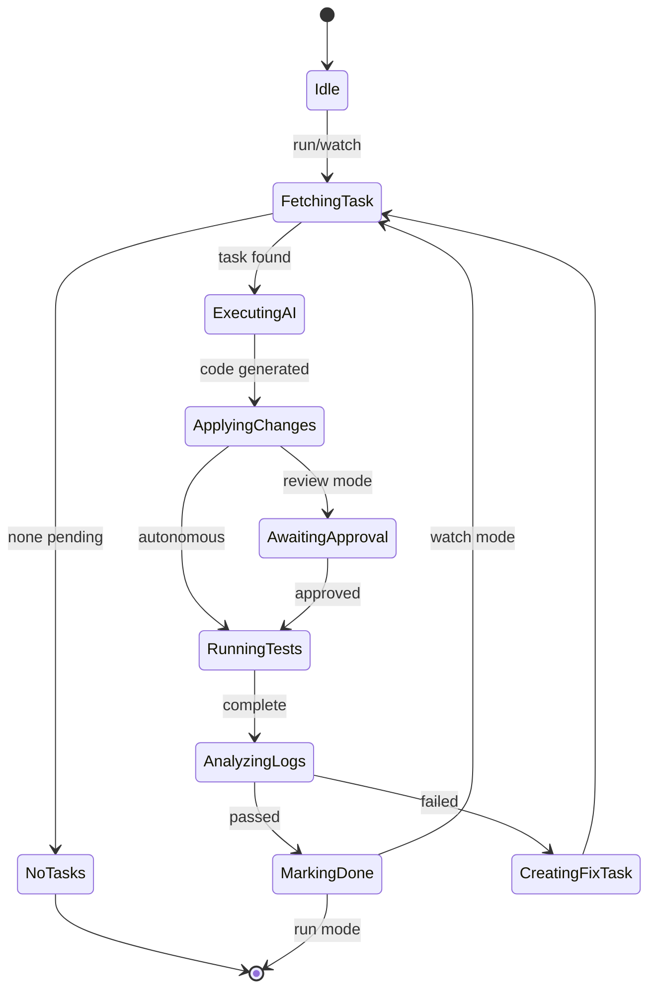

# dev-loop

Autonomous development orchestrator that transforms PRDs into validated code through a continuous loop of AI code generation, test execution, and log analysis.

## Core Concept

Dev-loop implements a **test-driven development loop**:



**Key principle**: Every task bundles feature code + test code. The loop continues until all tests pass.

## Two Operating Modes

### Non-Evolution Mode (Default)

You implement tasks directly. Dev-loop provides task management and diagnostics.



### Evolution Mode

Two-agent architecture for autonomous development:



| Aspect | Non-Evolution | Evolution |
|--------|--------------|-----------|
| Who implements | You | Inner agent |
| Your role | Direct coding | Orchestration |
| Code you edit | All files | Only `packages/dev-loop/` |

## Quick Start

```bash
# Prerequisites: Node.js 20+, AI API key

# Install
npm install -g dev-loop

# Setup
echo "ANTHROPIC_API_KEY=your_key" > .env
dev-loop init
task-master init

# Run
task-master parse-prd --input=prd.md   # Create tasks from PRD
dev-loop run                            # Execute one iteration
dev-loop watch                          # Continuous mode
```

## Configuration

Create `devloop.config.js`:

```javascript
module.exports = {
  ai: {
    provider: 'anthropic',              // 'anthropic' | 'openai' | 'gemini' | 'ollama'
    model: 'claude-sonnet-4-20250514',
    fallback: 'openai:gpt-4o',
  },
  testing: {
    runner: 'playwright',               // 'playwright' | 'cypress'
    command: 'npm test',
    timeout: 300000,
  },
  intervention: {
    mode: 'autonomous',                 // 'autonomous' | 'review' | 'hybrid'
  },
  taskMaster: {
    tasksPath: '.taskmaster/tasks/tasks.json',
  },
  debug: false,
  metrics: { enabled: true, path: '.devloop/metrics.json' },
  patternLearning: { enabled: true, patternsPath: '.devloop/patterns.json' },
};
```

## CLI Reference

### Core Commands

| Command | Description |
|---------|-------------|
| `dev-loop init` | Initialize project |
| `dev-loop run [--task ID] [--debug]` | Execute one iteration |
| `dev-loop watch [--debug]` | Continuous execution |
| `dev-loop status` | Current progress |
| `dev-loop pause` / `resume` | Control execution |

### Task Commands

| Command | Description |
|---------|-------------|
| `dev-loop list [--pending\|--done]` | List tasks |
| `dev-loop show <id>` | Task details |
| `dev-loop reset <id>` | Reset to pending |
| `task-master parse-prd --input=<file>` | Create tasks from PRD |
| `task-master add-task --prompt="..."` | Add single task |
| `task-master set-status --id=<id> --status=done` | Update status |

### Debugging Commands

| Command | Description |
|---------|-------------|
| `dev-loop diagnose [<id>]` | Analyze failures |
| `dev-loop trace <id>` | Execution trace |
| `dev-loop logs [--follow]` | View logs |
| `dev-loop metrics [--summary]` | Debug metrics |
| `dev-loop validate` | Check config/environment |

## MCP Integration

Both Task Master and Dev-Loop run as MCP servers for direct AI assistant integration.

### Setup

Create `.cursor/mcp.json`:

```json
{
  "mcpServers": {
    "task-master-ai": {
      "command": "npx",
      "args": ["-y", "task-master-ai@0.40.0"],
      "env": { "ANTHROPIC_API_KEY": "${ANTHROPIC_API_KEY}" }
    },
    "dev-loop": {
      "command": "node",
      "args": ["packages/dev-loop/dist/mcp/server.js"],
      "env": { "ANTHROPIC_API_KEY": "${ANTHROPIC_API_KEY}" }
    }
  }
}
```

### MCP Tools

**Task Master MCP** (task management):
- `parse_prd`, `add_task`, `list_tasks`, `next_task`, `get_task`, `set_status`, `expand_task`

**Dev-Loop MCP** (workflow orchestration):
- Core: `devloop_run`, `devloop_status`, `devloop_prd`, `devloop_list_tasks`
- Debug: `devloop_diagnose`, `devloop_trace`, `devloop_logs`, `devloop_metrics`
- Control: `devloop_pause`, `devloop_resume`, `devloop_reset`, `devloop_validate`
- Evolution: `devloop_evolution_start`, `devloop_evolution_status`, `devloop_evolution_stop`

### Common Workflows

**Start a PRD (Evolution Mode):**
```
1. devloop_evolution_start(prd: "path/to/prd.md")
2. task-master: parse_prd(input: "path/to/prd.md")
3. devloop_prd(prdPath: "path/to/prd.md", debug: true)
4. devloop_evolution_status() — monitor until complete
```

**Debug a failure:**
```
1. devloop_diagnose(taskId: "123")
2. devloop_logs(analyze: true)
3. devloop_trace(taskId: "123")
```

## Architecture

### Workflow State Machine



### Core Components

| Component | Purpose |
|-----------|---------|
| **WorkflowEngine** | Main orchestration loop, state machine |
| **TaskMasterBridge** | Wrapper around task-master-ai |
| **StateManager** | JSON/YAML persistence, state recovery |
| **CodeContextProvider** | Extract file signatures, imports, error context |
| **ValidationGate** | Pre-apply validation, syntax checking |
| **PatternLearningSystem** | Learn from outcomes, inject guidance |

### Provider Interfaces

| Interface | Implementations |
|-----------|-----------------|
| **AIProvider** | Anthropic, OpenAI, Gemini, Ollama |
| **TestRunner** | Playwright, Cypress |
| **LogAnalyzer** | PatternMatcher (regex), AILogAnalyzer |

### Analysis Components

For complex issues, dev-loop provides:

- **FrameworkPatternLibrary** — Framework-specific patterns (Drupal, React)
- **DebuggingStrategyAdvisor** — Classify errors, suggest investigation vs direct fix
- **ExecutionOrderAnalyzer** — Detect timing/ordering issues
- **ComponentInteractionAnalyzer** — Map component boundaries and conflicts
- **RootCauseAnalyzer** — Track partial fixes, identify systemic issues

## Intervention Modes

Control whether the inner agent requires approval:

| Mode | Behavior |
|------|----------|
| `autonomous` | Fully automated |
| `review` | Human approves each change |
| `hybrid` | Auto for safe changes, review for risky (`delete`, `schema-change`) |

## Evolution Mode Details

Activated by human operator: "Enter evolution mode for dev-loop"

**Outer agent responsibilities:**
1. Run `devloop_evolution_start`
2. Create/update tasks via Task Master
3. Monitor via `devloop_evolution_status`
4. If inner agent stuck: enhance `packages/dev-loop/` code
5. Build, commit, push dev-loop changes
6. Validate improvements via metrics

**What to add to dev-loop vs create as task:**

| Scenario | Action |
|----------|--------|
| One-off bug fix | Create task |
| Repeated pattern | Add to PatternLearningSystem |
| Missing context | Enhance CodeContextProvider |
| Better prompts | Update templates |

**Keep dev-loop framework-agnostic.** Project-specific behavior goes in:
- `devloop.config.js` — Hooks, log sources
- `.taskmaster/templates/` — PRD templates
- Project rules (CLAUDE.md, .cursorrules) — Injected into prompts

## File Structure

```
project/
├── devloop.config.js           # Dev-loop config
├── .env                        # API keys
├── .taskmaster/
│   ├── tasks/tasks.json        # Task definitions
│   └── docs/                   # PRDs
├── .devloop/
│   ├── metrics.json            # Execution metrics
│   └── patterns.json           # Learned patterns
├── tests/playwright/           # Test specs
└── test-results/               # Artifacts, screenshots
```

## CI Output

- `devloop-results.json` — Structured results
- `devloop-results.xml` — JUnit XML
- `devloop-summary.md` — Human-readable summary

## Troubleshooting

| Issue | Fix |
|-------|-----|
| Test timeout | Fix wait strategy, increase timeout |
| AI not implementing | Check API key and config |
| Form not advancing | Wait for button text/URL change |
| Flaky tests | Add explicit waits, retry logic |

## Best Practices

1. Bundle features with tests
2. Run tests after each change
3. Check logs with every test run
4. Take screenshots liberally
5. Create atomic fix tasks
6. Commit working states
7. Verify AI changes with `git diff`

## Development

```bash
npm install          # Install dependencies
npm run build        # Build
npm run dev          # Watch mode
npm test             # Test
```

**Requirements:** Node.js >= 20.0.0

## Dependencies

| Package | Purpose |
|---------|---------|
| `task-master-ai` | Task management |
| `commander` | CLI framework |
| `zod` | Config validation |
| `@anthropic-ai/sdk` | Claude API |
| `openai` | GPT API |
| `@google/generative-ai` | Gemini API |

## Roadmap

### Complete
- Workflow engine with state machine
- Multi-provider AI support
- Playwright/Cypress test runners
- Pattern learning system
- Pre-apply validation
- Framework pattern library
- Error classification & root cause analysis
- MCP integration (Task Master + Dev-Loop)
- Evolution mode

### In Progress
- Smart scheduling with dependency resolution
- Proactive pattern application
- Context gap detection

### Planned
- Parallel task execution
- Git workflow integration
- Rich HTML reports
- Shell completion scripts

## See Also

- [HANDOFF.md](./HANDOFF.md) — Implementation handoff
- [AI Dev Tasks](https://github.com/snarktank/ai-dev-tasks) — Prompt templates
- [Task Master AI](https://www.npmjs.com/package/task-master-ai) — Task management

## License

MIT
