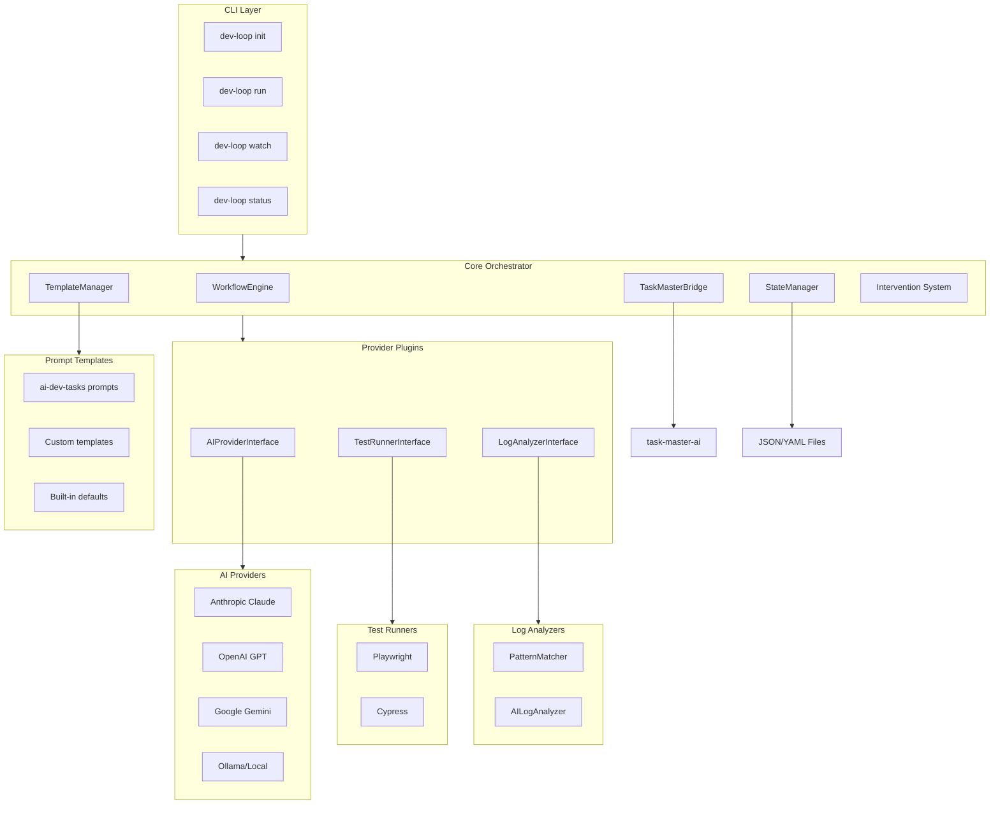
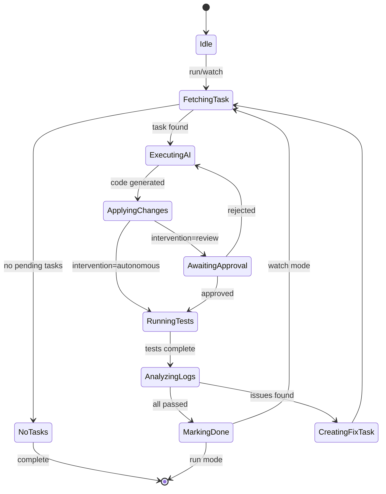
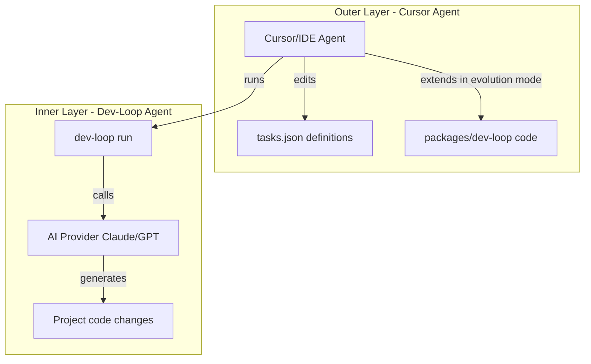
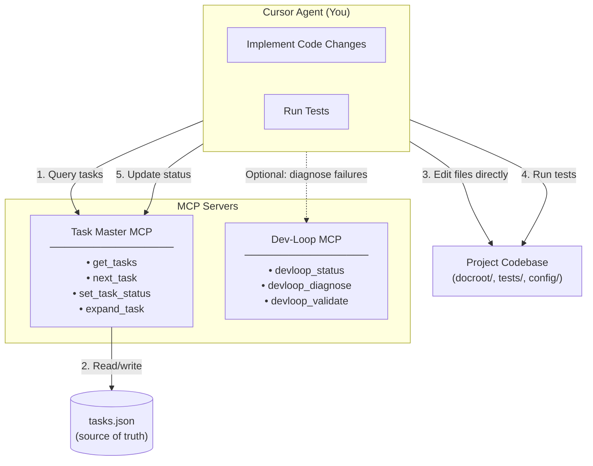
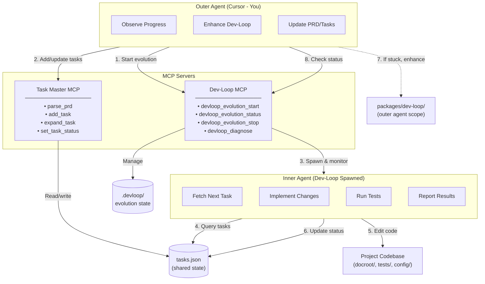

# dev-loop

Transforms PRDs into validated code by orchestrating AI providers, test runners, and metric/log analyzers in a continuous loop. Key features include multi-provider AI support, Playwright/Cypress test runners, hybrid log analysis, historical pattern learning, observation-driven evolution, metrics, framework pattern matching, execution order analysis, component interaction detection, and root cause analysis.

## Quick Start

### Prerequisites

- **Node.js 20+** - Required for Task Master and modern dependencies
- **AI API Key** - Anthropic, OpenAI, or other provider API key
- **Test Framework** - Playwright or Cypress (depending on your config)

### Installation

```bash
# Install globally
npm install -g dev-loop

# Or use locally
npm install
npm run build
npm start -- --help
```

### Setup

```bash
# Ensure Node.js 20+ is active
nvm use 20

# Create .env with API key
echo "ANTHROPIC_API_KEY=your_key_here" > .env

# Initialize dev-loop in your project
dev-loop init
```

### First Run

```bash
# Initialize Task Master (if not already done)
task-master init

# Parse PRD into tasks
task-master parse-prd --input=path/to/prd.md

# Or manually create feature+test tasks
task-master add-task --prompt="
Implement user login flow with:
- Email/password authentication
- Session management
- Error handling for invalid credentials

Include Playwright tests for:
- Successful login redirects to dashboard
- Invalid credentials shows error message
- Empty fields show validation errors
- Session persists across page reloads
" --priority=high

# Run one iteration
dev-loop run

# Or run in daemon mode (continuous)
dev-loop watch
```

## Configuration

Create a `devloop.config.js` file in your project root:

```javascript
module.exports = {
  // Debug mode - enable verbose output and metrics tracking
  debug: false,
  metrics: {
    enabled: true,
    path: '.devloop/metrics.json',
  },
  // AI Provider configuration
  ai: {
    provider: 'anthropic', // 'anthropic' | 'openai' | 'gemini' | 'ollama'
    model: 'claude-sonnet-4-20250514',
    fallback: 'openai:gpt-4o', // Optional fallback
    apiKey: process.env.ANTHROPIC_API_KEY, // Or set in .env
  },

  // Prompt templates
  templates: {
    source: 'ai-dev-tasks', // 'builtin' | 'ai-dev-tasks' | 'custom'
    customPath: './my-templates/', // Only if source: 'custom'
  },

  // Test runner configuration
  testing: {
    runner: 'playwright', // 'playwright' | 'cypress'
    command: 'npm test',
    timeout: 300000, // 5 minutes
    artifactsDir: 'test-results',
  },

  // Log analysis configuration
  logs: {
    sources: [
      { type: 'file', path: '/var/log/app.log' },
      { type: 'command', command: 'tail -100 /var/log/application.log' },
    ],
    patterns: {
      error: /Error|Exception|Fatal/i,
      warning: /Warning|Deprecated/i,
    },
    useAI: true, // Enable AI-powered analysis
  },

  // Intervention mode
  intervention: {
    mode: 'autonomous', // 'autonomous' | 'review' | 'hybrid'
    approvalRequired: ['delete', 'schema-change'], // Actions needing approval
  },

  // Task Master integration
  taskMaster: {
    tasksPath: '.taskmaster/tasks/tasks.json',
  },

  // Enhanced context for better AI prompts
  context: {
    includeSkeleton: true,      // Include file skeleton showing available helpers
    includeImports: true,       // Include import section explicitly
    maxHelperSignatures: 20,    // Max helper signatures to show
  },

  // Pre-apply validation to catch errors before filesystem changes
  preValidation: {
    enabled: true,              // Enable pre-apply validation
    maxRetries: 2,              // Retries before creating fix task
    validateSyntax: true,       // TypeScript syntax validation
  },

  // Pattern learning to prevent repeating mistakes
  patternLearning: {
    enabled: true,              // Enable pattern learning
    patternsPath: '.devloop/patterns.json',
    useBuiltinPatterns: true,   // Include common patterns
  },
};
```

## Architecture

### System Architecture

The dev-loop system is built with a layered architecture that separates concerns and enables extensibility:



### Workflow Lifecycle

The complete workflow from PRD to validated code:

```
┌─────────────────────────────────────────────────────────────────────────────┐
│                         PRD (Product Requirements)                          │
│                         ┌──────────────────────┐                           │
│                         │  Feature Requirements │                           │
│                         │  Test Requirements    │                           │
│                         └──────────────────────┘                           │
└─────────────────────────────────────────────────────────────────────────────┘
                                      │
                                      ▼
┌─────────────────────────────────────────────────────────────────────────────┐
│                    TASK MASTER (via TaskMasterBridge)                        │
│  ┌─────────────────────────────────────────────────────────────────────┐   │
│  │  Parse PRD → Create Tasks (Feature + Test bundled together)        │   │
│  │  ┌─────────────┐  ┌─────────────┐  ┌─────────────┐              │   │
│  │  │   Task 1    │  │   Task 2    │  │   Task N    │              │   │
│  │  │  Feature A  │  │  Feature B  │  │   Fix Task  │              │   │
│  │  │  + Test A   │  │  + Test B   │  │   + Tests   │              │   │
│  │  └─────────────┘  └─────────────┘  └─────────────┘              │   │
│  └─────────────────────────────────────────────────────────────────────┘   │
└─────────────────────────────────────────────────────────────────────────────┘
                                      │
                                      ▼
┌─────────────────────────────────────────────────────────────────────────────┐
│                    WORKFLOW ENGINE (Orchestration Loop)                      │
│  ┌─────────────────────────────────────────────────────────────────────┐   │
│  │  1. Fetch next pending task                                          │   │
│  │  2. Set status: pending → in-progress                                │   │
│  │  3. Load task context (codebase, tests, logs)                        │   │
│  └─────────────────────────────────────────────────────────────────────┘   │
└─────────────────────────────────────────────────────────────────────────────┘
                                      │
                                      ▼
┌─────────────────────────────────────────────────────────────────────────────┐
│                    AI PROVIDER (Code Generation)                           │
│  ┌─────────────────────────────────────────────────────────────────────┐   │
│  │  • Receive task prompt + context                                    │   │
│  │  • Generate feature code + test code together                       │   │
│  │  • Return code changes (diffs/patches)                             │   │
│  └─────────────────────────────────────────────────────────────────────┘   │
└─────────────────────────────────────────────────────────────────────────────┘
                                      │
                                      ▼
┌─────────────────────────────────────────────────────────────────────────────┐
│                    INTERVENTION SYSTEM (Optional Approval)                  │
│  ┌─────────────────────────────────────────────────────────────────────┐   │
│  │  Mode: autonomous → skip                                            │   │
│  │  Mode: review/hybrid → show diff, await approval                    │   │
│  └─────────────────────────────────────────────────────────────────────┘   │
└─────────────────────────────────────────────────────────────────────────────┘
                                      │
                                      ▼
┌─────────────────────────────────────────────────────────────────────────────┐
│                    CODEBASE (Apply Changes)                                 │
│  ┌─────────────────────────────┐  ┌─────────────────────────────────────┐ │
│  │      Feature Code            │  │        Test Code                     │ │
│  │  • Controllers/Services      │  │  • Playwright/Cypress tests           │ │
│  │  • Forms/Handlers            │  │  • Unit tests                          │ │
│  │  • Entity definitions        │  │  • Integration tests                 │ │
│  └─────────────────────────────┘  └─────────────────────────────────────┘ │
└─────────────────────────────────────────────────────────────────────────────┘
                                      │
                                      ▼
┌─────────────────────────────────────────────────────────────────────────────┐
│                    TEST RUNNER (Validation)                                 │
│  ┌───────────────────┐  ┌───────────────────┐  ┌───────────────────────┐   │
│  │  Execute Tests    │  │  Collect Artifacts│  │  Parse Results         │   │
│  │  • Playwright     │  │  • Screenshots    │  │  • Pass/Fail status   │   │
│  │  • Cypress        │  │  • Videos         │  │  • Test coverage       │   │
│  │  • Unit tests     │  │  • Logs           │  │  • Error details       │   │
│  └───────────────────┘  └───────────────────┘  └───────────────────────┘   │
└─────────────────────────────────────────────────────────────────────────────┘
                                      │
                                      ▼
┌─────────────────────────────────────────────────────────────────────────────┐
│                    LOG ANALYZER (Issue Detection)                          │
│  ┌───────────────────┐  ┌───────────────────┐  ┌───────────────────────┐   │
│  │  Pattern Matcher  │  │  AI Analyzer      │  │  Hybrid Analysis      │   │
│  │  • Regex patterns │  │  • Root cause     │  │  • Combine results   │   │
│  │  • Fast detection │  │  • Suggestions     │  │  • Issue prioritization│   │
│  └───────────────────┘  └───────────────────┘  └───────────────────────┘   │
└─────────────────────────────────────────────────────────────────────────────┘
                                      │
                          ┌───────────┴───────────┐
                          ▼                       ▼
                   ┌─────────────┐         ┌─────────────┐
                   │    PASS     │         │    FAIL     │
                   │             │         │             │
                   │ All tests   │         │ Issues      │
                   │ pass        │         │ detected    │
                   │ Logs clean  │         │             │
                   └─────────────┘         └─────────────┘
                          │                       │
                          │                       ▼
                          │              ┌─────────────────────┐
                          │              │  Create Fix Task    │
                          │              │  (via TaskMaster)   │
                          │              └─────────────────────┘
                          │                       │
                          │                       │
                          ▼                       ▼
                   ┌─────────────────────────────────────┐
                   │  STATE MANAGER (Update Status)      │
                   │  • Mark task as done                │
                   │  • Save execution history           │
                   │  • Update workflow state             │
                   └─────────────────────────────────────┘
                                      │
                          ┌───────────┴───────────┐
                          ▼                       ▼
                   ┌─────────────┐         ┌─────────────┐
                   │  Next Task   │         │  Fix Task   │
                   │  (if any)    │         │  (loop back)│
                   └─────────────┘         └─────────────┘
                          │                       │
                          └───────────┬─────────┘
                                      │
                                      ▼
                          ┌─────────────────────┐
                          │  Watch Mode?        │
                          │  • Yes → Loop       │
                          │  • No → Complete    │
                          └─────────────────────┘
                                      │
                                      ▼
                          ┌─────────────────────┐
                          │  PRD 100% COMPLETE  │
                          │  All features done  │
                          │  All tests passing  │
                          └─────────────────────┘
```

### Workflow Engine State Machine

The core orchestration follows a state machine pattern:



**State Transitions:**
- **Idle** → **FetchingTask**: When `run` or `watch` command is executed
- **FetchingTask** → **ExecutingAI**: When a pending task is found
- **ExecutingAI** → **ApplyingChanges**: After AI generates code
- **ApplyingChanges** → **AwaitingApproval**: In review/hybrid mode for risky operations
- **ApplyingChanges** → **RunningTests**: In autonomous mode or after approval
- **RunningTests** → **AnalyzingLogs**: After test execution completes
- **AnalyzingLogs** → **MarkingDone**: When all tests pass and logs are clean
- **AnalyzingLogs** → **CreatingFixTask**: When issues are detected
- **MarkingDone** → **FetchingTask**: In watch mode (continuous loop)
- **MarkingDone** → **Idle**: In run mode (single iteration)

### Core Components

1. **WorkflowEngine** (`src/core/workflow-engine.ts`)
   - Main orchestration loop implementing the state machine
   - Coordinates all providers and manages task lifecycle
   - Handles error recovery and retry logic
   - Manages state transitions and workflow execution

2. **TaskMasterBridge** (`src/core/task-bridge.ts`)
   - Wrapper around `task-master-ai@0.40.0`
   - Provides unified interface for task CRUD operations
   - Manages task status transitions (pending → in-progress → done)
   - Integrates with task-master-ai CLI or programmatic API

3. **StateManager** (`src/core/state-manager.ts`)
   - Local JSON/YAML file persistence
   - Tracks workflow state across restarts
   - Manages task state and execution history
   - Provides state recovery after interruptions
   - Atomic state updates to prevent corruption

4. **TemplateManager** (`src/core/template-manager.ts`)
   - Loads prompt templates from multiple sources
   - Supports `builtin`, `ai-dev-tasks`, and `custom` sources
   - Template resolution follows priority: custom > ai-dev-tasks > builtin
   - Provides PRD and task generation templates
   - Handles template resolution and caching

5. **Intervention System** (`src/core/intervention.ts`)
   - Approval gates for review mode
   - Hybrid mode logic for selective approval
   - Terminal-based approval UI
   - Risk assessment for code changes
   - Three modes: autonomous, review, hybrid

6. **CodeContextProvider** (`src/core/code-context-provider.ts`)
   - Extracts structured context from target files
   - Provides function/class signatures to AI
   - Shows import patterns for accurate references
   - Generates file-specific guidance prompts
   - Extracts execution context from errors
   - Generates "error story" narratives for better AI understanding
   - Identifies component interactions from error messages

7. **ValidationGate** (`src/core/validation-gate.ts`)
   - Pre-apply validation before filesystem changes
   - Verifies patch search strings exist in files
   - TypeScript syntax validation
   - Suggests fixes for validation errors
   - Prevents wasted iterations from invalid patches

8. **PatternLearningSystem** (`src/core/pattern-learner.ts`)
   - Remembers common failure patterns
   - Injects "do not repeat" guidance into prompts
   - Built-in patterns for common AI errors
   - Records patterns from test failures
   - Persists learned patterns in `.devloop/patterns.json`

9. **FrameworkPatternLibrary** (`src/core/framework-pattern-library.ts`)
   - Framework-specific execution pattern knowledge
   - Drupal patterns: form handler order, hook execution, entity lifecycle, widget interactions
   - React patterns: component lifecycle, useEffect dependencies
   - Generic patterns: async sequencing, event handler order
   - Matches errors to known patterns and provides framework-specific guidance

10. **DebuggingStrategyAdvisor** (`src/core/debugging-strategy-advisor.ts`)
    - Classifies errors: timing-order, missing-state, component-interaction, simple-bug
    - Suggests debugging strategy: add-logging, fix-root-cause, add-validation, refactor-interaction
    - Determines when investigation is needed vs direct fix
    - Generates targeted debug code snippets for investigation
    - Framework-aware error classification

11. **InvestigationTaskGenerator** (`src/core/investigation-task-generator.ts`)
    - Creates investigation tasks before fix tasks for complex issues
    - Generates framework-specific investigation tasks
    - Provides debug code templates for strategic logging
    - Ensures proper investigation → analysis → fix workflow

12. **ExecutionOrderAnalyzer** (`src/core/execution-order-analyzer.ts`)
    - Analyzes code for execution order/timing issues
    - Detects form handler order problems (array_push vs array_unshift)
    - Identifies hook execution order issues
    - Generates execution flow diagrams for AI prompts

13. **ComponentInteractionAnalyzer** (`src/core/component-interaction-analyzer.ts`)
    - Identifies component boundaries and interactions
    - Detects common interaction problems (entity lifecycle, widget-entity conflicts)
    - Maps component interaction flows (e.g., widget → entity → bundle lifecycle)
    - Suggests fixes based on interaction patterns

14. **RootCauseAnalyzer** (`src/core/root-cause-analyzer.ts`)
    - Analyzes why partial fixes fail
    - Identifies which code paths are fixed vs broken
    - Suggests comprehensive fixes addressing all execution paths
    - Tracks fix attempt patterns to identify systemic issues

### Provider Interfaces

All providers implement standardized interfaces for pluggability:

1. **AIProvider Interface** (`src/providers/ai/interface.ts`)
   - `generateCode(context, task)`: Generate implementation code
   - `analyzeError(error, context)`: Analyze and suggest fixes
   - `fallback()`: Support for provider fallback chains
   - Implementations: Anthropic, OpenAI, Gemini, Ollama
   - Provider factory manages registration, fallback chains, and configuration

2. **TestRunner Interface** (`src/providers/test-runners/interface.ts`)
   - `runTests(options)`: Execute test suite
   - `collectArtifacts()`: Gather screenshots, videos, logs
   - `parseResults(output)`: Extract pass/fail status
   - Implementations: Playwright, Cypress
   - Handles timeouts gracefully and supports parallel execution

3. **LogAnalyzer Interface** (`src/providers/log-analyzers/interface.ts`)
   - `analyze(logs, context)`: Analyze log content
   - `detectIssues()`: Identify errors and warnings
   - `suggestFixes()`: Provide remediation recommendations
   - Implementations: PatternMatcher (regex-based), AILogAnalyzer (AI-powered)
   - Hybrid mode combines both approaches for comprehensive issue detection

### Project Structure

```
dev-loop/
├── package.json
├── tsconfig.json
├── .eslintrc.json
├── .prettierrc
├── .gitignore
├── src/
│   ├── index.ts                 # CLI entry point
│   ├── cli/
│   │   ├── commands/
│   │   │   ├── init.ts          # Interactive wizard
│   │   │   ├── run.ts           # Single execution
│   │   │   ├── watch.ts         # Daemon mode
│   │   │   ├── status.ts        # Current state
│   │   │   └── logs.ts          # Log viewing
│   │   └── prompts.ts           # Wizard prompts
│   ├── core/
│   │   ├── workflow-engine.ts   # Main orchestration
│   │   ├── task-bridge.ts       # task-master-ai wrapper
│   │   ├── state-manager.ts     # File persistence
│   │   ├── template-manager.ts  # Template loading
│   │   ├── intervention.ts      # Approval gates
│   │   ├── code-context-provider.ts  # File context extraction
│   │   ├── validation-gate.ts  # Pre-apply validation
│   │   ├── pattern-learner.ts  # Pattern learning system
│   │   ├── framework-pattern-library.ts  # Framework patterns
│   │   ├── debugging-strategy-advisor.ts  # Error classification
│   │   ├── investigation-task-generator.ts  # Investigation tasks
│   │   ├── execution-order-analyzer.ts  # Execution order analysis
│   │   ├── component-interaction-analyzer.ts  # Component interactions
│   │   └── root-cause-analyzer.ts  # Root cause analysis
│   ├── providers/
│   │   ├── ai/
│   │   │   ├── interface.ts     # AIProvider interface
│   │   │   ├── factory.ts       # Provider factory
│   │   │   ├── anthropic.ts     # Claude provider
│   │   │   ├── openai.ts        # GPT provider
│   │   │   ├── gemini.ts        # Gemini provider
│   │   │   └── ollama.ts        # Local provider
│   │   ├── test-runners/
│   │   │   ├── interface.ts     # TestRunner interface
│   │   │   ├── playwright.ts    # Playwright runner
│   │   │   └── cypress.ts       # Cypress runner
│   │   └── log-analyzers/
│   │       ├── interface.ts     # LogAnalyzer interface
│   │       ├── pattern-matcher.ts  # Regex analysis
│   │       └── ai-analyzer.ts   # AI analysis
│   ├── templates/
│   │   ├── index.ts             # Template registry
│   │   ├── builtin/
│   │   │   ├── create-prd.md    # Basic PRD template
│   │   │   └── generate-tasks.md  # Task generation
│   │   └── ai-dev-tasks/
│   │       ├── create-prd.md    # Bundled prompts
│   │       └── generate-tasks.md  # Bundled prompts
│   ├── config/
│   │   ├── schema.ts            # Zod validation
│   │   ├── loader.ts            # Config loader
│   │   └── defaults.ts          # Default values
│   └── types/
│       └── index.ts              # TypeScript types
├── templates/
│   └── devloop.config.js         # Config template
├── tests/
├── Dockerfile
└── README.md
```

## CLI Commands

### Core Commands

```bash
# Initialize project
dev-loop init [--template ai-dev-tasks]

# Run one iteration
dev-loop run
dev-loop run --task <id>      # Run specific task
dev-loop run --all            # Run all pending tasks
dev-loop run --debug          # Enable verbose output

# Run in daemon mode (continuous)
dev-loop watch
dev-loop watch --debug

# Check current status
dev-loop status

# Pause/resume execution
dev-loop pause
dev-loop resume

# View/analyze logs
dev-loop logs
dev-loop logs --tail 100
dev-loop logs --follow
dev-loop logs --clear

# View debug metrics and trends
dev-loop metrics
dev-loop metrics --last 10
dev-loop metrics --task 122
dev-loop metrics --summary
dev-loop metrics --json
dev-loop metrics --clear
```

### Task Management Commands

```bash
# List all tasks
dev-loop list
dev-loop list --pending       # Show pending only
dev-loop list --done          # Show completed
dev-loop list --blocked       # Show blocked
dev-loop list --tree          # Show dependency tree
dev-loop list --json          # Output as JSON

# Show task details
dev-loop show <taskId>
dev-loop show <taskId> --history

# Reset tasks to pending
dev-loop reset <taskId>       # Reset specific task
dev-loop reset --all-failed   # Reset all blocked tasks
dev-loop reset --all          # Reset all tasks

# Re-run a task
dev-loop replay <taskId>
dev-loop replay <taskId> --dry-run
dev-loop replay <taskId> --compare
```

### Task Master Commands

```bash
# Initialize Task Master
task-master init

# Parse PRD into tasks
task-master parse-prd --input=prd.md

# View all tasks with progress
task-master list

# Get next task to work on
task-master next

# Show task details
task-master show <id>

# Update task status
task-master set-status --id=<id> --status=<pending|in-progress|done>

# Add new task (feature + test)
task-master add-task --prompt="..." --priority=<high|medium|low>

# Expand task into subtasks
task-master expand --id=<id>

# Update task details
task-master update-task --id=<id> --prompt="..."
```

### Debugging Commands

```bash
# Diagnose failures
dev-loop diagnose             # Analyze all failures
dev-loop diagnose <taskId>    # Analyze specific task
dev-loop diagnose --suggest   # Include fix suggestions
dev-loop diagnose --auto-fix  # Attempt automatic fixes

# Trace task execution
dev-loop trace <taskId>
dev-loop trace <taskId> --tokens  # Include token usage
```

### Template & Pattern Commands

```bash
# Templates
dev-loop template list
dev-loop template show <name>

# Patterns
dev-loop pattern list
```

### Configuration & Validation

```bash
# Show configuration
dev-loop config show
dev-loop config show ai.provider

# Validate setup
dev-loop validate
dev-loop validate --config-only
dev-loop validate --tasks
dev-loop validate --environment
dev-loop validate --fix
```

### Session Handoff

```bash
# Create handoff document
dev-loop handoff create
dev-loop handoff create -o path/to/output.md

# View handoffs
dev-loop handoff show
dev-loop handoff list
```

## Advanced Features

### Debug Mode & Metrics

Debug mode provides detailed output and metrics tracking to help understand system behavior.

**Enable via config:**
```javascript
module.exports = {
  debug: true,
  metrics: {
    enabled: true,
    path: '.devloop/metrics.json',
  },
};
```

**Enable via CLI:**
```bash
dev-loop run --debug
dev-loop watch --debug
```

**Debug output includes:**
- Full AI prompts (system and user prompts)
- Token usage (input/output tokens)
- API request/response details
- File discovery and context gathering details
- Patch search/replace strings
- Validation step details
- Pattern learning matches
- Timing for each phase (AI call, test run, log analysis)

**View metrics:**
```bash
# View summary and recent runs
dev-loop metrics

# View last N runs
dev-loop metrics --last 10

# View metrics for specific task
dev-loop metrics --task 122

# View summary only
dev-loop metrics --summary

# Output as JSON
dev-loop metrics --json

# Clear all metrics
dev-loop metrics --clear
```

Metrics are stored in `.devloop/metrics.json` and track:
- Timing: AI call duration, test run duration, log analysis duration, total duration
- Tokens: Input and output tokens per run
- Context: Context size, files included, files truncated
- Patches: Attempted, succeeded, failed counts
- Validation: Pre-validation results, syntax errors
- Patterns: Patterns matched and applied

### Code Context Provider

Automatically extracts rich context from target files:
- Function/class signatures
- Import patterns
- File skeletons showing available helpers
- File-specific guidance for AI
- Execution context from errors
- Component interaction identification

### Pre-Apply Validation

Validates code changes before applying to filesystem:
- Verifies patch search strings exist in files
- TypeScript/PHP syntax validation
- Function reference checking
- Prevents wasted iterations from invalid patches

### Pattern Learning System

Remembers common failure patterns and injects "do not repeat" guidance:
- Built-in patterns for common AI errors
- Records patterns from test failures, log analysis, and validation errors
- Persists learned patterns in `.devloop/patterns.json`
- Automatically applies relevant patterns to subsequent prompts

### Complex Issue Analysis

dev-loop includes sophisticated analysis capabilities for complex multi-component issues:

**Framework Pattern Library**: Understands framework-specific execution patterns (Drupal form handlers, React lifecycle, generic async sequencing). Matches errors to known patterns and provides framework-specific guidance.

**Error Classification & Strategy**: Automatically classifies errors (timing-order, missing-state, component-interaction, simple-bug) and suggests appropriate debugging strategy (investigation vs direct fix).

**Investigation Task Generation**: For complex issues, creates investigation tasks before fix tasks with strategic debug logging and framework-specific templates.

**Execution Order Analysis**: Detects and analyzes execution order/timing issues, identifies form handler order problems, and suggests execution order fixes.

**Component Interaction Detection**: Understands how multiple components interact, identifies component boundaries, maps interactions, and detects common problems (lifecycle issues, conflicts, ordering).

**Root Cause Analysis**: Analyzes why partial fixes fail, tracks fix attempts, identifies which code paths are fixed vs broken, and suggests comprehensive fixes addressing all execution paths.

**Example**: For a multi-component timing issue, dev-loop would:
1. Detect multi-component timing issue from error message
2. Match framework-specific pattern (e.g., "form handler order" for Drupal)
3. Create investigation task to add debug logging for execution order
4. Analyze execution order and identify handler execution sequence
5. Create fix task to adjust handler order (e.g., array_unshift for Drupal, priority adjustment for React)
6. Understand why partial fix failed (only fixed direct path, not widget path)

## Intervention Modes

Intervention modes control whether the *inner* dev-loop agent requires human approval for code changes. This is configured in `devloop.config.js` and is independent of the outer Cursor agent's role.

### Autonomous Mode

Fully automated - no human intervention:

```javascript
intervention: {
  mode: 'autonomous',
}
```

### Review Mode

AI proposes changes, human approves each:

```javascript
intervention: {
  mode: 'review',
}
```

### Hybrid Mode

Autonomous for safe changes, review for risky operations:

```javascript
intervention: {
  mode: 'hybrid',
  approvalRequired: ['delete', 'schema-change', 'migration'],
}
```

> **Note:** Intervention modes (autonomous/review/hybrid) control whether the *inner* dev-loop agent requires human approval for code changes. This is independent of Evolution Mode, which defines the *outer* Cursor agent's role. You can run evolution mode with any intervention setting.

## Cursor Agent Integration

The Cursor/IDE agent operates in one of two roles when working with dev-loop:

### Operator Mode (Default)

In the default operator role, the Cursor agent:
- Runs dev-loop commands (`npx dev-loop run`, `npx dev-loop watch`)
- Observes output and logs
- Validates results in browser when tasks complete
- Updates task definitions in `tasks.json` if needed
- Does NOT directly edit project code (Drupal/tests) - that's the inner agent's job

This is the standard workflow where dev-loop's inner agent handles all code generation and fixes.

### Evolution Mode

Evolution mode is for improving dev-loop itself based on **real-world use cases across different projects** and **systematic observation of agent outcomes**. This is activated explicitly by the human operator in their IDE chat (e.g., "Enter evolution mode for dev-loop").

**Why Evolution Mode?**

Different projects reveal different failure patterns and use cases:
- **Drupal projects** expose schema/config issues, entity type generation challenges, and Drush command patterns
- **React projects** reveal import/type issues, component structure problems, and build configuration needs
- **Node.js projects** show module resolution issues, async/await patterns, and API integration challenges

By aggregating observations across projects, you can identify **generic improvements** that benefit all users.

When in evolution mode, the Cursor agent has additional responsibilities:
- All operator mode responsibilities (run, observe, validate)
- **Plus**: Extend dev-loop codebase (`packages/dev-loop/`) to improve capabilities
- **Plus**: Enhance patterns, templates, validation, or context providers based on observed outcomes
- **Plus**: Track and analyze metrics across runs to identify improvement opportunities

The inner dev-loop agent's scope remains unchanged - it still implements project code (Drupal/PHP/tests).

#### Two-Layer Architecture



#### The Evolution Loop

The evolution loop is a systematic process for improving dev-loop:

1. **Observe**: Review metrics, patterns, and outcomes across multiple runs
2. **Analyze**: Identify trends and patterns (validation failures, token usage, repeated errors)
3. **Enhance**: Make targeted improvements (add patterns, improve context providers, enhance validation)
4. **Validate**: Test improvements against real project workflows

When in evolution mode, the human operator:
1. Run dev-loop iteration: `npx dev-loop run --debug`
2. Review observations: `dev-loop evolve insights` to see automated suggestions
3. Analyze metrics: `dev-loop metrics --summary` to identify trends
4. Enhance dev-loop code (if needed): Implement suggestions, add patterns, improve components
5. Build and push: `npm run build && git commit && git push`
6. Validate: Run again and verify improvements in metrics

**When to Extend Dev-Loop vs Create Task:**

| Scenario | Action |
|----------|--------|
| One-off bug fix | Create task in tasks.json |
| Repeated pattern | Add to PatternLearningSystem |
| Missing context | Enhance CodeContextProvider |
| Better prompts needed | Update templates |

**Extension Process:**
```bash
# Make changes to src/
cd packages/dev-loop

# Rebuild TypeScript after changes
npm run build

# Test the improvement
npx dev-loop run

# Commit and push incrementally
git add -A && git commit -m "Description of improvement"
git push
```

**What NOT to Add to Dev-Loop:**

Keep dev-loop framework-agnostic. Do NOT add:
- Framework-specific logic (Drupal, React, etc.)
- Project-specific code
- Project-specific paths or patterns

Instead, configure project-specific behavior in:
- `devloop.config.js` - Hooks, log sources, test commands
- `.taskmaster/templates/` - PRD and task templates
- Project rules files (CLAUDE.md, .cursorrules) - Rules injected into prompts

## MCP Integration (Task Master + Dev-Loop)

Both Task Master and Dev-Loop can run as MCP (Model Context Protocol) servers, enabling direct AI assistant integration without CLI commands. This provides a seamless experience for managing tasks and orchestrating development workflows.

### What is MCP?

The Model Context Protocol (MCP) is a standard for AI assistants to interact with external tools via structured JSON-RPC communication over stdio. Both Task Master and Dev-Loop expose their functionality as MCP tools.

### Architecture Overview

Both Task Master and Dev-Loop MCP servers work together, but their usage patterns differ between evolution mode and non-evolution mode.

#### Non-Evolution Mode (Direct Task Execution)

In non-evolution mode, you (the Cursor agent) directly implement tasks using Task Master for task management:



**Workflow:**
1. Use Task Master MCP to query available tasks (`get_tasks`, `next_task`)
2. Implement the task by editing code directly
3. Run tests to verify changes
4. Update task status via Task Master MCP (`set_task_status`)

#### Evolution Mode (Autonomous Development)

In evolution mode, a **two-agent architecture** enables autonomous development. The outer agent (you) orchestrates while the inner agent implements:



**Workflow:**
1. Start evolution mode via Dev-Loop MCP (`devloop_evolution_start`)
2. Create/update tasks via Task Master MCP (`parse_prd`, `add_task`)
3. Dev-Loop spawns inner agent to implement tasks autonomously
4. Inner agent fetches tasks, implements code, runs tests, updates status
5. Outer agent monitors progress via Dev-Loop MCP (`devloop_evolution_status`)
6. If inner agent gets stuck, outer agent can:
   - Enhance dev-loop (edit `packages/dev-loop/`)
   - Update tasks/PRD (via Task Master MCP)
   - Diagnose failures (`devloop_diagnose`)
7. Repeat until PRD is complete

#### Key Differences

| Aspect | Non-Evolution Mode | Evolution Mode |
|--------|-------------------|----------------|
| **Who implements?** | You (Cursor agent) | Inner agent (spawned by dev-loop) |
| **Your role** | Direct implementation | Orchestration & enhancement |
| **Code editing** | You edit all files | You only edit `packages/dev-loop/` |
| **Task Master use** | Task tracking | Task creation & management |
| **Dev-Loop use** | Optional diagnostics | Core orchestration |
| **Autonomy** | Manual | Autonomous with oversight |

### Setting Up Both MCP Servers

#### Step 1: Create MCP Configuration

Create `mcp.json` in your project root (or `.cursor/mcp.json` for Cursor-specific config):

```json
{
  "mcpServers": {
    "task-master-ai": {
      "command": "npx",
      "args": ["-y", "task-master-ai@0.40.0"],
      "cwd": "/path/to/your/project",
      "env": {
        "ANTHROPIC_API_KEY": "${ANTHROPIC_API_KEY}",
        "PERPLEXITY_API_KEY": "${PERPLEXITY_API_KEY}",
        "OPENAI_API_KEY": "${OPENAI_API_KEY}"
      }
    },
    "dev-loop": {
      "command": "node",
      "args": ["packages/dev-loop/dist/mcp/server.js"],
      "cwd": "/path/to/your/project",
      "env": {
        "ANTHROPIC_API_KEY": "${ANTHROPIC_API_KEY}",
        "PERPLEXITY_API_KEY": "${PERPLEXITY_API_KEY}",
        "OPENAI_API_KEY": "${OPENAI_API_KEY}"
      }
    }
  }
}
```

**Note:** For dev-loop MCP, ensure you've built dev-loop first:
```bash
cd packages/dev-loop && npm run build
```

#### Step 2: Configure Environment Variables

Ensure your `.env` file contains the required API keys:

```bash
ANTHROPIC_API_KEY=sk-ant-...
PERPLEXITY_API_KEY=pplx-...  # Optional, for research model
OPENAI_API_KEY=sk-...         # Optional, for fallback
```

#### Step 3: Restart Cursor IDE

After adding the MCP configuration, restart Cursor to load both MCP servers. The tools will appear in the available MCP tools list.

### Task Master MCP Tools

Task Master exposes 37+ tools for task management:

| Tool | Description |
|------|-------------|
| `parse_prd` | Parse a PRD document into actionable tasks |
| `add_task` | Create a new task with AI-generated description |
| `list_tasks` | Get all tasks with optional filtering |
| `next_task` | Get the next pending task by priority |
| `get_task` | Get details of a specific task |
| `set_status` | Update task status (pending/in-progress/done/blocked) |
| `expand_task` | Expand a task into subtasks |
| `update_task` | Update task details |
| `delete_task` | Remove a task |
| `analyze_project` | Analyze codebase for context |

### Dev-Loop MCP Tools

Dev-Loop exposes 17+ tools for workflow orchestration:

#### Core Workflow Tools (5)
| Tool | Description |
|------|-------------|
| `devloop_run` | Execute one workflow iteration |
| `devloop_run_task` | Run specific task by ID |
| `devloop_status` | Get current progress and state |
| `devloop_list_tasks` | List tasks with filtering |
| `devloop_prd` | Execute PRD autonomously |

#### Debugging Tools (5)
| Tool | Description |
|------|-------------|
| `devloop_diagnose` | Analyze failures and suggest fixes |
| `devloop_trace` | Get execution trace for task |
| `devloop_logs` | View and analyze logs |
| `devloop_evolve` | Get improvement suggestions |
| `devloop_metrics` | View debug metrics and trends |

#### Control Tools (4)
| Tool | Description |
|------|-------------|
| `devloop_pause` | Pause workflow execution |
| `devloop_resume` | Resume paused execution |
| `devloop_reset` | Reset task(s) to pending |
| `devloop_validate` | Validate config and environment |

#### Evolution Mode Tools (3)
| Tool | Description |
|------|-------------|
| `devloop_evolution_start` | Activate evolution mode with PRD |
| `devloop_evolution_status` | Check evolution mode state |
| `devloop_evolution_stop` | Deactivate evolution mode |

### Workflow Modes

#### Normal Mode (Outside Evolution Mode)

In normal development mode, you can use both MCP servers independently:

**Task Management (Task Master MCP):**
```
Use task-master-ai: add_task
- prompt: "Implement user authentication"
- priority: "high"
```

**Workflow Control (Dev-Loop MCP):**
```
Use dev-loop: devloop_run
- debug: true
```

**Check Status:**
```
Use dev-loop: devloop_status
```

#### Evolution Mode (Outer Agent Workflow)

In Evolution Mode, the Cursor agent (outer agent) orchestrates the entire workflow using both MCP servers:

**1. Activate Evolution Mode:**
```
Use dev-loop: devloop_evolution_start
- prd: ".taskmaster/docs/openapi_wizard_v3.md"
```

**2. Parse PRD into Tasks:**
```
Use task-master-ai: parse_prd
- input: ".taskmaster/docs/openapi_wizard_v3.md"
```

**3. Execute PRD Autonomously:**
```
Use dev-loop: devloop_prd
- prdPath: ".taskmaster/docs/openapi_wizard_v3.md"
- debug: true
```

**4. Monitor Progress:**
```
Use dev-loop: devloop_status
```

**5. Diagnose Issues:**
```
Use dev-loop: devloop_diagnose
- taskId: "task-123"
```

**6. Control Execution:**
```
Use dev-loop: devloop_pause
# ... make changes ...
Use dev-loop: devloop_resume
```

**7. Check Evolution Status:**
```
Use dev-loop: devloop_evolution_status
```

**8. Deactivate When Complete:**
```
Use dev-loop: devloop_evolution_stop
```

### MCP Benefits

| Benefit | Description |
|---------|-------------|
| **Direct integration** | Call tools directly from AI assistants without CLI parsing |
| **Streaming support** | Progress reporting for long operations (PRD parsing, test execution) |
| **Rich tool discovery** | Structured tool schemas for better AI understanding |
| **Better error handling** | Structured JSON-RPC responses vs CLI output parsing |
| **Session persistence** | MCP servers maintain state, reducing file I/O |
| **AI-native interface** | Designed specifically for AI assistant interaction |
| **No CLI dependencies** | Full workflow control without terminal commands |

### Hybrid Approach

Both MCP servers work alongside file-based operations:

- **Task Master MCP** provides enhanced task management interface
- **Dev-Loop MCP** provides workflow orchestration interface
- **Dev-Loop CLI** continues to work for direct execution
- **Both systems** share the same `tasks.json` file as source of truth

This means:
- Use **Task Master MCP** for task creation, parsing, and management
- Use **Dev-Loop MCP** for workflow control, monitoring, and debugging
- Use **Dev-Loop CLI** for automated execution in CI/CD or scripts
- All three interfaces work together seamlessly

### Quick Reference: Common MCP Workflows

**Starting a New PRD:**
```
1. Use task-master-ai: parse_prd with input "path/to/prd.md"
2. Use dev-loop: devloop_evolution_start with prd "path/to/prd.md"
3. Use dev-loop: devloop_prd with prdPath "path/to/prd.md" and debug true
```

**Monitoring Progress:**
```
Use dev-loop: devloop_status
Use dev-loop: devloop_list_tasks with status "pending"
```

**Debugging Failures:**
```
Use dev-loop: devloop_diagnose with taskId "task-123"
Use dev-loop: devloop_logs with analyze true
Use dev-loop: devloop_trace with taskId "task-123"
```

**Controlling Execution:**
```
Use dev-loop: devloop_pause
# ... make changes to dev-loop or config ...
Use dev-loop: devloop_resume
Use dev-loop: devloop_reset with taskId "task-123"
```

**Evolution Mode Management:**
```
Use dev-loop: devloop_evolution_status
# Check completion status, boundaries, etc.
Use dev-loop: devloop_evolution_stop
# When PRD is 100% complete
```

## CI Output Formats

dev-loop generates CI-agnostic output formats:

- **`devloop-results.json`** - Structured JSON with all task results, test outcomes, and log analysis
- **`devloop-results.xml`** - JUnit XML format for CI integration (Jenkins, GitHub Actions, etc.)
- **`devloop-summary.md`** - Human-readable markdown summary with progress and issues

## Testing Patterns

### Test Evolution Pattern

Tests evolve alongside features:

| Iteration | Feature State | Test State |
|-----------|---------------|------------|
| 1 | Basic implementation | Smoke test - feature loads |
| 2 | Core logic complete | Functional tests - verify behavior |
| 3 | Edge cases handled | Edge case tests added |
| 4 | Bug fixes applied | Regression tests added |
| 5 | Feature complete | Full test coverage |

### Playwright Test Patterns

**Test File Structure:**
```typescript
// tests/playwright/feature-name.spec.ts
import { test, expect, Page } from '@playwright/test';

test.describe('Feature Name - User Stories', () => {
  test.beforeEach(async ({ page }) => {
    await login(page);
    await page.goto('/feature-url');
  });

  test('should complete primary user flow', async ({ page }) => {
    await page.fill('#input-field', 'test value');
    await page.click('button:has-text("Submit")');
    await expect(page.locator('.success-message')).toBeVisible();
  });
});
```

**Wait Strategies for Drupal/Ajax:**
- Don't use `networkidle` - Drupal keeps connections alive
- Wait for step transitions via button text change
- Scroll buttons into view for long forms
- Use generous timeouts for Ajax-heavy apps

**Screenshot Debugging:**
Take screenshots liberally throughout tests to debug failures visually.

## Troubleshooting

| Issue | Symptom | Fix |
|-------|---------|-----|
| Protected method error | `Call to protected method` in logs | Change method visibility to `public` |
| Test timeout | Test never logs next step | Fix wait strategy, increase timeout |
| Entity not found | `PluginNotFoundException` | Clean orphaned config: `drush config:delete` |
| Form not advancing | Screenshot shows same step | Wait for button text/URL change |
| AI not implementing | Tasks done but no code | Check AI provider API key and config |
| Flaky tests | Intermittent failures | Add explicit waits, retry logic |

## Best Practices

1. **Bundle features with tests** - Every feature task includes its tests
2. **Run tests after each change** - Catch regressions immediately
3. **Check logs with every test run** - Surface hidden backend errors
4. **Take screenshots liberally** - Debug failures visually
5. **Create atomic fix tasks** - One issue per task
6. **Use generous timeouts** - Ajax-heavy apps need patience
7. **Verify AI changes** - Check `git diff` after agent runs
8. **Commit working states** - Save progress after each passing test
9. **Iterate incrementally** - Small changes, frequent validation
10. **Document as you go** - Tests serve as living documentation

## File Structure

```
project/
├── devloop.config.js        # dev-loop configuration
├── .env                     # API keys
├── .taskmaster/
│   ├── config.json          # Task Master configuration
│   ├── tasks/
│   │   └── tasks.json       # All tasks (features + tests)
│   └── ai-responses/        # Saved AI agent responses
├── tests/
│   └── playwright/
│       ├── helpers/
│       │   └── auth.ts      # Shared test utilities
│       ├── feature-a.spec.ts # Feature A tests
│       ├── feature-b.spec.ts # Feature B tests
│       └── integration.spec.ts # Integration tests
├── test-results/            # Screenshots, videos, artifacts
│   ├── devloop-results.json  # Structured results
│   ├── devloop-results.xml   # JUnit XML format
│   └── devloop-summary.md    # Human-readable summary
└── docs/
    ├── workflow.md           # Workflow documentation
    └── prd.md               # Product requirements
```

## Development

```bash
# Install dependencies
npm install

# Build
npm run build

# Watch mode
npm run dev

# Lint
npm run lint

# Format
npm run format

# Test
npm test
```

## Requirements

- Node.js >= 20.0.0
- npm >= 9.0.0

## Dependencies

| Package | Purpose | Version |
|---------|---------|---------|
| `task-master-ai` | Task management (wrapped) | ^0.40.0 |
| `commander` | CLI framework | ^11.1.0 |
| `inquirer` | Interactive prompts | ^9.2.12 |
| `zod` | Config validation | ^3.22.4 |
| `@anthropic-ai/sdk` | Claude API | ^0.20.0 |
| `openai` | GPT API | ^4.20.0 |
| `@google/generative-ai` | Gemini API | ^0.2.1 |
| `chalk` | Terminal colors | ^4.1.2 |
| `ora` | Spinners | ^5.4.1 |
| `chokidar` | File watching (daemon) | ^3.5.3 |
| `fs-extra` | File system utilities | ^11.1.1 |
| `yaml` | YAML parsing | ^2.3.4 |

## License

MIT

## Roadmap

### Phase 1: Core Stability ✓ Complete

- ✓ Logging system with configurable output path
- ✓ Basic task execution with retry logic
- ✓ Pattern learning foundation
- ✓ Pre-apply validation gate

### Phase 2: Command Expansion (Mostly Complete)

- ✓ `replay` - Re-run tasks for debugging
- ✓ `diagnose` - Failure analysis with suggestions
- ✓ `trace` - Execution trace with token usage
- ✓ `template list/show` - Template viewing
- ⚠ `template create/edit` - Template management (viewing only)
- ✓ `pattern list` - Pattern listing
- ⚠ `pattern learn/score` - Pattern learning commands (automatic learning only)
- ✓ `metrics` - Basic dashboard with task/token stats
- ✓ `handoff create/show/list` - Session handoff automation
- ⚠ `session start/end` - Session tracking (not yet implemented)

### Phase 3: Intelligence Layer (Partially Complete)

- ✓ Framework pattern library (Drupal, React, generic patterns)
- ✓ Error classification & strategy advisor
- ✓ Investigation task generation
- ✓ Execution order analysis
- ✓ Component interaction detection
- ✓ Root cause analysis
- ✓ Pattern learning system (automatic)
- ⚠ `evolve` - Self-improvement mode command (evolution mode exists but no CLI command)
- ⚠ Context gap detection from failure analysis
- ⚠ Template A/B testing with `template compare`
- ⚠ Pattern effectiveness scoring with `pattern score`
- ⚠ Multi-agent specialization with `agent create`
- ⚠ Automatic pattern application (learning exists, proactive application pending)

### Phase 4: Developer Experience (Planned)

- `debug --step` - Interactive step-by-step debugging
- `test --task <id>` - Task-scoped testing
- `git commit/branch/pr` - Git workflow integration
- `git changelog` - Changelog generation from tasks
- `report --format html` - Rich HTML reports
- Shell completion scripts

### Phase 5: Full Autonomy (Partially Complete)

- ✓ `watch` - Continuous execution mode
- ⚠ `watch` - Smart scheduling with dependency resolution (basic watch exists)
- `run --parallel` - Parallel task execution
- ⚠ Self-healing on common failure patterns (pattern learning exists, auto-healing pending)
- ⚠ Proactive pattern application before execution (reactive only)
- `prd expand` - AI-powered PRD expansion
- `split` - Automatic subtask generation

**Legend:**
- ✓ = Implemented
- ⚠ = Partially implemented
- (no marker) = Planned

## See Also

- [HANDOFF.md](./HANDOFF.md) - Implementation handoff document
- [AI Dev Tasks](https://github.com/snarktank/ai-dev-tasks) - Prompt templates repository
- [Task Master AI](https://www.npmjs.com/package/task-master-ai) - Task management system
