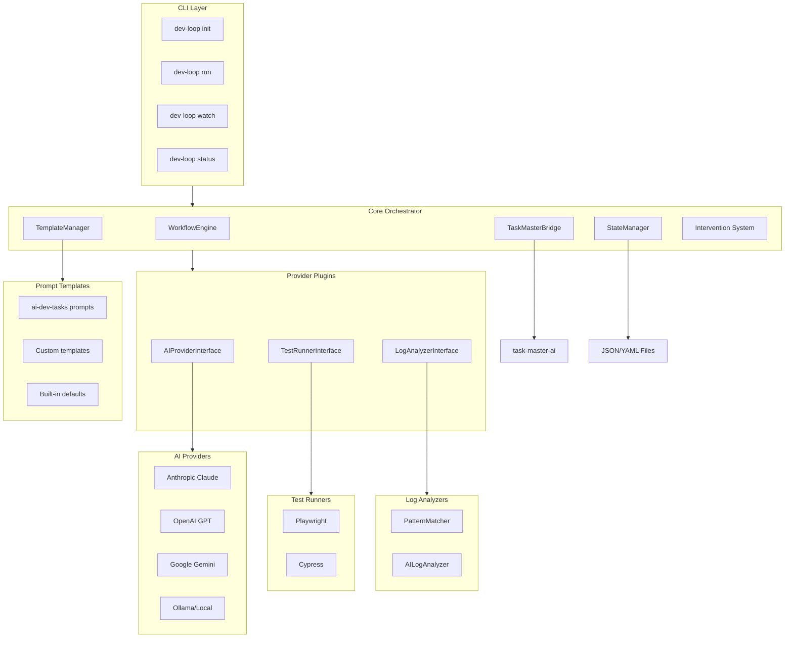
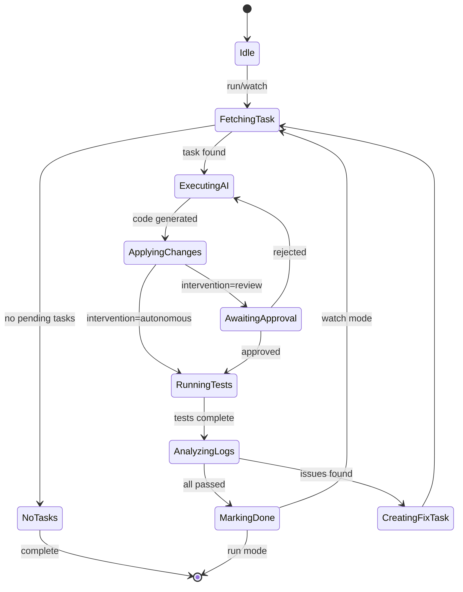

# dev-loop

> Automated Development Workflow Orchestrator

A TypeScript CLI application with daemon mode that wraps `task-master-ai` to orchestrate the PRD-to-validated-code workflow. Supports multiple AI providers, Playwright + Cypress testing, hybrid log analysis, configurable automation levels, and optional integration with [ai-dev-tasks](https://github.com/snarktank/ai-dev-tasks) prompt templates.

## Overview

dev-loop automates the iterative development cycle where **features and tests are built together**:

1. Parse PRD into tasks that bundle feature code + test code together
2. Send each task to the AI provider with context for both implementation AND tests
3. Run tests immediately after code generation
4. Analyze logs for hidden errors
5. Create fix tasks when issues are found
6. Loop until PRD is 100% complete

## Architecture

### System Architecture

The dev-loop system is built with a layered architecture that separates concerns and enables extensibility:



### Workflow Engine State Machine

The core orchestration follows a state machine pattern:



**State Transitions:**
- **Idle** → **FetchingTask**: When `run` or `watch` command is executed
- **FetchingTask** → **ExecutingAI**: When a pending task is found
- **ExecutingAI** → **ApplyingChanges**: After AI generates code
- **ApplyingChanges** → **AwaitingApproval**: In review/hybrid mode for risky operations
- **ApplyingChanges** → **RunningTests**: In autonomous mode or after approval
- **RunningTests** → **AnalyzingLogs**: After test execution completes
- **AnalyzingLogs** → **MarkingDone**: When all tests pass and logs are clean
- **AnalyzingLogs** → **CreatingFixTask**: When issues are detected
- **MarkingDone** → **FetchingTask**: In watch mode (continuous loop)
- **MarkingDone** → **Idle**: In run mode (single iteration)

### Component Architecture

#### Core Components

1. **WorkflowEngine** (`src/core/workflow-engine.ts`)
   - Main orchestration loop implementing the state machine
   - Coordinates all providers and manages task lifecycle
   - Handles error recovery and retry logic
   - Manages state transitions and workflow execution

2. **TaskMasterBridge** (`src/core/task-bridge.ts`)
   - Wrapper around `task-master-ai@0.40.0`
   - Provides unified interface for task CRUD operations
   - Manages task status transitions (pending → in-progress → done)
   - Integrates with task-master-ai CLI or programmatic API

3. **StateManager** (`src/core/state-manager.ts`)
   - Local JSON/YAML file persistence
   - Tracks workflow state across restarts
   - Manages task state and execution history
   - Provides state recovery after interruptions

4. **TemplateManager** (`src/core/template-manager.ts`)
   - Loads prompt templates from multiple sources
   - Supports `builtin`, `ai-dev-tasks`, and `custom` sources
   - Provides PRD and task generation templates
   - Handles template resolution and caching

5. **Intervention System** (`src/core/intervention.ts`)
   - Approval gates for review mode
   - Hybrid mode logic for selective approval
   - Terminal-based approval UI
   - Risk assessment for code changes

#### Provider Interfaces

All providers implement standardized interfaces for pluggability:

1. **AIProvider Interface** (`src/providers/ai/interface.ts`)
   - `generateCode(context, task)`: Generate implementation code
   - `analyzeError(error, context)`: Analyze and suggest fixes
   - `fallback()`: Support for provider fallback chains
   - Implementations: Anthropic, OpenAI, Gemini, Ollama

2. **TestRunner Interface** (`src/providers/test-runners/interface.ts`)
   - `runTests(options)`: Execute test suite
   - `collectArtifacts()`: Gather screenshots, videos, logs
   - `parseResults(output)`: Extract pass/fail status
   - Implementations: Playwright, Cypress

3. **LogAnalyzer Interface** (`src/providers/log-analyzers/interface.ts`)
   - `analyze(logs, context)`: Analyze log content
   - `detectIssues()`: Identify errors and warnings
   - `suggestFixes()`: Provide remediation recommendations
   - Implementations: PatternMatcher, AILogAnalyzer

### High-Level Workflow

```
┌─────────────────────────────────────────────────────────────────────────────┐
│                              PRD (Requirements)                              │
└─────────────────────────────────────────────────────────────────────────────┘
                                      │
                                      ▼
┌─────────────────────────────────────────────────────────────────────────────┐
│                         TASK MASTER (Orchestration)                          │
│  ┌─────────────┐  ┌─────────────┐  ┌─────────────┐  ┌─────────────┐        │
│  │   Task 1    │  │   Task 2    │  │   Task 3    │  │   Task N    │        │
│  │  Feature A  │  │  Feature B  │  │   Test A    │  │   Test B    │        │
│  │  + Test A   │  │  + Test B   │  │   Updates   │  │   Updates   │        │
│  └─────────────┘  └─────────────┘  └─────────────┘  └─────────────┘        │
└─────────────────────────────────────────────────────────────────────────────┘
                                      │
                    ┌─────────────────┼─────────────────┐
                    ▼                 ▼                 ▼
        ┌───────────────────┐ ┌───────────────┐ ┌───────────────────┐
        │    AI AGENT       │ │   AI AGENT    │ │    AI AGENT       │
        │  (Claude/GPT)     │ │ (Claude/GPT)  │ │  (Claude/GPT)     │
        │                   │ │               │ │                   │
        │ Implements:       │ │ Implements:   │ │ Implements:       │
        │ • Feature code    │ │ • Test code   │ │ • Bug fixes       │
        │ • Test code       │ │ • Assertions  │ │ • Test updates    │
        └───────────────────┘ └───────────────┘ └───────────────────┘
                    │                 │                 │
                    └─────────────────┼─────────────────┘
                                      ▼
┌─────────────────────────────────────────────────────────────────────────────┐
│                              CODEBASE                                        │
│  ┌─────────────────────────────┐  ┌─────────────────────────────────────┐  │
│  │      Feature Code           │  │        Playwright Tests              │  │
│  │  • Controllers/Services     │  │  • wizard-validation.spec.ts        │  │
│  │  • Forms/Handlers           │  │  • api-integration.spec.ts          │  │
│  │  • Entity definitions       │  │  • user-workflow.spec.ts            │  │
│  └─────────────────────────────┘  └─────────────────────────────────────┘  │
└─────────────────────────────────────────────────────────────────────────────┘
                                      │
                                      ▼
┌─────────────────────────────────────────────────────────────────────────────┐
│                         VALIDATION LAYER                                     │
│  ┌───────────────────┐  ┌───────────────────┐  ┌───────────────────────┐   │
│  │ PLAYWRIGHT RUNNER │  │  APPLICATION LOGS │  │   SCREENSHOT/VIDEO    │   │
│  │                   │  │                   │  │                       │   │
│  │ • Execute tests   │  │ • PHP errors      │  │ • Step-by-step imgs   │   │
│  │ • Assert results  │  │ • Exceptions      │  │ • Failure captures    │   │
│  │ • Report pass/fail│  │ • Warnings        │  │ • Debug artifacts     │   │
│  └───────────────────┘  └───────────────────┘  └───────────────────────┘   │
└─────────────────────────────────────────────────────────────────────────────┘
                                      │
                          ┌───────────┴───────────┐
                          ▼                       ▼
                   ┌─────────────┐         ┌─────────────┐
                   │    PASS     │         │    FAIL     │
                   │             │         │             │
                   │ Mark task   │         │ Create new  │
                   │ as done     │         │ fix tasks   │
                   └─────────────┘         └─────────────┘
                          │                       │
                          │                       │
                          ▼                       ▼
                   ┌─────────────┐         ┌─────────────┐
                   │ Next task   │         │ AI Agent    │
                   │ in queue    │◄────────│ fixes issue │
                   └─────────────┘         └─────────────┘
                          │
                          ▼
                   ┌─────────────┐
                   │ PRD 100%    │
                   │ COMPLETE    │
                   └─────────────┘
```

### Iterative Development Cycle

The key principle is that **features and their tests are developed together**, not sequentially:

```
┌─────────────────────────────────────────────────────────────────────────────┐
│                    ITERATIVE DEVELOPMENT CYCLE                               │
│                                                                              │
│   ┌──────────┐      ┌──────────┐      ┌──────────┐      ┌──────────┐       │
│   │  TASK 1  │      │  TASK 2  │      │  TASK 3  │      │  TASK N  │       │
│   │          │      │          │      │          │      │          │       │
│   │ Feature  │ ──►  │ Feature  │ ──►  │  Fix     │ ──►  │ Feature  │       │
│   │    +     │      │    +     │      │  Tests   │      │    +     │       │
│   │  Tests   │      │  Tests   │      │    +     │      │  Tests   │       │
│   │          │      │          │      │  Code    │      │          │       │
│   └────┬─────┘      └────┬─────┘      └────┬─────┘      └────┬─────┘       │
│        │                 │                 │                 │              │
│        ▼                 ▼                 ▼                 ▼              │
│   ┌──────────┐      ┌──────────┐      ┌──────────┐      ┌──────────┐       │
│   │  RUN     │      │  RUN     │      │  RUN     │      │  RUN     │       │
│   │  TESTS   │      │  TESTS   │      │  TESTS   │      │  TESTS   │       │
│   └────┬─────┘      └────┬─────┘      └────┬─────┘      └────┬─────┘       │
│        │                 │                 │                 │              │
│        ▼                 ▼                 ▼                 ▼              │
│   ┌──────────┐      ┌──────────┐      ┌──────────┐      ┌──────────┐       │
│   │  PASS ✓  │      │  FAIL ✗  │      │  PASS ✓  │      │  PASS ✓  │       │
│   │          │      │          │      │          │      │          │       │
│   │  Next    │      │  Create  │      │  Next    │      │  PRD     │       │
│   │  Task    │      │  Fix     │      │  Task    │      │  Done!   │       │
│   └──────────┘      │  Task    │      └──────────┘      └──────────┘       │
│                     └──────────┘                                            │
│                          │                                                  │
│                          └──────────► (loops back to fix)                   │
│                                                                              │
└─────────────────────────────────────────────────────────────────────────────┘
```

### Project Structure

```
dev-loop/
├── package.json
├── tsconfig.json
├── .eslintrc.json
├── .prettierrc
├── .gitignore
├── src/
│   ├── index.ts                 # CLI entry point
│   ├── cli/
│   │   ├── commands/
│   │   │   ├── init.ts          # Interactive wizard
│   │   │   ├── run.ts           # Single execution
│   │   │   ├── watch.ts         # Daemon mode
│   │   │   ├── status.ts        # Current state
│   │   │   └── logs.ts          # Log viewing
│   │   └── prompts.ts           # Wizard prompts
│   ├── core/
│   │   ├── workflow-engine.ts   # Main orchestration
│   │   ├── task-bridge.ts       # task-master-ai wrapper
│   │   ├── state-manager.ts     # File persistence
│   │   ├── template-manager.ts  # Template loading
│   │   └── intervention.ts      # Approval gates
│   ├── providers/
│   │   ├── ai/
│   │   │   ├── interface.ts     # AIProvider interface
│   │   │   ├── factory.ts       # Provider factory
│   │   │   ├── anthropic.ts     # Claude provider
│   │   │   ├── openai.ts        # GPT provider
│   │   │   ├── gemini.ts        # Gemini provider
│   │   │   └── ollama.ts        # Local provider
│   │   ├── test-runners/
│   │   │   ├── interface.ts     # TestRunner interface
│   │   │   ├── playwright.ts    # Playwright runner
│   │   │   └── cypress.ts       # Cypress runner
│   │   └── log-analyzers/
│   │       ├── interface.ts     # LogAnalyzer interface
│   │       ├── pattern-matcher.ts  # Regex analysis
│   │       └── ai-analyzer.ts   # AI analysis
│   ├── templates/
│   │   ├── index.ts             # Template registry
│   │   ├── builtin/
│   │   │   ├── create-prd.md    # Basic PRD template
│   │   │   └── generate-tasks.md  # Task generation
│   │   └── ai-dev-tasks/
│   │       ├── create-prd.md    # Bundled prompts
│   │       └── generate-tasks.md  # Bundled prompts
│   ├── config/
│   │   ├── schema.ts            # Zod validation
│   │   ├── loader.ts            # Config loader
│   │   └── defaults.ts          # Default values
│   └── types/
│       └── index.ts              # TypeScript types
├── templates/
│   └── devloop.config.js         # Config template
├── tests/
├── Dockerfile
└── README.md
```

## Design Patterns

### 1. Task Master AI Integration

The project wraps `task-master-ai@0.40.0` through the TaskMasterBridge:
- Uses task-master-ai CLI commands via child processes OR
- Imports and uses task-master-ai programmatically if it exports APIs
- Handles task CRUD operations
- Manages task status transitions (pending → in-progress → done)
- Provides abstraction layer for task management

### 2. AI Provider Pattern

All AI providers implement the `AIProvider` interface:
- Support code generation with context
- Support error analysis and suggestions
- Handle API errors gracefully with retry logic
- Support fallback to another provider
- Implement consistent error handling and rate limiting

**Provider Factory:**
- Registers available providers
- Creates provider instances based on configuration
- Manages fallback chains
- Handles provider-specific configuration

### 3. Test Runner Pattern

Test runners implement the `TestRunner` interface:
- Execute tests via child processes
- Parse output for pass/fail status
- Collect artifacts (screenshots, videos, logs)
- Handle timeouts gracefully
- Support parallel execution
- Provide structured test results

### 4. Log Analysis Pattern

The hybrid log analyzer combines multiple approaches:
- **PatternMatcher**: Fast regex-based detection for known error patterns
- **AILogAnalyzer**: Intelligent analysis for complex issues
- **Hybrid Mode**: Uses pattern matching first, then AI analysis if patterns match or `useAI: true`
- Combines results from both approaches for comprehensive issue detection

### 5. Configuration Pattern

The config system provides:
- Zod-based validation with helpful error messages
- Support for `devloop.config.js` (JavaScript module) and `devloop.config.json` (JSON)
- Merges default config with user config
- Environment variable support via `.env` files
- Type-safe configuration access

### 6. Template System Pattern

Templates are loaded from multiple sources:
- **`builtin`**: Minimal defaults shipped with dev-loop
- **`ai-dev-tasks`**: Bundled prompts from snarktank/ai-dev-tasks repo
- **`custom`**: User-provided templates from `customPath`
- Template resolution follows priority: custom > ai-dev-tasks > builtin
- Supports template caching for performance

### 7. Intervention System Pattern

The intervention system provides three modes:
- **Autonomous**: Fully automated, no human intervention
- **Review**: AI proposes changes, human approves each
- **Hybrid**: Autonomous for safe changes, review for risky operations
- Risk assessment based on change type (delete, schema-change, migration, etc.)
- Terminal-based approval UI with diff preview

### 8. State Management Pattern

StateManager provides:
- Local JSON/YAML file persistence
- Workflow state tracking across restarts
- Task state and execution history
- State recovery after interruptions
- Atomic state updates to prevent corruption

## Configuration

Create a `devloop.config.js` file in your project root:

```javascript
module.exports = {
  // AI Provider configuration
  ai: {
    provider: 'anthropic', // 'anthropic' | 'openai' | 'gemini' | 'ollama'
    model: 'claude-sonnet-4-20250514',
    fallback: 'openai:gpt-4o', // Optional fallback
    apiKey: process.env.ANTHROPIC_API_KEY, // Or set in .env
  },

  // Prompt templates
  templates: {
    source: 'ai-dev-tasks', // 'builtin' | 'ai-dev-tasks' | 'custom'
    customPath: './my-templates/', // Only if source: 'custom'
  },

  // Test runner configuration
  testing: {
    runner: 'playwright', // 'playwright' | 'cypress'
    command: 'npm test',
    timeout: 300000, // 5 minutes
    artifactsDir: 'test-results',
  },

  // Log analysis configuration
  logs: {
    sources: [
      { type: 'file', path: '/var/log/app.log' },
      { type: 'command', command: 'ddev exec tail -100 /var/log/drupal.log' },
    ],
    patterns: {
      error: /Error|Exception|Fatal/i,
      warning: /Warning|Deprecated/i,
    },
    useAI: true, // Enable AI-powered analysis
  },

  // Intervention mode
  intervention: {
    mode: 'autonomous', // 'autonomous' | 'review' | 'hybrid'
    approvalRequired: ['delete', 'schema-change'], // Actions needing approval
  },

  // Task Master integration
  taskMaster: {
    tasksPath: '.taskmaster/tasks/tasks.json',
  },
};
```

## CLI Commands

### Core Commands

```bash
# Initialize project
dev-loop init [--template ai-dev-tasks]

# Run one iteration
dev-loop run

# Run in daemon mode (continuous)
dev-loop watch

# Check current status
dev-loop status

# View/analyze logs
dev-loop logs
```

### Task Master Commands (via wrapper)

```bash
# Initialize Task Master
task-master init

# Parse PRD into tasks
task-master parse-prd --input=prd.md

# View all tasks with progress
task-master list

# Get next task to work on
task-master next

# Show task details
task-master show <id>

# Update task status
task-master set-status --id=<id> --status=<pending|in-progress|done>

# Add new task (feature + test)
task-master add-task --prompt="..." --priority=<high|medium|low>

# Expand task into subtasks
task-master expand --id=<id>

# Update task details
task-master update-task --id=<id> --prompt="..."
```

## Features

- 🤖 **Multi-Provider AI Support**: Anthropic Claude, OpenAI GPT, Google Gemini, Ollama
- 🧪 **Test Runners**: Playwright and Cypress support
- 📊 **Hybrid Log Analysis**: Pattern matching + AI-powered analysis
- 🔄 **Flexible Automation**: Autonomous, review, or hybrid intervention modes
- 📝 **Template System**: Built-in, ai-dev-tasks, or custom prompt templates
- 🔁 **Daemon Mode**: Continuous execution until PRD complete
- 📤 **CI Integration**: JSON, JUnit XML, and Markdown output formats

## Intervention Modes

### Autonomous Mode

Fully automated - no human intervention:

```javascript
intervention: {
  mode: 'autonomous',
}
```

### Review Mode

AI proposes changes, human approves each:

```javascript
intervention: {
  mode: 'review',
}
```

### Hybrid Mode

Autonomous for safe changes, review for risky operations:

```javascript
intervention: {
  mode: 'hybrid',
  approvalRequired: ['delete', 'schema-change', 'migration'],
}
```

## CI Output Formats

dev-loop generates CI-agnostic output formats:

- **`devloop-results.json`** - Structured JSON with all task results, test outcomes, and log analysis
- **`devloop-results.xml`** - JUnit XML format for CI integration (Jenkins, GitHub Actions, etc.)
- **`devloop-summary.md`** - Human-readable markdown summary with progress and issues

## Dependencies

| Package | Purpose | Version |
|---------|---------|---------|
| `task-master-ai` | Task management (wrapped) | ^0.40.0 |
| `commander` | CLI framework | ^11.1.0 |
| `inquirer` | Interactive prompts | ^9.2.12 |
| `zod` | Config validation | ^3.22.4 |
| `@anthropic-ai/sdk` | Claude API | ^0.20.0 |
| `openai` | GPT API | ^4.20.0 |
| `@google/generative-ai` | Gemini API | ^0.2.1 |
| `chalk` | Terminal colors | ^4.1.2 |
| `ora` | Spinners | ^5.4.1 |
| `chokidar` | File watching (daemon) | ^3.5.3 |
| `fs-extra` | File system utilities | ^11.1.1 |
| `yaml` | YAML parsing | ^2.3.4 |

## Installation

```bash
# Install globally
npm install -g dev-loop

# Or use locally
npm install
npm run build
npm start -- --help
```

### Prerequisites

- **Node.js 20+** - Required for Task Master and modern dependencies
- **Task Master AI** - Will be initialized automatically, or install globally: `npm install -g task-master-ai`
- **AI API Key** - Anthropic, OpenAI, or other provider API key
- **Test Framework** - Playwright or Cypress (depending on your config)

### Setup

```bash
# Ensure Node.js 20+ is active
nvm use 20

# Create .env with API key
echo "ANTHROPIC_API_KEY=your_key_here" > .env

# Initialize dev-loop in your project
dev-loop init
```

## Quick Start

### 1. Initialize Project

```bash
# Interactive wizard to create devloop.config.js
dev-loop init

# Or use ai-dev-tasks templates
dev-loop init --template ai-dev-tasks
```

### 2. Parse PRD into Tasks

```bash
# Initialize Task Master (if not already done)
task-master init

# Parse PRD - dev-loop creates both feature AND test tasks
task-master parse-prd --input=path/to/prd.md

# Or manually create feature+test tasks
task-master add-task --prompt="
Implement user login flow with:
- Email/password authentication
- Session management
- Error handling for invalid credentials

Include Playwright tests for:
- Successful login redirects to dashboard
- Invalid credentials shows error message
- Empty fields show validation errors
- Session persists across page reloads
" --priority=high
```

### 3. Run Workflow

```bash
# Run one iteration
dev-loop run

# Run in daemon mode (continuous until PRD complete)
dev-loop watch

# Check current status
dev-loop status
```

## Workflow Steps

dev-loop automates the following workflow:

### Step 1: Parse PRD into Tasks (Features + Tests)

When creating tasks from the PRD, each feature task should include its test:

```bash
# Good: Feature and test together
task-master add-task --prompt="Implement wizard Step 7 Schema.org mapping pre-population.
Include Playwright test that:
1. Navigates to wizard Step 7
2. Verifies Schema.org mappings are auto-populated
3. Checks for success messages
4. Takes screenshots at each verification point"
```

The AI agent then implements **BOTH**:
- The feature code (e.g., `prepopulateSchemaMappings` function)
- The test code (e.g., `wizard-validation.spec.ts` additions)

### Step 2: Expand Complex Tasks

```bash
# Break down into subtasks (both feature and test subtasks)
task-master expand --id=1

# Result:
# 1.1 - Implement login form controller
# 1.2 - Add session management service
# 1.3 - Create login form validation
# 1.4 - Write Playwright login success test
# 1.5 - Write Playwright login failure test
# 1.6 - Write Playwright session persistence test
```

### Step 3: Execute Feature + Test Tasks with AI

dev-loop automatically:
1. Gets the next pending task
2. Sets task status to `in-progress`
3. Calls AI provider with task context
4. Applies generated code changes
5. Runs tests
6. Analyzes logs
7. Marks task as done OR creates fix tasks

### Step 4: Run Tests

Tests are executed automatically, but you can also run manually:

```bash
# Run all tests
npm test

# Run specific test file
npm test -- tests/playwright/login.spec.ts --timeout=300000

# Run with visible browser for debugging
npm test -- --headed
```

### Step 5: Analyze Results and Iterate

dev-loop automatically:
- Checks test results
- Analyzes application logs
- Creates fix tasks when issues are found

You can also check manually:

```bash
# Check test results
ls test-results/*.png

# Check application logs
ddev exec tail -100 /var/log/drupal.log | grep -E "(Error|Exception)"

# View dev-loop logs
dev-loop logs
```

### Step 6: Complete and Move to Next

When tests pass and logs are clean, dev-loop automatically:
- Marks task as `done`
- Fetches next pending task
- Continues until PRD is 100% complete

## Test Evolution Pattern

Tests evolve alongside features:

| Iteration | Feature State | Test State |
|-----------|---------------|------------|
| 1 | Basic implementation | Smoke test - feature loads |
| 2 | Core logic complete | Functional tests - verify behavior |
| 3 | Edge cases handled | Edge case tests added |
| 4 | Bug fixes applied | Regression tests added |
| 5 | Feature complete | Full test coverage |

## Playwright Test Patterns

### Test File Structure

```typescript
// tests/playwright/feature-name.spec.ts
import { test, expect, Page } from '@playwright/test';

test.describe('Feature Name - User Stories', () => {
  test.beforeEach(async ({ page }) => {
    // Setup: login, navigate to starting point
    await login(page);
    await page.goto('/feature-url');
  });

  test('should complete primary user flow', async ({ page }) => {
    // Arrange
    await page.fill('#input-field', 'test value');

    // Act
    await page.click('button:has-text("Submit")');

    // Assert
    await expect(page.locator('.success-message')).toBeVisible();

    // Document
    await takeScreenshot(page, 'primary-flow-success');
  });

  test('should handle error cases', async ({ page }) => {
    // Test error handling
  });

  test('should validate edge cases', async ({ page }) => {
    // Test edge cases
  });
});
```

### Wait Strategies for Drupal/Ajax

```typescript
// Don't use networkidle - Drupal keeps connections alive
await page.waitForLoadState('domcontentloaded').catch(() => {});

// Wait for step transition via button text change
await page.waitForFunction(
  (oldText) => {
    const btn = document.querySelector('button[type="submit"]');
    return btn?.textContent !== oldText;
  },
  buttonText,
  { timeout: 60000 }
);

// Scroll buttons into view for long forms
await button.scrollIntoViewIfNeeded();
await expect(button).toBeVisible({ timeout: 10000 });
```

### Screenshot Debugging

```typescript
async function takeScreenshot(page: Page, name: string) {
  const timestamp = new Date().toISOString().replace(/[:.]/g, '-');
  const path = `test-results/${name}-${timestamp}.png`;
  await page.screenshot({ path, fullPage: true });
  console.log(`📸 Screenshot: ${path}`);
}

// Use liberally throughout tests
await takeScreenshot(page, 'step-1-initial-state');
await page.click('#submit');
await takeScreenshot(page, 'step-2-after-submit');
```

## Common Issues and Fixes

| Issue | Symptom | Fix |
|-------|---------|-----|
| Protected method error | `Call to protected method` in logs | Change method visibility to `public` |
| Test timeout | Test never logs next step | Fix wait strategy, increase timeout |
| Entity not found | `PluginNotFoundException` | Clean orphaned config: `drush config:delete` |
| Form not advancing | Screenshot shows same step | Wait for button text/URL change |
| AI not implementing | Tasks done but no code | Check AI provider API key and config |
| Flaky tests | Intermittent failures | Add explicit waits, retry logic |

## File Structure

```
project/
├── devloop.config.js        # dev-loop configuration
├── .env                     # API keys
├── .taskmaster/
│   ├── config.json          # Task Master configuration
│   ├── tasks/
│   │   └── tasks.json       # All tasks (features + tests)
│   └── ai-responses/        # Saved AI agent responses
├── tests/
│   └── playwright/
│       ├── helpers/
│       │   └── auth.ts      # Shared test utilities
│       ├── feature-a.spec.ts # Feature A tests
│       ├── feature-b.spec.ts # Feature B tests
│       └── integration.spec.ts # Integration tests
├── test-results/            # Screenshots, videos, artifacts
│   ├── devloop-results.json  # Structured results
│   ├── devloop-results.xml   # JUnit XML format
│   └── devloop-summary.md    # Human-readable summary
└── docs/
    ├── workflow.md           # Workflow documentation
    └── prd.md               # Product requirements
```

## Best Practices

1. **Bundle features with tests** - Every feature task includes its tests
2. **Run tests after each change** - Catch regressions immediately
3. **Check logs with every test run** - Surface hidden backend errors
4. **Take screenshots liberally** - Debug failures visually
5. **Create atomic fix tasks** - One issue per task
6. **Use generous timeouts** - Ajax-heavy apps need patience
7. **Verify AI changes** - Check `git diff` after agent runs
8. **Commit working states** - Save progress after each passing test
9. **Iterate incrementally** - Small changes, frequent validation
10. **Document as you go** - Tests serve as living documentation

## Development

```bash
# Install dependencies
npm install

# Build
npm run build

# Watch mode
npm run dev

# Lint
npm run lint

# Format
npm run format

# Test
npm test
```

## Requirements

- Node.js >= 20.0.0
- npm >= 9.0.0

## License

MIT

## See Also

- [HANDOFF.md](./HANDOFF.md) - Implementation handoff document
- [Plan File](./.cursor/plans/dev-loop_node_app_b915e7bc.plan.md) - Detailed implementation plan
- [Original Workflow Documentation](../sysf/docs/workflow.md) - Detailed workflow description
- [AI Dev Tasks](https://github.com/snarktank/ai-dev-tasks) - Prompt templates repository
- [Task Master AI](https://www.npmjs.com/package/task-master-ai) - Task management system
