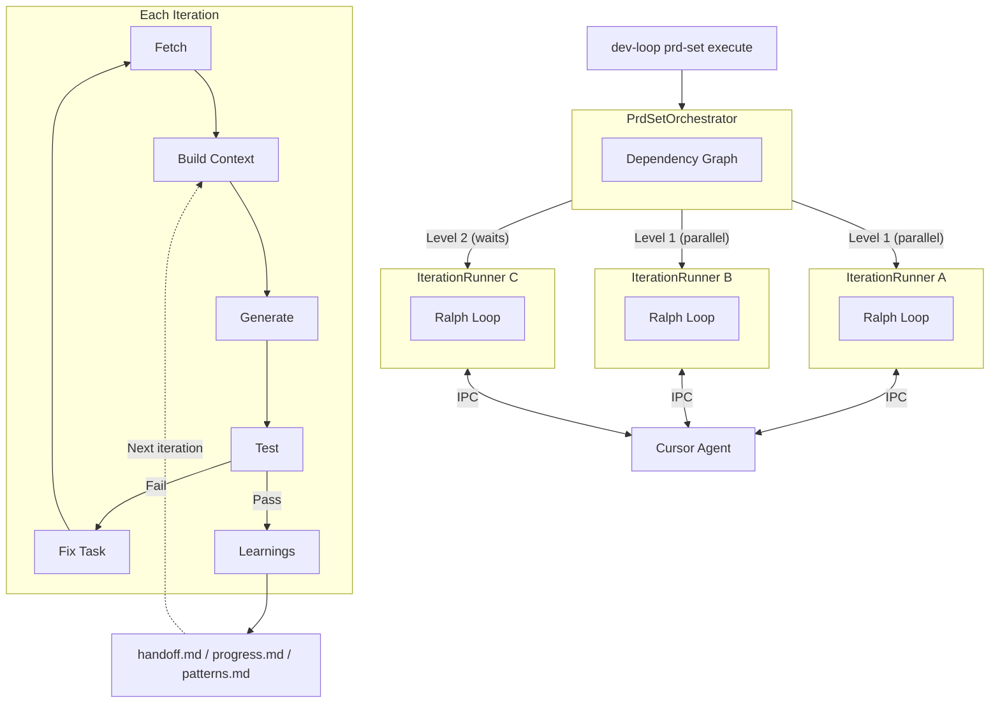

# dev-loop

Autonomous development orchestrator that implements test-driven development in a loop. AI generates code, tests validate it, failures create fix tasks, and the loop continues until all tests pass.

Built on **LangGraph** for workflow orchestration, **LangChain.js** for unified AI provider access, and a Ralph pattern per iteration.

> **AI Agents**: See [`CLAUDE.md`](CLAUDE.md) for quick reference and [`docs/INDEX.md`](docs/INDEX.md) for full documentation.

## Table of Contents

- [Features](#features)
- [Architecture](#architecture)
- [How It Works](#how-it-works)
- [Quick Start](#quick-start)
- [PRD Sets](#prd-sets-parallel-autonomous-execution)
- [Phase Hooks](#phase-hooks)
- [Event System](#event-system)
- [Key Dependencies](#key-dependencies)
- [Ralph Pattern](#fresh-context-pattern)
- [LangGraph Nodes](#langgraph-nodes)
- [AI Providers](#ai-providers)
- [MCP Tools](#for-ai-agents-mcp-tools)
- [CLI Reference](#cli-reference)
- [Framework Plugins](#framework-plugins)
- [Metrics](#metrics)
- [Project Structure](#project-structure)
- [Documentation](#documentation)

## Features

| Category | Feature | Description |
|----------|---------|-------------|
| **Execution** | IterationRunner | Default entry point with Ralph per iteration |
| **Execution** | Parallel PRD Execution | Dependency-aware parallel execution of PRDs within a set |
| **Execution** | Parallel Task Execution | Concurrent task execution within dependency levels |
| **Metrics** | EventMetricBridge | Automatic metrics collection from event stream |
| **Metrics** | Hierarchical Metrics | PRD Set, PRD, Phase, and Task level metrics |
| **Metrics** | Enhanced Metrics | JSON parsing, IPC, file filtering, validation, context, codebase, sessions |
| **Context** | CrossPrdCheckpointer | Shared state coordination across parallel PRDs |
| **Context** | SpecKit Integration | Pre-resolved clarifications, research, and constitution rules |
| **Context** | Context Isolation | Ralph per PRD, per iteration |
| **Hooks** | Phase Hooks | Framework-specific lifecycle hooks (onPhaseStart, onPhaseComplete) |
| **Parsing** | Enhanced JSON Parsing | Multiple strategies: direct, retry, AI fallback, sanitization |
| **Events** | Event Stream | 100+ event types for real-time observability |
| **Testing** | TDD Loop | Complete fetch, context, generate, validate, apply, test, analyze cycle |
| **Learning** | Pattern Learning | Automatic pattern discovery and sharing across PRD sets |
| **Monitoring** | Proactive Monitoring | Event-based intervention system with automated fixes |

## Architecture



Key aspects:
- **Parallel PRD execution**: Level 1 PRDs run concurrently, Level 2 waits for dependencies
- **Ralph per iteration**: Each IterationRunner maintains isolated context
- **IPC coordination**: Bidirectional communication with Cursor agent
- **State persistence**: Learnings flow to files, read on next iteration

## How It Works

dev-loop runs a TDD loop where each iteration:

1. **Fetches a task** from Task Master
2. **Builds context** from codebase, SpecKit, and handoff state
3. **Generates code** via LangChain.js (6 AI providers supported)
4. **Validates syntax** before applying changes
5. **Applies changes** to the filesystem
6. **Runs tests** (Playwright/Cypress)
7. **On failure**: Analyzes errors, creates fix task, loops back
8. **On success**: Captures learnings, executes phase hooks, proceeds to next task

The **IterationRunner** creates fresh AI context each iteration to prevent context pollution. State persists to files (`handoff.md`, `progress.md`) instead of accumulating in the AI's context window.

The **EventMetricBridge** automatically collects metrics from the event stream, providing hierarchical observability at PRD Set, PRD, Phase, and Task levels.

## Quick Start

```bash
# Configure AI provider
echo "ANTHROPIC_API_KEY=sk-ant-..." > .env

# Initialize
dev-loop init && task-master init

# Execute PRD set (loop behavior determined by PRD set schema)
dev-loop prd-set execute .taskmaster/planning/my-feature/

# Single iteration (for debugging)
dev-loop run
```

## PRD Sets: Parallel Autonomous Execution

For large-scope development, dev-loop supports **PRD sets** - collections of related PRDs executed in parallel with dependency-aware scheduling.

**PRD Set structure**:

```
.taskmaster/planning/my-feature/
├── index.md.yml          # Manifest with dependencies
├── api-layer.md          # PRD 1
├── data-model.md         # PRD 2 (depends on api-layer)
├── ui-components.md      # PRD 3 (parallel with data-model)
└── .speckit/             # Autonomous context
    ├── clarifications.json   # Resolved design decisions
    ├── research.json         # Codebase research findings
    └── constitution.json     # Project rules/patterns
```

**PrdSetOrchestrator** builds a dependency graph and executes PRDs in levels:
- **Level 1**: Independent PRDs run in parallel (fresh IterationRunner per PRD)
- **Level 2+**: PRDs wait for their dependencies to complete
- **CrossPrdCheckpointer** coordinates shared state across parallel PRDs

**SpecKit** enables fully autonomous execution by pre-resolving:
- **Clarifications**: Design decisions answered before execution
- **Research**: Codebase findings (existing patterns, APIs, conventions)
- **Constitution**: Project rules from `.cursorrules` or similar

## Phase Hooks

Phase hooks enable framework-specific actions at phase boundaries:

```yaml
# In phase YAML file
hooks:
  onPhaseComplete:
    - type: cli_command
      cliCommand: module-enable
      args:
        module: my_module
      description: Enable module after Phase 1 completes
```

**PhaseHookExecutor** executes hooks when phases complete:
- **cli_command**: Framework-specific CLI commands (Drupal drush, Django manage.py)
- **shell**: Arbitrary shell commands
- **callback**: Custom callback functions

Supported framework commands:
- **Drupal**: `module-enable`, `cache-rebuild`, `config-import`
- **Django**: `migrate`, `collectstatic`
- **React**: `build`, `test`

## Event System

dev-loop emits 100+ event types for real-time observability:

| Category | Events |
|----------|--------|
| Task Lifecycle | `task:started`, `task:completed`, `task:failed`, `task:blocked` |
| Code Generation | `code:generated`, `code:generation_failed` |
| Testing | `test:passed`, `test:failed`, `test:stalled` |
| JSON Parsing | `json:parse_success`, `json:parse_failed`, `json:ai_fallback_success` |
| Phase/PRD | `phase:started`, `phase:completed`, `prd:started`, `prd:completed` |
| Hooks | `hook:started`, `hook:completed`, `hook:failed` |
| Patterns | `pattern:learned`, `pattern:matched`, `pattern:injected` |
| Intervention | `intervention:triggered`, `intervention:successful`, `intervention:failed` |

**EventMetricBridge** subscribes to these events and automatically updates hierarchical metrics at PRD Set, PRD, Phase, and Task levels.

## Key Dependencies

| Package | Role in TDD Loop |
|---------|------------------|
| `@langchain/langgraph` | 10-node workflow StateGraph with conditional edges and file-based checkpointing |
| `@langchain/core` | Unified interface for all AI providers |
| `@langchain/anthropic` | Claude models for code generation |
| `zod` | Type-safe structured output from AI (code changes, analysis) |
| `fastmcp` | MCP server exposing dev-loop tools to outer AI agents |
| `task-master-ai` | Task management, PRD parsing, dependency tracking |

## Ralph Pattern

Long-running AI sessions accumulate errors. The Ralph pattern solves this:

- **New context each iteration**: IterationRunner creates new LangGraph workflow per iteration
- **State in files**: `handoff.md` captures current state, `progress.md` logs history
- **Pattern learning**: Discoveries with 3+ occurrences promote to `learned-patterns.md`
- **Crash recovery**: LangGraph checkpoints in `.devloop/checkpoints/`
- **Cross-PRD coordination**: CrossPrdCheckpointer shares state across parallel PRDs

## LangGraph Nodes

| Node | TDD Role |
|------|----------|
| `fetchTask` | Get next pending task(s) from Task Master |
| `buildContext` | Gather relevant code context for AI |
| `generateCode` | AI code generation via LangChainProvider |
| `validateCode` | Pre-apply syntax/lint validation |
| `applyChanges` | Write code changes to files |
| `runTests` | Execute test suite (the "T" in TDD) |
| `analyzeFailure` | AI analysis of test failures |
| `createFixTask` | Create fix task (loops back for retry) |
| `suggestImprovements` | Escalate on repeated failures |
| `captureLearnings` | Persist learnings to files |

Each node emits events to the event stream, enabling automatic metrics collection via EventMetricBridge.

## AI Providers

All providers use LangChain.js with Zod schemas for structured output:

| Provider | Package | Notes |
|----------|---------|-------|
| Anthropic | `@langchain/anthropic` | Recommended (claude-sonnet-4) |
| OpenAI | `@langchain/openai` | gpt-4o, gpt-4-turbo |
| Azure OpenAI | `@langchain/openai` | Enterprise Azure deployments |
| Google Gemini | `@langchain/google-genai` | gemini-1.5-pro, gemini-2.0-flash |
| Ollama | `@langchain/ollama` | Local models (llama3.1, codellama) |
| Cursor | Custom adapter | IDE integration |
| Amp | Custom adapter | ampcode.com CLI agent |

### Azure OpenAI Configuration

For Azure OpenAI, set these environment variables:

```bash
AZURE_OPENAI_API_KEY=<your-api-key>
AZURE_OPENAI_ENDPOINT=https://<resource-name>.openai.azure.com/
AZURE_OPENAI_API_VERSION=2024-02-15-preview
AZURE_OPENAI_DEPLOYMENT_NAME=gpt-4
```

Then configure in `devloop.config.js`:

```javascript
module.exports = {
  ai: {
    provider: 'azure',
    model: 'gpt-4',  // Your deployment name
  },
};
```

## For AI Agents: MCP Tools

dev-loop exposes ~50 MCP tools for outer agent integration:

```json
{ "mcpServers": { "dev-loop": { "command": "dev-loop-mcp" } } }
```

| Category | Example Tools |
|----------|---------------|
| Core | `get_task`, `complete_task`, `get_pending_tasks` |
| Control | `pause_execution`, `resume_execution`, `stop` |
| Debug | `get_logs`, `analyze_error`, `get_state` |
| Playwright | `run_test`, `get_test_results` |
| Events | `subscribe_events` (real-time workflow observability) |
| Metrics | `devloop_metrics_summary`, `devloop_metrics_json_parsing` |
| Monitoring | `devloop_event_monitor_start`, `devloop_event_monitor_status` |

## CLI Reference

| Command | Purpose |
|---------|---------|
| `dev-loop prd-set execute <path>` | Execute PRD set (primary method) |
| `dev-loop run` | Single iteration (debugging) |
| `dev-loop status` | Current state |
| `dev-loop logs -f` | Follow logs |
| `dev-loop pause` / `resume` / `stop` | Workflow control |

## Framework Plugins

Auto-detected plugins inject framework-specific context and CLI commands:

| Framework | Detection | Provides |
|-----------|-----------|----------|
| Drupal | `composer.json` with drupal/core | Module patterns, config schema, drush commands |
| Django | `manage.py` | App structure, migrations, manage.py commands |
| React | `package.json` with react | Component patterns, hooks, npm scripts |
| Browser Extension | `manifest.json` | Content scripts, messaging |

## Metrics

dev-loop collects hierarchical metrics at multiple levels:

| Level | Metrics |
|-------|---------|
| PRD Set | Total PRDs, completion rate, execution levels, aggregate timing/tokens |
| PRD | Phases, tasks, success rate, timing, tokens, feature metrics |
| Phase | Tasks, validation gates, hooks executed |
| Task | Duration, tokens, retries, JSON parse attempts, files changed |

Enhanced metrics categories:
- **JSON Parsing**: Success by strategy (direct, retry, AI fallback, sanitized)
- **IPC**: Connection health, retries, latency
- **File Filtering**: Boundary violations, predictive filtering
- **Validation**: Gate success rates, error categories
- **Context**: Search operations, window utilization
- **Sessions**: Session health, history management

## Project Structure

```
.devloop/
├── checkpoints/        # LangGraph crash recovery
├── handoff.md          # Current iteration context (Ralph pattern)
├── progress.md         # Iteration history
├── learned-patterns.md # Discovered patterns
└── metrics.json        # Hierarchical metrics

.taskmaster/
├── tasks.json          # Task list
└── planning/           # PRD sets
```

## Documentation

> **AI Agents**: Start with [docs/INDEX.md](docs/INDEX.md) for discovery. All docs include YAML frontmatter with `title`, `description`, `category`, `keywords`, and `related` fields for navigation.

### User Guides

- [User Guide](docs/users/README.md) - Complete user documentation
- [Configuration](docs/users/CONFIG.md) - Configuration reference
- [PRD Building](docs/users/PRD_BUILDING.md) - Creating PRD sets
- [Phase Hooks](docs/users/PHASE_HOOKS.md) - Framework lifecycle hooks
- [Metrics](docs/users/METRICS.md) - Metrics and cost tracking
- [Reports](docs/users/REPORTS.md) - Report generation
- [Patterns](docs/users/PATTERNS.md) - Pattern learning system
- [Archive](docs/users/ARCHIVE.md) - State archival

### AI Agent Integration

- [AI Agent Guide](docs/ai/README.md) - For AI agents creating PRDs
- [PRD Schema](docs/ai/PRD_SCHEMA.md) - PRD file format
- [PRD Template](docs/ai/PRD_TEMPLATE.md) - PRD templates
- [PRD Features](docs/ai/PRD_FEATURES.md) - Available PRD features
- [State Management](docs/ai/STATE_MANAGEMENT.md) - State file formats

### Contributing

- [Architecture](docs/contributing/ARCHITECTURE.md) - Codebase structure
- [Contribution Mode](docs/contributing/CONTRIBUTION_MODE.md) - Two-agent development
- [Event Streaming](docs/contributing/EVENT_STREAMING.md) - Event system guide
- [Proactive Monitoring](docs/contributing/PROACTIVE_MONITORING.md) - Automated interventions
- [Boundary Enforcement](docs/contributing/BOUNDARY_ENFORCEMENT.md) - Module boundaries
- [Quick Start](docs/contributing/QUICK_START.md) - Getting started contributing

### Troubleshooting

- [JSON Parsing](docs/troubleshooting/json-parsing.md) - JSON extraction issues
- [Patterns](docs/troubleshooting/patterns.md) - Pattern matching issues
- [Cursor Integration](docs/CURSOR_INTEGRATION.md) - Cursor IDE integration

## See Also

- [LangGraph](https://langchain-ai.github.io/langgraph/) - Workflow orchestration
- [LangChain.js](https://js.langchain.com/) - AI model interface
- [Task Master AI](https://www.npmjs.com/package/task-master-ai) - Task management
- [Model Context Protocol](https://modelcontextprotocol.io/) - AI tool integration

## License

MIT
