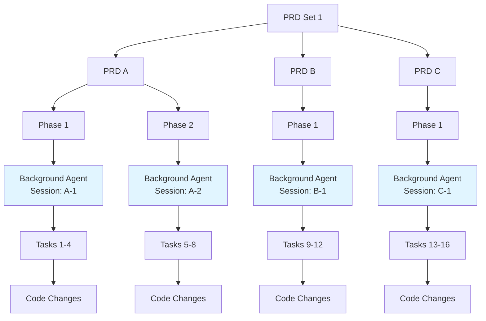

# Cursor Integration Guide

Complete guide to dev-loop's Cursor integration, including background agent execution, session management, parallel execution, timeout handling, retry logic, and JSON parsing.

## Overview

Dev-loop uses Cursor background agents (headless execution via `cursor agent --print`) as the primary method for autonomous code generation. This enables:

- **Background agent execution** - Headless, autonomous code generation using `cursor agent --print` mode
- **Session persistence** - Context and conversation history maintained across tasks
- **100% automated execution** - No manual intervention required
- **Parallel execution support** - Multiple PRD sets and phases execute simultaneously with isolated sessions
- **Optional observability** - Visible agent configs and chat requests can be created for monitoring (optional, non-blocking)
- **Timeout handling** - Configurable timeouts with progressive extension
- **Retry logic** - Automatic retries with strict JSON prompts on failure
- **Enhanced JSON parsing** - Robust extraction from various response formats

**Primary Execution Flow**: Background agents execute headlessly and return code changes via structured JSON output. Visible chats are optional and only created for observability when `createObservabilityChats` is enabled.

## Background Agent Execution (Primary)

The primary execution path uses Cursor background agents (`cursor agent --print`) for headless, autonomous code generation:

- **Direct execution** - Background agents run headlessly and return code changes via stdout
- **Session management** - Each PRD/phase combination maintains its own session for context persistence
- **JSON parsing** - Robust parsing extracts code changes from structured JSON responses
- **No visible chats** - Execution is completely headless (no IDE interaction required)

### Configuration

```javascript
cursor: {
  requestsPath: 'files-private/cursor',
  agentName: 'DevLoopCodeGen',
  model: 'auto',
  agents: {
    enabled: true,                    // Enable agent auto-generation
    autoGenerate: true,               // Automatically generate agent configs
    agentsPath: '.cursor/agents',     // Path to agent config files
    chatRequestsPath: 'files-private/cursor/chat-requests.json',
    chatInstructionsPath: 'files-private/cursor/chat-instructions',
    defaultMode: 'Ask',               // Default chat mode (Ask, Chat, Compose)
    autoProcess: true,                // Auto-process in watch mode
    watchMode: true,                  // Enable file watching
    processInterval: 2000,            // Polling interval (ms)
    useBackgroundAgent: true,         // Use --print mode for headless operation
    agentOutputFormat: 'json',        // Output format: 'json', 'text', 'stream-json'
    createObservabilityChats: false,  // Optional: Create visible chats for monitoring
    backgroundAgentTimeout: 300000,   // Timeout in ms (default: 5 minutes)
    sessionManagement: {
      enabled: true,                  // Enable session persistence (default: true)
      maxSessionAge: 3600000,         // Max session age in ms (default: 1 hour)
      maxHistoryItems: 50,            // Max history entries per session (default: 50)
      sessionsPath: '.devloop/cursor-sessions.json', // Session storage path
    },
  },
}
```

## Reliability Features

### Timeout Handling

Background agents have configurable timeouts:
- **Default timeout**: 5 minutes (configurable via `config.cursor.agents.backgroundAgentTimeout`)
- **Progressive timeout extension**: Timeout extends automatically on activity detection (up to max timeout)
- **Heartbeat monitoring**: Detects idle processes and triggers timeout if no activity
- **Timeout error handling**: Graceful handling of timeout errors with clear messages

**Configuration:**
```javascript
cursor: {
  agents: {
    backgroundAgentTimeout: 300000, // 5 minutes in milliseconds
  }
}
```

### Retry Logic

Cursor provider includes automatic retry logic:
- **Default attempts**: 3 attempts (initial attempt + 2 retries)
- **Strict JSON prompts**: Retries use stricter JSON prompts to improve success rate
- **Enhanced JSON extraction**: Robust parsing handles various response formats
- **"Already complete" detection**: Recognizes when tasks are already complete without explicit code changes

**Retry Flow:**
1. Initial attempt with standard prompt
2. On failure, retry with strict JSON prompt
3. On second failure, final retry with strictest JSON prompt
4. After 3 failures, throw error (unless fallback enabled)

### Enhanced JSON Parsing

Dev-loop uses a robust JSON parsing strategy to extract code changes from Cursor background agent responses:

**Parsing Strategy:**
1. **Raw JSON first**: Attempts to parse JSON without modification (JSON should already be valid)
2. **Double-escaping detection**: Only unescapes when double-escaping is detected (e.g., `\\\\n` → `\\n`)
3. **Multiple extraction strategies**:
   - JSON code blocks (```json ... ```)
   - CodeChanges structure in text
   - Files key extraction with brace counting
   - Triple-escaped JSON handling
4. **"Already complete" detection**: Recognizes completion messages without explicit CodeChanges JSON

**Key Improvements:**
- **Fixed control character errors**: No longer incorrectly unescapes valid JSON escape sequences
- **Better error handling**: Detailed logging with context snippets for debugging
- **Shared parser utility**: Centralized parsing logic in `cursor-json-parser.ts` for consistency
- **Prefix stripping**: Automatically removes prefixes like "Here is the JSON:"

**Architecture:**
```
CursorProvider
  └─> CursorChatOpener
       ├─> CursorSessionManager (session persistence)
       └─> cursor-json-parser (shared JSON parsing)
```

The refactored architecture eliminates code duplication by centralizing JSON parsing logic in a shared utility module used by both `CursorProvider` and `CursorChatOpener`.

## Session Management

Background agents maintain context between calls using session management:

- **Automatic session creation**: Sessions are created per PRD/phase combination
- **Conversation history**: Previous prompts and responses are included in context
- **Context window continuity**: Agents can build on previous interactions
- **Session statistics**: Track success rates, JSON parsing errors, and call counts
- **History pruning**: History is automatically pruned based on `maxHistoryItems` config

**Configuration:**
```javascript
cursor: {
  agents: {
    sessionManagement: {
      enabled: true,              // Enable session persistence
      maxSessionAge: 3600000,     // 1 hour (milliseconds)
      maxHistoryItems: 50,        // Max conversation history entries
      sessionsPath: '.devloop/cursor-sessions.json',
    },
  },
}
```

**How it works:**
1. First task in a PRD/phase creates a new session
2. Subsequent tasks in the same PRD/phase resume the session
3. Conversation history is included in prompts for context
4. Sessions are automatically cleaned up after `maxSessionAge`
5. Statistics are tracked per session (calls, errors, JSON parsing failures)

**Session Boundary Specifications:**
- **Parallel tasks**: Separate sessions with optional shared base context
- **Fix tasks**: Reuse original task's session with appended history
- **Cross-PRD dependencies**: Isolated sessions with selective context injection
- **Context snapshotting**: Module-scoped file system state snapshot at task start

See [`docs/contributing/ARCHITECTURE.md`](contributing/ARCHITECTURE.md) for detailed session management architecture.

## Parallel Execution

The system fully supports parallel execution of multiple PRD sets and phases:

- **Unique agent names** prevent conflicts during parallel execution
- **Concurrent processing** - Multiple background agents execute simultaneously
- **Context tracking** - Each agent request includes PRD/phase/task context for tracking
- **Isolated sessions** - Each PRD/phase gets its own session for context isolation
- **Context snapshotting** - File system state is snapshotted at task start to prevent race conditions

### How It Works

When multiple PRD sets or phases execute in parallel:

1. **Unique Agent Names**: Each PRD/phase/task gets a unique agent name
   - Format: `DevLoop-[Set-{prdSetId}]-PRD-{prdId}-Phase-{phaseId}-Task-{taskId}`
   - Example: `DevLoop-Set-1-PRD-api-spec-Phase-2-Task-123`

2. **Isolated Sessions**: Each PRD/phase gets its own background agent session
   - Sessions execute headlessly with no IDE interaction
   - Each session maintains separate context and history
   - Sessions are tracked independently via session management

3. **Concurrent Execution**: Multiple background agents execute simultaneously
   - Each PRD/phase runs its background agent independently
   - No blocking between sessions
   - All sessions return code changes in parallel

4. **Context Snapshotting**: Context is snapshotted at task start
   - Prevents seeing files created by parallel tasks
   - Module-scoped (only files in `docroot/modules/share/{module}/`)
   - Live updates are disabled during parallel execution

### Parallel Execution Diagram



**Execution Flow**:
1. PRD Set 1 starts execution
2. PRDs A, B, and C execute in parallel
3. Each PRD's phases execute sequentially within that PRD
4. Each phase uses a background agent session (e.g., Session A-1 for PRD A Phase 1)
5. Tasks within each phase execute sequentially, sharing the same session
6. All background agents run headlessly and return code changes independently

**Result**: Multiple background agent sessions execute in parallel, each maintaining its own context and history, with no visible IDE interaction required.

## Optional Observability

When `createObservabilityChats` is enabled, dev-loop can optionally create visible agent configs and chat requests for monitoring:

- **Agent configs** - Generated in `.cursor/agents/` for visibility in Cursor IDE
- **Chat requests** - Created in `files-private/cursor/chat-requests.json` (optional, for observability only)
- **Auto-processing** - Chat auto-processor (when watch mode is running) processes requests to create instruction files
- **Non-blocking** - Observability chat creation runs in parallel and doesn't block primary execution

**Note**: Observability chats are optional and non-blocking. Primary execution uses background agents and doesn't require visible chats.

## IDE Composer Integration (Alternative)

Dev-loop also supports IDE composer integration for manual interaction:

- **Prompt files** - Creates `.prompt.md` files for copy-paste to Cursor's composer (Cmd+L)
- **Keyboard automation** - Optional macOS automation to trigger Cursor composer
- **Manual processing** - Alternative to background agent execution

**Configuration:**
```javascript
cursor: {
  agents: {
    preferIdeChat: false,  // Default: false (use background agents)
    keyboardAutomation: false,  // Enable macOS keyboard automation
    promptFileFormat: 'markdown',  // Format for prompt files
  }
}
```

**Usage:**
- Set `preferIdeChat: true` to use IDE composer instead of background agents
- Requires manual copy-paste into Cursor composer
- Useful for debugging or manual review

See [`docs/CURSOR_CHAT_AUTOMATION.md`](CURSOR_CHAT_AUTOMATION.md) (deprecated) for legacy IDE composer documentation. Background agent execution is now the primary method.

## Configuration Options

| Option | Type | Default | Description |
|--------|------|---------|-------------|
| `enabled` | boolean | `true` | Enable agent auto-generation and chat request system |
| `autoGenerate` | boolean | `true` | Automatically generate agent config files |
| `agentsPath` | string | `.cursor/agents` | Path to agent config files directory |
| `chatRequestsPath` | string | `files-private/cursor/chat-requests.json` | Path to chat requests JSON file |
| `chatInstructionsPath` | string | `files-private/cursor/chat-instructions` | Path to chat instruction files directory |
| `defaultMode` | enum | `'Ask'` | Default chat mode: `'Ask'`, `'Chat'`, or `'Compose'` |
| `autoProcess` | boolean | `true` | Auto-process chat requests in watch mode |
| `watchMode` | boolean | `true` | Enable file watching for new chat requests |
| `processInterval` | number | `2000` | Polling interval in milliseconds |
| `useBackgroundAgent` | boolean | `true` | Use background agent execution (--print mode) |
| `agentOutputFormat` | enum | `'json'` | Output format: `'json'`, `'text'`, `'stream-json'` |
| `createObservabilityChats` | boolean | `false` | Create visible chats for observability (optional) |
| `backgroundAgentTimeout` | number | `300000` | Timeout in milliseconds (default: 5 minutes) |
| `sessionManagement` | object | See below | Session persistence configuration |
| `preferIdeChat` | boolean | `false` | Use IDE composer instead of background agents |
| `keyboardAutomation` | boolean | `false` | Enable macOS keyboard automation |

### Session Management Configuration

```javascript
cursor: {
  agents: {
    sessionManagement: {
      enabled: true,                    // Enable session persistence (default: true)
      maxSessionAge: 3600000,           // Max session age in milliseconds (default: 1 hour)
      maxHistoryItems: 50,              // Max items in session history (default: 50)
      sessionsPath: '.devloop/cursor-sessions.json', // Path to session store
    },
  },
}
```

## Usage

### Automatic Execution (Recommended)

1. **Enable agents in config**:
   ```javascript
   cursor: {
     agents: {
       enabled: true,
       autoProcess: true,
       useBackgroundAgent: true,
     }
   }
   ```

2. **Start watch mode**:
   ```bash
   dev-loop watch
   ```

3. **Dev-loop automatically**:
   - Executes tasks using background agents (headless, primary execution)
   - Optionally generates observability agent configs (if `createObservabilityChats: true`)
   - Optionally creates chat requests for observability (if enabled)
   - Auto-processes observability requests via background service (if watch mode running)

### Validation

Test the setup with the validation command:

```bash
dev-loop validate-cursor-agents
```

This command:
- Generates 3 test observability agent configs (for testing)
- Creates 3 observability chat requests (for testing)
- Auto-processes all observability requests
- Verifies files are created correctly
- Note: Primary execution uses background agents, not these test configs

## MCP Tools

The following MCP tools are available for managing background agents and observability chats:

- `devloop_background_agent_status()` - Query session state and statistics
- `devloop_logs(analyze: true)` - Get categorized background agent errors
- `devloop_metrics()` - View execution metrics including background agent operations
- `cursor_chat_list_requests()` - List pending observability chat requests
- `cursor_chat_auto_process_all()` - Process all pending observability requests
- `cursor_agent_list()` - List all available agent config files

## Troubleshooting

### Timeout Errors

If you encounter timeout errors:

1. **Check timeout configuration**:
   ```javascript
   cursor: {
     agents: {
       backgroundAgentTimeout: 600000, // Increase to 10 minutes if needed
     }
   }
   ```

2. **Review task complexity**: Complex tasks may need longer timeouts
3. **Check activity detection**: Timeout extends automatically on activity, check if activity is being detected
4. **Review logs**: Check dev-loop logs for timeout warnings

### Retry Failures

If all retry attempts fail:

1. **Check JSON parsing errors**: Review session statistics for JSON parsing error patterns
2. **Review logs**: Check dev-loop logs for detailed retry failure messages
3. **Check prompt size**: Large prompts may cause issues, check token usage
4. **Verify model**: Ensure Cursor Auto model is working correctly

### JSON Parsing Errors

If you encounter JSON parsing errors:

1. **Check Session Statistics**:
   - Use `devloop_background_agent_status()` MCP tool to view JSON parsing error counts
   - Review session statistics for patterns in failures

2. **Verify Response Format**:
   - Background agents should return JSON code blocks (```json ... ```)
   - Ensure the response includes both `files` array and `summary` field

3. **Review Logs**:
   - Check dev-loop logs for detailed parsing error messages
   - Look for context snippets in error logs to identify problematic JSON

4. **Parser Strategy**:
   - The parser tries multiple strategies: raw JSON, double-escaping detection, multiple regex patterns
   - Most errors are automatically handled by the robust parsing logic

5. **Session History**:
   - If parsing fails consistently, check if session history is causing issues
   - Try disabling `persistHistory` temporarily to isolate the issue

The shared JSON parser (`cursor-json-parser.ts`) handles various edge cases automatically, including:
- Control characters in code content (newlines, tabs)
- Double-escaped JSON strings
- Triple-escaped JSON strings
- Multiple JSON extraction strategies
- "Already complete" response detection
- Prefix stripping ("Here is the JSON:", etc.)
- Detailed error logging for debugging

For detailed JSON response format requirements and additional troubleshooting guidance, see [`docs/troubleshooting/json-parsing.md`](../troubleshooting/json-parsing.md).

### Background Agent Hanging

If background agents hang:

1. **Check timeout**: Ensure `backgroundAgentTimeout` is configured appropriately
2. **Kill hanging processes**: Use `pkill -f "cursor.*agent"` to terminate hanging processes
3. **Archive state**: Run `npx dev-loop archive` to clean up state files and kill hanging processes
4. **Review logs**: Check dev-loop logs for timeout warnings or errors

### Session Issues

If sessions are not persisting:

1. **Check session management config**: Verify `sessionManagement.enabled` is `true`
2. **Check session file**: Verify `.devloop/cursor-sessions.json` exists and is writable
3. **Review session statistics**: Use `devloop_background_agent_status()` to check session state
4. **Check session age**: Sessions are cleaned up after `maxSessionAge`, verify config

## Best Practices

1. **Use background agents**: Primary execution method, fully automated and headless
2. **Configure timeouts**: Set appropriate timeouts based on task complexity
3. **Monitor retries**: Review retry statistics to identify problematic patterns
4. **Use session management**: Enable session persistence for better context continuity
5. **Enable observability selectively**: Only enable `createObservabilityChats` if you need monitoring
6. **Archive regularly**: Use `npx dev-loop archive` to clean up state files and hanging processes
7. **Review metrics**: Check parallel execution metrics to optimize concurrency

## Related Documentation

- [`docs/contributing/ARCHITECTURE.md`](contributing/ARCHITECTURE.md) - Session management and parallel execution architecture
- [`HANDOFF_CURSOR_AI_PROVIDER.md`](../HANDOFF_CURSOR_AI_PROVIDER.md) - Implementation handoff document
- [`docs/users/METRICS.md`](users/METRICS.md) - Parallel execution metrics
- [`docs/users/REPORTS.md`](users/REPORTS.md) - Parallel execution analysis in reports


