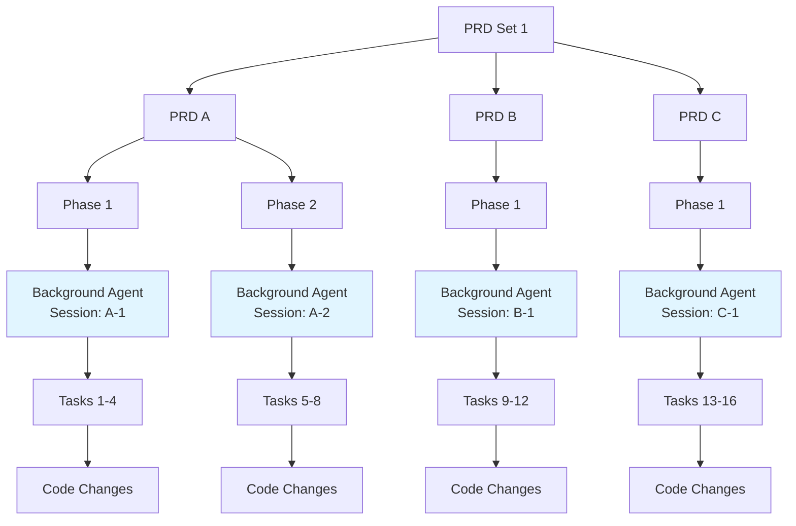

# Cursor Multi-Agent Integration

This document describes how to configure and use dev-loop's Cursor multi-agent capabilities, including automatic agent generation, chat request system, and 100% automated execution.

## Overview

Dev-loop uses Cursor background agents (headless execution via `cursor agent --print`) as the primary method for autonomous code generation. This enables:

- **Background agent execution** - Headless, autonomous code generation using `cursor agent --print` mode
- **Session persistence** - Context and conversation history maintained across tasks
- **100% automated execution** - No manual intervention required
- **Parallel execution support** - Multiple PRD sets and phases execute simultaneously with isolated sessions
- **Optional observability** - Visible agent configs and chat requests can be created for monitoring (optional, non-blocking)

**Primary Execution Flow**: Background agents execute headlessly and return code changes via structured JSON output. Visible chats are optional and only created for observability when `createObservabilityChats` is enabled.

## Features

### Agent Auto-Generation

Dev-loop automatically generates agent configuration files in `.cursor/agents/` when code generation tasks are executed. Each agent is uniquely named based on PRD/phase/task context:

- Format: `DevLoop-[Set-{prdSetId}]-PRD-{prdId}-Phase-{phaseId}-Task-{taskId}`
- Example: `DevLoop-Set-1-PRD-api-spec-Phase-2-Task-123`

### Background Agent Execution (Primary)

The primary execution path uses Cursor background agents (`cursor agent --print`) for headless, autonomous code generation:

- **Direct execution** - Background agents run headlessly and return code changes via stdout
- **Session management** - Each PRD/phase combination maintains its own session for context persistence
- **JSON parsing** - Robust parsing extracts code changes from structured JSON responses
- **No visible chats** - Execution is completely headless (no IDE interaction required)

### Observability Chats (Optional)

When `createObservabilityChats` is enabled, dev-loop can optionally create visible agent configs and chat requests for monitoring:

- **Agent configs** - Generated in `.cursor/agents/` for visibility in Cursor IDE
- **Chat requests** - Created in `files-private/cursor/chat-requests.json` (optional, for observability only)
- **Auto-processing** - Chat auto-processor (when watch mode is running) processes requests to create instruction files
- **Non-blocking** - Observability chat creation runs in parallel and doesn't block primary execution

### Parallel Execution

The system fully supports parallel execution of multiple PRD sets and phases:

- **Unique agent names** prevent conflicts during parallel execution
- **Concurrent processing** - multiple chat requests processed simultaneously using Promise.all()
- **Context tracking** - each chat request includes PRD/phase/task context for tracking
- **Multiple chats** - all chats appear simultaneously in Cursor agent panel

## Configuration

### Basic Configuration

Add the `cursor.agents` configuration to your `devloop.config.js`:

```javascript
cursor: {
  requestsPath: 'files-private/cursor',
  agentName: 'DevLoopCodeGen',
  model: 'Auto',
  agents: {
    enabled: true,                    // Enable agent auto-generation
    autoGenerate: true,               // Automatically generate agent configs
    agentsPath: '.cursor/agents',     // Path to agent config files
    chatRequestsPath: 'files-private/cursor/chat-requests.json',
    chatInstructionsPath: 'files-private/cursor/chat-instructions',
    defaultMode: 'Ask',               // Default chat mode (Ask, Chat, Compose)
    autoProcess: true,                // Auto-process in watch mode
    watchMode: true,                  // Enable file watching
    processInterval: 2000,            // Polling interval (ms)
  }
}
```

### Configuration Options

| Option | Type | Default | Description |
|--------|------|---------|-------------|
| `enabled` | boolean | `true` | Enable agent auto-generation and chat request system |
| `autoGenerate` | boolean | `true` | Automatically generate agent config files |
| `agentsPath` | string | `.cursor/agents` | Path to agent config files directory |
| `chatRequestsPath` | string | `files-private/cursor/chat-requests.json` | Path to chat requests JSON file |
| `chatInstructionsPath` | string | `files-private/cursor/chat-instructions` | Path to chat instruction files directory |
| `defaultMode` | enum | `'Ask'` | Default chat mode: `'Ask'`, `'Chat'`, or `'Compose'` |
| `autoProcess` | boolean | `true` | Auto-process chat requests in watch mode |
| `watchMode` | boolean | `true` | Enable file watching for new chat requests |
| `processInterval` | number | `2000` | Polling interval in milliseconds |
| `sessionManagement` | object | See below | Session persistence configuration |

### Session Management Configuration

Session management enables background agents to maintain context between calls:

```javascript
cursor: {
  agents: {
    sessionManagement: {
      enabled: true,                    // Enable session persistence (default: true)
      maxSessionAge: 3600000,           // Max session age in milliseconds (default: 1 hour)
      persistHistory: true,             // Persist conversation history (default: true)
      maxHistoryItems: 50,              // Max items in session history (default: 50)
      sessionsPath: '.devloop/cursor-sessions.json', // Path to session store
    },
  },
}
```

## Background Agent Session Persistence

Background agents use session management to maintain context and conversation history across multiple `dev-loop run` iterations. This enables more coherent and efficient autonomous code generation.

### Session Lifecycle

1. **Session Creation**: When a background agent is first called for a PRD/phase combination, a new session is created
2. **Session Resumption**: Subsequent calls in the same PRD/phase resume the existing session
3. **History Management**: Conversation history is automatically included in prompts when `persistHistory` is enabled
4. **Session Cleanup**: Sessions older than `maxSessionAge` are automatically cleaned up
5. **Statistics Tracking**: Each session tracks:
   - Total calls
   - Successful calls
   - Failed calls
   - JSON parsing errors

### History Management

When `persistHistory` is enabled, the session manager:
- Stores previous prompts and responses in session history
- Includes conversation history in new prompts for context continuity
- Limits history to `maxHistoryItems` (oldest entries are removed when limit is reached)
- Preserves context across multiple tasks in the same PRD/phase

### Session Statistics

Each session tracks execution statistics:
- `totalCalls`: Total number of background agent calls
- `successfulCalls`: Number of successful calls (code changes extracted)
- `failedCalls`: Number of failed calls
- `jsonParsingErrors`: Number of JSON parsing errors encountered

Access session statistics via the `devloop_background_agent_status()` MCP tool.

## Agent Config File Format

Agent config files are generated in `.cursor/agents/{agentName}.md` as plain markdown files (no YAML frontmatter). The format matches Cursor's expected agent configuration:

```markdown
# DevLoop-Set-1-PRD-api-spec-Phase-2-Task-123 Agent

## Role
You are a code generation agent created by dev-loop for autonomous development workflows.

## Question
Generate code for: Task title

Task description

Prompt

## Instructions
- Generate code in "Ask" mode
- Use "Auto" model
- Follow project conventions and best practices
- Provide complete, working code solutions

## When to Use
This agent is used for code generation tasks in dev-loop workflows.

## Context
- PRD ID: api-spec
- Phase ID: 2
- PRD Set ID: 1
- Task ID: 123
```

## Chat Request Format

Chat requests are stored in `files-private/cursor/chat-requests.json`:

```json
{
  "requests": [
    {
      "id": "req-1234567890-abc",
      "agentName": "DevLoop-Set-1-PRD-api-spec-Phase-2-Task-123",
      "question": "Generate code for task X",
      "model": "Auto",
      "mode": "Ask",
      "status": "pending",
      "createdAt": "2025-01-15T10:00:00Z",
      "context": {
        "prdId": "api-spec",
        "phaseId": 2,
        "prdSetId": "set-1",
        "taskId": "123",
        "taskTitle": "Task title"
      }
    }
  ]
}
```

## Instruction File Format

Instruction files are created in `files-private/cursor/chat-instructions/{requestId}.json`:

```json
{
  "action": "create_chat",
  "agentName": "DevLoop-Set-1-PRD-api-spec-Phase-2-Task-123",
  "question": "Generate code for task X",
  "model": "Auto",
  "mode": "Ask",
  "requestId": "req-1234567890-abc",
  "createdAt": "2025-01-15T10:00:00Z",
  "instructions": "Optional observability: Create a visible agent config for monitoring (background agents execute headlessly)",
  "context": {
    "prdId": "api-spec",
    "phaseId": 2,
    "prdSetId": "set-1",
    "taskId": "123",
    "taskTitle": "Task title"
  }
}
```

## MCP Tools

The following MCP tools are available for managing chat requests and agents:

### `cursor_chat_list_requests`

List all pending chat requests that need to be processed.

**Parameters**: None

**Returns**:
```json
{
  "success": true,
  "requests": [
    {
      "id": "req-123",
      "agentName": "DevLoopCodeGen",
      "question": "...",
      "model": "Auto",
      "mode": "Ask",
      "createdAt": "2025-01-15T10:00:00Z",
      "context": {...}
    }
  ],
  "count": 1
}
```

### `cursor_chat_list_all`

List all chat requests including pending, processed, and failed.

**Parameters**: None

**Returns**: Same format as `cursor_chat_list_requests`, but includes `status` field.

### `cursor_chat_auto_process_all`

Automatically process all pending chat requests by creating instruction files.

**Parameters**: None

**Returns**:
```json
{
  "success": true,
  "processed": 3,
  "successful": 3,
  "failed": 0,
  "results": [...]
}
```

### `cursor_agent_list`

List all available agent config files in `.cursor/agents/`.

**Parameters**: None

**Returns**:
```json
{
  "success": true,
  "agents": [
    {
      "name": "DevLoopCodeGen",
      "filePath": ".cursor/agents/DevLoopCodeGen.md",
      "createdAt": "2025-01-15T10:00:00Z"
    }
  ],
  "count": 1
}
```

### `cursor_chat_list_instructions`

List all chat instruction files that have been created.

**Parameters**: None

**Returns**:
```json
{
  "success": true,
  "instructions": [
    {
      "requestId": "req-123",
      "agentName": "DevLoopCodeGen",
      "question": "...",
      "model": "Auto",
      "mode": "Ask",
      "filePath": "files-private/cursor/chat-instructions/req-123.json"
    }
  ],
  "count": 1
}
```

## Usage

### Automatic Execution (Recommended)

1. **Enable agents in config**:
   ```javascript
   cursor: {
     agents: {
       enabled: true,
       autoProcess: true,
     }
   }
   ```

2. **Start watch mode**:
   ```bash
   dev-loop watch
   ```

3. **Dev-loop automatically**:
   - Executes tasks using background agents (headless, primary execution)
   - Optionally generates observability agent configs (if `createObservabilityChats: true`)
   - Optionally creates chat requests for observability (if enabled)
   - Auto-processes observability requests via background service (if watch mode running)

### Manual Processing (Observability Only)

**Note**: Manual processing only applies to optional observability chats. Primary execution uses background agents automatically and doesn't require manual processing.

If watch mode is not running and observability chats are enabled, you can manually process observability chat requests:

1. **List pending observability requests**:
   ```bash
   # Use MCP tool: cursor_chat_list_requests
   ```

2. **Process all observability requests**:
   ```bash
   # Use MCP tool: cursor_chat_auto_process_all
   ```

### Validation

Test the setup with the validation command:

```bash
dev-loop validate-cursor-agents
```

This command:
- Generates 3 test observability agent configs (for testing)
- Creates 3 observability chat requests (for testing)
- Auto-processes all observability requests
- Verifies files are created correctly
- Note: Primary execution uses background agents, not these test configs

## Parallel Execution

### How It Works

When multiple PRD sets or phases execute in parallel:

1. **Unique Agent Names**: Each PRD/phase/task gets a unique agent name
   - Example: `DevLoop-Set-1-PRD-A-Phase-1-Task-1`
   - Example: `DevLoop-Set-1-PRD-B-Phase-1-Task-10`
   - Example: `DevLoop-Set-2-PRD-C-Phase-1-Task-15`

2. **Isolated Sessions**: Each PRD/phase gets its own background agent session
   - Sessions execute headlessly with no IDE interaction
   - Each session maintains separate context and history
   - Sessions are tracked independently via session management

3. **Concurrent Execution**: Multiple background agents execute simultaneously
   - Each PRD/phase runs its background agent independently
   - No blocking between sessions
   - All sessions return code changes in parallel

4. **Optional Observability**: If enabled, observability chats create agent configs and requests
   - Chat requests stored in `chat-requests.json` (optional, for observability only)
   - Auto-processor handles requests concurrently (if watch mode running)
   - Creates instruction files for visible monitoring (non-blocking)

### PRD Set Execution Diagram

When executing a PRD set with multiple PRDs and phases, background agents run in parallel:



**Execution Flow**:
1. PRD Set 1 starts execution
2. PRDs A, B, and C execute in parallel
3. Each PRD's phases execute sequentially within that PRD
4. Each phase uses a background agent session (e.g., Session A-1 for PRD A Phase 1)
5. Tasks within each phase execute sequentially, sharing the same session
6. All background agents run headlessly and return code changes independently

**Result**: Multiple background agent sessions execute in parallel, each maintaining its own context and history, with no visible IDE interaction required.

## Validation

### Validate Agent Setup

Use the validation command to test the entire agent setup:

```bash
npx dev-loop validate-cursor-agents
```

This command will:
1. Create 3 test observability agent config files (for testing visibility)
2. Create observability chat requests for each agent (for testing)
3. Auto-process observability requests to create instruction files
4. Verify file formats and structure
5. Provide validation summary
6. Note: This tests observability features only. Primary execution uses background agents automatically.

### Check Agent Visibility

Use the visibility checker to verify agent configs are correctly formatted:

```bash
npx dev-loop check-agent-visibility
```

This command will:
1. List all agent config files
2. Verify format matches working examples
3. Check file permissions and structure
4. Validate agent names
5. Check if Cursor process is running
6. Provide manual verification steps

### Validation Workflow

1. **Run validation command**:
   ```bash
   npx dev-loop validate-cursor-agents
   ```

2. **Check agent visibility**:
   ```bash
   npx dev-loop check-agent-visibility
   ```

3. **Verify observability agent configs** (if observability is enabled):
   - Toggle agent panel (Ctrl+E / Cmd+E)
   - Or restart Cursor IDE
   - Check that observability agent configs appear in the panel
   - Note: Primary execution uses background agents and doesn't require visible configs

4. **Background agent execution**:
   - Primary execution uses background agents (headless, no IDE interaction)
   - Observability chats (if enabled) create visible agent configs for monitoring
   - Instruction files are only created for observability chats, not for primary execution

## Troubleshooting

### Observability Agent Configs Not Appearing in Cursor Agent Panel

**Note**: This section only applies to optional observability chats. Primary execution uses background agents (headless) and doesn't require visible agent configs.

If observability agent config files are created but not visible in Cursor's agent panel:

1. **Toggle Agent Panel**:
   - Press `Ctrl+E` (or `Cmd+E` on Mac) to toggle the agent panel
   - If the panel was hidden, this should make it visible
   - If the panel was already visible, toggling might refresh its contents

2. **Restart Cursor IDE**:
   - Close and reopen Cursor to refresh agent detection
   - Cursor may need a restart to detect new agent files

3. **Check Panel Location**:
   - The agent panel may be auto-hidden on the right side of the window
   - Hover over the right edge of the Cursor window to reveal the panel

4. **Verify Agent Format**:
   - Run `npx dev-loop check-agent-visibility` to validate format
   - Agent config files should be plain markdown (no YAML frontmatter)
   - Files should be in `.cursor/agents/` directory
   - File names should match the agent name (e.g., `DevLoopValidation1.md`)

5. **Check File Permissions**:
   - Ensure `.cursor/agents/` directory is readable
   - Verify agent config files are not corrupted

6. **Validate Setup**:
   - Run `npx dev-loop validate-cursor-agents` to test the entire setup
   - Check validation output for any format errors
   - Compare generated agents with working examples (`architecture.md`, `debugging.md`)

### JSON Parsing Errors

If you encounter JSON parsing errors:

1. **Check Session Statistics**:
   - Use `devloop_background_agent_status()` MCP tool to view JSON parsing error counts
   - Review session statistics for patterns in failures

2. **Verify Response Format**:
   - Background agents should return JSON code blocks (```json ... ```)
   - Ensure the response includes both `files` array and `summary` field

3. **Review Logs**:
   - Check dev-loop logs for detailed parsing error messages
   - Look for context snippets in error logs to identify problematic JSON

4. **Parser Strategy**:
   - The parser tries multiple strategies: raw JSON, double-escaping detection, multiple regex patterns
   - Most errors are automatically handled by the robust parsing logic

5. **Session History**:
   - If parsing fails consistently, check if session history is causing issues
   - Try disabling `persistHistory` temporarily to isolate the issue

The shared JSON parser (`cursor-json-parser.ts`) handles various edge cases automatically, including:
- Control characters in code content (newlines, tabs)
- Double-escaped JSON strings
- Multiple JSON extraction strategies
- Detailed error logging for debugging

### Chat Requests Not Processing

- Ensure `dev-loop watch` is running (for automatic processing)
- Check `chat-requests.json` file exists and is valid JSON
- Verify `cursor.agents.autoProcess` is `true` in config
- Check logs for auto-processor errors

### Instruction Files Not Created

- Verify `chat-instructions/` directory is writable
- Check auto-processor is running (should see log messages)
- Verify request status is `pending` (not already `processed`)

### Parallel Execution Issues

- Ensure agent names are unique (check for conflicts)
- Verify context fields are populated correctly
- Check that auto-processor is using concurrent processing (check logs)

## File Locations

- **Agent configs**: `.cursor/agents/*.md`
- **Chat requests**: `files-private/cursor/chat-requests.json`
- **Instruction files**: `files-private/cursor/chat-instructions/*.json`
- **Logs**: Check dev-loop logs for auto-processor activity

## Best Practices

1. **Use watch mode** for 100% automated execution
2. **Monitor chat requests** via MCP tools if needed
3. **Validate setup** with `validate-cursor-agents` command
4. **Check agent visibility** with `check-agent-visibility` command
5. **Check instruction files** to verify processing
6. **Use unique agent names** for parallel execution (automatic)
7. **Verify agent format** matches working examples before troubleshooting
8. **Note**: Background agents execute headlessly. Instruction files are only created for optional observability chats, not for primary execution.

## Integration with Existing Workflow

The agent and chat system integrates seamlessly with dev-loop's existing code generation workflow:

- **Primary execution** uses background agents (`cursor agent --print`) for headless code generation
- **Fallback method** (`executeCursorGenerateCode`) is available if background agents fail
- **Observability chats** are optional and can be disabled via `createObservabilityChats: false`
- **Backward compatible** - existing configs without `cursor.agents` continue to work
