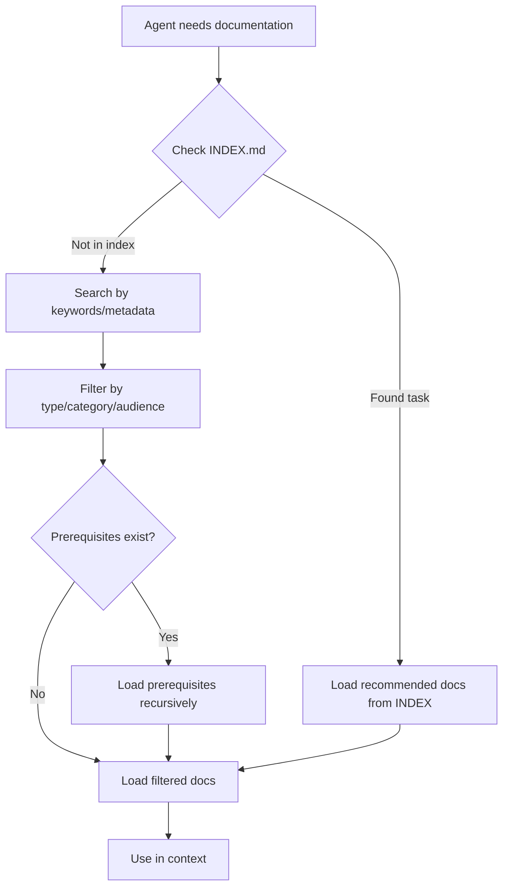

# Dev-Loop AI Agent Guide

Complete guide for AI agents creating PRDs and leveraging dev-loop capabilities.

## Overview

Dev-loop transforms PRDs into validated code through autonomous execution. This guide helps AI agents create effective PRDs that leverage all dev-loop features.

## Quick Start

1. **Read this guide** to understand dev-loop's capabilities
2. **Use the PRD template** as a starting point
3. **Reference the schema** to ensure valid frontmatter
4. **Validate your PRD** before activation

## Documentation Structure

All PRD documentation is in this directory (`docs/ai/`):

- [`INDEX.md`](INDEX.md) - Documentation index with lookup tables for tasks, features, problems, and workflows
- [`PRD_SCHEMA.md`](PRD_SCHEMA.md) - Complete schema reference with validation rules, field definitions, and phase dependency guidelines
- [`PRD_FEATURES.md`](PRD_FEATURES.md) - Comprehensive guide showing how PRDs can leverage ALL 17 dev-loop features with examples and best practices
- [`PRD_TEMPLATE.md`](PRD_TEMPLATE.md) - Copy-paste template with all optional sections and inline documentation
- [`METADATA.md`](METADATA.md) - Metadata system documentation explaining frontmatter structure
- [`STATE_MANAGEMENT.md`](STATE_MANAGEMENT.md) - Unified state management system documentation (execution-state.json, metrics.json)

## Creating Valid PRDs

### Step 1: Use the Template

Start with [`PRD_TEMPLATE.md`](PRD_TEMPLATE.md). It includes:
- All required fields with inline comments
- All optional sections with explanations
- Placeholders for easy replacement
- Links to detailed documentation

### Step 2: Reference the Schema

When writing frontmatter, consult [`PRD_SCHEMA.md`](PRD_SCHEMA.md) for:
- Required vs optional fields
- Valid field values and types
- Phase dependency rules
- Common mistakes to avoid

### Step 3: Leverage Features

Read [`PRD_FEATURES.md`](PRD_FEATURES.md) to understand how to:
- Configure error guidance for automatic error fixing
- Set up context files for AI agents
- Enable test generation
- Configure log analysis patterns
- And 13+ more features

### Step 4: Validate

Use the validation command before activating PRDs:

```bash
dev-loop validate-prd <prd-path>
```

This checks:
- Required fields present
- Phase dependencies valid (no circular, no optional/deferred deps)
- Field types correct
- Status values valid
- idPattern format correct

### Alternative: Build PRD Set from Planning Document

Instead of manually creating PRDs, you can use `build-prd-set` to convert planning documents:

```bash
dev-loop build-prd-set --convert planning-doc.md --output-dir .taskmaster/production
```

This automatically:
- Extracts requirements (REQ-X.Y format)
- Creates phases based on requirement numbering
- Generates PRD set structure (index.md.yml + phase files)
- Includes tasks in phase frontmatter

**Planning Document Format:**

Use `REQ-X.Y: Title` format in your planning document:

```markdown
### REQ-1.1: Create Module Info File

**Priority**: must
**Type**: functional

**Description**: Create the module info file with proper metadata.

**Acceptance Criteria**:
- File exists at `docroot/modules/share/my_module/my_module.info.yml`
- Contains: name, type, description, core_version_requirement

**Target Files**:
- `docroot/modules/share/my_module/my_module.info.yml`
```

The command will:
1. Parse all `REQ-X.Y` requirements
2. Group by phase (based on `REQ-X` prefix)
3. Extract task metadata (title, description, validation checklist, files)
4. Generate PRD set with proper structure

See [`../users/PRD_BUILDING.md`](../users/PRD_BUILDING.md) for complete guide including enhance and create modes.

## Key Concepts

### Phase Dependencies

Phases define execution order. Key rules:
- No circular dependencies
- Cannot depend on phases with `status: optional` or `status: deferred`
- All referenced phase IDs must exist

### Error Guidance

Configure `config.framework.errorGuidance` to teach dev-loop how to fix common errors automatically:

```yaml
config:
  framework:
    errorGuidance:
      'PluginNotFoundException': 'Check plugin annotation syntax, verify deriver class, clear cache with drush cr'
```

### Context Files

Ensure AI agents have critical files in context:

```yaml
config:
  contextFiles:
    alwaysInclude:
      - 'docroot/modules/share/my_module/src/MyService.php'
    taskSpecific:
      'TASK-101':
        - 'docroot/modules/share/my_module/src/ReferenceClass.php'
```

### Test Generation

Auto-generate Playwright tests from PRD requirements:

```yaml
config:
  testGeneration:
    imports: [...]
    selectors: {...}
    template: "..."
    isolationRules: [...]
```

## Validation

Always validate PRD frontmatter before activating:

```bash
dev-loop validate-prd .taskmaster/planning/my_feature_prd.md
```

The command will:
- Report errors (must fix)
- Report warnings (should fix)
- Exit with code 0 (success) or 1 (errors found)

## Common Patterns

### Minimal Valid PRD

```yaml
---
# Dev-Loop PRD Metadata v1.0
prd:
  id: my_feature
  version: 1.0.0
  status: ready

execution:
  strategy: phased

requirements:
  idPattern: "TASK-{id}"
  phases:
    - id: 1
      name: "Implementation"
      parallel: false

testing:
  directory: tests/playwright/my-feature/
---
```

### Full-Featured PRD

See [`PRD_TEMPLATE.md`](PRD_TEMPLATE.md) for a complete template with all optional sections.

## Troubleshooting

| Issue | Solution |
|-------|----------|
| Validation errors | Check [`PRD_SCHEMA.md`](PRD_SCHEMA.md) for required fields and rules |
| Phase dependency errors | Ensure no circular deps, no deps on optional/deferred phases |
| Missing features | Review [`PRD_FEATURES.md`](PRD_FEATURES.md) to see what's available |
| Invalid frontmatter | Use `dev-loop validate-prd` to identify issues |

## Next Steps

1. Read [`PRD_SCHEMA.md`](PRD_SCHEMA.md) for complete schema reference
2. Use [`PRD_TEMPLATE.md`](PRD_TEMPLATE.md) as starting point
3. Consult [`PRD_FEATURES.md`](PRD_FEATURES.md) for advanced configuration
4. Validate with `dev-loop validate-prd`
5. Activate PRD in your project

## Documentation Autoloading

This documentation system is designed for efficient autoloading by AI agents. Use these strategies to discover and load the right docs at the right time.

**Important:** This documentation (`docs/ai/`) is for AI agents creating PRDs and using dev-loop. For contributing to dev-loop code, see [`../contributing/README.md`](../contributing/README.md). Contribution documentation (`docs/contributing/`) is only autoloaded when explicitly in contribution mode.

### Discovery Methods

**1. Index-Based Discovery (Recommended)**

Start with [`INDEX.md`](INDEX.md) when you know what task you're performing:

- Look up your task in "Task → Documentation" table
- Follow recommended documentation links
- Load prerequisites automatically

Example: Creating a PRD → INDEX.md recommends `PRD_TEMPLATE.md`, `PRD_SCHEMA.md`

**2. Metadata-Based Filtering**

All docs include YAML frontmatter with metadata. Filter by:

- `type`: reference (complete reference), guide (step-by-step), template (copy-paste)
- `category`: prd, features, cli, architecture
- `audience`: ai, user, both
- `keywords`: Match task keywords to doc keywords

Example: Task mentions "validation" → Load docs with `keywords: ["validation"]`

**3. Keyword Matching**

Match task content to document keywords:

- Task: "configure error handling" → Keywords: "error", "guidance" → `PRD_FEATURES.md` Section 17
- Task: "set up test generation" → Keywords: "test", "generation" → `PRD_FEATURES.md` Section 3

**4. Workflow Sequences**

Follow recommended workflows from [`INDEX.md`](INDEX.md):

- Create PRD: Template → Schema → Features (sequential loading)
- Validate PRD: Schema → Validation command

### Context Filtering Best Practices

**Prevent Context Clutter:**

1. **Audience Filter**: Only load `audience: ai` or `audience: both` for AI tasks
2. **Type Filter**: Load `reference` for lookup, `guide` for step-by-step, `template` for starting point
3. **Category Filter**: Match task category to doc category
4. **Load Prerequisites**: Check `prerequisites` field and load those docs first
5. **Estimated Read Time**: Prioritize shorter docs for quick lookups

**When to Load Which Docs:**

| Scenario | Docs to Load | Priority |
|----------|--------------|----------|
| Creating PRD | `PRD_TEMPLATE.md`, `PRD_SCHEMA.md` | High |
| Validation errors | `PRD_SCHEMA.md` (validation section) | High |
| Feature configuration | `PRD_FEATURES.md` (relevant section) | Medium |
| Understanding features | `PRD_FEATURES.md` (full doc) | Low |
| Getting started | `README.md`, `PRD_TEMPLATE.md` | High |
| Contributing to dev-loop | `../contributing/README.md` (only in contribution mode) | High |

**Contribution Documentation:** Only autoload documentation with `contribution_mode: true` when:
- `.devloop/contribution-mode.json` exists and `active: true`
- Or explicitly in contribution mode context

Do not load contribution docs when creating PRDs or using dev-loop.

### Autoloading Workflow



### Examples

**Example 1: Creating a PRD**

1. Check `INDEX.md` "Task → Documentation" table
2. Find "Create PRD" → Load `PRD_TEMPLATE.md` (priority: High)
3. Check prerequisites: `PRD_SCHEMA.md` → Load it first
4. Use template, reference schema for validation
5. Optional: Load `PRD_FEATURES.md` for advanced configuration

**Example 2: Validation Error**

1. Error mentions "phase dependency" → Search `INDEX.md` "Problem → Solution"
2. Find "Phase dependency error" → Load `PRD_SCHEMA.md`
3. Filter to validation section (keywords: validation, phase, dependency)
4. Load and apply fix guidance

**Example 3: Configuring Error Guidance**

1. Task: "Configure error handling" → Check `INDEX.md` "Feature → Documentation"
2. Find "Error Guidance" → `PRD_FEATURES.md` Section 17
3. Load `PRD_FEATURES.md`, navigate to Section 17
4. Apply configuration examples

### Metadata Reference

All documentation files include YAML frontmatter. See [`METADATA.md`](METADATA.md) for complete metadata system documentation.

**Quick Reference:**
- `type`: reference | guide | tutorial | template | index
- `category`: prd | cli | architecture | features | contributing
- `audience`: ai | user | both
- `keywords`: Array of searchable terms
- `prerequisites`: Array of prerequisite doc paths
- `estimated_read_time`: Minutes to read
- `contribution_mode`: boolean (only autoload when in contribution mode)

## See Also

- [`INDEX.md`](INDEX.md) - Documentation lookup tables
- [`METADATA.md`](METADATA.md) - Metadata system documentation
- [User Documentation](../users/README.md) - For human users of dev-loop
- [Root README](../../README.md) - Overview and quick start
