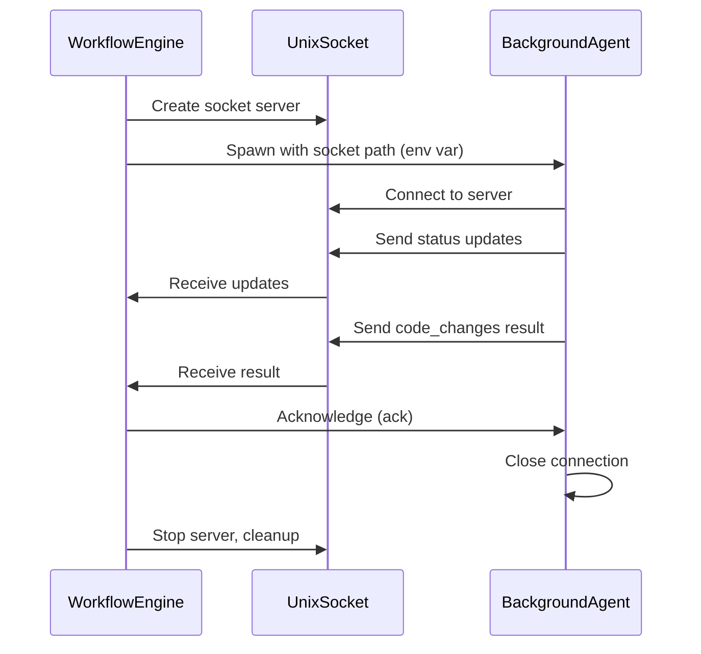

# Agent IPC System

Dev-loop uses Unix domain sockets for reliable communication between the parent workflow engine and background agents.

## Overview

The IPC (Inter-Process Communication) system provides structured, bidirectional communication between:
- **Parent Agent (IterationRunner/WorkflowEngine)**: Orchestrates task execution
- **Child Agents (Background Cursor Agents)**: Execute code generation tasks

## Architecture



## Components

### AgentIPCServer

The server runs in the parent workflow engine and manages connections from background agents.

**Location**: `src/core/agent-ipc.ts`

```typescript
import { AgentIPCServer } from './agent-ipc';

// Create server with session ID
const server = new AgentIPCServer('session-123', debug);

// Start listening
await server.start();

// Get socket path to pass to child
const socketPath = server.getSocketPath();

// Wait for result from specific request
const result = await server.waitForResult('request-id', 300000);

// Clean up
await server.stop();
```

### AgentIPCClient

The client runs in background agent processes and sends updates to the parent.

**Location**: `src/core/agent-ipc.ts`

```typescript
import { createIPCClientFromEnv } from './agent-ipc';

// Create client from environment variables
const client = createIPCClientFromEnv();

if (client) {
  // Connect to server
  await client.connect();

  // Send status updates
  client.sendStatus('generating code');
  client.sendProgress(50);

  // Send code changes result
  client.sendCodeChanges(codeChanges);

  // Send completion
  client.sendComplete(true, 'Generated 3 files');

  // Close connection
  client.close();
}
```

## Message Protocol

### Message Structure

All messages follow this format:

```typescript
interface IPCMessage {
  type: IPCMessageType;
  sessionId: string;
  requestId: string;
  timestamp: number;
  payload: {
    status?: string;
    progress?: number;
    filesChanged?: string[];
    codeChanges?: CodeChanges;
    error?: string;
    success?: boolean;
    summary?: string;
  };
}
```

### Message Types

| Type | Direction | Description |
|------|-----------|-------------|
| `status` | Child → Parent | Agent status updates (e.g., "generating code") |
| `progress` | Child → Parent | Percentage completion (0-100) |
| `files_changed` | Child → Parent | List of modified file paths |
| `code_changes` | Child → Parent | Structured CodeChanges result |
| `error` | Child → Parent | Error information |
| `complete` | Child → Parent | Execution finished (success/failure) |
| `ack` | Parent → Child | Acknowledgment of received message |

### Wire Format

Messages are JSON-encoded and newline-delimited:

```
{"type":"status","sessionId":"abc","requestId":"req-1","timestamp":1234567890,"payload":{"status":"starting"}}\n
{"type":"progress","sessionId":"abc","requestId":"req-1","timestamp":1234567891,"payload":{"progress":50}}\n
{"type":"code_changes","sessionId":"abc","requestId":"req-1","timestamp":1234567892,"payload":{"codeChanges":{...}}}\n
```

## Configuration

### Environment Variables

When spawning child agents, the parent passes these environment variables:

| Variable | Description |
|----------|-------------|
| `DEVLOOP_IPC_SOCKET` | Path to Unix socket |
| `DEVLOOP_SESSION_ID` | Current session identifier |
| `DEVLOOP_REQUEST_ID` | Current request identifier |
| `DEVLOOP_DEBUG` | Enable debug logging ("true"/"false") |

### Socket Path

Socket files are created in the system temp directory with unique identifiers:

```
/tmp/devloop-{sessionId}-{timestamp}-{randomId}.sock
```

On macOS, this is typically `/var/folders/.../devloop-{sessionId}-{timestamp}-{randomId}.sock`.

## Socket Collision Handling

When multiple parallel agents start with the same session ID, they could previously collide on the same socket path. This is now handled automatically:

### Unique Socket Paths

Each IPC server instance generates a unique path using:
- Session ID (for grouping)
- High-resolution timestamp (`process.hrtime.bigint()`)
- Random suffix (for additional uniqueness)

```typescript
// In AgentIPCServer
getSocketPath() {
  const tmpDir = os.tmpdir();
  const uniqueId = process.hrtime.bigint().toString();
  return path.join(tmpDir, `devloop-${sessionId}-${uniqueId}.sock`);
}
```

### EADDRINUSE Fallback

If `EADDRINUSE` still occurs (rare edge case), automatic retry with alternate path:

```typescript
try {
  await ipcServer.start();
} catch (error) {
  if (error.code === 'EADDRINUSE') {
    logger.warn('[AgentIPCServer] Socket in use, trying alternate path');
    ipcServer = new AgentIPCServer(sessionId, debug, true); // alternate
    await ipcServer.start();
  }
}
```

### Example Log Output

When fallback is triggered:

```
[WARN] [AgentIPCServer] Socket in use, trying alternate path
[DEBUG] [CursorChatOpener] IPC server started at /var/folders/.../devloop-alt-abc123.sock
```

## Debugging

### Enable Debug Logging

Set debug mode in config or use `--debug` flag:

```bash
npx dev-loop prd-set execute <path> --debug
```

Debug output includes:
- Socket server start/stop
- Client connection events
- Message send/receive logs
- Acknowledgment tracking

### Check Socket File

Verify socket exists:

```bash
ls -la /tmp/devloop-*.sock
```

### Monitor Messages

With debug enabled, IPC messages appear in logs:

```
[AgentIPCServer] Listening on /tmp/devloop-session-123.sock
[AgentIPCServer] Received status from req-456
[AgentIPCServer] Received code_changes from req-456
```

### Common Issues

**EADDRINUSE (Socket Already in Use)**
- Multiple parallel agents tried to use same socket path
- Fix: Automatic - unique socket paths and fallback retry handle this
- Manual: Delete socket file if automatic handling fails

**Socket Already Exists**
- Previous run didn't clean up
- Fix: Automatic cleanup on `server.stop()`
- Manual: Delete socket file (`rm /tmp/devloop-*.sock`)

**Connection Timeout**
- Child agent failed to connect within 5 seconds
- Check: Environment variables passed correctly?

**No Messages Received**
- Child may not be using IPC client
- Check: Is `createIPCClientFromEnv()` being called?

## Integration with CursorChatOpener

The CursorChatOpener automatically:

1. Creates an IPC server before spawning background agents
2. Passes socket path via environment variables
3. Waits for results via `waitForResult()`
4. Cleans up socket on completion or error

```typescript
// In openWithBackgroundAgent():
const ipcServer = new AgentIPCServer(sessionId, debug);
await ipcServer.start();

const childEnv = {
  ...process.env,
  DEVLOOP_IPC_SOCKET: ipcServer.getSocketPath(),
  DEVLOOP_SESSION_ID: sessionId,
  DEVLOOP_REQUEST_ID: requestId,
};

// Spawn child with env
const child = spawn(cursorPath, args, { env: childEnv });

// ... handle completion ...

await ipcServer.stop();
```

## Best Practices

1. **Always clean up**: Call `server.stop()` on completion or error
2. **Use timeouts**: Set reasonable timeout for `waitForResult()`
3. **Handle disconnects**: Check `client.isConnected()` before sending
4. **Log important events**: Use debug mode during development
5. **Unique session IDs**: Prevent socket collisions with unique IDs


