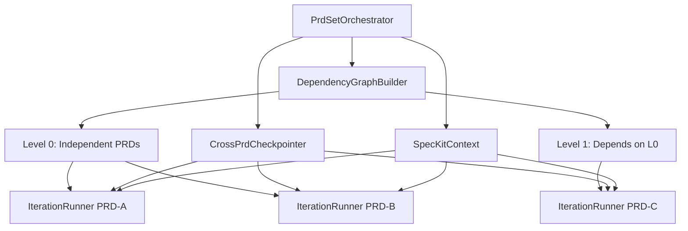
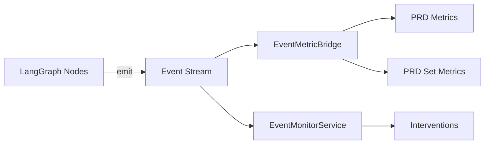

# Dev-Loop Architecture

Overview of dev-loop's codebase structure and core components.

## Directory Structure

```
dev-loop/
├── src/
│   ├── cli/              # CLI commands
│   │   └── commands/     # Individual command implementations
│   ├── core/             # Core business logic (organized into subdirectories)
│   │   ├── metrics/      # Metrics tracking system (8 files)
│   │   ├── analysis/     # Code and error analysis
│   │   │   ├── error/    # Error analysis (unified analyzer, failure-analyzer, root-cause-analyzer)
│   │   │   ├── code/     # Code intelligence (context-provider, quality-scanner, abstraction-detector, etc.)
│   │   │   └── pattern/  # Pattern learning and detection
│   │   ├── testing/      # Test execution and management (6 files)
│   │   ├── validation/   # Validation gates and scripts (6 files)
│   │   ├── generation/   # Code generation (drupal-implementation-generator, autonomous-task-generator, etc.)
│   │   ├── execution/    # Workflow and task execution (iteration-runner.ts, task-bridge.ts, phase-hook-executor.ts, etc.)
│   │   ├── reporting/    # Report generation (unified generator)
│   │   ├── tracking/     # Progress and observation tracking (6 files)
│   │   ├── prd/          # PRD parsing and management
│   │   │   ├── parser/   # PRD parsing (4 files)
│   │   │   ├── set/      # PRD set management (7 files: discovery, validator, orchestrator, generator, etc.)
│   │   │   ├── coordination/  # PRD coordination and context (2 files)
│   │   │   └── validation/    # Cross-PRD validation (1 file)
│   │   ├── monitoring/   # Proactive monitoring and intervention (5 files)
│   │   │   ├── event-monitor.ts       # EventMonitorService - continuous event polling
│   │   │   ├── issue-classifier.ts    # IssueClassifier - event classification
│   │   │   ├── action-executor.ts     # ActionExecutor - fix execution
│   │   │   └── action-strategies.ts   # Action strategies for each issue type
│   │   ├── config/       # Configuration management
│   │   │   └── merger.ts # Hierarchical config merger (schema consistency)
│   │   └── utils/        # Shared utilities (logger, dependency-graph, event-stream, string-matcher, etc.)
│   ├── config/           # Configuration loading and schema
│   │   ├── schema/       # Modular schema structure (8 files: base, core, framework, prd, overlays, phase, validation, index)
│   │   ├── schema.ts     # Backward-compatible re-export wrapper
│   │   ├── loader.ts     # Config file loading
│   │   └── defaults.ts   # Default configuration
│   ├── frameworks/       # Framework plugins (Drupal, Django, React)
│   ├── mcp/              # MCP server implementation
│   │   └── tools/        # MCP tool registrations
│   ├── providers/        # AI, test runner, log analyzer providers
│   │   └── ai/
│   │       ├── langchain/  # LangChain provider implementation
│   │       │   ├── provider.ts      # LangChainProvider
│   │       │   ├── models.ts        # Model factory
│   │       │   ├── schemas.ts       # Zod schemas
│   │       │   ├── cursor-adapter.ts # CursorCLIAdapter
│   │       │   └── index.ts         # Module exports
│   │       ├── cursor.ts           # CursorProvider (kept)
│   │       ├── interface.ts        # AIProvider interface (kept)
│   │       └── factory.ts          # AIProviderFactory (updated)
│   └── templates/        # Code generation templates
├── docs/
│   ├── ai/               # AI agent documentation (PRD creation)
│   ├── users/            # User documentation
│   └── contributing/     # Contribution documentation (this directory)
└── dist/                 # Compiled JavaScript (generated)
```

**Schema Modular Structure**: The configuration schema has been refactored into a modular structure:
- `src/config/schema/` contains 8 organized files handling different aspects of configuration
- `src/config/schema.ts` is a backward-compatible re-export wrapper
- See [Schema Modular Refactoring Handoff](../handoff-schema-modular-refactoring.md) for details

## Core Components

### IterationRunner (Default Entry Point)

**Location:** `src/core/execution/iteration-runner.ts`

The **sole entry point** for workflow execution, implementing the Ralph pattern of fresh context per iteration:

- Creates fresh LangGraph workflow per iteration
- Generates handoff document (`handoff.md`) for context continuity
- Persists learnings to `progress.md` and `learned-patterns.md`
- Supports configurable max iterations and context thresholds
- Used by `PrdSetOrchestrator` for parallel PRD execution
- Integrates with `EventMetricBridge` for automatic metrics collection
- Executes phase hooks via `PhaseHookExecutor` on phase completion
- Coordinates with `CrossPrdCheckpointer` for shared state across PRDs

```typescript
const runner = new IterationRunner(config, {
  maxIterations: 100,
  contextThreshold: 90,
  autoHandoff: true,
  persistLearnings: true,
  updatePatterns: true,
}, specKitContext, sharedCheckpointer);
const result = await runner.runWithFreshContext(prdPath);
```

**Key Integration Points:**
- **EventMetricBridge**: Initialized on construction, automatically captures events and updates metrics
- **PhaseHookExecutor**: Checks phase completion after each task, executes `onPhaseComplete` hooks
- **CrossPrdCheckpointer**: Shares patterns and metrics across parallel PRDs in a set

### LangGraph StateGraph

**Location:** `src/core/execution/langgraph/`

Graph-based workflow orchestration with 10 nodes:

| Node | Purpose |
|------|---------|
| `fetchTask` | Get next pending task from TaskMasterBridge |
| `buildContext` | Build code context for AI generation |
| `generateCode` | AI code generation via provider |
| `validateCode` | Pre-apply syntax validation |
| `applyChanges` | Apply code patches to files |
| `runTests` | Execute test suite |
| `analyzeFailure` | Analyze test/apply failures |
| `createFixTask` | Create fix task for failures |
| `suggestImprovements` | Suggest improvements on stall |
| `captureLearnings` | Persist learnings (Ralph pattern) |

**Files:**
- `state.ts` - WorkflowState annotation and types
- `graph.ts` - StateGraph definition with conditional edges
- `checkpointer.ts` - File-based checkpoint persistence
- `nodes/*.ts` - Individual node implementations

### TaskMasterBridge

**Location:** `src/core/execution/task-bridge.ts`

Wrapper around task-master-ai MCP for task management:
- Fetch pending tasks
- Update task status
- Get task details

### State Management (LangGraph)

**Location:** `src/core/execution/langgraph/`

State is managed by LangGraph checkpoints and the handoff mechanism:
- **LangGraph Checkpoints**: File-based state persistence in `.devloop/checkpoints/`
- **Handoff Context**: Generated in `.devloop/handoff.md` for context continuity
- **Learnings**: Persisted in `.devloop/progress.md` and `.devloop/learned-patterns.md`
- **Retry Counts**: Simple JSON file at `.devloop/retry-counts.json`
- **Execution State**: PRD coordination via `PrdCoordinator` in `.devloop/execution-state.json`
- **Cross-PRD State**: Shared via `CrossPrdCheckpointer` in `.devloop/shared-checkpoint-state.json`

### EventMetricBridge

**Location:** `src/core/metrics/event-metric-bridge.ts`

Automatic metrics collection from the event stream:

- **Purpose**: Subscribes to event stream and updates hierarchical metrics automatically
- **Integration**: Initialized by `IterationRunner`, listens to all events
- **Event Mapping**: Maps 100+ event types to metric update methods
- **Metrics Levels**: Updates PRD Set, PRD, Phase, and Task level metrics
- **Batched Saves**: Performance optimization with 5-second save intervals

```typescript
const bridge = initializeEventMetricBridge({
  prdMetrics,
  prdSetMetrics,
  enabled: true,
  debug: config.debug,
});
bridge.start(); // Begin listening to events
```

**Event Categories Handled:**
- Task lifecycle (`task:started`, `task:completed`, `task:failed`, `task:blocked`)
- Code generation (`code:generated`, `code:generation_failed`)
- Testing (`test:passed`, `test:failed`)
- JSON parsing (`json:parse_success`, `json:parse_failed`, `json:ai_fallback_success`)
- Phase/PRD lifecycle (`phase:started`, `phase:completed`, `prd:completed`)
- Hook execution (`hook:started`, `hook:completed`, `hook:failed`)
- Pattern learning (`pattern:learned`, `pattern:matched`)

### PhaseHookExecutor

**Location:** `src/core/execution/phase-hook-executor.ts`

Executes framework-specific lifecycle hooks defined in phase YAML files:

- **Purpose**: Run framework commands at phase boundaries (start/complete)
- **Hook Types**: `cli_command`, `shell`, `callback`
- **Framework Integration**: Registers commands from framework plugins (Drupal, Django, React)
- **Error Handling**: Supports `continueOnError` for graceful degradation

```typescript
const executor = new PhaseHookExecutor(config, debug);

// Load and execute hooks from phase file
const hooks = await executor.loadPhaseHooks(phaseFilePath);
const results = await executor.executeHooks(hooks.onPhaseComplete, context);
```

**Phase YAML Hook Definition:**
```yaml
hooks:
  onPhaseComplete:
    - type: cli_command
      cliCommand: module-enable
      args:
        module: my_module
      description: Enable module after phase completes
      continueOnError: false
```

**Framework Commands:**
- **Drupal**: `module-enable`, `cache-rebuild`, `config-import`
- **Django**: `migrate`, `collectstatic`
- **React**: `build`, `test`

### CrossPrdCheckpointer

**Location:** `src/core/execution/langgraph/cross-prd-checkpointer.ts`

Coordinates shared state across parallel PRDs within a PRD set:

- **Purpose**: Enable pattern sharing and metrics aggregation across PRDs
- **Namespacing**: Checkpoint directories namespaced by PRD set ID
- **Shared State**: Completed PRDs, shared patterns, global metrics
- **Integration**: Passed to each `IterationRunner` instance by `PrdSetOrchestrator`

```typescript
const sharedCheckpointer = createCrossPrdCheckpointer({
  prdSetId: 'my-feature-set',
  checkpointDir: '.devloop/checkpoints',
});

// Get shared state across PRDs
const sharedState = await sharedCheckpointer.getSharedState();
// { completedPrds: ['prd-a'], sharedPatterns: [...], globalMetrics: {...} }

// Update shared state after PRD completes
await sharedCheckpointer.markPrdCompleted('prd-b', patterns, metrics);
```

**Shared State Structure:**
- `completedPrds`: List of PRD IDs that have finished
- `sharedPatterns`: Patterns discovered that benefit other PRDs
- `globalMetrics`: Aggregated metrics across all PRDs (tasks, tokens, etc.)

### CodeContextProvider

**Location:** `src/core/analysis/code/context-provider.ts`

Extracts code context for AI prompts:
- File signatures
- Import statements
- Error context
- Related files

### ValidationGate

**Location:** `src/core/validation/gate.ts`

Pre-apply validation:
- Syntax checking
- Basic error detection
- Change validation

### EventMonitorService

**Location:** `src/core/monitoring/event-monitor.ts`

Proactive event monitoring service:
- Continuous event polling
- Threshold-based intervention triggering
- Automated fix execution
- Intervention effectiveness monitoring

See "Monitoring & Intervention System" section above for details.

### IssueClassifier

**Location:** `src/core/monitoring/issue-classifier.ts`

Event classification system:
- Maps event types to issue categories
- Determines confidence levels
- Identifies patterns and failure reasons

See "Monitoring & Intervention System" section above for details.

### ActionExecutor

**Location:** `src/core/monitoring/action-executor.ts`

Automated intervention execution:
- Executes fix strategies
- Validates intervention effectiveness
- Supports rollback on regression

See "Monitoring & Intervention System" section above for details.

### InterventionMetricsTracker

**Location:** `src/core/metrics/intervention-metrics.ts`

Intervention metrics tracking:
- Tracks all interventions and outcomes
- Measures success rate and effectiveness
- Identifies improvement opportunities

See "Monitoring & Intervention System" section above for details.

### PatternLearningSystem

**Location:** `src/core/analysis/pattern/learner.ts`

Learns from successful and failed task executions:
- Extracts patterns
- Stores in `.devloop/patterns.json` and `.devloop/learned-patterns.md`
- Injects guidance into AI prompts

### ParallelMetrics

**Location:** `src/core/metrics/parallel.ts`

Tracks concurrent agent execution and coordination:
- Records agent start/completion times
- Tracks concurrency levels (max, average)
- Calculates parallel efficiency (vs sequential execution)
- Measures agent overlap time and coordination statistics
- Stores metrics in `.devloop/metrics.json.parallel` (unified metrics file)

### ProgressTracker

**Location:** `src/core/tracking/progress-tracker.ts`

Provides real-time progress updates during execution:
- Event-driven progress tracking
- Task-level and overall progress reporting
- Emits progress events for UI integration
- Tracks task start/completion/failure states


### ReportGenerator

**Location:** `src/core/reporting/generator.ts`

Generates comprehensive execution reports:
- Parallel execution analysis
- Session management metrics
- Agent breakdown tables
- Parallel efficiency calculations
- Token usage and cost estimation

### PRD Set Orchestration

**Location:** `src/core/prd/set/orchestrator.ts`

Orchestrates PRD set execution with parallel `IterationRunner` instances:
- Discovers PRD sets from `index.md.yml` files
- Validates PRD sets at multiple levels (set, PRD, phase)
- Builds dependency graph to determine execution levels
- Creates **fresh IterationRunner per PRD** (Ralph pattern - isolated context)
- Passes `CrossPrdCheckpointer` to runners for shared state coordination
- Passes `SpecKitContext` to runners for design decisions injection
- Manages hierarchical configuration overlays
- Tracks PRD set-level metrics and progress
- Displays report path in console output after completion



**Fresh Context Per PRD:**
Each PRD gets its own `IterationRunner` instance with fresh context, ensuring no context pollution between parallel PRDs. The `CrossPrdCheckpointer` enables selective sharing of patterns and metrics without polluting AI context.

**Report Generation:**
After PRD set completion, a report is automatically generated and the path is displayed:
```
Report generated: .devloop/reports/prd-set-my-feature-1234567890.md
```

### Hierarchical Config Merger

**Location:** `src/config/merger.ts`

Merges configuration overlays in hierarchical order:
- Project Config → Framework Config → PRD Set Config → PRD Config → Phase Config
- Deep merge for nested objects
- Special handling for arrays (concatenation vs replacement)
- Integrated with PRD set orchestration

### Schema System

**Location:** `src/config/schema/` (modular structure)

Configuration schema organized into 8 files:
- `base.ts` - Common schema fragments (logSourceSchema)
- `core.ts` - Core configuration schema (configSchema)
- `framework.ts` - Framework configuration schema
- `prd.ts` - PRD-related schemas (factory function)
- `overlays.ts` - Configuration overlay schemas using `.partial().passthrough()` pattern
- `phase.ts` - Phase definition schema
- `validation.ts` - Validation functions
- `index.ts` - Main entry point (re-exports everything)

Backward compatibility maintained via `src/config/schema.ts` re-export wrapper.

## Event Stream Architecture

**Location:** `src/core/utils/event-stream.ts`

Real-time event emission system for workflow observability:

### Event Types (100+)

Events are organized by category:

| Category | Event Types |
|----------|-------------|
| Task Lifecycle | `task:started`, `task:completed`, `task:failed`, `task:blocked` |
| Code Generation | `code:generated`, `code:generation_failed` |
| Changes | `changes:applied`, `file:created`, `file:modified`, `file:boundary_violation` |
| Testing | `test:passed`, `test:failed`, `test:stalled` |
| JSON Parsing | `json:parse_success`, `json:parse_failed`, `json:parse_retry`, `json:ai_fallback_success` |
| Phase/PRD | `phase:started`, `phase:completed`, `prd:started`, `prd:completed` |
| Hooks | `hook:started`, `hook:completed`, `hook:failed` |
| Patterns | `pattern:learned`, `pattern:matched`, `pattern:injected` |
| Intervention | `intervention:triggered`, `intervention:successful`, `intervention:failed` |
| SpecKit | `speckit:context_loaded`, `speckit:clarification_applied`, `speckit:research_used` |
| Build | `build:started`, `build:completed`, `build:phase_started`, `build:ai_call_completed` |

### Event Emission

Events are emitted from LangGraph nodes and other components:

```typescript
import { emitEvent } from '../utils/event-stream';

// Emit task completion event
emitEvent('task:completed', {
  taskId: task.id,
  title: task.title,
  durationMs: Date.now() - startTime,
}, {
  prdId,
  phaseId,
  severity: 'info',
});
```

### Event Subscription

Components can subscribe to events:

```typescript
import { getEventStream } from '../utils/event-stream';

const eventStream = getEventStream();
eventStream.addListener((event) => {
  if (event.type === 'task:completed') {
    // Handle task completion
  }
});
```

### EventMetricBridge Integration

The `EventMetricBridge` subscribes to all events and automatically updates metrics:



## Enhanced JSON Parsing

**Location:** `src/providers/ai/json-parser.ts`

Robust JSON extraction from AI responses with multiple fallback strategies:

### Parsing Strategies

1. **Direct Parse**: Try standard `JSON.parse()` first
2. **Code Block Extraction**: Extract JSON from markdown code blocks
3. **Cursor CLI Wrapper Detection**: Handle `{type:"result", result:"..."}` wrapper
4. **Stringified Array Fix**: Handle `"files": "[{...}]"` pattern from LangChainProvider
5. **Trailing Content Removal**: Remove text after JSON object
6. **Control Character Sanitization**: Clean non-printable characters
7. **AI Fallback**: Use AI to fix malformed JSON as last resort

### Event Emission

All parsing attempts emit events for observability:

```typescript
emitEvent('json:parse_success', {
  strategy: 'direct',
  durationMs: 15,
});

emitEvent('json:parse_failed', {
  error: 'Unexpected token',
  attemptNumber: 1,
});

emitEvent('json:ai_fallback_success', {
  originalError: 'Invalid JSON',
  fixedBy: 'anthropic',
});
```

### Provider-Specific Handling

- **Cursor Provider**: Detects and unwraps CLI wrapper format
- **LangChainProvider**: Handles stringified `files` array
- **All Providers**: Auto-generates missing `summary` field, infers `operation` from content

### Metrics Collection

JSON parsing metrics tracked via `EventMetricBridge`:

| Metric | Description |
|--------|-------------|
| `totalAttempts` | Total parse attempts |
| `successByStrategy.direct` | Successful direct parses |
| `successByStrategy.retry` | Successful after retry |
| `successByStrategy.aiFallback` | Successful via AI fix |
| `successByStrategy.sanitized` | Successful after sanitization |
| `failureReasons` | Categorized failure counts |

## Framework Plugins

**Location:** `src/frameworks/`

Plugins provide framework-specific behavior:
- **Drupal** - Drupal 10/11 with DDEV
- **Django** - Django 5+ with Docker/DRF
- **React** - React + TypeScript + Vite
- **Generic** - Fallback for any project
- **Composite** - Multi-framework projects

Each plugin implements `FrameworkPlugin` interface with:
- Detection logic
- Templates
- Error patterns
- File discovery rules

## Provider System

**Location:** `src/providers/`

### AI Providers

Supported providers via LangChain.js:
- **Anthropic** - Claude via `@langchain/anthropic`
- **OpenAI** - GPT via `@langchain/openai`
- **Google** - Gemini via `@langchain/google-genai`
- **Ollama** - Local models via `@langchain/ollama`
- **Cursor** - Via `CursorCLIAdapter` with Anthropic API fallback

See "LangChain Provider Architecture" section above for implementation details.

## LangChain Provider Architecture

**Location:** `src/providers/ai/langchain/`

Dev-loop uses LangChain.js for unified AI provider abstraction:

### LangChainProvider

**Location:** `src/providers/ai/langchain/provider.ts`

Main provider implementing the `AIProvider` interface:
- Unified implementation for Anthropic, OpenAI, Gemini, Ollama
- Structured output via Zod schemas (`CodeChangesSchema`, `AnalysisSchema`)
- Cursor provider uses CursorCLIAdapter with Anthropic fallback
- Implements `generateCode()`, `analyzeError()`, `generateText()`

### Model Factory

**Location:** `src/providers/ai/langchain/models.ts`

Creates LangChain chat models via `createLangChainModel()`:
- `ChatAnthropic` for Claude models
- `ChatOpenAI` for GPT models
- `ChatGoogleGenerativeAI` for Gemini models
- `ChatOllama` for local Ollama models
- Returns `BaseChatModel` interface for all providers

### CursorCLIAdapter

**Location:** `src/providers/ai/langchain/cursor-adapter.ts`

Special adapter wrapping CursorProvider as LangChain `BaseChatModel`:
- Handles 8192-byte truncation detection
- Falls back to Anthropic API on truncation
- Wraps existing CursorProvider for CLI interactions
- Maintains session persistence via CursorProvider

### Zod Schemas

**Location:** `src/providers/ai/langchain/schemas.ts`

Structured output schemas for type-safe AI responses:
- `CodeChangesSchema` - File changes with operations
- `AnalysisSchema` - Error analysis with root cause
- `PatternDetectionSchema` - Pattern detection results
- `FixTaskSchema` - Fix task generation
- `ImprovementSuggestionSchema` - Improvement suggestions

### AIProviderFactory Integration

**Location:** `src/providers/ai/factory.ts`

Factory now returns:
- `LangChainProvider` for anthropic, openai, gemini, ollama providers
- `CursorProvider` for cursor provider (specialized CLI handling)
- All providers implement unified `AIProvider` interface

### Test Runners

- **Playwright** - Browser automation
- **Cypress** - E2E testing

### Log Analyzers

- **PatternMatcher** - Regex-based analysis
- **AILogAnalyzer** - AI-powered analysis (uses LangChainProvider)

## MCP Integration

**Location:** `src/mcp/`

MCP (Model Context Protocol) server for AI assistant integration:

- **server.ts** - Main MCP server entry point
- **tools/** - Tool registrations:
  - `core.ts` - Core workflow tools
  - `debug.ts` - Debugging tools
  - `control.ts` - Control tools
  - `contribution.ts` - Contribution mode tools
  - `events.ts` - Event streaming tools
  - `observations.ts` - Observation tools
  - `metrics.ts` - Metrics tools
  - `contribution-mode.ts` - Contribution mode status and validation tools
  - `event-monitoring.ts` - Proactive event monitoring tools (start, stop, status, configure, interventions)
  - `observation-enhanced.ts` - Enhanced observation tools (pattern detection, session analysis, context gap detection, dependency graph)
  - `playwright-tdd.ts` - Playwright TDD workflow tools
  - `codebase-query.ts` - Codebase query tools
  - `cursor-ai.ts` - Cursor AI integration tools
  - `cursor-chat.ts` - Cursor chat integration tools
  - `background-agent.ts` - Background agent tools

## Monitoring & Intervention System

**Location:** `src/core/monitoring/`

Proactive event monitoring and automated intervention system that continuously monitors events and applies corrective actions when thresholds are exceeded.

### EventMonitorService

**Location:** `src/core/monitoring/event-monitor.ts`

Continuously monitors event stream and triggers automated corrective actions:
- Polls events every N seconds (configurable, default: 5 seconds)
- Checks event counts/rates against configured thresholds
- Classifies issues and determines confidence levels
- Triggers interventions automatically (if confidence is high) or requests approval
- Monitors intervention effectiveness and rolls back if regressions occur
- Rate limiting (max interventions per hour)
- Lifecycle management (start/stop)

**Key Methods:**
- `start()` - Start monitoring service
- `stop()` - Stop monitoring service
- `getStatus()` - Get monitoring status and statistics
- `updateConfig()` - Update configuration at runtime
- `pollEvents()` - Poll events and check thresholds (private)

### IssueClassifier

**Location:** `src/core/monitoring/issue-classifier.ts`

Classifies event types into actionable categories and determines confidence levels:
- Maps event types to classification strategies
- Extracts patterns from event history
- Determines confidence levels (0-1) for automated action
- Categorizes issues (json-parsing, task-execution, boundary-enforcement, validation, contribution-mode, ipc, agent, health)
- Identifies most common failure reasons and patterns

**Classification Strategies:**
- JSON parsing issues - Analyzes failure reasons, retry patterns, AI fallback usage
- Task execution issues - Detects blocked/failed tasks, extracts failure reasons, identifies retry patterns
- Boundary enforcement issues - Detects violations vs excessive filtering, identifies module confusion
- Validation issues - Extracts error categories, identifies recovery patterns
- Contribution mode issues - Handles module confusion, session pollution, boundary violations, context loss
- IPC connection issues - Detects connection failures, retry patterns, consistency
- Agent errors - Lower confidence for complex agent errors
- Health check issues - Low confidence, requires investigation

### ActionExecutor

**Location:** `src/core/monitoring/action-executor.ts`

Executes corrective actions based on issue classifications:
- Loads action strategies lazily (on first use)
- Maps issue types to specific fix strategies
- Executes strategies and validates fixes
- Monitors fix effectiveness via subsequent events
- Supports rollback if fixes cause regressions
- Tracks intervention results for metrics

**Key Methods:**
- `execute()` - Execute intervention for an issue
- `monitorEffectiveness()` - Monitor intervention effectiveness (async, non-blocking)
- `loadActionStrategies()` - Load action strategies (lazy initialization)

### Action Strategies

**Location:** `src/core/monitoring/action-strategies.ts`

Specific fix strategies for each issue type. Each strategy implements the `ActionStrategy` interface:

- **JsonParsingStrategy** (`enhance-json-parser`) - Enhances JSON parser with better extraction logic, adds control character sanitization, newline escaping
- **TaskBlockingStrategy** (`unblock-task`) - Unblocks tasks with enhanced context, resets retry count, clears errors
- **BoundaryViolationStrategy** (`enhance-boundary-enforcement`) - Enhances boundary enforcement, adds early file filtering before validation
- **ValidationFailureStrategy** (`enhance-validation-gates`) - Improves validation gates, adds recovery suggestions
- **ContributionModeStrategy** (`fix-contribution-mode-issue`) - Delegates to specific fixes based on issue type (module confusion, session pollution, boundary violations, context loss)
- **IPCConnectionStrategy** (`enhance-ipc-connection`) - Adds retry logic with exponential backoff

**Strategy Pattern:**
- Each strategy has `name`, `issueType`, and `execute()` method
- Strategies can modify code files (with backup creation)
- Strategies can update state files (retry counts, session data)
- Strategies emit events for tracking and validation
- Strategies return success/failure status and rollback requirements

### InterventionMetricsTracker

**Location:** `src/core/metrics/intervention-metrics.ts`

Tracks all automated interventions and their outcomes:
- Records intervention history with full details
- Tracks success rate by issue type and event type
- Identifies patterns in intervention effectiveness
- Timing metrics (detection, fix, validation time)
- Threshold tracking (exceeded count, prevented count, false positives)
- Effectiveness analysis (most/least effective strategies, common failure modes)

**Key Methods:**
- `recordIntervention()` - Track a new intervention
- `recordThresholdExceeded()` - Record threshold exceeded
- `recordIssuePrevented()` - Record issue prevented
- `recordFalsePositive()` - Record false positive intervention
- `getMetrics()` - Get current metrics
- `getRecords()` - Get intervention records (with filters)
- `getIssueTypeMetrics()` - Get metrics for specific issue type
- `getEffectivenessAnalysis()` - Get effectiveness analysis
- `analyzePatterns()` - Analyze intervention patterns (runs periodically)

### Integration Points

The monitoring system integrates with:
- **Event Stream** (`src/core/utils/event-stream.ts`) - Polls events, emits intervention events
- **Config System** (`src/config/schema/core.ts`) - Reads monitoring configuration
- **Metrics System** (`src/core/metrics/intervention-metrics.ts`) - Tracks intervention metrics
- **Contribution Mode** (`src/cli/commands/contribution.ts`) - Starts/stops monitoring on contribution mode lifecycle
- **MCP Tools** (`src/mcp/tools/event-monitoring.ts`) - Exposes monitoring control via MCP

### Configuration

Monitoring configuration is defined in `devloop.config.js`:

```javascript
module.exports = {
  mcp: {
    eventMonitoring: {
      enabled: true,
      pollingInterval: 5000,
      thresholds: { /* event type → threshold config */ },
      actions: { /* action settings */ },
      metrics: { /* metrics tracking settings */ }
    }
  }
};
```

See [Proactive Monitoring Guide](./PROACTIVE_MONITORING.md) for detailed configuration reference.

## Configuration

**Location:** `src/config/`

- **schema/** - Modular schema structure (8 files):
  - `base.ts` - Common schema fragments
  - `core.ts` - Core configuration schema
  - `framework.ts` - Framework configuration schema
  - `prd.ts` - PRD-related schemas (factory function)
  - `overlays.ts` - Configuration overlay schemas (factory function using `.partial().passthrough()`)
  - `phase.ts` - Phase definition schema
  - `validation.ts` - Validation functions
  - `index.ts` - Main entry point (re-exports)
- **schema.ts** - Backward-compatible re-export wrapper (for existing imports)
- **loader.ts** - Config file loading
- **defaults.ts** - Default configuration

**Hierarchical Configuration System**: Config overlays are merged at multiple levels (Project → Framework → PRD Set → PRD → Phase) using `src/config/merger.ts`. See [Schema Modular Refactoring](../handoff-schema-modular-refactoring.md) for details.

## Contribution Mode

When in contribution mode, you (outer agent) can edit:
- `node_modules/dev-loop/src/` - Core code
- `.taskmaster/` - Tasks and PRDs
- `devloop.config.js` - Project config

Inner agent (dev-loop) edits:
- Project code (e.g., `docroot/`, `tests/`)

Boundaries are enforced via `.cursorrules` or project rules.

## Parallel Execution System

Dev-loop implements true parallel execution using dependency level grouping:

### Dependency Level Grouping

Tasks are grouped by dependency level using topological sorting:
- Tasks with no dependencies execute first
- Tasks dependent on completed tasks execute next
- Multiple tasks at the same level execute concurrently
- Maximum concurrency is controlled by `autonomous.maxConcurrency` config

**Location:** `src/core/execution/iteration-runner.ts` and `src/core/execution/langgraph/nodes/fetch-task.ts`

### Concurrency Control

- Tasks within a dependency level are executed in parallel (up to `maxConcurrency`)
- Remaining tasks in a level are queued for the next iteration
- Parallel execution is tracked by `ParallelMetrics`
- Each parallel task gets isolated context snapshot

### Coordination Statistics

ParallelMetrics tracks:
- Maximum concurrent agents
- Average concurrency over time
- Agent overlap time (time agents run simultaneously)
- Sequential time (gaps between agent executions)
- Total agent run time
- Parallel efficiency percentage

## Session Management System

Dev-loop uses a provider-agnostic session management system for context persistence:

### Provider-Agnostic Design

- **BaseSessionManager** - Abstract base class with common functionality
- **CursorSessionManager** - Cursor-specific implementation
- Future providers can implement their own session managers

### Session Boundary Specifications

Session boundaries are explicitly defined for all execution scenarios:

1. **Parallel Tasks** - Separate sessions with optional shared base context
   - Each task gets isolated session: `{prdId}-{phaseId}-{taskId}`
   - Context is snapshotted at task start to prevent race conditions

2. **Fix Tasks** - Reuse original task's session
   - Fix attempts are appended to session history
   - History is pruned after max retries

3. **Cross-PRD Dependencies** - Isolated sessions with selective context injection
   - Each PRD has isolated session: `{prdSetId}-{prdId}`
   - Only completed PRDs' context is injected

4. **Context Snapshotting** - Module-scoped file system state snapshot
   - Snapshot taken at task start
   - Only includes files that existed at snapshot time
   - Prevents seeing files created by parallel tasks

### Session Lifecycle

- Sessions are created on first task execution
- Persist until PRD/phase completion or max age exceeded
- History is pruned based on `maxHistoryItems` config
- Session statistics are tracked (calls, errors, JSON parsing failures)

**Location:** `src/providers/ai/session-manager.ts` and `src/providers/ai/cursor-session-manager.ts`

**Logging Levels:**

The session management system uses appropriate log levels:
- **Debug level**: Expected session lifecycle events (new session creation, session resume)
- **Warning/Error level**: Actual issues requiring attention (session corruption, persistence failures)

This reduces log noise while maintaining visibility for debugging. Enable debug logging to see all session lifecycle events.

## Context Discovery System

Enhanced context discovery with PRD/phase scoping and relevance ranking:

### PRD/Phase Scoping

Context discovery is scoped to the target module based on PRD/phase context:
- Files from target module get higher relevance scores
- Files from other modules are excluded or deprioritized
- Module name is extracted from PRD ID (e.g., "PERF-PHASE-1" → "bd_perf")

### Relevance Ranking

Files are ranked by relevance:
- Target module files get highest priority
- Semantic similarity to task description
- Import relationships
- Recent modification time

### Context Snapshotting

Context is snapshotted at task start for parallel execution:
- Prevents race conditions from seeing files created by parallel tasks
- Module-scoped (only files in `docroot/modules/share/{module}/`)
- Live updates are disabled during parallel execution

**Location:** `src/core/analysis/code/context-provider.ts` and `src/core/execution/langgraph/nodes/build-context.ts`

## Code Cleanup Status

### Stub Implementations

The following files have stub implementations pending full LangChain integration:

1. **EmbeddingService** (`src/ai/embedding-service.ts`)
   - Current: Uses `any` type for providerManager
   - Needed: Replace with LangChain embeddings via `@langchain/core/embeddings`
   - Status: Temporarily disabled in `recommend.ts`

2. **SemanticAnalyzer** (`src/ai/semantic-analyzer.ts`)
   - Current: Uses `any` type for providerManager
   - Needed: Replace with LangChainProvider
   - Status: Works with current stub but logs warning

### Files Requiring Verification

Run these commands to verify no dead code remains:

```bash
# Check for imports of deleted modules
grep -r "AIProviderManager\|AIPatternProvider" src/
grep -r "from.*provider-manager" src/
grep -r "AnthropicProvider\|OpenAIProvider\|GeminiProvider\|OllamaProvider" src/

# Check for stub implementations
grep -r "TODO.*LangChain\|stub.*LangChain" src/

# Check for unused files
# (Run after verifying all imports)
```

See follow-up plan "Dead Code Cleanup" for detailed removal instructions.

## Code Inventory for Dead Code Detection

### Files That Import Deleted Modules

**Stub Files (Need Full LangChain Integration):**
- `src/ai/embedding-service.ts` - Uses `any` type for providerManager, needs LangChain embeddings
- `src/ai/semantic-analyzer.ts` - Uses `any` type for providerManager, needs LangChainProvider
- `src/cli/commands/recommend.ts` - AI pattern detection disabled, needs LangChain embeddings integration

**Files Importing AIProvider Interface (Still Valid):**
- `src/providers/ai/interface.ts` - Core AIProvider interface (KEEP)
- `src/providers/ai/factory.ts` - Factory using LangChainProvider (KEEP, updated)
- `src/providers/ai/cursor.ts` - CursorProvider implementing AIProvider (KEEP)
- `src/core/execution/iteration-runner.ts` - Uses AIProvider interface (KEEP)
- `src/providers/log-analyzers/ai-analyzer.ts` - Uses AIProvider interface (KEEP)
- All other files using AIProvider interface - Verify they use interface, not internals

### Deleted Files (Already Removed)

These files were deleted in the refactor:
- `src/providers/ai/anthropic.ts` - DELETED
- `src/providers/ai/openai.ts` - DELETED
- `src/providers/ai/gemini.ts` - DELETED
- `src/providers/ai/ollama.ts` - DELETED
- `src/providers/ai/api-agent-wrapper.ts` - DELETED
- `src/providers/ai/pattern-detection/` - DELETED (entire directory)
- `src/ai/provider-interface.ts` - DELETED (AIPatternProvider interface)
- `src/ai/provider-manager.ts` - DELETED (AIProviderManager)
- `docker-compose.temporal.yml` - DELETED

### New LangChain Files (Keep)

New LangChain implementation:
- `src/providers/ai/langchain/provider.ts` - LangChainProvider implementation
- `src/providers/ai/langchain/models.ts` - Model factory
- `src/providers/ai/langchain/schemas.ts` - Zod schemas
- `src/providers/ai/langchain/cursor-adapter.ts` - CursorCLIAdapter
- `src/providers/ai/langchain/index.ts` - Module exports

### Code Patterns to Check

**Grep patterns to find potential dead code:**

```bash
# Find imports of deleted modules
grep -r "AIProviderManager\|AIPatternProvider" src/
grep -r "from.*provider-manager\|from.*provider-interface" src/
grep -r "AnthropicProvider\|OpenAIProvider\|GeminiProvider\|OllamaProvider" src/
grep -r "pattern-detection" src/
grep -r "@temporalio" src/

# Find stub implementations
grep -r "TODO.*LangChain\|stub.*LangChain\|pending.*LangChain" src/

# Find any remaining references to deleted files
grep -r "api-agent-wrapper" src/
```

**Files to check for dead code:**
- All files in `src/ai/` - Check if they're still used
- `src/cli/commands/recommend.ts` - Check if disabled code should be removed
- `src/core/analysis/` - Check pattern detection code that might be obsolete
- Any file using `embedding-service.ts` or `semantic-analyzer.ts` - Check if stubs work correctly

### Stub Implementations Status

**Currently Using Stubs:**
- `embedding-service.ts` - Uses `any` type, warns "LangChain integration pending"
- `semantic-analyzer.ts` - Uses `any` type, warns "LangChain integration pending"

**Action Required:**
- These need full LangChain integration OR should be removed if not used
- Check all usages to determine if integration is needed or code can be deleted

### Integration Points to Verify

**Files that use AIProvider (should work with LangChainProvider):**
- `src/core/execution/iteration-runner.ts` - Main workflow (verify works)
- `src/providers/log-analyzers/ai-analyzer.ts` - Log analysis (verify works)
- `src/mcp/tools/debug.ts` - MCP debug tools (verify works)
- All PRD generation/building code (verify works)

**Files that might need updates:**
- Any file using `EmbeddingService` directly
- Any file using `SemanticAnalyzer` directly
- Any file referencing pattern detection providers

## AI Provider Reliability

Dev-loop includes comprehensive reliability features for AI provider interactions:

### Timeout Handling

Provider-agnostic timeout handler:
- Configurable timeouts per provider
- Progressive timeout extension on activity
- Heartbeat monitoring to detect idle processes
- Default timeout: 5 minutes (configurable via `config.cursor.agents.backgroundAgentTimeout`)

**Timeout Kill Handling:**

Background agents that exceed timeout limits are gracefully terminated with SIGTERM (exit code 143). The system distinguishes between:
- **Expected timeout kills**: Logged as warnings with `timeout: true` in result
- **Unexpected failures**: Logged as errors for investigation

This distinction helps identify normal timeout scenarios vs actual process failures requiring attention.

**Location:** `src/providers/ai/timeout-handler.ts` and `src/providers/ai/cursor-chat-opener.ts`

### Retry Logic

Automatic retry mechanism for failed AI calls:
- 3 attempts by default (initial attempt + 2 retries)
- Strict JSON prompts on retry to improve success rate
- Enhanced JSON extraction for various response formats
- "Already complete" response detection

**Location:** `src/providers/ai/cursor.ts` - `generateCode()` method and `src/providers/ai/langchain/provider.ts` - LangChainProvider implementation

### Enhanced JSON Parsing

Robust JSON extraction from AI responses:
- Handles raw JSON, JSON code blocks, and triple-escaped JSON
- Detects "already complete" responses without explicit CodeChanges
- Strips prefixes like "Here is the JSON:"
- Detailed error logging with context snippets

**Location:** `src/providers/ai/cursor-json-parser.ts` (shared utility)

## PRD Set Architecture

Dev-loop supports executing multiple PRDs together as a PRD set, with hierarchical configuration overlays and parallel execution capabilities.

### PRD Set Discovery

**Location:** `src/core/prd/set/discovery.ts`

Discovers PRD sets from `index.md.yml` files or directory scanning:
- Reads PRD set manifest from `index.md.yml`
- Validates PRD set structure
- Resolves PRD paths relative to the PRD set directory

### PRD Set Validation

**Location:** `src/core/prd/set/validator.ts`

Validates PRD sets at multiple levels:
- Set-level validation (manifest structure, PRD references)
- PRD-level validation (individual PRD schemas)
- Phase-level validation (phase definitions and config overlays)

### PRD Set Orchestration

**Location:** `src/core/prd/set/orchestrator.ts`

Orchestrates PRD set execution:
- Parallel execution of independent PRDs (up to `maxConcurrent` limit)
- Dependency-aware execution ordering
- Hierarchical configuration overlay merging
- Progress tracking and error handling at PRD set level

### Hierarchical Configuration Merging

**Location:** `src/config/merger.ts`

Merges configuration overlays in the following order:
1. Project Config (base)
2. Framework Config
3. PRD Set Config (from `index.md.yml`)
4. PRD Config (from PRD frontmatter)
5. Phase Config (from phase definitions)

Later levels override earlier levels. Deep merge for nested objects. Special handling for arrays that should be concatenated vs replaced.

**Schema Support:** Configuration overlay schemas are defined in `src/config/schema/overlays.ts` using `.partial().passthrough()` pattern to derive from base config schema.

## Schema Consistency System

The configuration schema system has been refactored into a modular structure for better maintainability and reduced duplication.

### Modular Schema Structure

**Location:** `src/config/schema/` (8 files)

- **base.ts** - Common schema fragments used across multiple files (e.g., `logSourceSchema`)
- **core.ts** - Main configuration schema (`configSchema`) and `Config` type
- **framework.ts** - Framework-specific configuration schema
- **prd.ts** - PRD-related schemas (factory function to handle circular dependencies)
- **overlays.ts** - Configuration overlay schemas (factory function using `.partial().passthrough()`)
- **phase.ts** - Phase definition schema
- **validation.ts** - Validation functions (`validateConfig`, `validateConfigOverlay`)
- **index.ts** - Main entry point that re-exports everything

### Circular Dependency Resolution

The schema system uses factory functions and lazy initialization to handle circular dependencies:
- `configSchema` (core.ts) → needs `prdSchema` (prd.ts)
- `prdSchema` (prd.ts) → needs `configOverlaySchema` (overlays.ts)
- `configOverlaySchema` (overlays.ts) → needs `configSchema` (core.ts)

**Solution:** Factory functions with `z.lazy()` for circular references. Initialization order in `core.ts` is important.

### Backward Compatibility

The old `schema.ts` file has been converted to a re-export wrapper:
```typescript
export * from './schema/index';
```

All existing imports from `'../config/schema'` continue to work without modification.

See [Schema Modular Refactoring Handoff](../handoff-schema-modular-refactoring.md) for complete details.

## Key Principles

1. **Framework-agnostic** - Core must work with any framework
2. **Plugin-based** - Framework-specific code in plugins
3. **Test-driven** - All features include tests
4. **Stateful** - Tracks execution state for recovery
5. **Extensible** - Easy to add new providers/plugins
6. **Provider-agnostic** - Unified AI provider via LangChain.js
7. **Parallel-first** - Designed for concurrent execution
8. **Modular organization** - Clear separation of concerns with logical directory structure
9. **Stateful execution** - LangGraph checkpoints and handoff mechanism provide state persistence

## See Also

- [Development Workflow](DEVELOPMENT_WORKFLOW.md) - How to make changes
- [Testing](TESTING.md) - Testing guidelines
- [Root README](../../README.md) - Project overview
