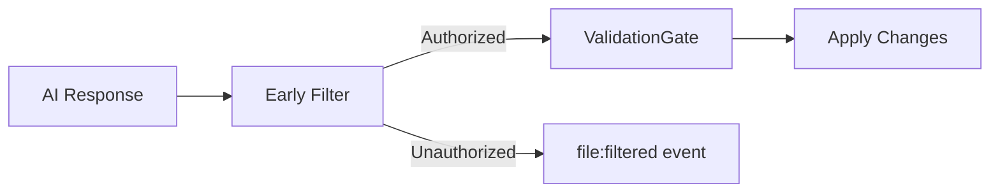

# Boundary Enforcement Implementation Guide

Guide for implementing programmatic boundary validation in dev-loop's contribution mode.

## Overview

Boundary enforcement ensures that outer and inner agents can only edit files within their designated scope. This prevents accidental edits to the wrong codebase and maintains clear separation of concerns.

## Implementation Location

Boundary validation is implemented in:

1. **WorkflowEngine** - Early file filtering and post-execution validation
2. **ValidationGate** - Validate file paths before code changes are applied
3. **Contribution Mode Manager** - Validate boundaries on contribution mode start/stop
4. **MCP Server** - Validate boundaries for MCP tool calls
5. **CLI Commands** - Validate boundaries for CLI operations

## Early File Filtering

Dev-loop filters unauthorized files **before** validation to reduce noise:

### How It Works



1. **After AI Response**: Files outside `targetModule` are filtered immediately
2. **Event Emission**: `file:filtered` events are emitted for observability
3. **Validation Gate**: Only authorized files reach validation, reducing error logs

### Implementation

In `WorkflowEngine.applyChanges()`:

```typescript
// Early filtering before validation
const targetModule = this.currentPrdTargetModule;
if (targetModule && changes.files && changes.files.length > 0) {
  const originalCount = changes.files.length;
  changes.files = changes.files.filter(file => {
    const allowed = this.isFileInTargetModule(file.path, targetModule);
    if (!allowed) {
      logger.warn(`[WorkflowEngine] FILTERED: ${file.path} (outside target module ${targetModule})`);
      this.eventStream.emit('file:filtered', {
        path: file.path,
        targetModule,
        taskId: task.id,
        reason: 'outside target module'
      }, 'warn');
    }
    return allowed;
  });
}
```

### Benefits

- **Reduced Noise**: No validation errors for files that would be rejected anyway
- **Better Observability**: `file:filtered` events provide structured tracking
- **Efficient Processing**: ValidationGate only processes authorized files

### Post-Execution Validation

After AI execution completes, `validateAndRevertUnauthorizedChanges()` checks `git status` and reverts any unauthorized changes:

```typescript
// Check for unauthorized changes after AI execution
const changedFiles = await this.getGitChangedFiles();
for (const file of changedFiles) {
  if (!this.isFileInTargetModule(file, targetModule)) {
    this.eventStream.emit('change:unauthorized', { path: file, targetModule }, 'warn');
    await this.revertFile(file);
    this.eventStream.emit('change:reverted', { path: file, targetModule }, 'info');
  }
}
```

This catches changes made via direct tool calls that bypass `applyChanges()`.

## Validation Function

### TypeScript Interface

```typescript
interface BoundaryValidationResult {
  valid: boolean;
  violations?: BoundaryViolation[];
  warnings?: string[];
}

interface BoundaryViolation {
  filePath: string;
  agentType: 'outer' | 'inner';
  reason: string;
  matchedPattern?: string;
  suggestion?: string;
}

function validateContributionModeBoundaries(
  filePath: string,
  agentType: 'outer' | 'inner',
  state: ContributionModeState
): BoundaryValidationResult {
  if (!state.active) {
    return { valid: true };
  }

  const boundaries = agentType === 'outer'
    ? state.outerAgentBoundaries
    : state.innerAgentBoundaries;

  // Check if path matches any forbidden pattern
  for (const pattern of boundaries.forbidden) {
    if (matchesPattern(filePath, pattern)) {
      return {
        valid: false,
        violations: [{
          filePath,
          agentType,
          reason: `File path matches forbidden pattern: ${pattern}`,
          matchedPattern: pattern,
          suggestion: `Move file to an allowed location or update boundaries in .cursor/rules/dev-loop.mdc`
        }]
      };
    }
  }

  // Check if path matches at least one allowed pattern
  const matchesAllowed = boundaries.allowed.some(pattern =>
    matchesPattern(filePath, pattern)
  );

  if (!matchesAllowed) {
    return {
      valid: false,
      violations: [{
        filePath,
        agentType,
        reason: `File path does not match any allowed pattern`,
        suggestion: `Add pattern to allowed list in .cursor/rules/dev-loop.mdc or move file to allowed location`
      }]
    };
  }

  return { valid: true };
}
```

### Pattern Matching Function

```typescript
function matchesPattern(filePath: string, pattern: string): boolean {
  // Handle regex patterns (prefixed with "regex:")
  if (pattern.startsWith('regex:')) {
    const regex = new RegExp(pattern.slice(6));
    return regex.test(filePath);
  }

  // Handle glob patterns
  if (pattern.includes('*') || pattern.includes('**')) {
    return minimatch(filePath, pattern);
  }

  // Handle literal paths
  // Check if filePath starts with pattern (for directory matches)
  if (pattern.endsWith('/')) {
    return filePath.startsWith(pattern);
  }

  // Exact match for files
  return filePath === pattern;
}
```

## Integration Points

### 1. Code Application (ValidationGate)

When applying code changes, validate boundaries:

```typescript
class ValidationGate {
  async validateChanges(changes: CodeChanges, state: ContributionModeState): Promise<ValidationResult> {
    const violations: BoundaryViolation[] = [];

    for (const change of changes) {
      const agentType = this.determineAgentType(change);
      const validation = validateContributionModeBoundaries(
        change.filePath,
        agentType,
        state
      );

      if (!validation.valid && validation.violations) {
        violations.push(...validation.violations);
      }
    }

    if (violations.length > 0) {
      return {
        valid: false,
        errors: violations.map(v =>
          `Boundary violation: ${v.filePath} (${v.agentType} agent) - ${v.reason}`
        )
      };
    }

    return { valid: true };
  }

  private determineAgentType(change: CodeChanges): 'outer' | 'inner' {
    // Determine based on context:
    // - If change is from MCP tool call, check tool name
    // - If change is from CLI, check command context
    // - Default to 'inner' for safety
    return 'inner';
  }
}
```

### 2. Contribution Mode Start

Validate boundaries when starting contribution mode:

```typescript
async function startContributionMode(prdPath: string): Promise<ContributionModeState> {
  // Load project rules
  const projectRules = await loadProjectRules('.cursor/rules/dev-loop.mdc');

  // Extract boundaries from project rules
  const boundaries = extractBoundaries(projectRules);

  // Merge with default boundaries
  const mergedBoundaries = mergeBoundaries(boundaries, getDefaultBoundaries());

  // Create state file
  const state: ContributionModeState = {
    active: true,
    prdPath,
    startedAt: new Date().toISOString(),
    outerAgentBoundaries: mergedBoundaries.outer,
    innerAgentBoundaries: mergedBoundaries.inner,
    rulesVersion: '1.0.0',
    rulesSource: '.cursor/rules/dev-loop.mdc'
  };

  // Validate boundaries
  const validation = validateBoundaries(state);
  if (!validation.valid) {
    throw new Error(`Invalid boundaries: ${validation.errors?.join(', ')}`);
  }

  // Save state file
  await saveStateFile(state);

  return state;
}
```

### 3. MCP Tool Calls

Validate boundaries for MCP tool calls:

```typescript
async function handleMCPToolCall(tool: string, params: any, state: ContributionModeState) {
  // Determine agent type based on tool
  const agentType = tool.startsWith('devloop_contribution_') ? 'outer' : 'inner';

  // If tool modifies files, validate boundaries
  if (tool === 'apply_code_changes' || tool === 'edit_file') {
    const filePath = params.filePath;
    const validation = validateContributionModeBoundaries(filePath, agentType, state);

    if (!validation.valid) {
      throw new Error(`Boundary violation: ${validation.violations?.[0]?.reason}`);
    }
  }

  // Execute tool
  return await executeTool(tool, params);
}
```

### 4. CLI Commands

Validate boundaries for CLI commands:

```typescript
async function handleCLICommand(command: string, args: any, state: ContributionModeState) {
  // Determine agent type based on command
  const agentType = command === 'contribution' ? 'outer' : 'inner';

  // If command modifies files, validate boundaries
  if (command === 'apply' || command === 'edit') {
    const filePath = args.file;
    const validation = validateContributionModeBoundaries(filePath, agentType, state);

    if (!validation.valid) {
      console.error(`Boundary violation: ${validation.violations?.[0]?.reason}`);
      process.exit(1);
    }
  }

  // Execute command
  return await executeCommand(command, args);
}
```

## Error Messages

Provide clear, actionable error messages:

```typescript
function formatBoundaryViolationError(violation: BoundaryViolation): string {
  return `
Boundary Violation Detected

File: ${violation.filePath}
Agent: ${violation.agentType}
Reason: ${violation.reason}
${violation.matchedPattern ? `Matched Pattern: ${violation.matchedPattern}` : ''}

${violation.suggestion || 'Please review contribution mode boundaries and adjust accordingly.'}

To fix:
1. Check .cursor/rules/dev-loop.mdc for boundary definitions
2. Verify file path matches intended agent scope
3. Update boundaries if needed, then restart contribution mode
`;
}
```

## Testing

### Unit Tests

```typescript
describe('Boundary Validation', () => {
  it('should allow outer agent to edit dev-loop files', () => {
    const state = createTestState();
    const result = validateContributionModeBoundaries(
      'node_modules/dev-loop/src/index.ts',
      'outer',
      state
    );
    expect(result.valid).toBe(true);
  });

  it('should reject outer agent editing project files', () => {
    const state = createTestState();
    const result = validateContributionModeBoundaries(
      'docroot/modules/share/my_module/my_module.module',
      'outer',
      state
    );
    expect(result.valid).toBe(false);
    expect(result.violations).toHaveLength(1);
  });

  it('should allow inner agent to edit project files', () => {
    const state = createTestState();
    const result = validateContributionModeBoundaries(
      'docroot/modules/share/my_module/my_module.module',
      'inner',
      state
    );
    expect(result.valid).toBe(true);
  });

  it('should reject inner agent editing dev-loop files', () => {
    const state = createTestState();
    const result = validateContributionModeBoundaries(
      'node_modules/dev-loop/src/index.ts',
      'inner',
      state
    );
    expect(result.valid).toBe(false);
  });
});
```

## Logging

Log boundary violations for debugging:

```typescript
function logBoundaryViolation(violation: BoundaryViolation, state: ContributionModeState) {
  logger.warn('Boundary violation detected', {
    filePath: violation.filePath,
    agentType: violation.agentType,
    reason: violation.reason,
    matchedPattern: violation.matchedPattern,
    prdPath: state.prdPath,
    timestamp: new Date().toISOString()
  });
}
```

## Related Documentation

- [Contribution Mode Guide](CONTRIBUTION_MODE.md) - Complete contribution mode documentation
- [Contribution State Schema](CONTRIBUTION_STATE_SCHEMA.md) - State file reference
