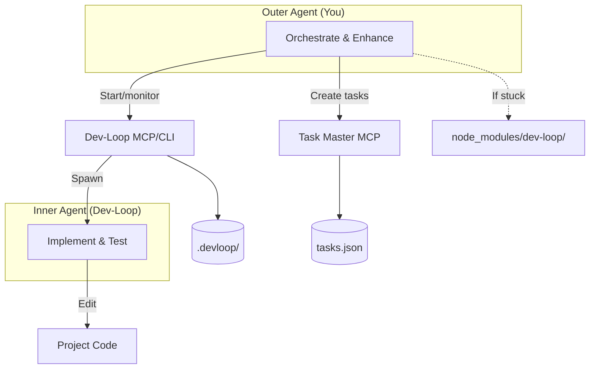

# Contribution Mode Guide

Complete guide to dev-loop's contribution mode - a two-agent architecture for contributing to dev-loop itself.

## Overview

Contribution mode enables you to enhance dev-loop while it autonomously implements project code. This two-agent architecture separates concerns:

- **Outer Agent (You)**: Enhances dev-loop core code, manages tasks, monitors progress
- **Inner Agent (Dev-Loop)**: Implements project code according to PRD requirements

## Two-Agent Architecture



## Critical Boundaries

### Outer Agent Scope

**You (Outer Agent) may ONLY edit:**

- `node_modules/dev-loop/` or linked dev-loop clone - Dev-loop enhancements (framework-agnostic only)
  - **Note**: If dev-loop is installed as npm/git dependency, source files may be in the linked clone location, not `node_modules/dev-loop/`. Check for linked clone location or edit in the actual dev-loop repository.
- `.taskmaster/tasks/tasks.json` - Task definitions
- `.taskmaster/docs/` - PRD updates
- `.devloop/` - Contribution mode state
- `devloop.config.js` - Dev-loop configuration (project/framework-specific settings here)

**When editing dev-loop source:**
- Add framework-agnostic features only
- For project-specific needs, extend `devloop.config.js` schema and configure per-project
- Never add Drupal, React, or other framework-specific code to dev-loop core

### Inner Agent Scope

**Dev-Loop (Inner Agent) may ONLY edit:**

- Project code (e.g., `docroot/`, `src/`, `tests/`, `config/`)
- Test files (e.g., `tests/playwright/`, `tests/cypress/`)
- Configuration files (e.g., `config/default/`)
- Scripts (e.g., `script/`, `scripts/`)

**Inner agent may NOT edit:**
- `node_modules/dev-loop/` - Dev-loop core code
- `.taskmaster/tasks/tasks.json` - Task definitions (managed by outer agent)
- `.devloop/contribution-mode.json` - Contribution mode state
- `devloop.config.js` - Dev-loop configuration

## Starting Contribution Mode

### CLI Mode

```bash
# Start contribution mode
npx dev-loop contribution start --prd <path>

# Monitor progress
npx dev-loop watch --until-complete

# Check status
npx dev-loop contribution status

# Stop contribution mode
npx dev-loop contribution stop
```

### MCP Mode

```typescript
// Start contribution mode
devloop_contribution_start(prd: "path/to/prd.md")

// Check status
devloop_contribution_status()

// Stop contribution mode
devloop_contribution_stop()
```

## State Management

Contribution mode maintains state in `.devloop/contribution-mode.json`. See [Contribution State Schema](CONTRIBUTION_STATE_SCHEMA.md) for complete reference.

**State File Structure:**

```json
{
  "active": true,
  "prdPath": ".taskmaster/docs/my_prd.md",
  "startedAt": "2025-01-20T10:00:00Z",
  "outerAgentBoundaries": {
    "allowed": ["node_modules/dev-loop/", ".taskmaster/", ".devloop/", "devloop.config.js"],
    "forbidden": ["docroot/", "tests/", "config/", "script/"]
  },
  "innerAgentBoundaries": {
    "allowed": ["docroot/", "tests/", "config/", "script/"],
    "forbidden": ["node_modules/dev-loop/", ".taskmaster/tasks/tasks.json", ".devloop/contribution-mode.json", "devloop.config.js"]
  },
  "rulesVersion": "1.0.0",
  "rulesSource": ".cursor/rules/dev-loop.mdc"
}
```

**State Validation:**
- On contribution mode start: Create/validate state file
- On each code change: Check boundaries against state file
- On contribution mode stop: Archive state file for audit

## Boundary Enforcement

Dev-loop validates boundaries programmatically:

1. **On Contribution Mode Start:**
   - Validates that project rules (`.cursor/rules/dev-loop.mdc`) exist
   - Checks that boundaries are defined
   - Stores validated boundaries in state file

2. **On Code Changes:**
   - Validates file paths against allowed/forbidden patterns
   - Rejects changes that violate boundaries
   - Logs boundary violations for debugging

3. **On Contribution Mode Stop:**
   - Archives state file for audit trail
   - Validates that all changes were within boundaries

## Workflow

### Standard Workflow

1. **Start Contribution Mode:**
   ```bash
   npx dev-loop contribution start --prd .taskmaster/docs/my_prd.md
   ```

2. **Let Inner Agent Work:**
   ```bash
   npx dev-loop watch --until-complete
   ```

3. **Monitor Progress:**
   - Watch dev-loop output
   - Check task status via Task Master MCP
   - Review test results

## Watching During Execution

When in contribution mode, you can watch dev-loop execution in real-time:

```bash
# In one terminal: Start contribution mode
npx dev-loop contribution start --prd <path>

# In another terminal: Watch execution
npx dev-loop watch --until-complete
```

This provides real-time feedback on:
- Task execution progress
- Parallel agent execution
- Pattern learning observations
- Error patterns and fixes

## Real-Time Observation

Dev-loop tracks observations during execution:
- Failure patterns
- Efficiency issues
- Validation trends
- Token spikes

These observations are available immediately for enhancing dev-loop code, enabling faster feedback loops. You can use these observations to:
- Identify patterns that need to be added to PatternLearningSystem
- Detect performance issues that require optimization
- Spot validation failures that need better guidance
- Monitor token usage for cost optimization

### Pattern Learning Integration

Dev-loop automatically learns from execution patterns:
- Successful patterns are reinforced
- Failure patterns trigger guidance injection
- Observations feed into the pattern learning system
- Patterns are stored in `.devloop/patterns.json`

You can enhance dev-loop by:
1. Observing patterns in real-time during execution
2. Adding patterns to PatternLearningSystem when needed
3. Improving prompts based on observed failures
4. Optimizing context discovery based on efficiency observations

4. **Enhance Dev-Loop (if needed):**
   - If inner agent is stuck, enhance dev-loop code
   - Edit files in `node_modules/dev-loop/src/`
   - Build: `cd node_modules/dev-loop && npm run build`
   - Commit and push dev-loop changes

5. **Update Tasks (if needed):**
   - If PRD needs more tasks, update `.taskmaster/tasks/tasks.json`
   - Let dev-loop continue implementation

6. **Validate Results:**
   - When all tasks pass, validate in browser
   - Run manual tests
   - Verify feature works as expected

7. **Stop Contribution Mode:**
   ```bash
   npx dev-loop contribution stop
   ```

### When to Enhance Dev-Loop vs Create Tasks

| Scenario | Action |
|----------|--------|
| One-off bug fix | Create task |
| Repeated pattern | Add to PatternLearningSystem |
| Missing context | Enhance CodeContextProvider |
| Better prompts | Update templates |
| Framework-specific need | Extend `devloop.config.js` |

## Project-Specific Rules

Projects can define additional rules in `.cursor/rules/dev-loop.mdc`:

```markdown
## Contribution Mode

### CRITICAL BOUNDARIES

**You (Cursor - Outer Agent) may ONLY edit:**
- `node_modules/dev-loop/` or linked dev-loop clone
- `.taskmaster/tasks/tasks.json`
- `.taskmaster/docs/`
- `.devloop/`
- `devloop.config.js`

**You may NOT directly edit (dev-loop inner agent scope):**
- `docroot/` - All Drupal code
- `tests/playwright/` - Playwright tests
- `config/` - Drupal configuration
- `script/` - PHP scripts
```

These project-specific rules are:
- Loaded on contribution mode start
- Validated against core rules
- Stored in state file
- Used for boundary enforcement

## Framework-Agnostic Principle

**CRITICAL**: Dev-loop core must remain framework-agnostic.

**Do NOT add to dev-loop core:**
- Drupal-specific code
- React-specific code
- Framework-specific templates
- Project-specific paths or patterns

**Do add to `devloop.config.js`:**
- Framework-specific rules
- Project-specific file patterns
- Framework-specific error guidance
- Project-specific templates

## Troubleshooting

### Boundary Violations

If you see boundary violation errors:

1. Check `.devloop/contribution-mode.json` for active boundaries
2. Verify file path matches allowed patterns
3. If legitimate, update project rules in `.cursor/rules/dev-loop.mdc`
4. Restart contribution mode to reload rules

### Inner Agent Stuck

If inner agent is stuck:

1. Check dev-loop logs: `npx dev-loop logs`
2. Review task status: `npx dev-loop status`
3. Diagnose failures: `npx dev-loop diagnose <task-id>`
4. Enhance dev-loop if needed (add patterns, improve prompts)
5. Update tasks if PRD needs clarification

### State File Issues

If state file is corrupted:

1. Stop contribution mode: `npx dev-loop contribution stop`
2. Delete `.devloop/contribution-mode.json`
3. Restart contribution mode

## Best Practices

1. **Always validate boundaries** before making changes
2. **Commit dev-loop changes immediately** after building
3. **Never edit project code directly** when in contribution mode
4. **Monitor inner agent progress** regularly
5. **Enhance dev-loop proactively** when patterns emerge
6. **Document project-specific rules** in `.cursor/rules/dev-loop.mdc`

## Related Documentation

- [Contribution State Schema](CONTRIBUTION_STATE_SCHEMA.md) - State file reference
- [Development Workflow](DEVELOPMENT_WORKFLOW.md) - How to make changes
- [Architecture](ARCHITECTURE.md) - Codebase structure
- [Testing](TESTING.md) - Writing and running tests
- [Pull Request Process](PULL_REQUEST.md) - Submitting contributions
