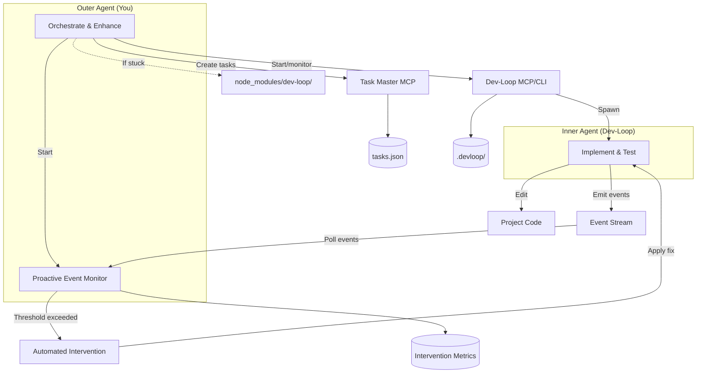

# Contribution Mode Guide

Complete guide to dev-loop's contribution mode - a two-agent architecture for contributing to dev-loop itself.

## Overview

Contribution mode enables you to enhance dev-loop while it autonomously implements project code. This two-agent architecture separates concerns:

- **Outer Agent (You)**: Enhances dev-loop core code, manages tasks, monitors progress
- **Inner Agent (Dev-Loop)**: Implements project code according to PRD requirements

## Two-Agent Architecture



## Critical Boundaries

### Outer Agent Scope

**You (Outer Agent) may ONLY edit:**

- `node_modules/dev-loop/` or linked dev-loop clone - Dev-loop enhancements (framework-agnostic only)
  - **Note**: If dev-loop is installed as npm/git dependency, source files may be in the linked clone location, not `node_modules/dev-loop/`. Check for linked clone location or edit in the actual dev-loop repository.
- `.taskmaster/tasks/tasks.json` - Task definitions
- `.taskmaster/docs/` - PRD updates
- `.devloop/` - Contribution mode state
- `devloop.config.js` - Dev-loop configuration (project/framework-specific settings here)

**When editing dev-loop source:**
- Add framework-agnostic features only
- For project-specific needs, extend `devloop.config.js` schema and configure per-project
- Never add Drupal, React, or other framework-specific code to dev-loop core

### Inner Agent Scope

**Dev-Loop (Inner Agent) may ONLY edit:**

- Project code (e.g., `docroot/`, `src/`, `tests/`, `config/`)
- Test files (e.g., `tests/playwright/`, `tests/cypress/`)
- Configuration files (e.g., `config/default/`)
- Scripts (e.g., `script/`, `scripts/`)

**Inner agent may NOT edit:**
- `node_modules/dev-loop/` - Dev-loop core code
- `.taskmaster/tasks/tasks.json` - Task definitions (managed by outer agent)
- `.devloop/contribution-mode.json` - Contribution mode state
- `devloop.config.js` - Dev-loop configuration

## Starting Contribution Mode

### CLI Mode

```bash
# Start contribution mode
npx dev-loop contribution start --prd <path>

# Monitor progress
npx dev-loop watch --until-complete

# Check status
npx dev-loop contribution status

# Stop contribution mode
npx dev-loop contribution stop
```

### MCP Mode

```typescript
// Start contribution mode
devloop_contribution_start(prd: "path/to/prd.md")

// Check status
devloop_contribution_status()

// Stop contribution mode
devloop_contribution_stop()
```

## Issue Detection & Monitoring

Contribution mode includes automatic issue detection to alert the outer agent when systemic problems occur. These metrics enable proactive identification and resolution of issues before they impact execution.

**CRITICAL: The outer agent should monitor via event streaming, NOT log parsing.** All issue detection emits `contribution:issue_detected` events that can be polled via `devloop_events_poll` or monitored proactively via `devloop_event_monitor_start`. Log parsing is deprecated in favor of structured event streaming.

### Module Confusion Detection

**Issue**: Agents targeting the wrong module (e.g., targeting `bd_devloop_enhancement_test` instead of `bd_restructure_validation_test`).

**Detection**:
- Tracks file filtering rate per target module
- Alerts when filtered file rate exceeds threshold (>10%)
- Records incidents with task ID, target module, wrong module, and timestamp

**Metrics**:
- `ContributionModeMetrics.issues.moduleConfusion.filteredFileRate`
- `ContributionModeMetrics.issues.moduleConfusion.incidents[]`

**Alert**: `contribution:issue_detected` event with `issueType: 'module-confusion'` is emitted when threshold exceeded.

### Session Pollution Detection

**Issue**: Sessions shared across PRD sets with different target modules, causing context pollution.

**Detection**:
- Tracks sessions used for multiple target modules
- Detects when a session is reused for a different target module
- Records incidents with session ID, modules, and task IDs

**Metrics**:
- `ContributionModeMetrics.issues.sessionPollution.sessionsWithMultipleModules`
- `ContributionModeMetrics.issues.sessionPollution.incidents[]`

**Alert**: `contribution:issue_detected` event with `issueType: 'session-pollution'` is emitted on first detection.

### Boundary Violation Monitoring

**Issue**: Repeated boundary violations indicating systemic issues with file filtering.

**Detection**:
- Tracks boundary violation rate (% of file operations)
- Alerts when violation rate exceeds threshold (>5%)
- Records violation patterns for analysis

**Metrics**:
- `ContributionModeMetrics.issues.boundaryViolations.rate`
- `ContributionModeMetrics.issues.boundaryViolations.total`
- `ContributionModeMetrics.issues.boundaryViolations.byPattern`

**Alert**: `contribution:issue_detected` event with `issueType: 'boundary-violations'` is emitted when threshold exceeded.

### Target Module Context Loss Detection

**Issue**: Tasks executed without target module context, leading to confusion about which module to modify.

**Detection**:
- Monitors tasks executed without target module in context
- Alerts when context loss rate exceeds threshold (>1%)
- Tracks total tasks vs tasks without target module

**Metrics**:
- `ContributionModeMetrics.issues.targetModuleContextLoss.rate`
- `ContributionModeMetrics.issues.targetModuleContextLoss.tasksWithoutTargetModule`

**Alert**: `contribution:issue_detected` event with `issueType: 'target-module-context-loss'` is emitted when threshold exceeded.

### Code Generation Degradation Detection

**Issue**: Code generation quality degrading over time (e.g., increasing test failures after code generation, decreasing success rates).

**Detection**:
- Tracks code generation success rate over time window (default: 24 hours)
- Monitors test pass rate trends after code generation
- Calculates degradation rate from baseline success rate
- Alerts when degradation rate exceeds threshold (>20% degradation) or pass rate trend is negative

**Metrics**:
- `ContributionModeMetrics.issues.codeGenerationDegradation.successRateTrend`
- `ContributionModeMetrics.issues.codeGenerationDegradation.testPassRateTrend`
- `ContributionModeMetrics.issues.codeGenerationDegradation.degradationRate`

**Alert**: `contribution:issue_detected` event with `issueType: 'code-generation-degradation'` when threshold exceeded.

**Intervention Strategy**: `enhance-code-generation-prompts` - Analyze failing patterns and enhance AI prompts/templates.

### Context Window Inefficiency Detection

**Issue**: Context building becoming inefficient (e.g., large context windows but still missing critical files, token usage growing without value).

**Detection**:
- Tracks context window size vs. task success rate
- Monitors token usage per task vs. success rate
- Detects pattern: large context → still missing files → task failure
- Alerts when context efficiency ratio (success rate / tokens per task) degrades significantly or missing file rate exceeds threshold (>20%)

**Metrics**:
- `ContributionModeMetrics.issues.contextWindowInefficiency.avgContextSize`
- `ContributionModeMetrics.issues.contextWindowInefficiency.tokensPerSuccess`
- `ContributionModeMetrics.issues.contextWindowInefficiency.missingFileRate`
- `ContributionModeMetrics.issues.contextWindowInefficiency.efficiencyRatio`

**Alert**: `contribution:issue_detected` event with `issueType: 'context-window-inefficiency'` when efficiency drops.

**Intervention Strategy**: `optimize-context-discovery` - Enhance codebase discovery to find relevant files more efficiently.

### Task Dependency Deadlock Detection

**Issue**: Tasks getting blocked due to circular dependencies or dependency resolution issues.

**Detection**:
- Tracks tasks stuck in "pending" due to unresolved dependencies
- Detects circular dependency patterns in task graph using DFS algorithm
- Monitors tasks waiting longer than threshold (>30 minutes) with unresolved dependencies
- Alerts when dependency deadlock pattern detected or average wait time exceeds threshold

**Metrics**:
- `ContributionModeMetrics.issues.taskDependencyDeadlock.blockedTasks`
- `ContributionModeMetrics.issues.taskDependencyDeadlock.circularDependencies`
- `ContributionModeMetrics.issues.taskDependencyDeadlock.avgWaitTime`

**Alert**: `contribution:issue_detected` event with `issueType: 'task-dependency-deadlock'` when deadlock detected.

**Intervention Strategy**: `resolve-dependency-deadlock` - Analyze dependency graph and suggest dependency resolution or task reordering, reset retry counts for blocked tasks.

### Test Generation Quality Detection

**Issue**: Generated tests consistently failing to validate requirements or missing edge cases.

**Detection**:
- Tracks test generation success rate (tests that pass on first run)
- Monitors test coverage vs. requirements coverage
- Detects pattern: test generated → immediately fails → indicates test quality issue
- Alerts when test generation success rate drops below threshold (<70%) or immediate failure rate exceeds threshold (>30%)

**Metrics**:
- `ContributionModeMetrics.issues.testGenerationQuality.successRate`
- `ContributionModeMetrics.issues.testGenerationQuality.coverageGap`
- `ContributionModeMetrics.issues.testGenerationQuality.immediateFailureRate`

**Alert**: `contribution:issue_detected` event with `issueType: 'test-generation-quality'` when quality degrades.

**Intervention Strategy**: `enhance-test-generation-templates` - Improve test generation prompts and templates based on failure patterns.

### Validation Gate Over-Blocking Detection

**Issue**: Validation gates blocking too many valid changes, causing unnecessary retries and delays.

**Detection**:
- Tracks validation failure rate vs. actual issue rate (false positives)
- Monitors pattern: validation fails → change is actually valid → retry succeeds
- Tracks validation failure reasons and frequency
- Alerts when validation false positive rate exceeds threshold (>30%)

**Metrics**:
- `ContributionModeMetrics.issues.validationGateOverBlocking.falsePositiveRate`
- `ContributionModeMetrics.issues.validationGateOverBlocking.blockedValidChanges`
- `ContributionModeMetrics.issues.validationGateOverBlocking.retrySuccessRate`

**Alert**: `contribution:issue_detected` event with `issueType: 'validation-gate-over-blocking'` when false positive rate too high.

**Intervention Strategy**: `relax-validation-gates` - Adjust validation thresholds or improve validation logic based on false positive patterns.

### AI Provider Instability Detection

**Issue**: AI provider responses becoming inconsistent or unreliable (timeouts, rate limits, degraded quality).

**Detection**:
- Tracks provider response time trends
- Monitors provider error rates (timeouts, rate limits, API errors)
- Tracks response quality degradation (JSON parsing failures, malformed responses)
- Alerts when provider stability metrics degrade significantly (error rate >10%, timeout rate >10%, or quality trend < -10%)

**Metrics**:
- `ContributionModeMetrics.issues.aiProviderInstability.errorRate`
- `ContributionModeMetrics.issues.aiProviderInstability.timeoutRate`
- `ContributionModeMetrics.issues.aiProviderInstability.qualityTrend`

**Alert**: `contribution:issue_detected` event with `issueType: 'ai-provider-instability'` when provider issues detected.

**Intervention Strategy**: `enhance-retry-logic` or `switch-ai-provider` - Suggest fallback provider or improve retry/timeout handling.

### Resource Exhaustion Detection

**Issue**: System resources (memory, disk, network) being exhausted during execution.

**Detection**:
- Tracks memory usage trends during execution
- Monitors disk space usage (especially `.devloop/` growth)
- Tracks network timeout rates
- Alerts when resource usage exceeds thresholds or shows rapid growth (memory/disk >80%, timeout rate >10%)

**Metrics**:
- `ContributionModeMetrics.issues.resourceExhaustion.memoryUsageTrend`
- `ContributionModeMetrics.issues.resourceExhaustion.diskUsageTrend`
- `ContributionModeMetrics.issues.resourceExhaustion.timeoutRate`

**Alert**: `contribution:issue_detected` event with `issueType: 'resource-exhaustion'` when resources constrained.

**Intervention Strategy**: `cleanup-resources` - Suggest cleanup operations, archive old metrics, or optimize resource usage.

### Phase Progression Stalling Detection

**Issue**: Phases getting stuck with no progress (tasks not advancing, no new tasks being processed).

**Detection**:
- Tracks phase progression rate (tasks completed per hour)
- Monitors phases with no progress for extended periods (>60 minutes)
- Detects pattern: phase started → no tasks completed → stalling
- Alerts when phase progression rate drops to zero or below threshold (<0.1 tasks/hour) or stall duration exceeds threshold

**Metrics**:
- `ContributionModeMetrics.issues.phaseProgressionStalling.stalledPhases`
- `ContributionModeMetrics.issues.phaseProgressionStalling.avgProgressRate`
- `ContributionModeMetrics.issues.phaseProgressionStalling.stallDuration`

**Alert**: `contribution:issue_detected` event with `issueType: 'phase-progression-stalling'` when phase stalls.

**Intervention Strategy**: `unblock-phase` - Analyze why phase is stalled and suggest fixes (unblock tasks, resolve dependencies, etc.).

### Pattern Learning Inefficacy Detection

**Issue**: Pattern learning system not effectively improving outcomes (patterns matched but not applied, or applied but ineffective).

**Detection**:
- Tracks pattern match rate vs. application rate
- Monitors pattern application success rate
- Detects pattern: pattern matched → not applied → same error recurs
- Alerts when pattern learning effectiveness drops below threshold (<50% match-to-application rate) or recurring pattern rate exceeds threshold (>30%)

**Metrics**:
- `ContributionModeMetrics.issues.patternLearningInefficacy.matchToApplicationRate`
- `ContributionModeMetrics.issues.patternLearningInefficacy.applicationSuccessRate`
- `ContributionModeMetrics.issues.patternLearningInefficacy.recurringPatternRate`

**Alert**: `contribution:issue_detected` event with `issueType: 'pattern-learning-inefficacy'` when learning ineffective.

**Intervention Strategy**: `enhance-pattern-learning` - Improve pattern matching logic or pattern application strategies.

### Schema Validation Consistency Detection

**Issue**: Schema validation producing inconsistent results or blocking valid schema operations.

**Detection**:
- Tracks schema validation success/failure patterns
- Monitors schema validation time vs. schema complexity
- Detects pattern: valid schema → validation fails → indicates validation issue
- Alerts when schema validation false positive rate exceeds threshold (>20%) or validation time trend increases significantly (>1000ms)

**Metrics**:
- `ContributionModeMetrics.issues.schemaValidationConsistency.falsePositiveRate`
- `ContributionModeMetrics.issues.schemaValidationConsistency.validationTimeTrend`
- `ContributionModeMetrics.issues.schemaValidationConsistency.inconsistencyRate`

**Alert**: `contribution:issue_detected` event with `issueType: 'schema-validation-consistency'` when inconsistencies detected.

**Intervention Strategy**: `fix-schema-validation` - Improve schema validation logic based on false positive patterns.

### Using Issue Detection Metrics

Issue detection metrics are automatically collected during contribution mode execution. Access them via:

**MCP Tools**:
```typescript
// Get contribution mode metrics
const metrics = await devloop_metrics({ prdId: "my-prd" });

// Check for issues
if (metrics.contributionMode?.issues.moduleConfusion.detected) {
  console.log(`Module confusion detected: ${metrics.contributionMode.issues.moduleConfusion.filteredFileRate * 100}% filtered file rate`);
}

if (metrics.contributionMode?.issues.sessionPollution.detected) {
  console.log(`Session pollution: ${metrics.contributionMode.issues.sessionPollution.sessionsWithMultipleModules} sessions with multiple modules`);
}

if (metrics.contributionMode?.issues.codeGenerationDegradation.detected) {
  console.log(`Code generation degradation: ${(metrics.contributionMode.issues.codeGenerationDegradation.degradationRate * 100).toFixed(1)}% degradation`);
}

if (metrics.contributionMode?.issues.contextWindowInefficiency.detected) {
  console.log(`Context window inefficiency: efficiency ratio ${metrics.contributionMode.issues.contextWindowInefficiency.efficiencyRatio.toFixed(4)}, missing file rate ${(metrics.contributionMode.issues.contextWindowInefficiency.missingFileRate * 100).toFixed(1)}%`);
}

if (metrics.contributionMode?.issues.taskDependencyDeadlock.detected) {
  console.log(`Task dependency deadlock: ${metrics.contributionMode.issues.taskDependencyDeadlock.blockedTasks} blocked tasks, ${metrics.contributionMode.issues.taskDependencyDeadlock.circularDependencies.length} circular dependencies`);
}

if (metrics.contributionMode?.issues.testGenerationQuality.detected) {
  console.log(`Test generation quality: success rate ${(metrics.contributionMode.issues.testGenerationQuality.successRate * 100).toFixed(1)}%, immediate failures ${(metrics.contributionMode.issues.testGenerationQuality.immediateFailureRate * 100).toFixed(1)}%`);
}

if (metrics.contributionMode?.issues.validationGateOverBlocking.detected) {
  console.log(`Validation gate over-blocking: false positive rate ${(metrics.contributionMode.issues.validationGateOverBlocking.falsePositiveRate * 100).toFixed(1)}%, ${metrics.contributionMode.issues.validationGateOverBlocking.blockedValidChanges} valid changes blocked`);
}

if (metrics.contributionMode?.issues.aiProviderInstability.detected) {
  console.log(`AI provider instability: error rate ${(metrics.contributionMode.issues.aiProviderInstability.errorRate * 100).toFixed(1)}%, timeout rate ${(metrics.contributionMode.issues.aiProviderInstability.timeoutRate * 100).toFixed(1)}%`);
}

if (metrics.contributionMode?.issues.phaseProgressionStalling.detected) {
  console.log(`Phase progression stalling: ${metrics.contributionMode.issues.phaseProgressionStalling.stalledPhases.length} stalled phases, progress rate ${metrics.contributionMode.issues.phaseProgressionStalling.avgProgressRate.toFixed(2)} tasks/hour`);
}

if (metrics.contributionMode?.issues.patternLearningInefficacy.detected) {
  console.log(`Pattern learning inefficacy: match-to-application rate ${(metrics.contributionMode.issues.patternLearningInefficacy.matchToApplicationRate * 100).toFixed(1)}%, recurring pattern rate ${(metrics.contributionMode.issues.patternLearningInefficacy.recurringPatternRate * 100).toFixed(1)}%`);
}

if (metrics.contributionMode?.issues.schemaValidationConsistency.detected) {
  console.log(`Schema validation consistency: false positive rate ${(metrics.contributionMode.issues.schemaValidationConsistency.falsePositiveRate * 100).toFixed(1)}%, validation time trend ${metrics.contributionMode.issues.schemaValidationConsistency.validationTimeTrend.toFixed(0)}ms`);
}
```

**Event Monitoring**:
```typescript
// Poll for issue detection events
const issues = await devloop_events_poll({
  types: ['contribution:issue_detected'],
  since: lastEventId
});

for (const issue of issues) {
  console.log(`Issue detected: ${issue.data.issueType} - ${JSON.stringify(issue.data)}`);
}
```

These metrics enable the outer agent to automatically detect and fix issues like those observed in the restructure-schema-validation session, improving system reliability and reducing manual intervention.

### Proactive Monitoring & Automated Interventions

Contribution mode includes a proactive event monitoring system that automatically detects issues and applies corrective actions when thresholds are exceeded. This enables automated issue resolution without manual intervention.

#### EventMonitorService Integration

The EventMonitorService continuously monitors the event stream and triggers automated interventions when configured thresholds are exceeded:

1. **Event Polling**: Service polls events every N seconds (configurable, default: 5 seconds)
2. **Threshold Checking**: Checks event counts/rates against configured thresholds
3. **Issue Classification**: Classifies issues and determines confidence levels
4. **Action Execution**: Executes fix strategies automatically (if confidence is high) or requests approval
5. **Effectiveness Monitoring**: Monitors intervention outcomes and rolls back if regressions occur

#### Automated Fix Strategies

The system includes pre-configured fix strategies for common issue types:

| Issue Type | Strategy | Action |
|------------|----------|--------|
| JSON parsing failures | `enhance-json-parser` | Enhances JSON parser with better extraction logic |
| Task blocking | `unblock-task` | Unblocks tasks with enhanced context, resets retry count |
| Boundary violations | `enhance-boundary-enforcement` | Enhances boundary enforcement logic, adds early filtering |
| Validation failures | `enhance-validation-gates` | Improves validation gates, adds recovery suggestions |
| Contribution mode issues | `fix-contribution-mode-issue` | Fixes based on specific issue type (module confusion, session pollution, etc.) |
| IPC connection failures | `enhance-ipc-connection` | Adds retry logic with exponential backoff |
| Code generation degradation | `enhance-code-generation-prompts` | Analyzes failure patterns and enhances AI prompts/templates |
| Context window inefficiency | `optimize-context-discovery` | Enhances codebase discovery to find relevant files more efficiently |
| Task dependency deadlock | `resolve-dependency-deadlock` | Analyzes dependency graph, suggests resolution, resets retry counts |
| Test generation quality | `enhance-test-generation-templates` | Improves test generation prompts and templates based on failure patterns |
| Validation gate over-blocking | `relax-validation-gates` | Adjusts validation thresholds or improves logic based on false positive patterns |
| AI provider instability | `enhance-retry-logic` or `switch-ai-provider` | Suggests fallback provider or improves retry/timeout handling |
| Resource exhaustion | `cleanup-resources` | Suggests cleanup operations, archives old metrics, optimizes resource usage |
| Phase progression stalling | `unblock-phase` | Analyzes why phase is stalled and suggests fixes (unblock tasks, resolve dependencies) |
| Pattern learning inefficacy | `enhance-pattern-learning` | Improves pattern matching logic or pattern application strategies |
| Schema validation consistency | `fix-schema-validation` | Improves schema validation logic based on false positive patterns |

See [Proactive Monitoring Guide](./PROACTIVE_MONITORING.md) for detailed strategy reference and configuration.

#### Configuration

Enable proactive monitoring in `devloop.config.js`:

```javascript
module.exports = {
  // ... other config
  mcp: {
    eventMonitoring: {
      enabled: true,
      pollingInterval: 5000,  // Milliseconds between polls
      thresholds: {
        'json:parse_failed': {
          count: 3,
          windowMs: 600000,    // 10 minutes
          autoAction: true,
          confidence: 0.8
        },
        'task:blocked': {
          count: 1,
          autoAction: true,
          confidence: 0.7
        },
        'file:boundary_violation': {
          count: 1,            // Critical: trigger immediately
          autoAction: true,
          confidence: 0.9
        }
      },
      actions: {
        requireApproval: ['validation:failed'],
        autoExecute: ['json:parse_failed', 'task:blocked', 'file:boundary_violation'],
        maxInterventionsPerHour: 10
      },
      metrics: {
        trackInterventions: true,
        trackSuccessRate: true,
        trackRollbacks: true
      }
    }
  }
};
```

#### Intervention Effectiveness Tracking

The system tracks intervention effectiveness to continuously improve:

- **Success Rate**: Percentage of successful interventions
- **Effectiveness by Issue Type**: Success rate per issue type
- **Timing Metrics**: Detection time, fix time, validation time
- **Pattern Analysis**: Most/least effective strategies, common failure modes

Access intervention metrics via:

```typescript
// Get intervention metrics
const { status, metrics, effectiveness } = await devloop_event_monitor_status();

console.log(`Total Interventions: ${metrics.totalInterventions}`);
console.log(`Success Rate: ${(metrics.successRate * 100).toFixed(1)}%`);

// Review recent interventions
const { interventions, summary } = await devloop_event_monitor_interventions({
  limit: 20
});
```

#### Lifecycle Management

The monitoring service:
- **Starts automatically** when contribution mode is activated (if enabled in config)
- **Stops automatically** when contribution mode is stopped
- **Can be controlled manually** via MCP tools: `devloop_event_monitor_start`, `devloop_event_monitor_stop`, `devloop_event_monitor_status`
- **Updates configuration at runtime** via `devloop_event_monitor_configure`

#### Integration with Issue Detection

Proactive monitoring complements existing issue detection:

- **Issue Detection Metrics**: Track long-term patterns (module confusion, session pollution, etc.)
- **Proactive Monitoring**: Respond to immediate issues (JSON parsing failures, blocked tasks, etc.)
- **Event Stream**: Both systems emit events that can be monitored via `devloop_events_poll`

The proactive monitoring system uses the same event stream as issue detection, enabling unified monitoring and intervention strategies.

See [Event Streaming Guide](./EVENT_STREAMING.md) for complete event monitoring guide.

## State Management

Contribution mode maintains state in `.devloop/contribution-mode.json`. See [Contribution State Schema](CONTRIBUTION_STATE_SCHEMA.md) for complete reference.

**State File Structure:**

```json
{
  "active": true,
  "prdPath": ".taskmaster/docs/my_prd.md",
  "startedAt": "2025-01-20T10:00:00Z",
  "outerAgentBoundaries": {
    "allowed": ["node_modules/dev-loop/", ".taskmaster/", ".devloop/", "devloop.config.js"],
    "forbidden": ["docroot/", "tests/", "config/", "script/"]
  },
  "innerAgentBoundaries": {
    "allowed": ["docroot/", "tests/", "config/", "script/"],
    "forbidden": ["node_modules/dev-loop/", ".taskmaster/tasks/tasks.json", ".devloop/contribution-mode.json", "devloop.config.js"]
  },
  "rulesVersion": "1.0.0",
  "rulesSource": ".cursor/rules/dev-loop.mdc"
}
```

**State Validation:**
- On contribution mode start: Create/validate state file
- On each code change: Check boundaries against state file
- On contribution mode stop: Archive state file for audit

## Boundary Enforcement

Dev-loop validates boundaries programmatically:

1. **On Contribution Mode Start:**
   - Validates that project rules (`.cursor/rules/dev-loop.mdc`) exist
   - Checks that boundaries are defined
   - Stores validated boundaries in state file

2. **On Code Changes:**
   - Validates file paths against allowed/forbidden patterns
   - Rejects changes that violate boundaries
   - Logs boundary violations for debugging

3. **On Contribution Mode Stop:**
   - Archives state file for audit trail
   - Validates that all changes were within boundaries

## Workflow

### Standard Workflow

1. **Start Contribution Mode:**
   ```bash
   npx dev-loop contribution start --prd .taskmaster/docs/my_prd.md
   ```

2. **Let Inner Agent Work:**
   ```bash
   npx dev-loop watch --until-complete
   ```

3. **Monitor Progress:**
   - **Monitor via event streaming**: Use `devloop_events_poll` or `devloop_event_monitor_start` to monitor `contribution:issue_detected` events
   - Check task status via Task Master MCP: `task_master: list_tasks`
   - Review test results: Check test execution status
   - **DO NOT parse logs** - Use structured event streaming instead

## Watching During Execution

When in contribution mode, the outer agent should monitor via event streaming:

```bash
# In one terminal: Start contribution mode
npx dev-loop contribution start --prd <path>

# In another terminal: Start watch mode (inner agent executes)
npx dev-loop watch --until-complete
```

**Outer Agent Monitoring (via MCP tools):**

```typescript
// Start proactive event monitoring (recommended)
await devloop_event_monitor_start();

// Or poll events manually
let lastEventId = null;
while (true) {
  const { events } = await devloop_events_poll({
    types: ['contribution:issue_detected'],
    since: lastEventId
  });
  
  for (const event of events) {
    console.log(`Issue detected: ${event.data.issueType}`);
    // Handle issue based on type
  }
  
  lastEventId = events[events.length - 1]?.id;
  await sleep(5000); // Poll every 5 seconds
}
```

This provides real-time feedback on:
- Task execution progress
- Contribution mode issue detection (14 issue types)
- Pattern learning observations
- Error patterns and fixes
- Proactive interventions and their outcomes

**NOTE: Do NOT monitor via log parsing.** Use structured event streaming via MCP tools for efficient, real-time monitoring.

## Real-Time Observation

Dev-loop tracks observations during execution:
- Failure patterns
- Efficiency issues
- Validation trends
- Token spikes

These observations are available immediately for enhancing dev-loop code, enabling faster feedback loops. You can use these observations to:
- Identify patterns that need to be added to PatternLearningSystem
- Detect performance issues that require optimization
- Spot validation failures that need better guidance
- Monitor token usage for cost optimization

### Pattern Learning Integration

Dev-loop automatically learns from execution patterns:
- Successful patterns are reinforced
- Failure patterns trigger guidance injection
- Observations feed into the pattern learning system
- Patterns are stored in `.devloop/patterns.json`

You can enhance dev-loop by:
1. Observing patterns in real-time during execution
2. Adding patterns to PatternLearningSystem when needed
3. Improving prompts based on observed failures
4. Optimizing context discovery based on efficiency observations

## Event Streaming & Observability

Dev-loop emits structured events for efficient contribution mode monitoring:

### Event Types

| Event | Description |
|-------|-------------|
| `file:filtered` | File blocked due to target module boundary |
| `validation:failed` | Pre-apply validation failure |
| `task:blocked` | Task exceeded max retries |
| `change:unauthorized` | Unauthorized git change detected |
| `change:reverted` | Unauthorized change reverted |

### Accessing Events via MCP

Use MCP tools to query events:

| Tool | Description |
|------|-------------|
| `devloop_events_poll` | Get events since timestamp |
| `devloop_events_latest` | Get N most recent events |
| `devloop_blocked_tasks` | List blocked tasks |
| `devloop_filtered_files` | List filtered file paths |
| `devloop_issues` | Get all warn/error/critical events |

### Example Usage

```typescript
// Poll for new events since last check
const { events } = await devloop_events_poll({
  sinceTimestamp: lastCheckTime,
  filterSeverity: 'warn'
});

// Check for filtered files
const { filteredFiles } = await devloop_filtered_files();

// Get all issues
const { issues } = await devloop_issues();
```

### Event Streaming vs Log Parsing

Event streaming is more efficient than log parsing for contribution mode:

| Aspect | Event Streaming | Log Parsing |
|--------|-----------------|-------------|
| Structure | Structured JSON | Unstructured text |
| Filtering | Built-in filters | Manual regex |
| Performance | Direct access | File I/O overhead |
| Real-time | Yes | Tail-based |

See [`EVENT_STREAMING.md`](EVENT_STREAMING.md) for complete guide.

4. **Enhance Dev-Loop (if needed):**
   - If inner agent is stuck, enhance dev-loop code
   - Edit files in `node_modules/dev-loop/src/`
   - Build: `cd node_modules/dev-loop && npm run build`
   - Commit and push dev-loop changes

5. **Update Tasks (if needed):**
   - If PRD needs more tasks, update `.taskmaster/tasks/tasks.json`
   - Let dev-loop continue implementation

6. **Validate Results:**
   - When all tasks pass, validate in browser
   - Run manual tests
   - Verify feature works as expected

7. **Stop Contribution Mode:**
   ```bash
   npx dev-loop contribution stop
   ```

### When to Enhance Dev-Loop vs Create Tasks

| Scenario | Action |
|----------|--------|
| One-off bug fix | Create task |
| Repeated pattern | Add to PatternLearningSystem |
| Missing context | Enhance CodeContextProvider |
| Better prompts | Update templates |
| Framework-specific need | Extend `devloop.config.js` |

## Project-Specific Rules

Projects can define additional rules in `.cursor/rules/dev-loop.mdc`:

```markdown
## Contribution Mode

### CRITICAL BOUNDARIES

**You (Cursor - Outer Agent) may ONLY edit:**
- `node_modules/dev-loop/` or linked dev-loop clone
- `.taskmaster/tasks/tasks.json`
- `.taskmaster/docs/`
- `.devloop/`
- `devloop.config.js`

**You may NOT directly edit (dev-loop inner agent scope):**
- `docroot/` - All Drupal code
- `tests/playwright/` - Playwright tests
- `config/` - Drupal configuration
- `script/` - PHP scripts
```

These project-specific rules are:
- Loaded on contribution mode start
- Validated against core rules
- Stored in state file
- Used for boundary enforcement

## Framework-Agnostic Principle

**CRITICAL**: Dev-loop core must remain framework-agnostic.

**Do NOT add to dev-loop core:**
- Drupal-specific code
- React-specific code
- Framework-specific templates
- Project-specific paths or patterns

**Do add to `devloop.config.js`:**
- Framework-specific rules
- Project-specific file patterns
- Framework-specific error guidance
- Project-specific templates

## Troubleshooting

### Boundary Violations

If you see boundary violation errors:

1. Check `.devloop/contribution-mode.json` for active boundaries
2. Verify file path matches allowed patterns
3. If legitimate, update project rules in `.cursor/rules/dev-loop.mdc`
4. Restart contribution mode to reload rules

### Inner Agent Stuck

If inner agent is stuck:

1. Check dev-loop logs: `npx dev-loop logs`
2. Review task status: `npx dev-loop status`
3. Diagnose failures: `npx dev-loop diagnose <task-id>`
4. Enhance dev-loop if needed (add patterns, improve prompts)
5. Update tasks if PRD needs clarification

### State File Issues

If state file is corrupted:

1. Stop contribution mode: `npx dev-loop contribution stop`
2. Delete `.devloop/contribution-mode.json`
3. Restart contribution mode

## Best Practices

1. **Always validate boundaries** before making changes
2. **Commit dev-loop changes immediately** after building
3. **Never edit project code directly** when in contribution mode
4. **Monitor inner agent progress** regularly
5. **Enhance dev-loop proactively** when patterns emerge
6. **Document project-specific rules** in `.cursor/rules/dev-loop.mdc`

## Related Documentation

- [Event Streaming](EVENT_STREAMING.md) - Event streaming guide for contribution mode
- [Proactive Monitoring](./PROACTIVE_MONITORING.md) - Comprehensive proactive monitoring and intervention guide
- [Observation Tools](./OBSERVATION_TOOLS.md) - Enhanced observation MCP tools reference
- [Boundary Enforcement](BOUNDARY_ENFORCEMENT.md) - Boundary validation implementation
- [Contribution State Schema](CONTRIBUTION_STATE_SCHEMA.md) - State file reference
- [Development Workflow](DEVELOPMENT_WORKFLOW.md) - How to make changes
- [Architecture](ARCHITECTURE.md) - Codebase structure
- [Testing](TESTING.md) - Writing and running tests
- [Pull Request Process](PULL_REQUEST.md) - Submitting contributions
