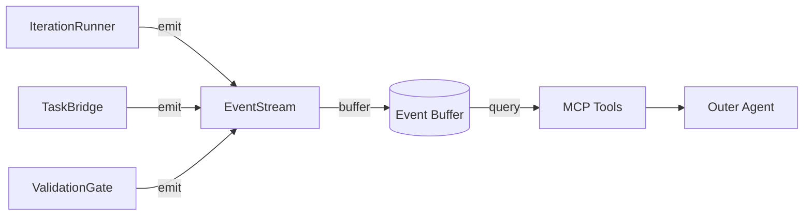
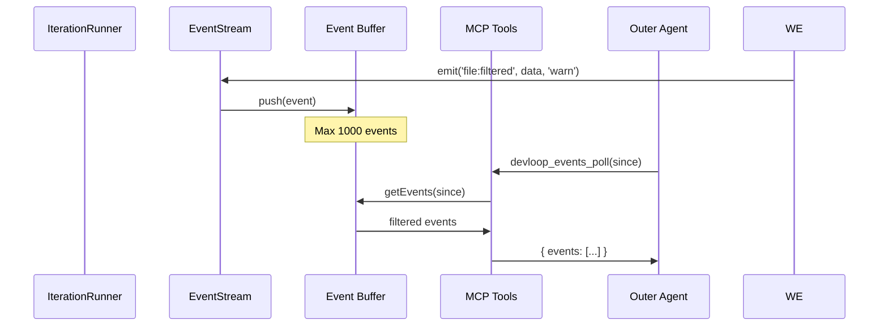
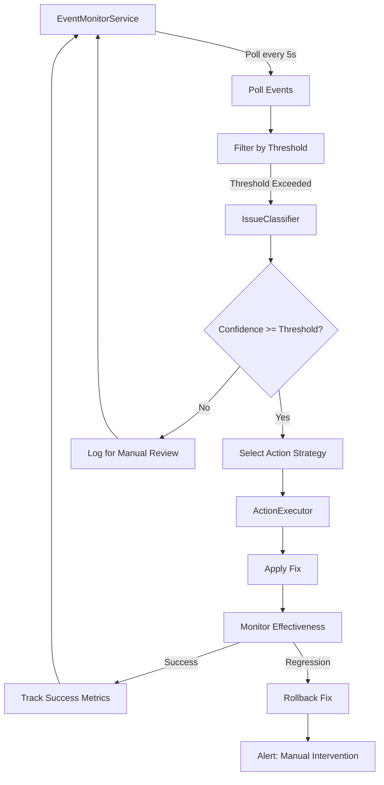
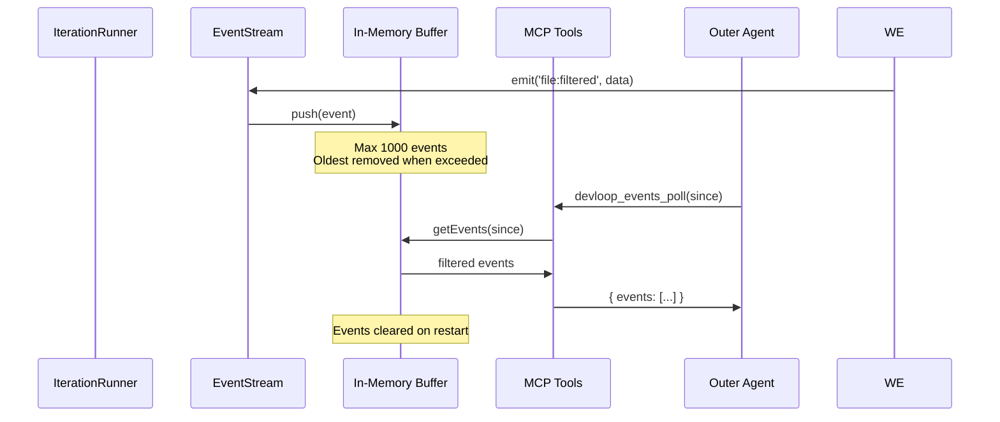
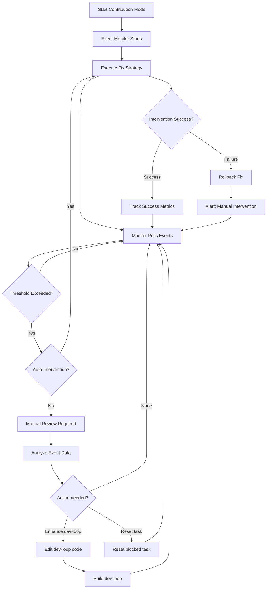

# Event Streaming Guide

Complete guide to dev-loop's event streaming system for contribution mode observability.

## Overview

Event streaming provides structured, real-time event emission for monitoring dev-loop execution. It's designed for efficient contribution mode observation without manual log parsing.



## Event Types

**Note**: All events automatically update relevant metrics when emitted via the event-to-metrics bridge. See the "Event-to-Metrics Bridge" section below for details.

## Event Types

### File Filtering Events

| Event | Severity | Description |
|-------|----------|-------------|
| `file:filtered` | warn | File blocked due to target module boundary |

**Payload:**
```typescript
{
  path: string;           // Filtered file path
  targetModule: string;   // Target module boundary
  taskId: string;         // Current task ID
  prdId: string;          // PRD identifier
  phaseId: number;        // Phase number
  reason: string;         // Why filtered
}
```

### Validation Events

| Event | Severity | Description |
|-------|----------|-------------|
| `validation:failed` | error | Pre-apply validation failure |

**Payload:**
```typescript
{
  taskId: string;
  prdId: string;
  phaseId: number;
  errors: Array<{
    type: string;
    message: string;
    file?: string;
  }>;
}
```

### Task Events

| Event | Severity | Description |
|-------|----------|-------------|
| `task:blocked` | warn | Task exceeded max retries |

**Payload:**
```typescript
{
  taskId: string;
  reason: string;         // e.g., "max retries exceeded"
}
```

### Change Events

| Event | Severity | Description |
|-------|----------|-------------|
| `change:unauthorized` | warn | Unauthorized git change detected |
| `change:reverted` | info | Unauthorized change reverted |

**Payload:**
```typescript
{
  path: string;           // File path
  targetModule: string;   // Target module boundary
  taskId?: string;
  prdId?: string;
  phaseId?: number;
  status?: string;        // Git status (e.g., "M", "A")
  reason?: string;        // Why reverted
}
```

### Intervention Events

Events emitted by the proactive event monitoring system when automated interventions are triggered.

| Event | Severity | Description |
|-------|----------|-------------|
| `intervention:triggered` | info | Intervention started for an issue |
| `intervention:successful` | info | Intervention completed successfully |
| `intervention:failed` | error | Intervention failed to resolve issue |
| `intervention:rolled_back` | warn | Intervention was rolled back due to regression |
| `intervention:approval_required` | warn | Intervention requires manual approval |
| `intervention:rate_limited` | warn | Intervention rate limit exceeded |
| `intervention:possible_regression` | warn | Possible regression detected after intervention |
| `intervention:fix_applied` | info | Fix was applied by intervention strategy |
| `intervention:error` | error | Error occurred during intervention |
| `intervention:threshold_exceeded` | warn | Event threshold exceeded, intervention may be triggered |
| `intervention:issue_prevented` | info | Issue was prevented by successful intervention |

**Payload Examples:**

`intervention:triggered`:
```typescript
{
  eventType: EventType;        // Original event type that triggered intervention
  issueType: string;           // Classified issue type (e.g., "json-parsing-failure")
  confidence: number;          // Classification confidence (0-1)
  strategy: string;            // Action strategy name (e.g., "enhance-json-parser")
}
```

`intervention:successful`:
```typescript
{
  interventionId: string;      // Unique intervention identifier
  issueType: string;
  eventType: EventType;
  action: string;              // Action strategy executed
  fixApplied: boolean;         // Whether fix was applied
  durationMs: number;          // Intervention duration
}
```

`intervention:failed`:
```typescript
{
  interventionId: string;
  issueType: string;
  eventType: EventType;
  action: string;
  fixApplied: boolean;
  error?: string;              // Error message if available
  durationMs: number;
}
```

`intervention:rolled_back`:
```typescript
{
  interventionId: string;
  issueType: string;
  eventType: EventType;
  error?: string;              // Reason for rollback
}
```

## MCP Tools Reference

### devloop_events_poll

Poll for new events since a given timestamp.

```typescript
const { events } = await devloop_events_poll({
  sinceTimestamp: "2025-01-09T10:00:00Z",  // Optional: ISO timestamp
  filterType: "file:filtered",              // Optional: Event type filter
  filterSeverity: "warn"                    // Optional: Severity filter
});
```

**Returns:** Array of events matching filters.

### devloop_events_latest

Get the N most recent events.

```typescript
const { events } = await devloop_events_latest({
  count: 10  // Default: 10
});
```

**Returns:** Array of latest events.

### devloop_blocked_tasks

Get tasks that are currently blocked.

```typescript
const { blockedTasks } = await devloop_blocked_tasks();
```

**Returns:** Array of blocked task IDs with reasons.

### devloop_filtered_files

Get files filtered due to target module boundaries.

```typescript
const { filteredFiles } = await devloop_filtered_files();
```

**Returns:** Array of filtered file paths.

### devloop_issues

Get all warning, error, and critical events.

```typescript
const { issues } = await devloop_issues();
```

**Returns:** Combined array of warn/error/critical events.

### devloop_events_clear

Clear the event buffer (useful for testing).

```typescript
const { status } = await devloop_events_clear();
```

**Returns:** `{ status: 'success', message: 'Event buffer cleared' }`

### devloop_event_monitor_start

Start the proactive event monitoring service. The service automatically polls events and triggers interventions when thresholds are exceeded.

```typescript
const { success, status, config } = await devloop_event_monitor_start();
```

**Returns:**
```typescript
{
  success: boolean;
  status: 'started' | 'already_running';
  message: string;
  config: {
    isRunning: boolean;
    enabled: boolean;
    lastPollTimestamp: string | null;
    interventionCount: number;
    interventionsThisHour: number;
  }
}
```

**Note:** The monitoring service starts automatically when contribution mode is activated (if enabled in config).

### devloop_event_monitor_stop

Stop the proactive event monitoring service.

```typescript
const { success, status } = await devloop_event_monitor_stop();
```

**Returns:** `{ success: boolean, status: 'stopped', message: string }`

### devloop_event_monitor_status

Get event monitoring service status and intervention statistics.

```typescript
const { status, metrics, effectiveness, recentInterventions, recentEvents } =
  await devloop_event_monitor_status();
```

**Returns:**
```typescript
{
  status: {
    isRunning: boolean;
    enabled: boolean;
    lastPollTimestamp: string | null;
    interventionCount: number;
    interventionsThisHour: number;
  };
  metrics: {
    totalInterventions: number;
    successRate: number;
    successfulInterventions: number;
    failedInterventions: number;
    rolledBackInterventions: number;
  };
  effectiveness: {
    overallSuccessRate: number;
    mostEffectiveStrategies: Array<{ strategy: string; successRate: number }>;
    leastEffectiveStrategies: Array<{ strategy: string; successRate: number }>;
    issueTypesNeedingImprovement: Array<{ issueType: string; effectiveness: number }>;
  };
  recentInterventions: Array<InterventionRecord>;
  recentEvents: Array<DevLoopEvent>;
}
```

### devloop_event_monitor_configure

Configure event monitoring thresholds and action settings at runtime.

```typescript
const { success, message, status } = await devloop_event_monitor_configure({
  pollingInterval: 5000,  // Optional: milliseconds between polls
  thresholds: {           // Optional: threshold configurations by event type
    'json:parse_failed': {
      count: 3,
      windowMs: 600000,   // 10 minutes
      autoAction: true,
      confidence: 0.8
    },
    'task:blocked': {
      count: 1,
      autoAction: true,
      confidence: 0.7
    }
  },
  actions: {              // Optional: action settings
    requireApproval: ['validation:failed'],  // Events requiring approval
    autoExecute: ['json:parse_failed', 'task:blocked'],  // Events that auto-execute
    maxInterventionsPerHour: 10  // Rate limiting
  }
});
```

**Returns:** `{ success: boolean, message: string, status: {...} }`

### devloop_event_monitor_interventions

Get list of recent interventions and their outcomes.

```typescript
const { interventions, summary } = await devloop_event_monitor_interventions({
  limit: 50,              // Optional: max interventions to return (default: 50)
  issueType: 'json-parsing-failure',  // Optional: filter by issue type
  success: true           // Optional: filter by success status
});
```

**Returns:**
```typescript
{
  interventions: Array<{
    interventionId: string;
    timestamp: string;
    eventType: EventType;
    issueType: string;
    strategy: string;
    confidence: number;
    success: boolean;
    fixApplied: boolean;
    rollbackRequired: boolean;
    error?: string;
    detectionTimeMs: number;
    fixTimeMs: number;
    validationTimeMs?: number;
  }>;
  summary: {
    total: number;
    successful: number;
    failed: number;
    rolledBack: number;
    successRate: number;
    byIssueType: Record<string, number>;
  }
}
```

## Usage Examples

### Monitoring Contribution Mode

```typescript
// Track last poll time
let lastPollTime = new Date().toISOString();

async function monitorEvents() {
  // Poll for new events
  const { events } = await devloop_events_poll({
    sinceTimestamp: lastPollTime
  });

  if (events.length > 0) {
    // Update poll time
    lastPollTime = events[events.length - 1].timestamp;

    // Process events
    for (const event of events) {
      if (event.severity === 'error') {
        console.log(`ERROR: ${event.type} - ${JSON.stringify(event.data)}`);
      }
    }
  }
}

// Poll every 5 seconds
setInterval(monitorEvents, 5000);
```

### Detecting Boundary Violations

```typescript
async function checkBoundaryViolations() {
  // Check for filtered files
  const { filteredFiles } = await devloop_filtered_files();

  if (filteredFiles.length > 0) {
    console.log('Files filtered due to boundary enforcement:');
    filteredFiles.forEach(f => console.log(`  - ${f}`));
  }

  // Check for unauthorized changes
  const { issues } = await devloop_issues();
  const unauthorized = issues.filter(i => i.type === 'change:unauthorized');

  if (unauthorized.length > 0) {
    console.log('Unauthorized changes detected and reverted:');
    unauthorized.forEach(i => console.log(`  - ${i.data.path}`));
  }
}
```

### Identifying Blocked Tasks

```typescript
async function checkBlockedTasks() {
  const { issues } = await devloop_issues();
  const blocked = issues.filter(i => i.type === 'task:blocked');

  for (const event of blocked) {
    console.log(`Task ${event.data.taskId} is blocked: ${event.data.reason}`);

    // Potentially reset the task
    // await devloop_reset({ taskId: event.data.taskId });
  }
}
```

### Proactive Monitoring Setup

```typescript
// Start proactive monitoring service
async function setupProactiveMonitoring() {
  // Check if monitoring is enabled in config
  const config = await loadConfig();
  const monitoringEnabled = config.mcp?.eventMonitoring?.enabled;

  if (monitoringEnabled) {
    // Start monitoring (auto-starts with contribution mode, but can start manually)
    await devloop_event_monitor_start();

    console.log('Proactive event monitoring started');
  }
}

// Monitor intervention effectiveness
async function checkInterventionStatus() {
  const { status, metrics, effectiveness } = await devloop_event_monitor_status();

  console.log(`Monitoring Status: ${status.isRunning ? 'Running' : 'Stopped'}`);
  console.log(`Total Interventions: ${metrics.totalInterventions}`);
  console.log(`Success Rate: ${(metrics.successRate * 100).toFixed(1)}%`);

  if (effectiveness.issueTypesNeedingImprovement.length > 0) {
    console.log('\nIssue Types Needing Improvement:');
    effectiveness.issueTypesNeedingImprovement.forEach(issue => {
      console.log(`  - ${issue.issueType}: ${(issue.effectiveness * 100).toFixed(1)}% effective`);
    });
  }
}

// Review recent interventions
async function reviewRecentInterventions() {
  const { interventions, summary } = await devloop_event_monitor_interventions({
    limit: 10,
    success: undefined  // Get all, not just successful or failed
  });

  console.log(`\nRecent Interventions (${interventions.length}):`);
  interventions.forEach(intervention => {
    const status = intervention.success ? '✓' : '✗';
    const fix = intervention.fixApplied ? 'fix applied' : 'no fix';
    console.log(`${status} ${intervention.issueType} (${intervention.strategy}) - ${fix}`);
    if (intervention.error) {
      console.log(`  Error: ${intervention.error}`);
    }
  });

  console.log(`\nSummary:`);
  console.log(`  Total: ${summary.total}`);
  console.log(`  Successful: ${summary.successful} (${(summary.successRate * 100).toFixed(1)}%)`);
  console.log(`  Failed: ${summary.failed}`);
  console.log(`  Rolled Back: ${summary.rolledBack}`);
}
```

## Event Lifecycle



## Event-to-Metrics Bridge

The event-to-metrics bridge automatically updates metrics when events are emitted, ensuring metrics stay synchronized with actual system behavior without manual tracking calls.

### How It Works

When an event is emitted via `emitEvent()`, the bridge:

1. **Subscribes to events** - The bridge listens to all events emitted through the event stream
2. **Maps events to metrics** - Each event type is mapped to the relevant metric update function
3. **Updates metrics in real-time** - Metrics are updated immediately when events occur
4. **Batches saves** - Metric saves are batched for performance (every 5 seconds or on workflow save)

### Event Type → Metric Mapping

| Event Category | Metrics Updated |
|----------------|----------------|
| `json:*` | `JsonParsingMetrics` (aiFallbackUsage, retry counts, success by strategy) |
| `file:*` | `FileFilteringMetrics` (predictiveFilters, boundaryViolations, filesAllowed) |
| `validation:*` | `ValidationMetrics` (recoverySuggestionsGenerated, errorsByCategory) |
| `ipc:*` | `IpcMetrics` (connectionsAttempted, healthChecksPerformed, retries) |
| `intervention:*` | `InterventionMetrics` (success rate, effectiveness patterns, timing) |
| `phase:*` / `prd:*` | Phase/PRD timing metrics (via explicit tracking) |

### Example: JSON Parsing Events

When a `json:parse_retry` event is emitted:

```typescript
emitEvent('json:parse_retry', {
  retryCount: 2,
  providerName: 'anthropic',
}, {
  prdId: 'my-prd',
  taskId: 'task-1',
});
```

The bridge automatically:
- Increments `JsonParsingMetrics.totalAttempts`
- Increments `JsonParsingMetrics.successByStrategy.retry`
- Updates `JsonParsingMetrics.totalParsingTimeMs` if duration provided
- Recalculates `JsonParsingMetrics.avgParsingTimeMs`

### Benefits

- **Automatic synchronization**: Metrics always reflect current system state
- **Reduced code duplication**: No need to update metrics manually at every event emission
- **Consistency**: Same event data used for both events and metrics
- **Performance**: Batched saves prevent performance issues

### Configuration

The bridge is automatically initialized when metrics are enabled in workflow configuration:

```typescript
{
  metrics: {
    enabled: true,
    prdMetricsPath: '.devloop/prd-metrics.json',
    phaseMetricsPath: '.devloop/phase-metrics.json',
  }
}
```

The bridge is started automatically and stops when the workflow completes.

## Proactive Event Monitoring

The proactive event monitoring system continuously monitors the event stream and automatically triggers corrective actions when thresholds are exceeded for specific event types. This enables automated issue resolution without manual intervention.

### Overview

The EventMonitorService polls the event stream at configurable intervals (default: 5 seconds) and checks event counts against configured thresholds. When a threshold is exceeded, the system:

1. **Classifies the issue** - Determines issue type and confidence level
2. **Selects action strategy** - Chooses appropriate fix strategy based on issue type
3. **Executes intervention** - Applies fix automatically (if confidence is high) or requests approval
4. **Monitors effectiveness** - Tracks intervention outcomes and rolls back if regressions occur



### Configuration

Enable proactive monitoring in `devloop.config.js`:

```javascript
module.exports = {
  // ... other config
  mcp: {
    eventMonitoring: {
      enabled: true,
      pollingInterval: 5000,  // Milliseconds between polls
      thresholds: {
        'json:parse_failed': {
          count: 3,            // Trigger after 3 failures
          windowMs: 600000,    // Within 10 minutes
          autoAction: true,    // Auto-execute fix
          confidence: 0.8      // Require 80% confidence
        },
        'task:blocked': {
          count: 1,            // Trigger on first blocked task
          autoAction: true,
          confidence: 0.7      // Require 70% confidence
        },
        'file:boundary_violation': {
          count: 1,            // Critical: trigger immediately
          autoAction: true,
          confidence: 0.9      // High confidence required
        },
        'validation:failed': {
          count: 5,            // Trigger after 5 failures
          windowMs: 600000,    // Within 10 minutes
          autoAction: false,   // Require approval
          confidence: 0.7
        }
      },
      actions: {
        requireApproval: ['validation:failed'],  // Events requiring approval
        autoExecute: ['json:parse_failed', 'task:blocked', 'file:boundary_violation'],
        maxInterventionsPerHour: 10  // Rate limiting
      },
      metrics: {
        trackInterventions: true,
        trackSuccessRate: true,
        trackRollbacks: true
      }
    }
  }
};
```

### Integration with Contribution Mode

The event monitoring service automatically starts when contribution mode is activated (if enabled in config). This ensures proactive issue detection and resolution during contribution mode execution.

The service:
- Starts automatically when `dev-loop contribution start` is executed
- Stops when contribution mode is stopped
- Can be manually controlled via MCP tools or CLI (future)

### Action Strategies

The system includes pre-configured action strategies for common issue types:

| Issue Type | Strategy | Action |
|------------|----------|--------|
| JSON parsing failures | `enhance-json-parser` | Enhances JSON parser with better extraction logic |
| Task blocking | `unblock-task` | Unblocks task with enhanced context, resets retry count |
| Boundary violations | `enhance-boundary-enforcement` | Enhances boundary enforcement logic, adds early filtering |
| Validation failures | `enhance-validation-gates` | Improves validation gates, adds recovery suggestions |
| Contribution mode issues | `fix-contribution-mode-issue` | Fixes based on specific issue type (module confusion, session pollution, etc.) |
| IPC connection failures | `enhance-ipc-connection` | Adds retry logic with exponential backoff |

See [Proactive Monitoring Guide](./PROACTIVE_MONITORING.md) for detailed strategy reference.

### Threshold Types

Thresholds can be configured using two methods:

**Count-based**: Trigger after N events
```javascript
'json:parse_failed': {
  count: 3,        // Trigger after 3 events
  windowMs: 600000 // Within 10 minutes (optional)
}
```

**Rate-based**: Trigger when event rate exceeds percentage
```javascript
'file:filtered': {
  rate: 0.10,      // Trigger when >10% of operations are filtered
  windowMs: 600000 // Within 10 minutes (required for rate)
}
```

### Manual Control

While the service runs automatically, you can control it manually:

```typescript
// Start monitoring
await devloop_event_monitor_start();

// Check status
const status = await devloop_event_monitor_status();

// Configure thresholds
await devloop_event_monitor_configure({
  thresholds: {
    'json:parse_failed': { count: 5, autoAction: true, confidence: 0.8 }
  }
});

// Get intervention history
const { interventions, summary } = await devloop_event_monitor_interventions({
  limit: 20
});

// Stop monitoring
await devloop_event_monitor_stop();
```

## Event Severity Levels

| Severity | Use Case |
|----------|----------|
| `info` | Informational events (e.g., successful operations) |
| `warn` | Warnings that don't block execution (e.g., filtered files) |
| `error` | Errors that may require attention |
| `critical` | Critical failures requiring immediate intervention |

## Event Buffer

Events are buffered in memory with these characteristics:

- **Max Events**: 1000 (oldest removed when exceeded)
- **Singleton**: Single instance across dev-loop
- **Persistence**: Not persisted (cleared on restart)
- **Thread-safe**: Safe for concurrent access

## Event Persistence Model

### In-Memory Buffer

**Important**: Events are stored in an in-memory buffer only. They are **not persisted** to disk and are **cleared on restart**.

**Characteristics**:
- **Storage**: Events are stored in memory in a circular buffer
- **Capacity**: Maximum 1000 events (oldest events are removed when capacity is exceeded)
- **Lifecycle**: Events exist only during active execution
- **Cleared on Restart**: Events are lost when dev-loop process restarts
- **No Persistence**: Events are not written to disk or database

**Implications**:
- **Poll During Execution**: Events must be polled while execution is running
- **No Historical Events**: After restart, historical events are not available
- **Event Loss on Restart**: If execution is restarted, previous events are lost
- **Real-Time Only**: Events provide real-time monitoring, not historical analysis

### Event Lifecycle



### Event Source

**Critical**: Events are emitted by IterationRunner instances during execution. The event stream is active whenever dev-loop is executing.

- **PRD Set Execute**: Events emitted by parallel IterationRunner instances per PRD
- **Single Run**: Events emitted during single-iteration execution
- **Same Process**: Events are emitted from the execution process
- **LangGraph Integration**: Events correspond to LangGraph node transitions

## Event Monitoring Service vs Manual Polling

Dev-loop provides two approaches to monitoring events: proactive monitoring service and manual polling. Both can be used together or independently.

### Proactive Monitoring Service

**What it is**: A separate service that automatically polls events and triggers interventions when thresholds are exceeded.

**How it works**:
1. Service polls events every N seconds (configurable, default: 5 seconds)
2. Checks event counts against configured thresholds
3. Triggers automated interventions when thresholds exceeded
4. Tracks intervention effectiveness

**When to use**:
- Automated issue resolution
- Unattended monitoring
- Threshold-based interventions
- When you want automated fixes without manual intervention

**Configuration**:
```javascript
// devloop.config.js
mcp: {
  eventMonitoring: {
    enabled: true,
    pollingInterval: 5000,
    thresholds: {
      'json:parse_failed': { count: 3, autoAction: true, confidence: 0.8 },
      'task:blocked': { count: 1, autoAction: true, confidence: 0.7 }
    }
  }
}
```

**Starting the service**:
- Automatically starts when contribution mode is activated (if enabled in config)
- Or start manually: `await devloop_event_monitor_start()`

**See [Proactive Monitoring Guide](PROACTIVE_MONITORING.md) for complete details.**

### Manual Polling

**What it is**: Direct polling of events via `devloop_events_poll` MCP tool.

**How it works**:
1. Outer agent calls `devloop_events_poll` in a loop
2. Filters events by type, severity, task ID, PRD ID, etc.
3. Processes events with custom logic
4. Takes action based on events

**When to use**:
- Custom logic for specific events
- Immediate feedback for debugging
- Fine-grained control over event processing
- When you want manual intervention based on events

**Example**:
```typescript
let lastEventId = null;

while (executionActive) {
  const { events, lastEventId: newLastEventId } = await devloop_events_poll({
    since: lastEventId,
    types: ['contribution:issue_detected', 'task:blocked'],
    severity: ['warn', 'error', 'critical'],
    limit: 50
  });

  for (const event of events) {
    // Custom handling logic
    handleEvent(event);
  }

  lastEventId = newLastEventId;
  await sleep(5000); // Poll every 5 seconds
}
```

### Hybrid Approach (Recommended)

**What it is**: Using both proactive monitoring service and manual polling simultaneously.

**How it works**:
- Proactive monitoring service handles common issues automatically
- Manual polling handles specific cases with custom logic
- Both can run simultaneously without conflicts

**When to use**:
- Best of both worlds
- Automated fixes for common issues
- Custom handling for specific scenarios
- Full visibility into both automated and manual actions

**Example**:
```typescript
// Start automated monitoring
await devloop_event_monitor_start();

// Also poll manually for custom logic
let lastEventId = null;
setInterval(async () => {
  const { events, lastEventId: newLastEventId } = await devloop_events_poll({
    since: lastEventId,
    types: ['test:stalled', 'progress:stalled'],  // Specific events for custom handling
    limit: 20
  });

  // Custom handling
  events.forEach(event => {
    if (event.type === 'test:stalled') {
      handleTestStalled(event); // Custom logic
    }
  });

  // Proactive monitoring service handles other events automatically

  lastEventId = newLastEventId;
}, 5000);
```

### Comparison

| Aspect | Proactive Monitoring Service | Manual Polling | Hybrid |
|--------|----------------------------|----------------|--------|
| **Automation** | Fully automated | Manual | Both |
| **Custom Logic** | Limited (threshold-based) | Full control | Best of both |
| **Best For** | Unattended monitoring | Active monitoring | Production use |
| **Setup** | Requires config | Direct MCP calls | Both |
| **Intervention** | Automatic | Manual | Both |

**See [Outer Agent Monitoring Guide](OUTER_AGENT_MONITORING.md) for detailed best practices.**

## Integration with Contribution Mode

Event streaming is especially useful in contribution mode:

1. **Outer agent monitors** without parsing logs
2. **Structured data** enables automated decision-making
3. **Automatic metrics updates** via event-to-metrics bridge provide real-time metrics for issue detection
4. **Contribution mode issue detection** (module confusion, session pollution, boundary violations) emits `contribution:issue_detected` events when thresholds are exceeded

See [CONTRIBUTION_MODE.md](./CONTRIBUTION_MODE.md) for details on issue detection metrics.
3. **Real-time** feedback on boundary enforcement
4. **Efficient polling** with timestamp-based queries

### Typical Contribution Mode Workflow



**Key Changes:**
- Event monitor starts automatically with contribution mode
- Automated interventions execute fixes when thresholds exceeded
- Manual review still available for complex issues or low-confidence interventions
- Intervention outcomes are tracked for continuous improvement

## Troubleshooting

### No Events Received

1. Verify dev-loop is running with event emission enabled
2. Check timestamp format (must be ISO 8601)
3. Ensure MCP server is connected

### Events Not Clearing

1. Use `devloop_events_clear()` to manually clear
2. Restart dev-loop to reset buffer

### Missing Event Types

1. Verify the component emitting events is active
2. Check event type spelling (case-sensitive)

## Related Documentation

- [Contribution Mode](CONTRIBUTION_MODE.md) - Complete contribution mode guide
- [Boundary Enforcement](BOUNDARY_ENFORCEMENT.md) - Boundary validation details
- [Architecture](ARCHITECTURE.md) - System architecture
- [Proactive Monitoring](./PROACTIVE_MONITORING.md) - Comprehensive proactive monitoring and intervention guide
- [Observation Tools](./OBSERVATION_TOOLS.md) - Enhanced observation MCP tools reference

