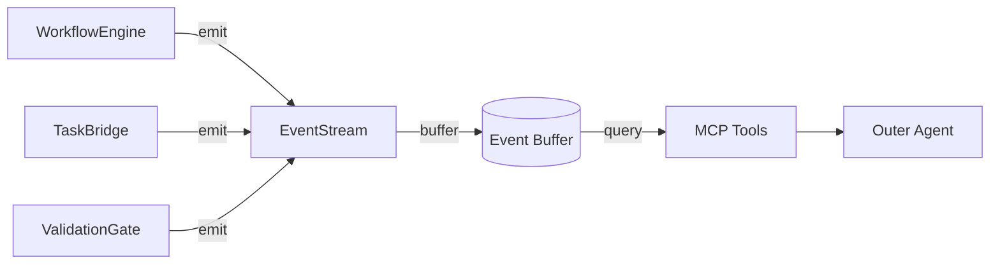
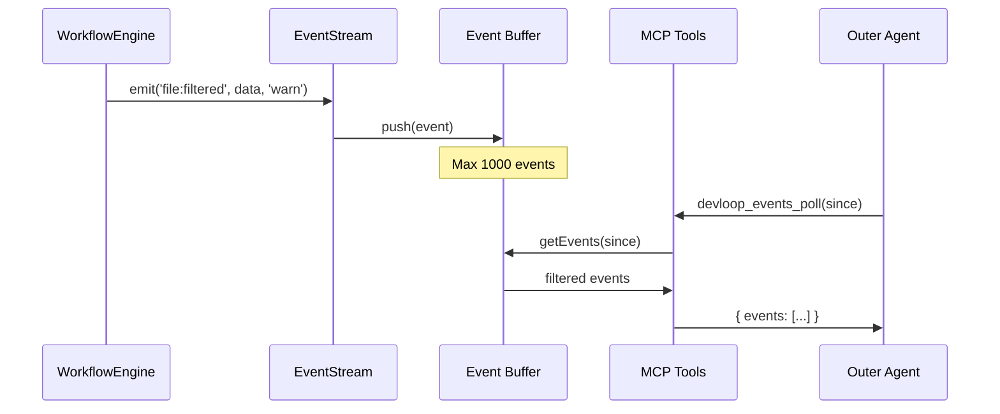
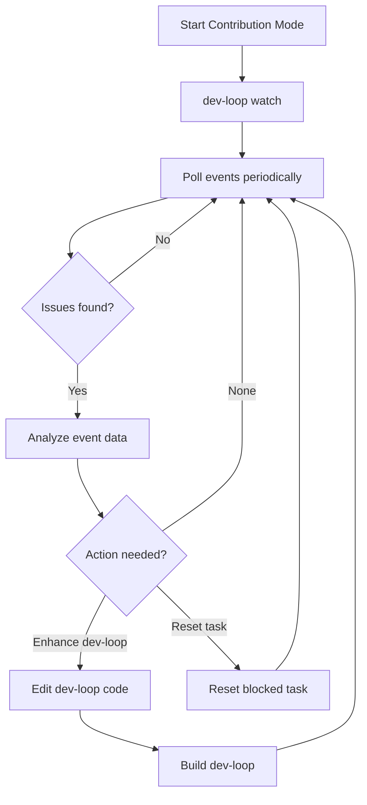

# Event Streaming Guide

Complete guide to dev-loop's event streaming system for contribution mode observability.

## Overview

Event streaming provides structured, real-time event emission for monitoring dev-loop execution. It's designed for efficient contribution mode observation without manual log parsing.



## Event Types

**Note**: All events automatically update relevant metrics when emitted via the event-to-metrics bridge. See the "Event-to-Metrics Bridge" section below for details.

## Event Types

### File Filtering Events

| Event | Severity | Description |
|-------|----------|-------------|
| `file:filtered` | warn | File blocked due to target module boundary |

**Payload:**
```typescript
{
  path: string;           // Filtered file path
  targetModule: string;   // Target module boundary
  taskId: string;         // Current task ID
  prdId: string;          // PRD identifier
  phaseId: number;        // Phase number
  reason: string;         // Why filtered
}
```

### Validation Events

| Event | Severity | Description |
|-------|----------|-------------|
| `validation:failed` | error | Pre-apply validation failure |

**Payload:**
```typescript
{
  taskId: string;
  prdId: string;
  phaseId: number;
  errors: Array<{
    type: string;
    message: string;
    file?: string;
  }>;
}
```

### Task Events

| Event | Severity | Description |
|-------|----------|-------------|
| `task:blocked` | warn | Task exceeded max retries |

**Payload:**
```typescript
{
  taskId: string;
  reason: string;         // e.g., "max retries exceeded"
}
```

### Change Events

| Event | Severity | Description |
|-------|----------|-------------|
| `change:unauthorized` | warn | Unauthorized git change detected |
| `change:reverted` | info | Unauthorized change reverted |

**Payload:**
```typescript
{
  path: string;           // File path
  targetModule: string;   // Target module boundary
  taskId?: string;
  prdId?: string;
  phaseId?: number;
  status?: string;        // Git status (e.g., "M", "A")
  reason?: string;        // Why reverted
}
```

## MCP Tools Reference

### devloop_events_poll

Poll for new events since a given timestamp.

```typescript
const { events } = await devloop_events_poll({
  sinceTimestamp: "2025-01-09T10:00:00Z",  // Optional: ISO timestamp
  filterType: "file:filtered",              // Optional: Event type filter
  filterSeverity: "warn"                    // Optional: Severity filter
});
```

**Returns:** Array of events matching filters.

### devloop_events_latest

Get the N most recent events.

```typescript
const { events } = await devloop_events_latest({
  count: 10  // Default: 10
});
```

**Returns:** Array of latest events.

### devloop_blocked_tasks

Get tasks that are currently blocked.

```typescript
const { blockedTasks } = await devloop_blocked_tasks();
```

**Returns:** Array of blocked task IDs with reasons.

### devloop_filtered_files

Get files filtered due to target module boundaries.

```typescript
const { filteredFiles } = await devloop_filtered_files();
```

**Returns:** Array of filtered file paths.

### devloop_issues

Get all warning, error, and critical events.

```typescript
const { issues } = await devloop_issues();
```

**Returns:** Combined array of warn/error/critical events.

### devloop_events_clear

Clear the event buffer (useful for testing).

```typescript
const { status } = await devloop_events_clear();
```

**Returns:** `{ status: 'success', message: 'Event buffer cleared' }`

## Usage Examples

### Monitoring Contribution Mode

```typescript
// Track last poll time
let lastPollTime = new Date().toISOString();

async function monitorEvents() {
  // Poll for new events
  const { events } = await devloop_events_poll({
    sinceTimestamp: lastPollTime
  });

  if (events.length > 0) {
    // Update poll time
    lastPollTime = events[events.length - 1].timestamp;

    // Process events
    for (const event of events) {
      if (event.severity === 'error') {
        console.log(`ERROR: ${event.type} - ${JSON.stringify(event.data)}`);
      }
    }
  }
}

// Poll every 5 seconds
setInterval(monitorEvents, 5000);
```

### Detecting Boundary Violations

```typescript
async function checkBoundaryViolations() {
  // Check for filtered files
  const { filteredFiles } = await devloop_filtered_files();

  if (filteredFiles.length > 0) {
    console.log('Files filtered due to boundary enforcement:');
    filteredFiles.forEach(f => console.log(`  - ${f}`));
  }

  // Check for unauthorized changes
  const { issues } = await devloop_issues();
  const unauthorized = issues.filter(i => i.type === 'change:unauthorized');

  if (unauthorized.length > 0) {
    console.log('Unauthorized changes detected and reverted:');
    unauthorized.forEach(i => console.log(`  - ${i.data.path}`));
  }
}
```

### Identifying Blocked Tasks

```typescript
async function checkBlockedTasks() {
  const { issues } = await devloop_issues();
  const blocked = issues.filter(i => i.type === 'task:blocked');

  for (const event of blocked) {
    console.log(`Task ${event.data.taskId} is blocked: ${event.data.reason}`);

    // Potentially reset the task
    // await devloop_reset({ taskId: event.data.taskId });
  }
}
```

## Event Lifecycle



## Event-to-Metrics Bridge

The event-to-metrics bridge automatically updates metrics when events are emitted, ensuring metrics stay synchronized with actual system behavior without manual tracking calls.

### How It Works

When an event is emitted via `emitEvent()`, the bridge:

1. **Subscribes to events** - The bridge listens to all events emitted through the event stream
2. **Maps events to metrics** - Each event type is mapped to the relevant metric update function
3. **Updates metrics in real-time** - Metrics are updated immediately when events occur
4. **Batches saves** - Metric saves are batched for performance (every 5 seconds or on workflow save)

### Event Type → Metric Mapping

| Event Category | Metrics Updated |
|----------------|----------------|
| `json:*` | `JsonParsingMetrics` (aiFallbackUsage, retry counts, success by strategy) |
| `file:*` | `FileFilteringMetrics` (predictiveFilters, boundaryViolations, filesAllowed) |
| `validation:*` | `ValidationMetrics` (recoverySuggestionsGenerated, errorsByCategory) |
| `ipc:*` | `IpcMetrics` (connectionsAttempted, healthChecksPerformed, retries) |
| `phase:*` / `prd:*` | Phase/PRD timing metrics (via explicit tracking) |

### Example: JSON Parsing Events

When a `json:parse_retry` event is emitted:

```typescript
emitEvent('json:parse_retry', {
  retryCount: 2,
  providerName: 'anthropic',
}, {
  prdId: 'my-prd',
  taskId: 'task-1',
});
```

The bridge automatically:
- Increments `JsonParsingMetrics.totalAttempts`
- Increments `JsonParsingMetrics.successByStrategy.retry`
- Updates `JsonParsingMetrics.totalParsingTimeMs` if duration provided
- Recalculates `JsonParsingMetrics.avgParsingTimeMs`

### Benefits

- **Automatic synchronization**: Metrics always reflect current system state
- **Reduced code duplication**: No need to update metrics manually at every event emission
- **Consistency**: Same event data used for both events and metrics
- **Performance**: Batched saves prevent performance issues

### Configuration

The bridge is automatically initialized when metrics are enabled in workflow configuration:

```typescript
{
  metrics: {
    enabled: true,
    prdMetricsPath: '.devloop/prd-metrics.json',
    phaseMetricsPath: '.devloop/phase-metrics.json',
  }
}
```

The bridge is started automatically and stops when the workflow completes.

## Event Severity Levels

| Severity | Use Case |
|----------|----------|
| `info` | Informational events (e.g., successful operations) |
| `warn` | Warnings that don't block execution (e.g., filtered files) |
| `error` | Errors that may require attention |
| `critical` | Critical failures requiring immediate intervention |

## Event Buffer

Events are buffered in memory with these characteristics:

- **Max Events**: 1000 (oldest removed when exceeded)
- **Singleton**: Single instance across dev-loop
- **Persistence**: Not persisted (cleared on restart)
- **Thread-safe**: Safe for concurrent access

## Integration with Contribution Mode

Event streaming is especially useful in contribution mode:

1. **Outer agent monitors** without parsing logs
2. **Structured data** enables automated decision-making
3. **Automatic metrics updates** via event-to-metrics bridge provide real-time metrics for issue detection
4. **Contribution mode issue detection** (module confusion, session pollution, boundary violations) emits `contribution:issue_detected` events when thresholds are exceeded

See [CONTRIBUTION_MODE.md](./CONTRIBUTION_MODE.md) for details on issue detection metrics.
3. **Real-time** feedback on boundary enforcement
4. **Efficient polling** with timestamp-based queries

### Typical Contribution Mode Workflow



## Troubleshooting

### No Events Received

1. Verify dev-loop is running with event emission enabled
2. Check timestamp format (must be ISO 8601)
3. Ensure MCP server is connected

### Events Not Clearing

1. Use `devloop_events_clear()` to manually clear
2. Restart dev-loop to reset buffer

### Missing Event Types

1. Verify the component emitting events is active
2. Check event type spelling (case-sensitive)

## Related Documentation

- [Contribution Mode](CONTRIBUTION_MODE.md) - Complete contribution mode guide
- [Boundary Enforcement](BOUNDARY_ENFORCEMENT.md) - Boundary validation details
- [Architecture](ARCHITECTURE.md) - System architecture

