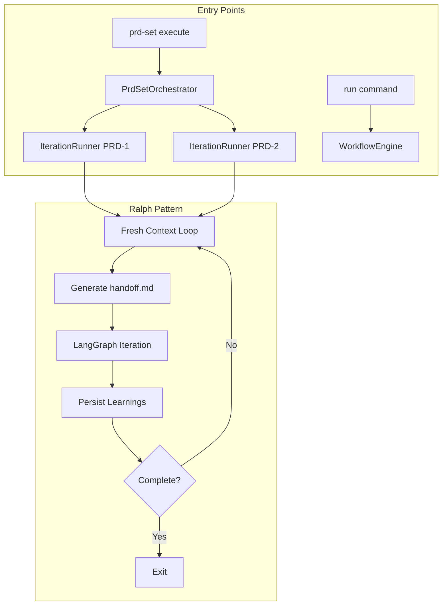
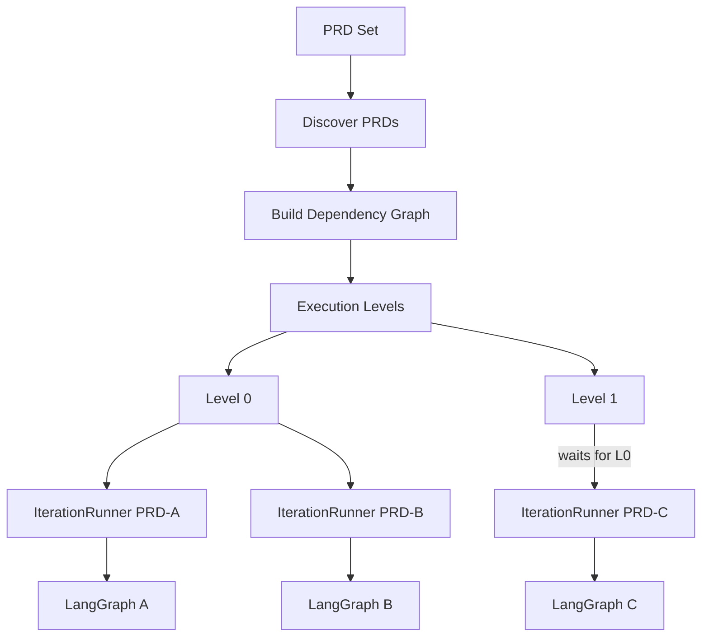

# Execution Modes Guide

Complete guide to dev-loop's execution model using PRD sets, IterationRunner, and LangGraph architecture.

## Overview

Dev-loop's execution loop is determined by the **PRD set schema**. The `PrdSetOrchestrator` spawns parallel `IterationRunner` instances for each PRD, with each runner implementing the Ralph pattern of fresh AI context per iteration.



**Key concepts:**
- **PRD Set Schema**: Defines dependencies and parallel execution structure
- **PrdSetOrchestrator**: Spawns parallel IterationRunner instances per PRD
- **IterationRunner**: Fresh context per iteration (Ralph pattern)
- **LangGraph StateGraph**: Workflow orchestration with checkpoints

## PRD Set Execute (Primary Method)

**Command**: `npx dev-loop prd-set execute <path>`

**Use Case**: Execute PRD sets with parallel IterationRunner instances. The loop behavior is determined by the PRD set schema.

**How it works**:
1. `PrdSetOrchestrator` discovers PRD set from `index.md.yml`
2. `DependencyGraphBuilder` determines execution levels
3. For each level, creates parallel `IterationRunner` per PRD
4. Each runner executes independently with fresh context
5. Results aggregated when all PRDs complete



```bash
# Execute PRD set with parallel runners
npx dev-loop prd-set execute .taskmaster/planning/my-set/

# With concurrency limit
npx dev-loop prd-set execute .taskmaster/planning/my-set/ --max-concurrent 3

# With debug logging
npx dev-loop prd-set execute .taskmaster/planning/my-set/ --debug
```

**Output**:
```
Executing PRD set: my-set
  PRDs in set: 5
  Mode: Parallel execution (fresh IterationRunner per PRD)

Level 0: Executing 2 PRDs in parallel
  ✓ PRD-A completed (15 iterations, 8 tasks)
  ✓ PRD-B completed (12 iterations, 6 tasks)

Level 1: Executing 3 PRDs in parallel
  ✓ PRD-C completed (10 iterations, 5 tasks)
  ✓ PRD-D completed (8 iterations, 4 tasks)
  ✓ PRD-E completed (6 iterations, 3 tasks)

Execution Complete:
  All PRDs executed using parallel IterationRunner instances.
  Check .devloop/progress.md for learnings and .devloop/handoff.md for context.
```

**State files created**:
- `.devloop/handoff.md` - Context for next iteration
- `.devloop/progress.md` - Learnings and progress
- `.devloop/learned-patterns.md` - Discovered patterns
- `.devloop/checkpoints/` - LangGraph state checkpoints

## Single Run Mode

**Command**: `npx dev-loop run`

**Use Case**: Execute a single workflow iteration (for debugging).

**How it works**:
1. `WorkflowEngine.runOnce()` executes directly
2. Fetches next pending task
3. Generates code, applies, tests
4. Marks done or creates fix task
5. Exits after single iteration

```bash
# Run single iteration
npx dev-loop run

# With specific task
npx dev-loop run --task REQ-1.1
```

**Note**: For continuous execution, use `prd-set execute` which uses IterationRunner with fresh context per iteration.

## Execution Mode Comparison

| Aspect | PRD Set Execute | Single Run |
|--------|-----------------|------------|
| **Command** | `prd-set execute <path>` | `run` |
| **Entry Point** | PrdSetOrchestrator | WorkflowEngine |
| **Context** | Fresh per PRD iteration | Single context |
| **Use Case** | Continuous execution | Debugging |
| **Parallel** | Yes (per PRD) | No |
| **Learnings** | Persisted per PRD | Not persisted |
| **State Recovery** | Checkpoints per PRD | None |

## The Ralph Pattern

All execution modes use the "Ralph pattern" for fresh context execution:

1. **Generate Handoff**: Create `handoff.md` with current state and context
2. **Execute Iteration**: Run LangGraph workflow with fresh AI context
3. **Persist Learnings**: Save discoveries to `progress.md`
4. **Update Patterns**: Store reusable patterns in `learned-patterns.md`
5. **Check Completion**: Continue if tasks remain, exit if complete

**Why fresh context?**
- Prevents context pollution from previous iterations
- Each iteration starts clean with handoff document
- Learnings persist across iterations via files, not AI memory
- Enables long-running executions without context degradation

## State Files

| File | Purpose | Created By |
|------|---------|------------|
| `.devloop/handoff.md` | Context for next iteration | ContextHandoff |
| `.devloop/progress.md` | Learnings and progress | LearningsManager |
| `.devloop/learned-patterns.md` | Discovered patterns | LearningsManager |
| `.devloop/checkpoints/*.json` | LangGraph state | FileCheckpointer |
| `.devloop/retry-counts.json` | Task retry tracking | TaskMasterBridge |
| `.devloop/execution-state.json` | PRD coordination | PrdCoordinator |

## Configuration

Configure iteration behavior in `devloop.config.js`:

```javascript
module.exports = {
  iteration: {
    maxIterations: 100,        // Max iterations before stopping
    contextThreshold: 90,      // Context usage % for auto-handoff
    autoHandoff: true,         // Enable automatic handoff
    persistLearnings: true,    // Save learnings to progress.md
    updatePatterns: true,      // Update learned-patterns.md
    handoffInterval: 5,        // Handoff every N iterations
  },
  prdSet: {
    maxConcurrent: 3,          // Max parallel PRD runners
    parallel: true,            // Enable parallel execution
  },
};
```

## Stopping Execution

```bash
# Stop all dev-loop processes
npx dev-loop stop

# Ctrl+C also works for interactive sessions
```

The `stop` command terminates all running IterationRunner instances and PrdSetOrchestrator processes.

## Troubleshooting

### PRD Set Execution Issues

- Verify all PRDs in set are valid
- Check dependency graph for circular dependencies
- Review per-PRD checkpoints in `.devloop/checkpoints/`
- Check `maxConcurrent` setting if hitting resource limits

### Execution Not Completing

- Check if all tasks are marked as "done"
- Verify tests are passing
- Check for blocked tasks with unresolved dependencies
- Review `.devloop/progress.md` for stalled patterns

### State Recovery

If execution crashes, IterationRunner can recover from checkpoints:
- LangGraph checkpoints preserve workflow state
- Handoff document preserves context
- Retry counts prevent infinite loops

## Related Documentation

- [Contribution Mode Guide](CONTRIBUTION_MODE.md) - Two-agent architecture
- [Event Streaming Guide](EVENT_STREAMING.md) - Event monitoring
- [Outer Agent Monitoring Guide](OUTER_AGENT_MONITORING.md) - Monitoring best practices
- [Architecture Guide](ARCHITECTURE.md) - Codebase structure
