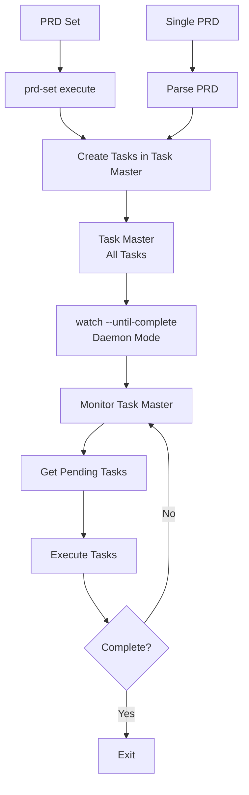

# Execution Modes Guide

Complete guide to dev-loop's execution modes: when to use `watch` (daemon mode) vs `prd-set execute` (one-shot execution).

## Overview

Dev-loop uses a **unified daemon mode architecture** where watch mode monitors Task Master for tasks from any source (PRD or PRD set).

**Unified Architecture**:
1. **PRD Set Execute**: Creates tasks in Task Master and exits immediately (one-shot)
2. **Watch Mode (Daemon)**: Monitors Task Master for tasks from any source and executes them (continuous loop)



**Key Insight**: PRD sets create tasks in Task Master instead of executing directly. Watch mode (daemon) then monitors Task Master for tasks from any source and executes them. This unified approach ensures:
- Single execution path via Task Master
- `dev-loop stop` works universally (stops watch mode daemon)
- All tasks visible in Task Master regardless of source
- Better task coordination and visibility

## Watch Mode (Unified Daemon Mode)

**Command**: `npx dev-loop watch --until-complete`

**Mode**: Daemon (continuous loop until complete)

**Use Case**: Universal daemon that monitors Task Master for tasks from any source (single PRD or PRD set)

**Characteristics**:
- Monitors Task Master for pending tasks from any source (PRD or PRD set)
- Runs in a continuous loop until all tasks are done and tests pass
- Exits automatically when PRD is 100% complete
- Suitable for both single PRDs and PRD sets (unified execution)
- Event streaming is active during execution
- Writes PID file (`.devloop.pid`) so `dev-loop stop` can stop it
- Can be stopped with `Ctrl+C` or `npx dev-loop stop`

**How it works**:
1. Calls `workflowEngine.runOnce()` in a loop
2. `runOnce()` gets pending tasks from Task Master via `taskBridge.getPendingTasks()`
3. Executes tasks in dependency order
4. Continues until all tasks complete and tests pass

**Example**:
```bash
# Start contribution mode
npx dev-loop contribution start --prd .taskmaster/docs/my-prd.md

# Start watch mode (daemon)
npx dev-loop watch --until-complete
```

**Output**:
```
Starting daemon mode (--until-complete: will exit when PRD is 100% complete)...
Iteration 1: Running workflow
Iteration 2: Task completed
  ✓ Task: task-1
Iteration 3: Running workflow
...
✓ PRD COMPLETE - All tasks done, tests passing
```

## PRD Set Execute (Task Creation Mode)

**Command**: `npx dev-loop prd-set execute <path>`

**Mode**: One-shot (creates tasks and exits immediately)

**Use Case**: Create tasks from multiple related PRDs orchestrated together

**Characteristics**:
- Creates tasks in Task Master from all PRDs in the set
- Exits immediately after task creation (does not execute tasks)
- Suitable for orchestrating multiple PRDs with dependencies
- Does NOT write PID file (exits immediately, no daemon needed)
- Tasks are picked up by watch mode daemon for execution

**Example**:
```bash
# Start contribution mode
npx dev-loop contribution start --prd .taskmaster/planning/my-set/index.md.yml

# Create tasks from PRD set (exits after task creation)
npx dev-loop prd-set execute .taskmaster/planning/my-set --debug

# Execute tasks via watch mode daemon
npx dev-loop watch --until-complete
```

**Output**:
```
Creating tasks from PRD set: my-set
  PRDs in set: 5
  Parent PRD: parent-prd
  Child PRDs: 4
  Mode: Unified daemon (tasks created in Task Master, watch mode executes them)

✓ PRD SET TASKS CREATED - All PRD tasks in Task Master
  PRDs with tasks created: 5/5
  Failed PRDs: 0
  Set ID: my-set

Next Steps:
  1. Run: npx dev-loop watch --until-complete
  2. Watch mode daemon will execute tasks from Task Master
  3. Stop execution: npx dev-loop stop
```

## Unified Daemon Architecture

**Key Insight**: With unified daemon mode, PRD sets create tasks in Task Master instead of executing directly. Watch mode (daemon) then monitors Task Master for tasks from any source and executes them.

**Benefits**:
- **Single Execution Path**: All tasks executed via Task Master regardless of source
- **Universal Stop Command**: `dev-loop stop` stops watch mode daemon (which executes all tasks)
- **Task Visibility**: All tasks visible in Task Master regardless of source (PRD or PRD set)
- **Better Coordination**: PRD sets create tasks, daemon executes them
- **Simpler Mental Model**: PRD sets create tasks, watch mode executes them

**Why This Architecture**:
- **PRD Sets**: Create tasks and exit (natural task creation, no execution needed)
- **Watch Mode**: Monitors Task Master for all tasks (unified execution daemon)
- **Stop Command**: Only watch mode needs PID file (PRD sets exit immediately after task creation)

## Execution Mode Comparison

| Aspect | Watch Mode | PRD Set Execute |
|--------|------------|-----------------|
| **Command** | `npx dev-loop watch --until-complete` | `npx dev-loop prd-set execute <path>` |
| **Execution Type** | Daemon (continuous loop) | One-shot (runs to completion) |
| **Use Case** | Single PRD | PRD set (multiple PRDs) |
| **Completion** | When PRD is 100% complete | When all PRDs finish |
| **Iteration** | Continuous until complete | Single execution |
| **Event Streaming** | Active during execution | Active during execution |
| **Stopping** | `Ctrl+C` or `npx dev-loop stop` | Exits when complete |
| **Best For** | Iterative improvement | Orchestrated execution |

## Event Streaming in Unified Architecture

With unified daemon mode, event streaming works as follows:

- **Events Emitted**: Watch mode daemon emits events during task execution
- **Event Buffer**: Events are buffered in-memory (max 1000 events)
- **Polling**: Outer agent can poll events via `devloop_events_poll` MCP tool
- **Monitoring**: Proactive monitoring service can run alongside watch mode daemon

**Important**: Events are emitted by watch mode daemon (the execution process), not a separate daemon. PRD set execute doesn't emit events because it only creates tasks and exits immediately. Event streaming is active when watch mode daemon is executing tasks.

## Choosing the Right Workflow

### For Single PRD:
1. Start contribution mode: `npx dev-loop contribution start --prd <path>`
2. Start watch mode: `npx dev-loop watch --until-complete`
   - Watch mode parses PRD and creates tasks automatically
   - Then executes tasks until complete
   - Exits when PRD is 100% complete

### For PRD Set:
1. Start contribution mode: `npx dev-loop contribution start --prd <path>`
2. Create tasks from PRD set: `npx dev-loop prd-set execute <path>`
   - PRD set orchestrator creates tasks in Task Master
   - Exits immediately after task creation
3. Execute tasks via daemon: `npx dev-loop watch --until-complete`
   - Watch mode daemon picks up tasks from Task Master
   - Executes tasks until complete
   - Exits when PRD is 100% complete

**Key Difference**: 
- **Single PRD**: Watch mode handles both task creation and execution
- **PRD Set**: PRD set execute creates tasks, watch mode executes them

**Why This Architecture**:
- PRD sets create tasks and exit (no execution needed)
- Watch mode executes tasks from any source (unified daemon)
- Single execution path via Task Master
- `dev-loop stop` works universally (stops watch mode daemon)

## Integration with Contribution Mode

Unified daemon mode works seamlessly with contribution mode:

```bash
# Start contribution mode
npx dev-loop contribution start --prd <path>

# For Single PRD:
npx dev-loop watch --until-complete
# Watch mode parses PRD, creates tasks, and executes them

# For PRD Set:
npx dev-loop prd-set execute <path>  # Creates tasks, exits
npx dev-loop watch --until-complete  # Executes tasks, exits when complete

# To stop execution:
npx dev-loop stop  # Stops watch mode daemon (which executes all tasks)
```

Event monitoring:
- Events are emitted during task execution (watch mode daemon)
- Outer agent can poll events via MCP tools (`devloop_events_poll`)
- Proactive monitoring service can run automatically (if enabled in config)
- PRD set execute doesn't emit events (exits immediately after task creation)

## Troubleshooting

### Watch Mode Issues

**Watch mode not exiting when PRD is complete**:
- Check if all tasks are marked as "done"
- Verify tests are passing (PRD tracker checks test status)
- Check for blocked tasks that may prevent completion

**Watch mode stopping unexpectedly**:
- Check for errors in dev-loop logs
- Verify contribution mode is still active
- Check if max iterations reached (configurable via `--max-iterations`)

### PRD Set Execution Issues

**PRD set execution blocking**:
- Check if PRDs have unresolved dependencies
- Verify all PRDs in the set are valid
- Check PRD set state file for status

**PRD set not completing**:
- Review failed PRDs in the result
- Check execution logs for errors
- Verify PRD set orchestrator is progressing

## Related Documentation

- [Contribution Mode Guide](CONTRIBUTION_MODE.md) - Complete contribution mode workflow
- [Event Streaming Guide](EVENT_STREAMING.md) - Event streaming architecture and usage
- [Outer Agent Monitoring Guide](OUTER_AGENT_MONITORING.md) - Best practices for monitoring execution
- [Quick Start Guide](QUICK_START.md) - Quick-start scenarios for common use cases
