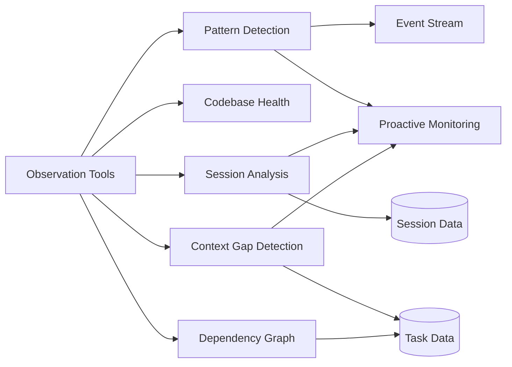

# Enhanced Observation Tools Guide

Reference guide for enhanced observation MCP tools that provide better observability of inner agent behavior and patterns.

## Overview

Enhanced observation tools provide advanced analysis capabilities for monitoring dev-loop execution, detecting patterns, and identifying issues. These tools complement the proactive event monitoring system by providing detailed analysis and visualization capabilities.



## Available Tools

### devloop_pattern_detection

Detect recurring patterns in failures, blocked tasks, and errors. Identifies common root causes.

**Purpose:** Identify recurring failure patterns that may indicate systemic issues requiring dev-loop enhancements.

**Parameters:**
- `eventTypes` (optional): Array of event types to filter by (e.g., `["task:blocked", "validation:failed"]`)
- `timeRange` (optional): Time range in hours to analyze (default: 24)
- `minOccurrences` (optional): Minimum occurrences to be considered a pattern (default: 3)

**Example:**
```typescript
const { patterns, totalPatterns, totalEvents } = await devloop_pattern_detection({
  eventTypes: ['task:blocked', 'validation:failed'],
  timeRange: 24,        // Last 24 hours
  minOccurrences: 3     // At least 3 occurrences
});

// Review patterns
for (const pattern of patterns) {
  console.log(`Pattern: ${pattern.pattern}`);
  console.log(`  Occurrences: ${pattern.occurrences}`);
  console.log(`  First Seen: ${pattern.firstSeen}`);
  console.log(`  Last Seen: ${pattern.lastSeen}`);
  console.log(`  Affected Tasks: ${pattern.taskIds.length}`);
  console.log(`  Severity: ${pattern.severity}`);
}
```

**Returns:**
```typescript
{
  patterns: Array<{
    pattern: string;                    // Pattern key (event type + reason/error)
    occurrences: number;                // Number of times pattern occurred
    firstSeen: string;                  // ISO timestamp of first occurrence
    lastSeen: string;                   // ISO timestamp of last occurrence
    eventTypes: string[];               // Event types in this pattern
    taskIds: string[];                  // Affected task IDs
    severity: EventSeverity;            // Highest severity in pattern
  }>;
  totalPatterns: number;
  totalEvents: number;
  timeRange: number;
  minOccurrences: number;
}
```

**Use Cases:**
- Identify recurring JSON parsing failures that need parser enhancement
- Detect repeated task blocking patterns requiring workflow improvements
- Find validation failures indicating missing guidance or context
- Discover boundary violations showing systematic module confusion

**Integration with Proactive Monitoring:**
Pattern detection complements proactive monitoring by identifying patterns that may need threshold configuration. Patterns with high occurrences can be configured as thresholds for automated intervention.

### devloop_codebase_health

Analyze codebase health metrics including test coverage, complexity, and tech debt indicators.

**Purpose:** Analyze codebase health to identify areas needing improvement. Currently a placeholder for Phase 3 code quality tools integration.

**Parameters:**
- `targetModule` (optional): Specific module to analyze (if not provided, analyzes all)
- `metrics` (optional): Array of specific metrics to analyze (`["coverage", "complexity", "tech-debt", "test-quality"]`)

**Example:**
```typescript
const { targetModule, metrics, note } = await devloop_codebase_health({
  targetModule: 'bd_test_module',
  metrics: ['coverage', 'complexity']
});
```

**Returns:**
```typescript
{
  targetModule: string;  // Module analyzed or 'all'
  metrics: {
    coverage: {
      enabled: boolean;
      message: string;
    };
    complexity: {
      enabled: boolean;
      message: string;
    };
    techDebt: {
      enabled: boolean;
      message: string;
    };
    testQuality: {
      enabled: boolean;
      message: string;
    };
  };
  note: string;  // Placeholder note about Phase 3 integration
}
```

**Note:** Full codebase health analysis requires Phase 3 code quality tools integration. This tool currently returns placeholder information indicating that full analysis will be available in Phase 3.

### devloop_session_analysis

Analyze session usage patterns to detect session pollution (sessions shared across modules).

**Purpose:** Detect session pollution where sessions are used for multiple target modules, causing context pollution and potential module confusion.

**Parameters:**
- `timeRange` (optional): Time range in hours to analyze (default: 24)

**Example:**
```typescript
const { totalSessions, pollutedSessions, pollutionRate, pollution } = 
  await devloop_session_analysis({
    timeRange: 24  // Last 24 hours
  });

console.log(`Total Sessions: ${totalSessions}`);
console.log(`Polluted Sessions: ${pollutedSessions}`);
console.log(`Pollution Rate: ${(pollutionRate * 100).toFixed(1)}%`);

// Review polluted sessions
for (const polluted of pollution) {
  console.log(`Session ${polluted.sessionId}:`);
  console.log(`  Modules: ${polluted.modules.join(', ')}`);
  console.log(`  Tasks: ${polluted.taskIds.join(', ')}`);
  console.log(`  Detected: ${polluted.timestamp}`);
}
```

**Returns:**
```typescript
{
  totalSessions: number;
  pollutedSessions: number;
  pollutionRate: number;  // pollutedSessions / totalSessions
  pollution: Array<{
    sessionId: string;
    modules: string[];      // Modules used in this session
    taskIds: string[];      // Tasks executed in this session
    timestamp: string;      // ISO timestamp of detection
  }>;
  sessionsByModule: Record<string, string[]>;  // Session ID → modules array
}
```

**Use Cases:**
- Detect session pollution causing module confusion
- Identify sessions that need to be isolated per target module
- Validate session boundary enforcement
- Track session reuse patterns

**Integration with Contribution Mode:**
Session pollution detection is used by contribution mode issue detection to identify `session-pollution` issues. When detected, the proactive monitoring system can automatically fix session ID generation to include targetModule.

**Data Source:**
Reads session data from `.devloop/cursor-sessions.json` which is managed by the session management system.

### devloop_context_gap_detection

Identify missing context that causes task failures. Analyzes failed tasks to find common missing context patterns.

**Purpose:** Detect missing context patterns that cause task failures, enabling improvements to the code context provider.

**Parameters:**
- `taskIds` (optional): Specific task IDs to analyze (if not provided, analyzes all failed tasks)
- `timeRange` (optional): Time range in hours to analyze (default: 24)

**Example:**
```typescript
const { totalFailedTasks, contextGaps, recommendations } = 
  await devloop_context_gap_detection({
    timeRange: 24  // Last 24 hours
  });

console.log(`Total Failed Tasks: ${totalFailedTasks}`);

// Review context gaps
for (const gap of contextGaps) {
  console.log(`Pattern: ${gap.pattern}`);
  console.log(`  Occurrences: ${gap.occurrences}`);
  console.log(`  Affected Tasks: ${gap.affectedTasks.length}`);
  console.log(`  Suggested Context: ${gap.suggestedContext}`);
}

// Review recommendations
for (const recommendation of recommendations) {
  console.log(`- ${recommendation}`);
}
```

**Returns:**
```typescript
{
  totalFailedTasks: number;
  contextGaps: Array<{
    pattern: string;              // Regex pattern source
    occurrences: number;          // Number of matching events
    affectedTasks: string[];      // Task IDs affected by this gap
    suggestedContext: string;     // Suggested context to add
  }>;
  recommendations: string[];      // Recommended improvements
}
```

**Detected Patterns:**
- **Missing Module Context**: "missing.*module|module.*not found" → Target module context
- **Undefined References**: "undefined|not defined" → Variable/function definitions
- **Property Access Errors**: "cannot read property|cannot access" → Object structure context
- **File Not Found**: "file not found|does not exist" → File path context
- **Import Errors**: "import.*error|require.*error" → Import/dependency context

**Use Cases:**
- Identify missing context causing task failures
- Improve code context provider with additional information
- Add target module information to all task prompts
- Include file structure context in AI prompts
- Enhance import/dependency context discovery

**Integration with Proactive Monitoring:**
Context gap detection can inform proactive monitoring by identifying patterns that may need automated context injection. When context gaps are detected, the system can enhance context provider automatically.

### devloop_dependency_graph

Generate dependency graph for tasks and code. Shows relationships between tasks and code files.

**Purpose:** Visualize task and code dependencies to understand execution order and relationships.

**Parameters:**
- `taskIds` (optional): Specific task IDs to include in graph
- `format` (optional): Output format - `"json"` (default), `"dot"` (Graphviz DOT), or `"mermaid"` (Mermaid diagram)

**Example (JSON Format):**
```typescript
const { graph, totalNodes, totalEdges } = await devloop_dependency_graph({
  taskIds: ['task-1', 'task-2', 'task-3'],
  format: 'json'
});

console.log(`Graph: ${totalNodes} nodes, ${totalEdges} edges`);

// Review nodes
for (const node of graph.nodes) {
  console.log(`Node: ${node.id} (${node.label}) - Status: ${node.type}`);
}

// Review edges
for (const edge of graph.edges) {
  console.log(`${edge.from} depends on ${edge.to}`);
}
```

**Example (Mermaid Format):**
```typescript
const { content } = await devloop_dependency_graph({
  format: 'mermaid'
});

// Returns Mermaid diagram code:
// graph TD
//   task-1["Task 1"] --> task-2["Task 2"]
//   task-2 --> task-3["Task 3"]
```

**Example (DOT Format):**
```typescript
const { content } = await devloop_dependency_graph({
  format: 'dot'
});

// Returns Graphviz DOT code:
// digraph dependencies {
//   "task-1" [label="Task 1"];
//   "task-2" [label="Task 2"];
//   "task-1" -> "task-2";
// }
```

**Returns (JSON format):**
```typescript
{
  graph: {
    nodes: Array<{
      id: string;        // Task ID
      label: string;     // Task title or ID
      type: string;      // Task status
    }>;
    edges: Array<{
      from: string;      // Source task ID
      to: string;        // Target task ID
      type: string;      // Edge type (e.g., "depends_on")
    }>;
  };
  totalNodes: number;
  totalEdges: number;
}
```

**Returns (Mermaid/DOT format):**
```typescript
{
  content: string;  // Mermaid or DOT diagram code
}
```

**Use Cases:**
- Visualize task dependencies to understand execution order
- Identify circular dependencies or dependency issues
- Plan task sequencing for optimal execution
- Generate documentation diagrams from task relationships

**Data Source:**
Reads task dependencies from `.taskmaster/tasks/tasks.json` which is managed by Task Master.

## Usage Examples

### Identifying Recurring Patterns

```typescript
// Detect patterns in task blocking
async function identifyBlockingPatterns() {
  const { patterns } = await devloop_pattern_detection({
    eventTypes: ['task:blocked'],
    timeRange: 48,  // Last 48 hours
    minOccurrences: 2
  });

  console.log('Recurring Blocking Patterns:');
  for (const pattern of patterns) {
    console.log(`\nPattern: ${pattern.pattern}`);
    console.log(`  Occurred ${pattern.occurrences} times`);
    console.log(`  First seen: ${pattern.firstSeen}`);
    console.log(`  Last seen: ${pattern.lastSeen}`);
    console.log(`  Affected tasks: ${pattern.taskIds.join(', ')}`);
    
    // Potentially create a dev-loop enhancement to address this pattern
    if (pattern.occurrences >= 5) {
      console.log('  → Consider adding to PatternLearningSystem');
    }
  }
}
```

### Detecting Session Pollution

```typescript
// Check for session pollution
async function checkSessionPollution() {
  const { pollutedSessions, pollutionRate, pollution } = 
    await devloop_session_analysis({ timeRange: 24 });

  if (pollutionRate > 0.1) {  // More than 10% pollution
    console.warn(`High session pollution rate: ${(pollutionRate * 100).toFixed(1)}%`);
    
    for (const polluted of pollution) {
      console.log(`\nPolluted Session: ${polluted.sessionId}`);
      console.log(`  Used for modules: ${polluted.modules.join(', ')}`);
      console.log(`  Tasks: ${polluted.taskIds.join(', ')}`);
      
      // This indicates session boundary enforcement needs improvement
      console.log('  → Consider enhancing session ID generation to include targetModule');
    }
  } else {
    console.log(`Session pollution rate is acceptable: ${(pollutionRate * 100).toFixed(1)}%`);
  }
}
```

### Finding Context Gaps

```typescript
// Identify missing context patterns
async function findContextGaps() {
  const { contextGaps, recommendations } = await devloop_context_gap_detection({
    timeRange: 24
  });

  if (contextGaps.length > 0) {
    console.log('Context Gaps Detected:');
    for (const gap of contextGaps) {
      console.log(`\n${gap.pattern}: ${gap.occurrences} occurrences`);
      console.log(`  Suggested Context: ${gap.suggestedContext}`);
      console.log(`  Affected Tasks: ${gap.affectedTasks.length}`);
    }
    
    console.log('\nRecommendations:');
    recommendations.forEach(rec => console.log(`  - ${rec}`));
    
    // Use this information to enhance CodeContextProvider
    console.log('\n→ Consider enhancing CodeContextProvider with missing context');
  } else {
    console.log('No clear context gaps detected');
  }
}
```

### Visualizing Dependencies

```typescript
// Generate dependency graph
async function visualizeDependencies() {
  // Get JSON format for programmatic analysis
  const { graph } = await devloop_dependency_graph({
    format: 'json'
  });

  console.log(`Dependency Graph: ${graph.nodes.length} nodes, ${graph.edges.length} edges`);
  
  // Find tasks with no dependencies (starting points)
  const startingTasks = graph.nodes
    .filter(node => !graph.edges.some(edge => edge.to === node.id))
    .map(node => node.id);
  
  console.log(`Starting tasks (no dependencies): ${startingTasks.join(', ')}`);
  
  // Find tasks with many dependencies (critical path)
  const dependencyCounts = new Map<string, number>();
  for (const edge of graph.edges) {
    dependencyCounts.set(edge.to, (dependencyCounts.get(edge.to) || 0) + 1);
  }
  
  const mostDependent = Array.from(dependencyCounts.entries())
    .sort((a, b) => b[1] - a[1])
    .slice(0, 5);
  
  console.log('\nMost Dependent Tasks:');
  mostDependent.forEach(([taskId, count]) => {
    console.log(`  ${taskId}: ${count} dependencies`);
  });
}
```

### Integration with Proactive Monitoring

```typescript
// Use observation tools to inform proactive monitoring configuration
async function configureMonitoringFromPatterns() {
  // Detect patterns
  const { patterns } = await devloop_pattern_detection({
    eventTypes: ['json:parse_failed', 'task:blocked', 'validation:failed'],
    timeRange: 24,
    minOccurrences: 3
  });

  // Configure thresholds based on detected patterns
  const thresholds: Record<string, any> = {};
  
  for (const pattern of patterns) {
    // Extract event type from pattern
    const eventType = pattern.eventTypes[0];
    
    if (!thresholds[eventType]) {
      thresholds[eventType] = {
        count: pattern.occurrences,
        windowMs: 24 * 3600000,  // 24 hours
        autoAction: pattern.occurrences >= 5,  // Auto-action for frequent patterns
        confidence: 0.7 + (pattern.occurrences * 0.02)  // Higher confidence for more occurrences
      };
    }
  }

  // Update monitoring configuration
  await devloop_event_monitor_configure({
    thresholds
  });

  console.log(`Configured thresholds for ${Object.keys(thresholds).length} event types based on detected patterns`);
}
```

## Integration with Proactive Monitoring

Enhanced observation tools complement proactive monitoring by:

1. **Pattern Detection → Threshold Configuration**: Patterns with high occurrences can be configured as thresholds for automated intervention
2. **Session Analysis → Session Fixes**: Session pollution detection triggers automated session ID generation fixes
3. **Context Gap Detection → Context Enhancement**: Context gaps can inform automated context provider enhancements
4. **Dependency Graph → Execution Planning**: Dependency graphs can inform task execution order optimization

See [Proactive Monitoring Guide](./PROACTIVE_MONITORING.md) for details on automated intervention system.

## Integration with Contribution Mode

Enhanced observation tools are especially useful in contribution mode:

1. **Pattern Detection**: Identifies recurring issues that need dev-loop enhancements
2. **Session Analysis**: Detects session pollution indicating boundary enforcement issues
3. **Context Gap Detection**: Finds missing context requiring code context provider improvements
4. **Dependency Graph**: Visualizes task relationships for better orchestration

These tools enable the outer agent to:
- Identify systemic issues requiring dev-loop enhancements
- Validate that fixes are effective (patterns should decrease after fixes)
- Optimize dev-loop configuration based on observed patterns
- Generate documentation and reports based on analysis results

## Troubleshooting

### Pattern Detection Returns No Patterns

**Possible Causes:**
1. Time range too short - Events may be outside the time range
2. Minimum occurrences too high - Patterns may not meet the threshold
3. Event types filtered - Events may be filtered out by eventTypes parameter

**Solutions:**
- Increase time range to capture more events
- Lower minimum occurrences threshold
- Check if events exist: `await devloop_events_poll({ filterType: 'event:type' })`
- Remove eventTypes filter to see all patterns

### Session Analysis Shows No Data

**Possible Causes:**
1. Session file not found - `.devloop/cursor-sessions.json` may not exist
2. No sessions created - Sessions may not have been created yet
3. Time range too short - Sessions may be outside the time range

**Solutions:**
- Verify session file exists: Check if `.devloop/cursor-sessions.json` exists
- Check if sessions are being created: Verify session management is enabled
- Increase time range to capture older sessions
- Check session data format: Verify sessions file has correct structure

### Context Gap Detection Returns Empty

**Possible Causes:**
1. No failed tasks - No tasks have failed in the time range
2. Error messages don't match patterns - Error messages may not match detection patterns
3. Time range too short - Failed tasks may be outside the time range

**Solutions:**
- Check for failed tasks: `await devloop_events_poll({ filterType: 'task:failed' })`
- Review actual error messages to identify patterns
- Increase time range to capture more failed tasks
- Verify event stream is capturing failures correctly

### Dependency Graph Returns Empty

**Possible Causes:**
1. Tasks file not found - `.taskmaster/tasks/tasks.json` may not exist
2. No tasks with dependencies - Tasks may not have `dependsOn` fields
3. Task IDs filtered - Specified task IDs may not exist

**Solutions:**
- Verify tasks file exists: Check if `.taskmaster/tasks/tasks.json` exists
- Check task structure: Verify tasks have `dependsOn` fields
- Remove taskIds filter to see all dependencies
- Verify tasks are loaded: Check if Task Master has tasks loaded

## Related Documentation

- [Event Streaming Guide](./EVENT_STREAMING.md) - Event streaming and proactive monitoring
- [Proactive Monitoring Guide](./PROACTIVE_MONITORING.md) - Automated intervention system
- [Contribution Mode Guide](./CONTRIBUTION_MODE.md) - Contribution mode workflow
- [Architecture Guide](./ARCHITECTURE.md) - System architecture including observation tools
