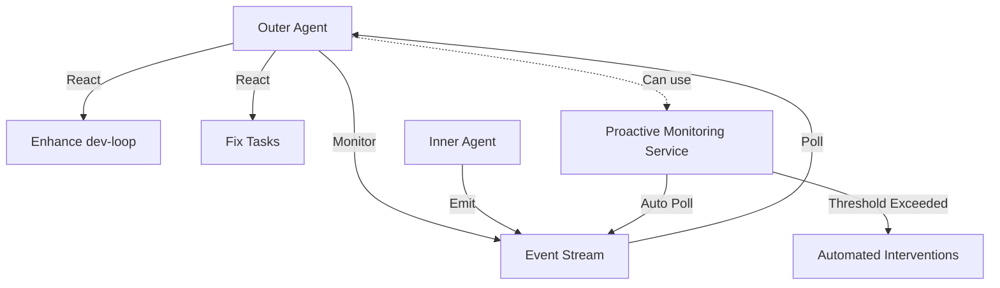

# Outer Agent Monitoring Guide

Complete guide to monitoring inner agent execution as the outer agent in contribution mode.

## Overview

As the outer agent in contribution mode, you monitor inner agent execution and take proactive action when issues are detected. This guide covers best practices for event monitoring, including manual polling, automated monitoring, and hybrid approaches.



## Monitoring Approaches

Dev-loop provides three approaches to monitoring inner agent execution:

### Option 1: Manual Event Polling (Recommended for Active Monitoring)

**Best for**: Custom logic, immediate feedback, specific event filtering

**How it works**:
- Use `devloop_events_poll` MCP tool in a loop
- Poll every 5-10 seconds during active execution
- Filter by event types you care about (e.g., `contribution:issue_detected`, `task:blocked`)
- Take action based on events

**Example**:
```typescript
let lastEventId = null;

async function monitorEvents() {
  while (executionActive) {
    const { events, lastEventId: newLastEventId } = await devloop_events_poll({
      since: lastEventId,
      types: ['contribution:issue_detected', 'task:blocked', 'validation:failed'],
      severity: ['warn', 'error', 'critical'],
      limit: 100
    });
    
    for (const event of events) {
      console.log(`[${event.severity}] ${event.type}: ${JSON.stringify(event.data)}`);
      
      // Take action based on event type
      if (event.type === 'task:blocked') {
        // Unblock task or enhance dev-loop
        await handleTaskBlocked(event);
      } else if (event.type === 'contribution:issue_detected') {
        // Handle contribution mode issue
        await handleIssueDetected(event);
      }
    }
    
    lastEventId = newLastEventId;
    await sleep(5000); // Poll every 5 seconds
  }
}
```

**Advantages**:
- Full control over event filtering and processing
- Custom logic can be applied immediately
- Can monitor multiple event types simultaneously
- Immediate feedback for debugging

**Disadvantages**:
- Requires active polling loop
- Manual implementation needed
- May miss events if polling interval is too long

### Option 2: Proactive Monitoring Service (Recommended for Automated Interventions)

**Best for**: Automated issue resolution, threshold-based interventions, unattended monitoring

**How it works**:
- Start `devloop_event_monitor_start` at contribution mode start
- Configure thresholds in `devloop.config.js`
- Service automatically polls events and triggers interventions when thresholds are exceeded
- Monitor intervention outcomes via `devloop_event_monitor_status`

**Example Configuration**:
```javascript
// devloop.config.js
module.exports = {
  mcp: {
    eventMonitoring: {
      enabled: true,
      pollingInterval: 5000,  // 5 seconds
      thresholds: {
        'json:parse_failed': {
          count: 3,
          windowMs: 600000,    // 10 minutes
          autoAction: true,
          confidence: 0.8
        },
        'task:blocked': {
          count: 1,
          autoAction: true,
          confidence: 0.7
        },
        'contribution:issue_detected': {
          count: 1,
          autoAction: true,
          confidence: 0.8
        }
      },
      actions: {
        requireApproval: ['validation:failed'],
        autoExecute: ['json:parse_failed', 'task:blocked', 'contribution:issue_detected'],
        maxInterventionsPerHour: 10
      }
    }
  }
};
```

**Starting the Service**:
```typescript
// Service starts automatically when contribution mode is activated (if enabled in config)
// Or start manually:
await devloop_event_monitor_start();

// Check status
const { status, metrics } = await devloop_event_monitor_status();
console.log(`Monitoring: ${status.isRunning ? 'Running' : 'Stopped'}`);
console.log(`Interventions: ${metrics.totalInterventions} (${(metrics.successRate * 100).toFixed(1)}% success)`);
```

**Advantages**:
- Automatic issue detection and resolution
- Configurable thresholds for different event types
- Intervention tracking and effectiveness analysis
- Can run unattended
- Prevents recurring issues automatically

**Disadvantages**:
- Requires configuration in `devloop.config.js`
- Less control over specific interventions
- May trigger interventions that need manual review

### Option 3: Hybrid Approach (Recommended)

**Best for**: Best of both worlds - automated fixes + custom monitoring

**How it works**:
- Start proactive monitoring service for automated fixes
- Also poll manually for custom logic or immediate feedback
- Both can run simultaneously (monitoring service + manual polling)

**Example**:
```typescript
// Start proactive monitoring service (automated fixes)
await devloop_event_monitor_start();

// Also poll manually for custom logic
let lastEventId = null;

async function hybridMonitoring() {
  while (executionActive) {
    // Manual polling for custom events
    const { events, lastEventId: newLastEventId } = await devloop_events_poll({
      since: lastEventId,
      types: ['test:stalled', 'progress:stalled'],
      limit: 50
    });
    
    for (const event of events) {
      // Custom handling for specific events
      if (event.type === 'test:stalled') {
        await handleTestStalled(event); // Custom logic
      }
      
      // Proactive monitoring service handles other events automatically
    }
    
    // Check intervention status
    const { status, metrics } = await devloop_event_monitor_status();
    if (metrics.totalInterventions > 0) {
      console.log(`Auto-interventions: ${metrics.totalInterventions} (${(metrics.successRate * 100).toFixed(1)}% success)`);
    }
    
    lastEventId = newLastEventId;
    await sleep(5000);
  }
}
```

**Advantages**:
- Automated fixes for common issues
- Custom handling for specific scenarios
- Full visibility into both automated and manual actions
- Best of both worlds

**Disadvantages**:
- More complex setup
- Requires understanding both approaches

## Typical Workflow

### For Single PRD (Watch Mode)

```bash
# Terminal 1: Start contribution mode
npx dev-loop contribution start --prd .taskmaster/docs/my-prd.md

# Terminal 2: Start watch mode (daemon)
npx dev-loop watch --until-complete

# Terminal 3: Monitor events (outer agent)
# Option A: Manual polling
# Use MCP tools or script to poll devloop_events_poll

# Option B: Automated monitoring (if enabled in config)
# Proactive monitoring service starts automatically

# Option C: Hybrid approach
# Start monitoring service + manual polling
```

### For PRD Set (One-Shot Execution)

```bash
# Terminal 1: Start contribution mode
npx dev-loop contribution start --prd .taskmaster/planning/my-set/index.md.yml

# Terminal 2: Execute PRD set (one-shot)
npx dev-loop prd-set execute .taskmaster/planning/my-set --debug

# Terminal 3: Monitor events (outer agent)
# Same options as above
```

## Event Monitoring Best Practices

### Polling Interval

- **5-10 seconds**: Recommended for active monitoring during execution
- **30 seconds**: For background monitoring when execution is slow
- **1 minute**: For periodic checks when execution is mostly idle

### Event Filtering

Filter events to focus on what matters:

```typescript
// Critical events only
const criticalEvents = await devloop_events_poll({
  severity: ['error', 'critical'],
  limit: 50
});

// Specific event types
const issueEvents = await devloop_events_poll({
  types: ['contribution:issue_detected', 'task:blocked'],
  limit: 50
});

// Events for specific PRD
const prdEvents = await devloop_events_poll({
  prdId: 'my-prd',
  limit: 50
});
```

### Event Processing

Process events efficiently:

```typescript
async function processEvents(events: DevLoopEvent[]) {
  // Group by type for batch processing
  const eventsByType = new Map<string, DevLoopEvent[]>();
  for (const event of events) {
    if (!eventsByType.has(event.type)) {
      eventsByType.set(event.type, []);
    }
    eventsByType.get(event.type)!.push(event);
  }
  
  // Process each type
  for (const [type, typeEvents] of eventsByType.entries()) {
    switch (type) {
      case 'task:blocked':
        await handleBlockedTasks(typeEvents);
        break;
      case 'contribution:issue_detected':
        await handleIssueDetections(typeEvents);
        break;
      case 'validation:failed':
        await handleValidationFailures(typeEvents);
        break;
      default:
        console.log(`Unhandled event type: ${type}`);
    }
  }
}
```

### Action Guidelines

When events are detected, take appropriate action:

**Task Blocked**:
- Review task status and errors
- Check if retry count exceeded
- Enhance dev-loop if pattern is repeated
- Reset task if appropriate

**Contribution Issue Detected**:
- Review issue details (module confusion, session pollution, etc.)
- Check issue metrics for patterns
- Enhance dev-loop to fix root cause
- Monitor for recurrence

**Validation Failed**:
- Review validation errors
- Check if false positive (validation too strict)
- Enhance validation gates if needed
- Review recovery suggestions

**JSON Parsing Failed**:
- Check parsing failure reasons
- Review JSON response format
- Enhance JSON parser if pattern is repeated
- Check if AI fallback is working

## Monitoring Service Configuration

### Threshold Configuration

Configure thresholds based on your tolerance for issues:

```javascript
thresholds: {
  // Critical: Trigger immediately
  'file:boundary_violation': {
    count: 1,
    autoAction: true,
    confidence: 0.9
  },
  
  // Common: Trigger after pattern
  'json:parse_failed': {
    count: 3,
    windowMs: 600000,  // 10 minutes
    autoAction: true,
    confidence: 0.8
  },
  
  // Requires review: Don't auto-execute
  'validation:failed': {
    count: 5,
    windowMs: 600000,
    autoAction: false,  // Require approval
    confidence: 0.7
  }
}
```

### Intervention Tracking

Monitor intervention effectiveness:

```typescript
const { metrics, effectiveness } = await devloop_event_monitor_status();

// Overall effectiveness
console.log(`Success Rate: ${(metrics.successRate * 100).toFixed(1)}%`);
console.log(`Rollback Rate: ${(metrics.rolledBackInterventions / metrics.totalInterventions * 100).toFixed(1)}%`);

// Most effective strategies
effectiveness.mostEffectiveStrategies.forEach(s => {
  console.log(`${s.strategy}: ${(s.successRate * 100).toFixed(1)}% success`);
});

// Issues needing improvement
effectiveness.issueTypesNeedingImprovement.forEach(issue => {
  console.log(`${issue.issueType}: ${(issue.effectiveness * 100).toFixed(1)}% effective`);
});
```

## Common Patterns

### Pattern 1: Active Development Session

**Scenario**: Actively developing and want immediate feedback

**Approach**: Manual polling with aggressive filtering

```typescript
// Poll every 3 seconds for critical events only
setInterval(async () => {
  const { events } = await devloop_events_poll({
    severity: ['error', 'critical'],
    limit: 10
  });
  
  events.forEach(event => {
    console.error(`[${event.severity.toUpperCase()}] ${event.type}`);
    // Immediate action
  });
}, 3000);
```

### Pattern 2: Unattended Execution

**Scenario**: Let execution run and check periodically

**Approach**: Proactive monitoring service with email/notification on intervention

```javascript
// Enable proactive monitoring
mcp: {
  eventMonitoring: {
    enabled: true,
    thresholds: {
      // Auto-fix common issues
      'json:parse_failed': { count: 3, autoAction: true },
      'task:blocked': { count: 1, autoAction: true }
    }
  }
}
```

### Pattern 3: Debugging Specific Issues

**Scenario**: Investigating a specific problem

**Approach**: Manual polling with specific event filters

```typescript
// Focus on specific event types
const { events } = await devloop_events_poll({
  types: ['json:parse_failed', 'json:parse_retry'],
  taskId: 'task-123',  // Specific task
  limit: 100
});

// Analyze pattern
events.forEach(event => {
  console.log(`${event.timestamp}: ${event.type}`);
  console.log(JSON.stringify(event.data, null, 2));
});
```

## Troubleshooting

### No Events Received

**Problem**: Events poll returns empty array

**Possible Causes**:
1. Execution not active (check if watch/prd-set execute is running)
2. Events not yet emitted (execution may be in early phase)
3. Event buffer cleared (events are in-memory, cleared on restart)
4. Filter too restrictive (check event filters)

**Solutions**:
- Verify execution is running: Check process status
- Poll with broader filters: Remove type/severity filters
- Check execution logs: Events are also logged
- Use `devloop_events_latest` to see recent events

### Events Lost After Restart

**Problem**: Events disappear after restarting dev-loop

**Cause**: Events are in-memory only (buffer cleared on restart)

**Solution**: This is expected behavior. Events are only available during active execution. To persist events:
- Use event monitoring service to react to events in real-time
- Export events periodically if persistence needed (future feature)
- Monitor logs for historical event data

### Monitoring Service Not Triggering Interventions

**Problem**: Events occur but interventions not triggered

**Possible Causes**:
1. Service not running (check `devloop_event_monitor_status`)
2. Thresholds not configured (check `devloop.config.js`)
3. Thresholds not exceeded (check event counts vs thresholds)
4. Confidence too low (check classification confidence)

**Solutions**:
- Verify service is running: `await devloop_event_monitor_status()`
- Check threshold configuration in `devloop.config.js`
- Review event counts: `await devloop_events_poll({ types: ['json:parse_failed'] })`
- Lower confidence requirements if too conservative

## Related Documentation

- [Contribution Mode Guide](CONTRIBUTION_MODE.md) - Complete contribution mode workflow
- [Event Streaming Guide](EVENT_STREAMING.md) - Event streaming architecture and usage
- [Execution Modes Guide](EXECUTION_MODES.md) - Watch mode vs PRD set execute
- [Proactive Monitoring Guide](PROACTIVE_MONITORING.md) - Automated intervention system
- [Quick Start Guide](QUICK_START.md) - Quick-start scenarios
