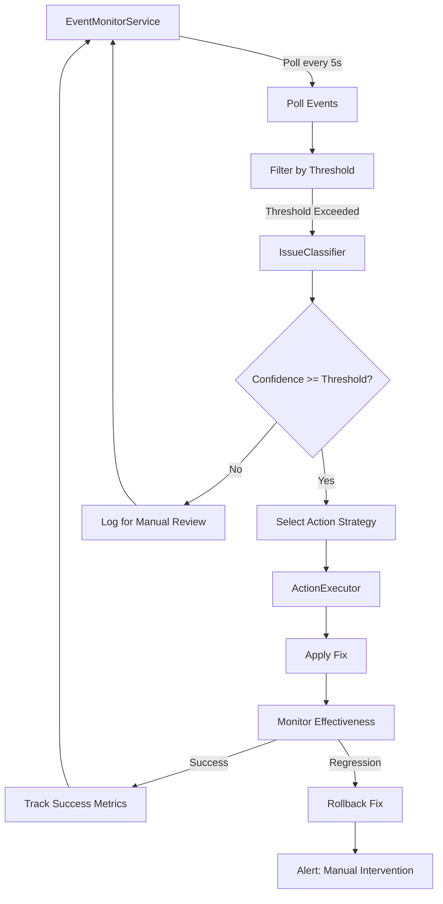

# Proactive Monitoring Guide

Comprehensive guide to dev-loop's proactive event monitoring and automated intervention system.

## Overview

The proactive event monitoring system continuously monitors the event stream and automatically triggers corrective actions when thresholds are exceeded for specific event types. This enables automated issue resolution without manual intervention, reducing manual intervention time and preventing recurring issues.



## Architecture

The proactive monitoring system consists of four main components:

### EventMonitorService

**Location:** `src/core/monitoring/event-monitor.ts`

Continuously monitors the event stream and triggers automated interventions:

- **Polling**: Polls events every N seconds (configurable, default: 5 seconds)
- **Threshold Checking**: Checks event counts/rates against configured thresholds
- **Issue Classification**: Delegates to IssueClassifier for issue classification
- **Action Execution**: Triggers ActionExecutor to execute fixes
- **Effectiveness Monitoring**: Monitors intervention outcomes and rolls back if regressions occur
- **Rate Limiting**: Enforces max interventions per hour to prevent excessive automation
- **Lifecycle Management**: Start/stop methods for service control

**Key Methods:**
- `start()` - Start monitoring service
- `stop()` - Stop monitoring service  
- `getStatus()` - Get monitoring status and statistics
- `updateConfig()` - Update configuration at runtime
- `pollEvents()` - Poll events and check thresholds (private)
- `checkThreshold()` - Check if threshold is exceeded (private)
- `handleThresholdExceeded()` - Handle threshold exceeded (private)

### IssueClassifier

**Location:** `src/core/monitoring/issue-classifier.ts`

Classifies event types into actionable categories and determines confidence levels:

- **Event Type Mapping**: Maps event types to classification strategies
- **Pattern Extraction**: Extracts patterns from event history
- **Confidence Calculation**: Determines confidence levels (0-1) for automated action
- **Issue Categorization**: Categorizes issues (json-parsing, task-execution, boundary-enforcement, validation, contribution-mode, ipc, agent, health)
- **Context Extraction**: Extracts relevant context from events (failure reasons, task IDs, patterns)

**Classification Strategies:**
- JSON parsing issues - Analyzes failure reasons, retry patterns, AI fallback usage
- Task execution issues - Detects blocked/failed tasks, extracts failure reasons, identifies retry patterns
- Boundary enforcement issues - Detects violations vs excessive filtering, identifies module confusion
- Validation issues - Extracts error categories, identifies recovery patterns
- Contribution mode issues - Handles module confusion, session pollution, boundary violations, context loss
- IPC connection issues - Detects connection failures, retry patterns, consistency
- Agent errors - Lower confidence for complex agent errors (requires analysis)
- Health check issues - Low confidence (requires investigation)

**Key Methods:**
- `classify()` - Classify an issue based on event type and history
- `getClassificationStrategy()` - Get classification strategy for event type (private)
- `classifyJsonParsing()` - Classify JSON parsing issues (private)
- `classifyTaskExecution()` - Classify task execution issues (private)
- `classifyBoundaryEnforcement()` - Classify boundary enforcement issues (private)
- `classifyValidation()` - Classify validation issues (private)
- `classifyContributionMode()` - Classify contribution mode issues (private)
- `classifyIPC()` - Classify IPC connection issues (private)
- `classifyAgent()` - Classify agent errors (private)
- `classifyHealth()` - Classify health check issues (private)
- `classifyGeneric()` - Generic classification for unknown event types (private)
- `getMostCommon()` - Get most common value from array (private)

### ActionExecutor

**Location:** `src/core/monitoring/action-executor.ts`

Executes corrective actions based on issue classifications:

- **Strategy Loading**: Loads action strategies lazily (on first use)
- **Strategy Mapping**: Maps issue types to specific fix strategies
- **Fix Execution**: Executes strategies and validates fixes
- **Effectiveness Monitoring**: Monitors fix effectiveness via subsequent events (async, non-blocking)
- **Rollback Support**: Supports rollback if fixes cause regressions

**Key Methods:**
- `execute()` - Execute intervention for an issue
- `monitorEffectiveness()` - Monitor intervention effectiveness (async, non-blocking, private)
- `loadActionStrategies()` - Load action strategies (lazy initialization, private)
- `ensureStrategiesInitialized()` - Ensure strategies are initialized (private)

### InterventionMetricsTracker

**Location:** `src/core/metrics/intervention-metrics.ts`

Tracks all automated interventions and their outcomes for analysis and improvement:

- **Intervention Recording**: Records intervention history with full details
- **Success Rate Tracking**: Tracks success rate by issue type and event type
- **Effectiveness Analysis**: Identifies patterns in intervention effectiveness
- **Timing Metrics**: Tracks detection time, fix time, validation time
- **Threshold Tracking**: Tracks exceeded count, prevented count, false positives
- **Pattern Analysis**: Analyzes most/least effective strategies, common failure modes

**Key Methods:**
- `recordIntervention()` - Track a new intervention
- `recordThresholdExceeded()` - Record threshold exceeded
- `recordIssuePrevented()` - Record issue prevented
- `recordFalsePositive()` - Record false positive intervention
- `getMetrics()` - Get current metrics
- `getRecords()` - Get intervention records (with filters)
- `getIssueTypeMetrics()` - Get metrics for specific issue type
- `getEffectivenessAnalysis()` - Get effectiveness analysis
- `analyzePatterns()` - Analyze intervention patterns (runs periodically, private)

## Action Strategies Reference

Each action strategy knows how to fix a particular type of issue. Strategies are implemented in `src/core/monitoring/action-strategies.ts` and follow the `ActionStrategy` interface.

### JSON Parsing Strategy

**Strategy Name:** `enhance-json-parser`  
**Issue Type:** `json-parsing-failure`

**Purpose:** Enhances JSON parser with better extraction logic to handle common parsing failures.

**Actions:**
- Adds control character sanitization if failures are due to control characters
- Adds newline escaping if failures are due to literal newlines
- Creates backup before applying fixes
- Emits `intervention:fix_applied` event on success

**Files Modified:**
- `src/providers/ai/json-parser.ts`

**Confidence:** 0.75-0.85 depending on failure patterns

### Task Blocking Strategy

**Strategy Name:** `unblock-task`  
**Issue Type:** `task-blocked`

**Purpose:** Unblocks tasks with enhanced context and resets retry count.

**Actions:**
- Resets retry count in `.devloop/retry-counts.json`
- Emits `contribution:agent_unblocked` event with enhanced context
- Clears task errors

**Files Modified:**
- `.devloop/retry-counts.json`

**Confidence:** 0.70-0.80 depending on task pattern

### Boundary Violation Strategy

**Strategy Name:** `enhance-boundary-enforcement`  
**Issue Type:** `boundary-violation`

**Purpose:** Enhances boundary enforcement logic to prevent violations.

**Actions:**
- Adds early file filtering before validation (if not already present)
- Creates backup before applying fixes
- Emits `intervention:fix_applied` event on success

**Files Modified:**
- `src/core/execution/workflow.ts`

**Confidence:** 0.90 (critical issues require high confidence)

### Validation Failure Strategy

**Strategy Name:** `enhance-validation-gates`  
**Issue Type:** `validation-failure`

**Purpose:** Improves validation gates and adds recovery suggestions.

**Actions:**
- Adds recovery suggestion generation method if not present
- Creates backup before applying fixes
- Emits `intervention:fix_applied` event on success

**Files Modified:**
- `src/core/validation/validation-gate.ts`

**Confidence:** 0.70-0.75 depending on error categories

### Contribution Mode Strategy

**Strategy Name:** `fix-contribution-mode-issue`  
**Issue Type:** `contribution:issue_detected`

**Purpose:** Fixes contribution mode issues based on specific issue type.

**Delegates to:**
- `fixModuleConfusion()` - Enhances module boundary warnings
- `fixSessionPollution()` - Fixes session ID generation
- `fixBoundaryViolations()` - Uses boundary violation strategy
- `fixContextLoss()` - Ensures targetModule propagation

**Confidence:** 0.75-0.85 depending on issue type and patterns

### IPC Connection Strategy

**Strategy Name:** `enhance-ipc-connection`  
**Issue Type:** `ipc-connection-failure`

**Purpose:** Enhances IPC connection logic with retry and exponential backoff.

**Actions:**
- Adds retry logic with exponential backoff if not present
- Creates backup before applying fixes
- Emits `intervention:fix_applied` event on success

**Files Modified:**
- `src/core/utils/agent-ipc.ts`

**Confidence:** 0.70-0.85 depending on consistency of failures

## Configuration Reference

The proactive monitoring system is configured in `devloop.config.js` under the `mcp.eventMonitoring` section.

### Configuration Schema

```typescript
interface EventMonitoringConfig {
  enabled: boolean;              // Enable/disable monitoring service
  pollingInterval: number;       // Milliseconds between polls (default: 5000)
  thresholds: Record<string, ThresholdConfig>;  // Event type → threshold config
  actions: {
    requireApproval: EventType[];  // Events requiring approval before action
    autoExecute: EventType[];      // Events that can auto-execute
    maxInterventionsPerHour: number;  // Rate limiting (default: 10)
  };
  metrics: {
    trackInterventions: boolean;    // Track all interventions (default: true)
    trackSuccessRate: boolean;      // Track success rate (default: true)
    trackRollbacks: boolean;        // Track rollbacks (default: true)
  };
}

interface ThresholdConfig {
  count?: number;        // Number of events before triggering
  rate?: number;         // Percentage rate (0-1) before triggering
  windowMs?: number;     // Time window in milliseconds (0 = no time limit)
  autoAction: boolean;   // Whether to auto-execute fix
  confidence: number;    // Confidence level required (0-1)
}
```

### Example Configuration

```javascript
module.exports = {
  // ... other config
  mcp: {
    eventMonitoring: {
      enabled: true,
      pollingInterval: 5000,  // 5 seconds
      thresholds: {
        'json:parse_failed': {
          count: 3,            // Trigger after 3 failures
          windowMs: 600000,    // Within 10 minutes
          autoAction: true,    // Auto-execute fix
          confidence: 0.8      // Require 80% confidence
        },
        'json:parse_retry': {
          count: 5,            // Trigger after 5 retries
          windowMs: 600000,    // Within 10 minutes
          autoAction: true,
          confidence: 0.7      // Require 70% confidence
        },
        'task:blocked': {
          count: 1,            // Trigger on first blocked task
          autoAction: true,
          confidence: 0.7      // Require 70% confidence
        },
        'file:filtered': {
          rate: 0.10,          // Trigger when >10% filtered
          windowMs: 600000,    // Within 10 minutes
          autoAction: true,
          confidence: 0.75     // Require 75% confidence
        },
        'file:boundary_violation': {
          count: 1,            // Critical: trigger immediately
          autoAction: true,
          confidence: 0.9      // High confidence required
        },
        'validation:failed': {
          count: 5,            // Trigger after 5 failures
          windowMs: 600000,    // Within 10 minutes
          autoAction: false,   // Require approval
          confidence: 0.7
        },
        'change:unauthorized': {
          count: 1,            // Critical: trigger immediately
          autoAction: true,
          confidence: 0.9      // High confidence required
        },
        'contribution:issue_detected': {
          count: 1,            // Trigger on first detection
          autoAction: true,
          confidence: 0.8      // Require 80% confidence
        },
        'ipc:connection_failed': {
          count: 3,            // Trigger after 3 failures
          windowMs: 300000,    // Within 5 minutes
          autoAction: true,
          confidence: 0.85     // Require 85% confidence
        }
      },
      actions: {
        requireApproval: ['validation:failed'],
        autoExecute: [
          'json:parse_failed',
          'json:parse_retry',
          'task:blocked',
          'file:boundary_violation',
          'change:unauthorized',
          'contribution:issue_detected',
          'ipc:connection_failed'
        ],
        maxInterventionsPerHour: 10
      },
      metrics: {
        trackInterventions: true,
        trackSuccessRate: true,
        trackRollbacks: true
      }
    }
  }
};
```

### Threshold Types

#### Count-Based Thresholds

Trigger after N events within an optional time window:

```javascript
'json:parse_failed': {
  count: 3,        // Trigger after 3 events
  windowMs: 600000 // Within 10 minutes (optional, 0 = no time limit)
}
```

#### Rate-Based Thresholds

Trigger when event rate exceeds percentage within a time window:

```javascript
'file:filtered': {
  rate: 0.10,      // Trigger when >10% of operations are filtered
  windowMs: 600000 // Within 10 minutes (required for rate)
}
```

### Confidence Levels

Confidence levels determine whether automated action can be taken:

- **0.9+ (High)**: Critical issues - immediate automated fix
- **0.8-0.89 (Medium-High)**: Common issues - automated fix with validation
- **0.7-0.79 (Medium)**: Complex issues - automated fix with approval or manual review
- **0.5-0.69 (Low)**: Uncertain issues - manual review required
- **<0.5 (Very Low)**: Investigation required - no automated action

## MCP Tools Reference

The proactive monitoring system exposes several MCP tools for control and monitoring:

### devloop_event_monitor_start

Start the proactive event monitoring service.

```typescript
const { success, status, config } = await devloop_event_monitor_start();
```

**Returns:**
```typescript
{
  success: boolean;
  status: 'started' | 'already_running';
  message: string;
  config: {
    isRunning: boolean;
    enabled: boolean;
    lastPollTimestamp: string | null;
    interventionCount: number;
    interventionsThisHour: number;
  }
}
```

**Note:** The monitoring service starts automatically when contribution mode is activated (if enabled in config).

### devloop_event_monitor_stop

Stop the proactive event monitoring service.

```typescript
const { success, status, message } = await devloop_event_monitor_stop();
```

**Returns:** `{ success: boolean, status: 'stopped', message: string }`

### devloop_event_monitor_status

Get event monitoring service status and intervention statistics.

```typescript
const { status, metrics, effectiveness, recentInterventions, recentEvents } = 
  await devloop_event_monitor_status();
```

**Returns:**
```typescript
{
  status: {
    isRunning: boolean;
    enabled: boolean;
    lastPollTimestamp: string | null;
    interventionCount: number;
    interventionsThisHour: number;
  };
  metrics: {
    totalInterventions: number;
    successRate: number;
    successfulInterventions: number;
    failedInterventions: number;
    rolledBackInterventions: number;
  };
  effectiveness: {
    overallSuccessRate: number;
    mostEffectiveStrategies: Array<{ strategy: string; successRate: number }>;
    leastEffectiveStrategies: Array<{ strategy: string; successRate: number }>;
    issueTypesNeedingImprovement: Array<{ issueType: string; effectiveness: number }>;
  };
  recentInterventions: Array<InterventionRecord>;
  recentEvents: Array<DevLoopEvent>;
}
```

### devloop_event_monitor_configure

Configure event monitoring thresholds and action settings at runtime.

```typescript
const { success, message, status } = await devloop_event_monitor_configure({
  pollingInterval: 5000,  // Optional: milliseconds between polls
  thresholds: {           // Optional: threshold configurations by event type
    'json:parse_failed': {
      count: 5,
      windowMs: 600000,
      autoAction: true,
      confidence: 0.8
    }
  },
  actions: {              // Optional: action settings
    requireApproval: ['validation:failed'],
    autoExecute: ['json:parse_failed'],
    maxInterventionsPerHour: 10
  }
});
```

**Returns:** `{ success: boolean, message: string, status: {...} }`

**Note:** Configuration updates take effect immediately. The service restarts with new polling interval if changed.

### devloop_event_monitor_interventions

Get list of recent interventions and their outcomes.

```typescript
const { interventions, summary } = await devloop_event_monitor_interventions({
  limit: 50,              // Optional: max interventions to return (default: 50)
  issueType: 'json-parsing-failure',  // Optional: filter by issue type
  success: true           // Optional: filter by success status
});
```

**Returns:**
```typescript
{
  interventions: Array<{
    interventionId: string;
    timestamp: string;
    eventType: EventType;
    issueType: string;
    strategy: string;
    confidence: number;
    success: boolean;
    fixApplied: boolean;
    rollbackRequired: boolean;
    error?: string;
    detectionTimeMs: number;
    fixTimeMs: number;
    validationTimeMs?: number;
  }>;
  summary: {
    total: number;
    successful: number;
    failed: number;
    rolledBack: number;
    successRate: number;
    byIssueType: Record<string, number>;
  }
}
```

## Intervention Metrics Analysis

The InterventionMetricsTracker collects comprehensive metrics on all interventions for analysis and continuous improvement.

### Metrics Structure

```typescript
interface InterventionMetrics {
  totalInterventions: number;
  successfulInterventions: number;
  failedInterventions: number;
  rolledBackInterventions: number;
  successRate: number;
  byIssueType: Record<string, {
    count: number;
    successful: number;
    failed: number;
    rolledBack: number;
    avgFixTimeMs: number;
    effectiveness: number;  // success / (success + failed + rolledBack)
  }>;
  byEventType: Record<string, {
    interventions: number;
    preventedIssues: number;
    avgPreventionTimeMs: number;
  }>;
  patterns: {
    mostEffectiveStrategies: Array<{ strategy: string; successRate: number }>;
    leastEffectiveStrategies: Array<{ strategy: string; successRate: number }>;
    commonFailureModes: Array<{ issueType: string; failureReason: string; count: number }>;
  };
  timing: {
    avgDetectionTimeMs: number;    // Time from event to intervention
    avgFixTimeMs: number;          // Time from intervention to fix applied
    avgValidationTimeMs: number;   // Time to validate fix effectiveness
    totalTimeMs: number;
  };
  thresholds: {
    exceededCount: number;         // Number of times thresholds were exceeded
    preventedCount: number;        // Number of issues prevented by interventions
    falsePositives: number;        // Interventions that weren't needed
  };
}
```

### Accessing Metrics

**Via MCP Tool:**
```typescript
const { metrics, effectiveness } = await devloop_event_monitor_status();

console.log(`Total Interventions: ${metrics.totalInterventions}`);
console.log(`Success Rate: ${(metrics.successRate * 100).toFixed(1)}%`);

// Get effectiveness analysis
console.log('Most Effective Strategies:');
effectiveness.mostEffectiveStrategies.forEach(s => {
  console.log(`  ${s.strategy}: ${(s.successRate * 100).toFixed(1)}%`);
});

// Get issue types needing improvement
console.log('Issue Types Needing Improvement:');
effectiveness.issueTypesNeedingImprovement.forEach(issue => {
  console.log(`  ${issue.issueType}: ${(issue.effectiveness * 100).toFixed(1)}% effective`);
});
```

**Via Direct Access:**
```typescript
import { getInterventionMetricsTracker } from '../../core/metrics/intervention-metrics';

const tracker = getInterventionMetricsTracker();
const metrics = tracker.getMetrics();
const effectiveness = tracker.getEffectivenessAnalysis();

// Get specific issue type metrics
const jsonParsingMetrics = tracker.getIssueTypeMetrics('json-parsing-failure');
```

### Metrics Validation Targets

Target metrics for effective proactive monitoring:

- **Success Rate**: > 70% (successful interventions / total interventions)
- **Rollback Rate**: < 10% (rollbacks / total interventions)
- **False Positive Rate**: < 5% (false positives / total interventions)
- **Average Intervention Time**: < 2 minutes (detection to fix application)
- **Threshold Detection Accuracy**: > 90% (correctly identifying issues requiring intervention)
- **Issue Prevention Rate**: > 60% (issues prevented / threshold exceeded)

### Pattern Analysis

The system automatically analyzes intervention patterns every 10 interventions:

- **Most Effective Strategies**: Top 5 strategies by success rate
- **Least Effective Strategies**: Bottom 5 strategies by success rate
- **Common Failure Modes**: Top 10 failure mode patterns (issue type + error reason)

This analysis helps identify:
- Strategies that work well and should be used more
- Strategies that need improvement
- Common failure patterns that need better handling

## Lifecycle Management

### Automatic Lifecycle

The monitoring service automatically:
- **Starts** when contribution mode is activated (if enabled in config)
- **Stops** when contribution mode is stopped
- **Integrates** with contribution mode lifecycle events

### Manual Lifecycle Control

While the service runs automatically, you can control it manually:

```typescript
// Start monitoring manually
await devloop_event_monitor_start();

// Check status
const status = await devloop_event_monitor_status();

// Configure thresholds
await devloop_event_monitor_configure({
  thresholds: {
    'json:parse_failed': { count: 5, autoAction: true, confidence: 0.8 }
  }
});

// Get intervention history
const { interventions, summary } = await devloop_event_monitor_interventions({
  limit: 20
});

// Stop monitoring manually
await devloop_event_monitor_stop();
```

## Integration with Contribution Mode

The proactive monitoring system integrates seamlessly with contribution mode:

1. **Automatic Start**: Service starts automatically when `dev-loop contribution start` is executed (if enabled in config)
2. **Event Stream**: Uses the same event stream as contribution mode issue detection
3. **Metrics Integration**: Intervention metrics are integrated with contribution mode metrics
4. **Boundary Enforcement**: Respects contribution mode boundaries (only fixes dev-loop code, not project code)
5. **Lifecycle Synchronization**: Stops automatically when contribution mode stops

See [Contribution Mode Guide](./CONTRIBUTION_MODE.md) for details on contribution mode integration.

## Troubleshooting

### Events Not Triggering Interventions

**Symptoms:** Events occur but interventions are not triggered.

**Possible Causes:**
1. Monitoring service is not running - Check status via `devloop_event_monitor_status()`
2. Thresholds not configured - Verify thresholds are configured in `devloop.config.js`
3. Thresholds not exceeded - Check event counts/rates against threshold configuration
4. Confidence too low - Check classification confidence vs threshold confidence requirement
5. Rate limiting - Check if `maxInterventionsPerHour` is exceeded

**Solutions:**
- Verify monitoring service is running: `await devloop_event_monitor_status()`
- Check threshold configuration in `devloop.config.js`
- Review event counts: `await devloop_events_poll({ filterType: 'json:parse_failed' })`
- Lower confidence requirements if interventions are too conservative
- Increase `maxInterventionsPerHour` if rate limiting is too restrictive

### Interventions Failing

**Symptoms:** Interventions are triggered but fail to resolve issues.

**Possible Causes:**
1. Strategy implementation issue - Fix strategy may have bugs
2. File permissions - Strategy may not have write permissions
3. Missing files - Strategy may be targeting non-existent files
4. Incomplete fixes - Strategy may not fully address the issue

**Solutions:**
- Check intervention records: `await devloop_event_monitor_interventions({ success: false })`
- Review strategy code in `src/core/monitoring/action-strategies.ts`
- Check file paths and permissions
- Review fix effectiveness: Check if issues recur after intervention
- Improve strategy implementation based on failure patterns

### High Rollback Rate

**Symptoms:** Many interventions are rolled back due to regressions.

**Possible Causes:**
1. Over-aggressive fixes - Fixes may be too broad
2. Insufficient validation - Fixes may not be properly validated
3. False positives - Interventions may be targeting non-issues
4. Strategy issues - Strategy implementation may have problems

**Solutions:**
- Review rollback reasons in intervention records
- Increase confidence requirements to reduce false positives
- Improve fix validation in strategies
- Narrow fix scope to target specific issues
- Review effectiveness analysis for problematic strategies

### False Positives

**Symptoms:** Interventions are triggered but not needed (issues resolve themselves).

**Possible Causes:**
1. Thresholds too low - Thresholds may be triggering on transient issues
2. Time windows too short - May be catching temporary spikes
3. Confidence calculation issues - Classification may be too confident

**Solutions:**
- Increase threshold counts or rates
- Increase time windows for rate-based thresholds
- Review false positive patterns: `tracker.recordFalsePositive(interventionId)`
- Adjust confidence calculations in IssueClassifier
- Add minimum observation period before triggering

### Performance Issues

**Symptoms:** Monitoring service causing performance degradation.

**Possible Causes:**
1. Polling interval too frequent - May be polling too often
2. Threshold checking too expensive - May be checking too many events
3. Intervention execution too slow - Fixes may take too long

**Solutions:**
- Increase polling interval (default: 5000ms)
- Optimize threshold checking logic
- Reduce event window sizes for threshold checking
- Optimize strategy execution time
- Monitor system resources during execution

### Missing Event Types

**Symptoms:** Expected event types are not being monitored.

**Possible Causes:**
1. Events not being emitted - Events may not be emitted by workflow
2. Thresholds not configured - Event types may not have threshold configuration
3. Event types not recognized - Event types may not match configured patterns

**Solutions:**
- Verify events are being emitted: `await devloop_events_poll({ filterType: 'event:type' })`
- Add threshold configuration for missing event types
- Check event type spelling (case-sensitive)
- Verify event stream is active and receiving events

## Related Documentation

- [Event Streaming Guide](./EVENT_STREAMING.md) - Complete event streaming guide with proactive monitoring section
- [Contribution Mode Guide](./CONTRIBUTION_MODE.md) - Contribution mode integration and workflow
- [Architecture Guide](./ARCHITECTURE.md) - System architecture including monitoring components
- [Observation Tools Guide](./OBSERVATION_TOOLS.md) - Enhanced observation MCP tools reference
- [Metrics Guide](../users/METRICS.md) - Intervention metrics reference
