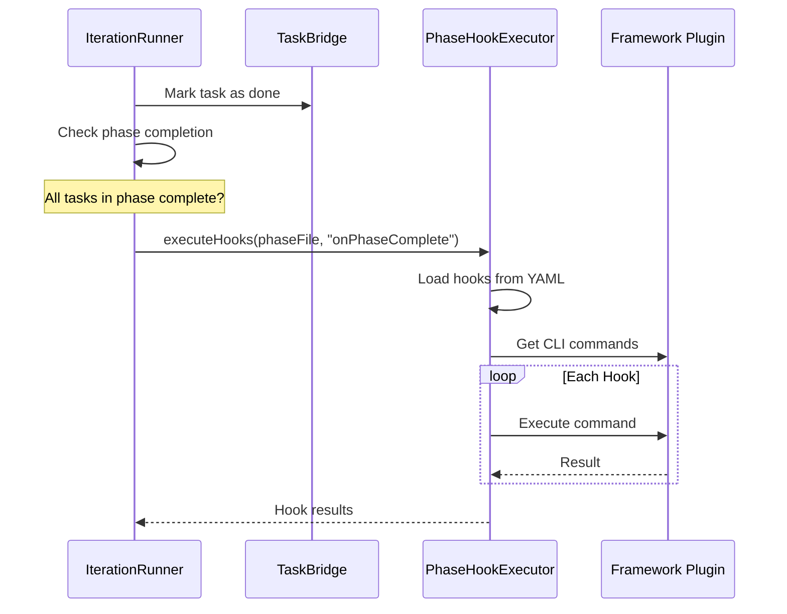

# Phase Hooks Guide

## Overview

Phase hooks enable framework-specific actions to be executed at phase boundaries during PRD set execution. They allow you to automate tasks like enabling modules, running migrations, clearing caches, and building assets when phases complete.

## How Phase Hooks Work



When all tasks in a phase are completed, the `IterationRunner` automatically:
1. Detects phase completion
2. Loads the phase YAML file
3. Executes any `onPhaseComplete` hooks defined in the file
4. Emits events for observability

## Defining Hooks

Hooks are defined in phase YAML files within your PRD set:

```yaml
# .taskmaster/planning/my-feature/phase1_setup.md.yml
---
phase:
  id: 1
  name: "Module Setup"
  description: "Create base module structure"

tasks:
  - id: REQ-1.1
    title: "Create module info.yml"
    priority: must
    # ... task details

hooks:
  onPhaseStart:
    - type: cli_command
      cliCommand: cache-rebuild
      description: Clear caches before starting
      continueOnError: true

  onPhaseComplete:
    - type: cli_command
      cliCommand: module-enable
      args:
        module: my_module
      description: Enable module after Phase 1 completes
    - type: cli_command
      cliCommand: cache-rebuild
      description: Clear caches after enabling module
```

## Hook Types

### cli_command

Execute a framework-specific CLI command registered by a framework plugin.

```yaml
- type: cli_command
  cliCommand: module-enable
  args:
    module: my_module
  description: Enable the module
  continueOnError: false
```

**Properties:**
- `cliCommand` (required): Name of the registered CLI command
- `args` (optional): Key-value arguments for the command
- `description` (optional): Human-readable description
- `continueOnError` (optional): If `true`, continue to next hook on failure. Default: `false`

### shell

Execute an arbitrary shell command.

```yaml
- type: shell
  command: npm run build
  description: Build frontend assets
  continueOnError: true
```

**Properties:**
- `command` (required): Shell command to execute
- `description` (optional): Human-readable description
- `continueOnError` (optional): Continue to next hook on failure

### callback

Execute a custom callback function (for advanced use cases).

```yaml
- type: callback
  callback: my_custom_function
  description: Run custom validation
```

**Note:** Callback hooks require custom implementation in your framework plugin.

## Framework Commands

Each framework plugin registers its own CLI commands:

### Drupal

| Command | Description | Arguments |
|---------|-------------|-----------|
| `module-enable` | Enable a Drupal module | `module`: Module machine name |
| `cache-rebuild` | Rebuild all Drupal caches | None |
| `config-import` | Import configuration | None |
| `config-export` | Export configuration | None |

**Example:**
```yaml
hooks:
  onPhaseComplete:
    - type: cli_command
      cliCommand: module-enable
      args:
        module: my_module
    - type: cli_command
      cliCommand: cache-rebuild
```

### Django

| Command | Description | Arguments |
|---------|-------------|-----------|
| `migrate` | Run database migrations | `app` (optional): App name |
| `collectstatic` | Collect static files | None |
| `makemigrations` | Create new migrations | `app` (optional): App name |

**Example:**
```yaml
hooks:
  onPhaseComplete:
    - type: cli_command
      cliCommand: migrate
    - type: cli_command
      cliCommand: collectstatic
```

### React

| Command | Description | Arguments |
|---------|-------------|-----------|
| `build` | Build production bundle | None |
| `test` | Run test suite | None |
| `lint` | Run linter | None |

**Example:**
```yaml
hooks:
  onPhaseComplete:
    - type: cli_command
      cliCommand: build
    - type: cli_command
      cliCommand: test
```

## Hook Lifecycle Events

Phase hooks emit events for observability:

| Event | Description |
|-------|-------------|
| `hook:started` | Hook execution started |
| `hook:completed` | Hook executed successfully |
| `hook:failed` | Hook execution failed |

These events include:
- Phase ID and PRD ID
- Hook type and description
- Duration
- Error details (for failures)

## Error Handling

### continueOnError

By default, if a hook fails, subsequent hooks in the same lifecycle event are skipped. Set `continueOnError: true` to continue execution:

```yaml
hooks:
  onPhaseComplete:
    - type: shell
      command: npm run optional-task
      description: Optional task
      continueOnError: true  # Continue even if this fails
    - type: cli_command
      cliCommand: cache-rebuild
      description: This will run even if above fails
```

### Hook Failure Impact

- **onPhaseStart failures**: Do not block task execution, but are logged as warnings
- **onPhaseComplete failures**: Do not affect task status, but are logged as warnings

## Best Practices

### 1. Keep Hooks Idempotent

Hooks may be executed multiple times if a PRD set is re-run. Ensure your hooks are safe to run repeatedly:

```yaml
# Good: Idempotent command
- type: cli_command
  cliCommand: cache-rebuild

# Be careful: Non-idempotent commands may cause issues
- type: shell
  command: mysql < seed-data.sql  # May fail on second run
```

### 2. Use continueOnError for Non-Critical Hooks

Optional cleanup or optimization tasks should use `continueOnError`:

```yaml
hooks:
  onPhaseComplete:
    - type: cli_command
      cliCommand: module-enable
      args:
        module: my_module
      # Critical: Don't continue on error
    - type: shell
      command: echo "Notifying team..."
      continueOnError: true  # Non-critical
```

### 3. Order Hooks Logically

Place critical hooks first, optional hooks last:

```yaml
hooks:
  onPhaseComplete:
    # 1. Enable the module (critical)
    - type: cli_command
      cliCommand: module-enable
      args:
        module: my_module

    # 2. Clear caches (important)
    - type: cli_command
      cliCommand: cache-rebuild

    # 3. Run tests (optional verification)
    - type: shell
      command: vendor/bin/phpunit
      continueOnError: true
```

### 4. Add Descriptive Descriptions

Help future maintainers understand the purpose of each hook:

```yaml
- type: cli_command
  cliCommand: config-import
  description: Import configuration changes from Phase 1 code generation
```

## Troubleshooting

### Hook Not Executing

1. **Phase not complete**: Hooks only run when ALL tasks in a phase are marked as `done`
2. **Missing hooks section**: Ensure your phase YAML has a `hooks` section
3. **Wrong lifecycle**: Check if you're using `onPhaseStart` vs `onPhaseComplete`

### Command Not Found

1. **Framework not detected**: Ensure your project has the correct framework detection files (e.g., `composer.json` for Drupal)
2. **Command not registered**: Check that the command is registered by the framework plugin
3. **Typo in cliCommand**: Command names are case-sensitive

### Hook Failing

1. **Check logs**: View detailed error in dev-loop logs
2. **Test manually**: Try running the command manually to diagnose issues
3. **Check dependencies**: Ensure required dependencies are in place (e.g., module file exists before enabling)

## Example: Complete PRD Set with Hooks

```
.taskmaster/planning/content_module/
├── index.md.yml
├── phase1_setup.md.yml      # onPhaseComplete: module-enable
├── phase2_entities.md.yml   # onPhaseComplete: cache-rebuild
├── phase3_services.md.yml   # onPhaseComplete: config-import
└── phase4_tests.md.yml      # onPhaseComplete: run tests
```

**phase1_setup.md.yml:**
```yaml
---
phase:
  id: 1
  name: "Module Setup"

tasks:
  - id: REQ-1.1
    title: "Create module info.yml"
    # ...
  - id: REQ-1.2
    title: "Create module file structure"
    # ...

hooks:
  onPhaseComplete:
    - type: cli_command
      cliCommand: module-enable
      args:
        module: content_module
      description: Enable content_module after base structure is created
    - type: cli_command
      cliCommand: cache-rebuild
      description: Clear caches to pick up new module
```

## Related Documentation

- [PRD Building Guide](PRD_BUILDING.md) - How to create PRD sets
- [Config Guide](CONFIG.md) - Framework configuration
- [Metrics Guide](METRICS.md) - Hook execution metrics
