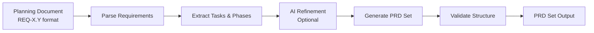
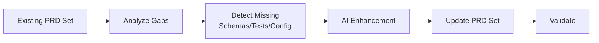
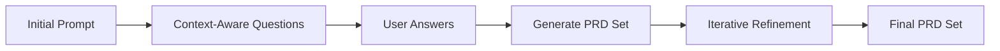

# PRD Building Guide

Complete guide for building PRD sets using `build-prd-set` command. Convert planning documents, enhance existing PRD sets, or create PRD sets interactively.

## Overview

The `build-prd-set` command provides three modes for creating and enhancing PRD sets:

1. **Convert Mode** - Transform planning documents into PRD sets
2. **Enhance Mode** - Improve existing PRD sets with additional schemas, tests, or configuration
3. **Create Mode** - Build PRD sets interactively from prompts

All modes support AI-powered refinement that learns from past patterns, observations, and test results to generate high-quality, executable PRD sets.

## Quick Start

### Convert Planning Document

```bash
# Basic conversion (skip refinement for quick structure validation)
dev-loop build-prd-set \
  --convert .taskmaster/pre-production/my-planning-doc.md \
  --output-dir .taskmaster/production \
  --max-iterations 0 \
  --auto-approve \
  --skip-analysis

# Full conversion with refinement
dev-loop build-prd-set \
  --convert .taskmaster/pre-production/my-planning-doc.md \
  --output-dir .taskmaster/production \
  --max-iterations 3 \
  --auto-approve
```

### Validate Generated PRD Set

```bash
dev-loop prd-set validate .taskmaster/production/my-prd-set
```

## Three Modes

### Convert Mode

Convert planning documents (markdown files with `REQ-X.Y` requirements) into PRD sets.

**Workflow:**



**Usage:**

```bash
dev-loop build-prd-set --convert <path> [options]
```

**Options:**
- `--output-dir <dir>` - Output directory (default: `.taskmaster/production`)
- `--set-id <id>` - PRD set ID (default: extracted from document)
- `--max-iterations <n>` - Refinement iterations (default: 3, use 0 to skip)
- `--auto-approve` - Skip interactive prompts
- `--skip-analysis` - Skip codebase analysis
- `--validate-only` - Only validate, don't create files
- `--force` - Overwrite existing PRD set

**Example:**

```bash
dev-loop build-prd-set \
  --convert .taskmaster/pre-production/analytics-collector-module.md \
  --output-dir .taskmaster/production \
  --max-iterations 3 \
  --auto-approve
```

**What It Does:**
1. Parses planning document and extracts `REQ-X.Y` requirements
2. Groups requirements into phases based on `REQ-X` prefix
3. Creates tasks from each requirement
4. Optionally refines with AI (schemas, test plans, features)
5. Generates PRD set structure:
   - `index.md.yml` - Parent PRD with status `split`
   - `phase{N}_{name}.md.yml` - Child PRD files (one per phase)

**Build Reports:**

Build reports generated after conversion correctly aggregate task counts from all phase files. For split PRDs, tasks are counted from `requirements.phases[].tasks` in each phase file, ensuring accurate metrics in the build report.

**Example build report output:**
```
## PRD Set Structure

- **Total Phases**: 5
- **Total Tasks**: 22

| Phase | Name | File | Tasks |
|-------|------|------|-------|
| 1 | Phase 1 | phase1_phase_1.md.yml | 3 |
| 2 | Phase 2 | phase2_phase_2.md.yml | 4 |
...
```

### Enhance Mode

Enhance existing PRD sets by adding missing schemas, test plans, or configuration.

**Workflow:**



**Usage:**

```bash
dev-loop build-prd-set --enhance <path> [options]
```

**Options:**
- `--gaps-only` - Only detect and report gaps, don't enhance
- `--enhance-types <types>` - Specific enhancement types: `schemas,tests,config,all`
- `--preserve-existing` - Don't modify existing valid configurations (default: true)

**Example:**

```bash
dev-loop build-prd-set \
  --enhance .taskmaster/production/my-prd-set \
  --enhance-types schemas,tests \
  --auto-approve
```

### Create Mode

Create PRD sets interactively through a series of context-aware questions.

**Workflow:**



**Usage:**

```bash
dev-loop build-prd-set --create [--prompt TEXT] [options]
```

**Options:**
- `--prompt <text>` - Initial prompt for PRD creation
- `--max-questions <n>` - Maximum number of questions (default: 10)
- `--skip-questions` - Skip questions and generate PRD directly from prompt
- `--template <template>` - Use specific PRD template

**Example:**

```bash
dev-loop build-prd-set \
  --create \
  --prompt "Create an analytics collector module for Drupal" \
  --max-questions 15
```

## Configuration

Configure PRD building in `devloop.config.js`:

```javascript
module.exports = {
  prdBuilding: {
    // Directories
    preProductionDir: '.taskmaster/pre-production',  // Planning documents
    productionDir: '.taskmaster/production',        // Generated PRD sets

    // Learning files integration
    learningFiles: {
      enabled: true,
      patterns: '.devloop/patterns.json',
      observations: '.devloop/observations.json',
      testResults: '.devloop/test-results.json/test-results.json',
      filtering: {
        relevanceThreshold: 0.5,  // Minimum relevance score (0-1)
        retentionDays: 180,       // Keep entries for 180 days
        lastUsedDays: 90,         // Filter by last use (90 days)
      },
    },

    // Refinement behavior
    refinement: {
      askPrePhaseQuestions: true,   // Ask questions before each refinement phase
      askMidPhaseQuestions: true,   // Ask questions during refinement
      askPostPhaseQuestions: true,  // Ask questions after refinement
      showCodebaseInsights: true,   // Show codebase insights during refinement
    },
  },
};
```

### Learning Files

Learning files provide historical context for refinement:

- **`patterns.json`** - Code patterns learned from past executions
- **`observations.json`** - System observations and insights
- **`test-results.json`** - Test execution history

These files are automatically loaded and filtered during refinement to:
- Generate context-aware questions
- Learn from past patterns and outcomes
- Improve PRD quality through historical insights

**Filtering:**
- Entries are filtered by relevance threshold
- Old entries beyond retention period are pruned
- Only relevant, recent data is used for refinement

See [ARCHIVE.md](./ARCHIVE.md) for information about learning files preservation during archiving.

## Interactive Refinement

The refinement process iteratively enhances PRD sets through three phases:

### Phase 1: Schema Enhancement

- Analyzes codebase for existing schema patterns
- Generates schema definitions for requirements
- Validates schema structure and completeness

### Phase 2: Test Planning

- Generates test plans based on requirements
- Considers test framework configuration (Playwright, Cypress, etc.)
- Creates test specifications with validation checklists

### Phase 3: Feature Enhancement

- Enhances PRD with dev-loop configuration
- Adds framework-specific features
- Configures execution settings

**Refinement Iterations:**

Each phase can run multiple iterations (controlled by `--max-iterations`):
- Iteration 1: Initial enhancement
- Iteration 2+: Refinement based on validation feedback
- Final: Validation and executability check

**Non-Interactive Usage:**

For CI/CD or automated scenarios, use `--auto-approve`:
- Skips all interactive prompts
- Uses default answers for questions
- Auto-approves refinement suggestions
- Works in non-TTY environments

## PRD Set Structure

A PRD set consists of:

### Parent PRD (`index.md.yml`)

The parent PRD manifest with:
- `status: split` (required for PRD sets)
- `relationships.dependedOnBy` - References to child PRDs
- `requirements.phases[]` - Phase definitions with tasks
- `requirements.phases[].file` - Reference to child PRD file

**Example:**

```yaml
---
prd:
  id: analytics_collector_module
  version: 1.0.0
  status: split
  note: "This PRD has been split into 7 phased PRDs."
execution:
  strategy: phased
  mode: autonomous
requirements:
  idPattern: TASK-{id}
  phases:
    - id: 1
      name: Phase 1
      file: phase1_phase_1.md.yml
      tasks:
        - id: REQ-1.1
          title: "Create Module Info File"
          description: "..."
relationships:
  dependedOnBy:
    - prd: analytics_collector_module_phase1
      features: [phase_1]
    - prd: analytics_collector_module_phase2
      features: [phase_2]
---
```

### Child PRDs (`phase{N}_{name}.md.yml`)

Individual phase PRD files with:
- `parentPrd` - Reference to parent PRD ID
- `prdSequence` - Sequence number in parent PRD
- `status: ready` - Ready for execution
- `requirements.phases[0].tasks` - Tasks for this phase

**Example:**

```yaml
---
prd:
  id: analytics_collector_module_phase1
  version: 1.0.0
  status: ready
  parentPrd: analytics_collector_module
  prdSequence: 1
execution:
  strategy: phased
requirements:
  idPattern: TASK-{id}
  phases:
    - id: 1
      name: Phase 1
      tasks:
        - id: REQ-1.1
          title: "Create Module Info File"
          description: "..."
---
```

## Common Workflows

### Workflow 1: Quick Structure Validation

Generate PRD set structure without refinement:

```bash
dev-loop build-prd-set \
  --convert planning-doc.md \
  --max-iterations 0 \
  --auto-approve \
  --skip-analysis
```

**Use Case:** Quick validation of planning document structure and task extraction.

### Workflow 2: Full PRD Set Generation

Generate complete PRD set with refinement:

```bash
dev-loop build-prd-set \
  --convert planning-doc.md \
  --max-iterations 3 \
  --auto-approve
```

**Use Case:** Production-ready PRD set generation with schemas, tests, and features.

### Workflow 3: Enhance Existing PRD Set

Add missing schemas to existing PRD set:

```bash
dev-loop build-prd-set \
  --enhance .taskmaster/production/my-prd-set \
  --enhance-types schemas \
  --auto-approve
```

**Use Case:** Improve existing PRD sets with additional enhancements.

### Workflow 4: Interactive Creation

Create PRD set from scratch:

```bash
dev-loop build-prd-set \
  --create \
  --prompt "Create a REST API module for user management"
```

**Use Case:** Building PRD sets when no planning document exists.

## Troubleshooting

### TTY Initialization Error

**Error:** `SystemError [ERR_TTY_INIT_FAILED]: TTY initialization failed`

**Solution:** Use `--auto-approve` flag for non-interactive environments:

```bash
dev-loop build-prd-set --convert doc.md --auto-approve
```

### Command Times Out

**Issue:** Command hangs or times out during refinement

**Cause:** AI API calls are slow (2-5+ minutes expected)

**Solutions:**
- Use `--max-iterations 0` to skip refinement
- Use `--skip-analysis` to skip codebase analysis
- Increase timeout if running in CI/CD

### PRD Set Validation Fails

**Error:** `Child PRD {id} listed in dependedOnBy but not found or invalid`

**Cause:** Child PRD files not found or incorrect naming

**Solution:** Ensure phase files exist and match `requirements.phases[].file` references

### Tasks Not Extracted

**Issue:** Generated PRD set has no tasks

**Cause:** Planning document doesn't use `REQ-X.Y` format

**Solution:** Use `REQ-X.Y: Title` format in planning document:

```markdown
### REQ-1.1: Create Module Info File

**Description**: Create the module info file...
```

## Best Practices

1. **Use Planning Documents** - Structure planning documents with `REQ-X.Y` format for automatic task extraction

2. **Validate Early** - Use `--max-iterations 0` to quickly validate structure before full refinement

3. **Leverage Learning Files** - Keep learning files (patterns.json, observations.json) to improve refinement quality

4. **Use Auto-Approve for CI/CD** - Always use `--auto-approve` in automated environments

5. **Iterative Refinement** - Start with `--max-iterations 1`, then increase if needed

6. **Validate After Generation** - Always run `prd-set validate` after generation

## Related Documentation

- [User Guide](./README.md) - Complete user documentation
- [PRD Schema](../ai/PRD_SCHEMA.md) - PRD frontmatter schema reference
- [PRD Features](../ai/PRD_FEATURES.md) - Guide to dev-loop features
- [Archive Guide](./ARCHIVE.md) - Learning files preservation

## See Also

- [AI Agent Guide](../ai/README.md) - For AI agents creating PRDs
- [PRD Template](../ai/PRD_TEMPLATE.md) - PRD template for manual creation
