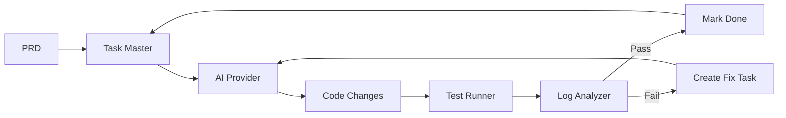
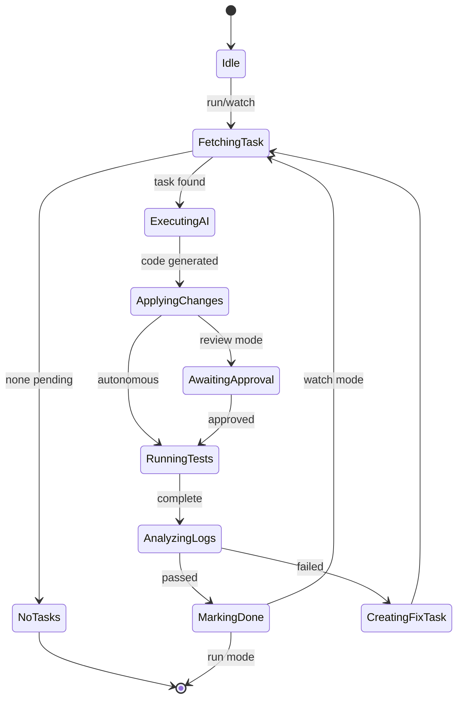

# Dev-Loop User Documentation

Complete user guide for dev-loop - the autonomous development orchestrator that transforms PRDs into validated code.

## Table of Contents

- [Overview](#overview)
- [Installation](#installation)
- [Quick Start](#quick-start)
- [Configuration](#configuration)
- [CLI Reference](#cli-reference)
- [MCP Integration](#mcp-integration)
- [Architecture](#architecture)
- [Framework Plugins](#framework-plugins)
- [Contribution Mode](#contribution-mode)
- [Best Practices](#best-practices)
- [Troubleshooting](#troubleshooting)

## Overview

Dev-loop implements a **test-driven development loop**:



**Key principle**: Every task bundles feature code + test code. The loop continues until all tests pass.

## Installation

**Prerequisites:** Node.js 20+, AI API key (Anthropic, OpenAI, or Gemini)

```bash
npm install -g dev-loop
```

## Quick Start

```bash
# Setup
echo "ANTHROPIC_API_KEY=your_key" > .env
dev-loop init
task-master init

# Run
task-master parse-prd --input=prd.md   # Create tasks from PRD
dev-loop run                            # Execute one iteration
dev-loop watch                          # Continuous mode
```

## Configuration

Create `devloop.config.js`:

```javascript
module.exports = {
  ai: {
    provider: 'anthropic',              // 'anthropic' | 'openai' | 'gemini' | 'ollama'
    model: 'claude-sonnet-4-20250514',
    fallback: 'openai:gpt-4o',
  },
  testing: {
    runner: 'playwright',               // 'playwright' | 'cypress'
    command: 'npm test',
    timeout: 300000,
  },
  intervention: {
    mode: 'autonomous',                 // 'autonomous' | 'review' | 'hybrid'
  },
  taskMaster: {
    tasksPath: '.taskmaster/tasks/tasks.json',
  },
  debug: false,
  metrics: { enabled: true, path: '.devloop/metrics.json' },
  patternLearning: { enabled: true, patternsPath: '.devloop/patterns.json' },
};
```

## CLI Reference

### Core Commands

| Command | Description |
|---------|-------------|
| `dev-loop init` | Initialize project |
| `dev-loop run [--task ID] [--debug]` | Execute one iteration |
| `dev-loop watch [--debug]` | Continuous execution |
| `dev-loop status` | Current progress |
| `dev-loop pause` / `resume` | Control execution |

### Task Commands

| Command | Description |
|---------|-------------|
| `dev-loop list [--pending\|--done]` | List tasks |
| `dev-loop show <id>` | Task details |
| `dev-loop reset <id>` | Reset to pending |
| `task-master parse-prd --input=<file>` | Create tasks from PRD |
| `task-master add-task --prompt="..."` | Add single task |
| `task-master set-status --id=<id> --status=done` | Update status |

### Debugging Commands

| Command | Description |
|---------|-------------|
| `dev-loop diagnose [<id>]` | Analyze failures |
| `dev-loop trace <id>` | Execution trace |
| `dev-loop logs [--follow]` | View logs |
| `dev-loop metrics [--summary]` | Debug metrics |
| `dev-loop validate` | Check config/environment |
| `dev-loop validate-prd <prd-path>` | Validate PRD frontmatter |

### Code Quality & AI Commands

| Command | Description |
|---------|-------------|
| `dev-loop scan [--type TYPE]` | Run code quality scans |
| `dev-loop recommend [--ai]` | Generate abstraction recommendations |
| `dev-loop feedback <id> [--accept\|--reject]` | Provide feedback on AI recommendations |

### Contribution Mode Commands

| Command | Description |
|---------|-------------|
| `dev-loop contribution start --prd <path>` | Start contribution mode |
| `dev-loop contribution status` | Check contribution mode status |
| `dev-loop contribution stop` | Stop contribution mode |
| `dev-loop contribution validate` | Validate contribution mode boundaries |
| `dev-loop contribution boundaries` | List active boundaries |

## MCP Integration

Both Task Master and Dev-Loop run as MCP servers for direct AI assistant integration.

### Setup

Create `.cursor/mcp.json`:

```json
{
  "mcpServers": {
    "task-master-ai": {
      "command": "npx",
      "args": ["-y", "task-master-ai@0.40.0"],
      "env": { "ANTHROPIC_API_KEY": "${ANTHROPIC_API_KEY}" }
    },
    "dev-loop": {
      "command": "node",
      "args": ["packages/dev-loop/dist/mcp/server.js"],
      "env": { "ANTHROPIC_API_KEY": "${ANTHROPIC_API_KEY}" }
    }
  }
}
```

### MCP Tools

**Task Master MCP** (task management):
- `parse_prd`, `add_task`, `list_tasks`, `next_task`, `get_task`, `set_status`, `expand_task`

**Dev-Loop MCP** (workflow orchestration):
- Core: `devloop_run`, `devloop_status`, `devloop_prd`, `devloop_list_tasks`
- Debug: `devloop_diagnose`, `devloop_trace`, `devloop_logs`, `devloop_metrics`
- Control: `devloop_pause`, `devloop_resume`, `devloop_reset`, `devloop_validate`
- Contribution: `devloop_contribution_start`, `devloop_contribution_status`, `devloop_contribution_stop`, `devloop_contribution_validate`, `devloop_contribution_boundaries`

### Common Workflows

**Start a PRD (Contribution Mode):**
```
1. devloop_contribution_start(prd: "path/to/prd.md")
2. task-master: parse_prd(input: "path/to/prd.md")
3. devloop_prd(prdPath: "path/to/prd.md", debug: true)
4. devloop_contribution_status() — monitor until complete
```

**Debug a failure:**
```
1. devloop_diagnose(taskId: "123")
2. devloop_logs(analyze: true)
3. devloop_trace(taskId: "123")
```

## Architecture

### Workflow State Machine



### Core Components

| Component | Purpose |
|-----------|---------|
| **WorkflowEngine** | Main orchestration loop, state machine |
| **TaskMasterBridge** | Wrapper around task-master-ai |
| **StateManager** | JSON/YAML persistence, state recovery |
| **CodeContextProvider** | Extract file signatures, imports, error context |
| **ValidationGate** | Pre-apply validation, syntax checking |
| **PatternLearningSystem** | Learn from outcomes, inject guidance |

### Provider Interfaces

| Interface | Implementations |
|-----------|-----------------|
| **AIProvider** | Anthropic, OpenAI, Gemini, Ollama |
| **TestRunner** | Playwright, Cypress |
| **LogAnalyzer** | PatternMatcher (regex), AILogAnalyzer |

### Analysis Components

For complex issues, dev-loop provides:

- **FrameworkPatternLibrary** — Framework-specific patterns (Drupal, React)
- **DebuggingStrategyAdvisor** — Classify errors, suggest investigation vs direct fix
- **ExecutionOrderAnalyzer** — Detect timing/ordering issues
- **ComponentInteractionAnalyzer** — Map component boundaries and conflicts
- **RootCauseAnalyzer** — Track partial fixes, identify systemic issues

## Framework Plugins

Dev-loop uses a plugin architecture to support different frameworks. Each plugin provides framework-specific templates, error patterns, file discovery rules, and configuration defaults.

### Built-in Plugins

| Plugin | Description | Auto-detects |
|--------|-------------|--------------|
| **drupal** | Drupal 10/11 with DDEV integration | Yes |
| **django** | Django 5+ with Docker/DRF support | Yes |
| **react** | React + TypeScript + Vite | Yes |
| **browser-extension** | Chrome/Firefox extensions with manifest V3 | Yes |
| **composite** | Multi-framework projects (auto-created) | No |
| **generic** | Fallback for any project | Fallback only |

### Auto-Detection

When `framework.type` is not specified in `devloop.config.js`, dev-loop auto-detects frameworks:

1. Checks built-in plugins (Drupal, Django, React)
2. If multiple detected → creates `CompositePlugin`
3. If single detected → uses that plugin
4. If none detected → uses `GenericPlugin`

Example: A project with both Django backend and React frontend automatically gets a `CompositePlugin` that merges both frameworks' configurations.

### Multi-Framework Projects

For projects like allthriveai (Django + React + Extension), dev-loop automatically:
- Detects all frameworks
- Creates a `CompositePlugin` with merged configurations
- Combines templates and error patterns
- Merges file discovery rules (search dirs, extensions, excludes)

**Example Configuration:**
```javascript
// devloop.config.js - optional, auto-detection works without this
module.exports = {
  framework: {
    type: 'composite', // Or let auto-detection handle it
  },
};
```

### Creating Custom Framework Plugins

#### Project-Local Plugin

Create a plugin in your project at `.devloop/frameworks/{name}/plugin.json`:

```json
{
  "name": "myframework",
  "version": "1.0.0",
  "description": "Custom framework plugin",
  "fileExtensions": ["ts", "tsx"],
  "searchDirs": ["src"],
  "excludeDirs": ["node_modules"],
  "templates": {
    "task": "templates/task.md"
  },
  "errorPatterns": {
    "MyError": "Helpful guidance for this error"
  },
  "cacheCommand": "npm run build"
}
```

#### NPM Plugin

Publish an npm package `@dev-loop/framework-{name}` that exports a `FrameworkPlugin` implementation.

See `src/frameworks/interface.ts` for full interface definition.

## Contribution Mode

Activated by human operator: "Enter contribution mode for dev-loop"

**Outer agent responsibilities:**
1. Run `devloop_contribution_start`
2. Create/update tasks via Task Master
3. Monitor via `devloop_contribution_status`
4. If inner agent stuck: enhance `node_modules/dev-loop/` code
5. Build, commit, push dev-loop changes
6. Validate improvements via metrics

**What to add to dev-loop vs create as task:**

| Scenario | Action |
|----------|--------|
| One-off bug fix | Create task |
| Repeated pattern | Add to PatternLearningSystem |
| Missing context | Enhance CodeContextProvider |
| Better prompts | Update templates |

**Keep dev-loop framework-agnostic.** Project-specific behavior goes in:
- `devloop.config.js` — Hooks, log sources
- `.taskmaster/templates/` — PRD templates
- Project rules (CLAUDE.md, .cursorrules) — Injected into prompts

## File Structure

```
project/
├── devloop.config.js           # Dev-loop config
├── .env                        # API keys
├── .taskmaster/
│   ├── tasks/tasks.json        # Task definitions
│   └── docs/                   # PRDs
├── .devloop/
│   ├── metrics.json            # Execution metrics
│   └── patterns.json           # Learned patterns
├── tests/playwright/           # Test specs
└── test-results/               # Artifacts, screenshots
```

## Best Practices

1. Bundle features with tests
2. Run tests after each change
3. Check logs with every test run
4. Take screenshots liberally
5. Create atomic fix tasks
6. Commit working states
7. Verify AI changes with `git diff`
8. Use `dev-loop validate-prd` before activating PRDs

## Troubleshooting

| Issue | Fix |
|-------|-----|
| Test timeout | Fix wait strategy, increase timeout |
| AI not implementing | Check API key and config |
| Form not advancing | Wait for button text/URL change |
| Flaky tests | Add explicit waits, retry logic |
| PRD validation errors | Check frontmatter against schema |

## See Also

- [AI Agent Guide](../ai/README.md) - For AI agents creating PRDs
- [HANDOFF.md](../../HANDOFF.md) - Implementation handoff
- [Task Master AI](https://www.npmjs.com/package/task-master-ai) - Task management

## License

MIT
