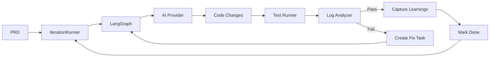
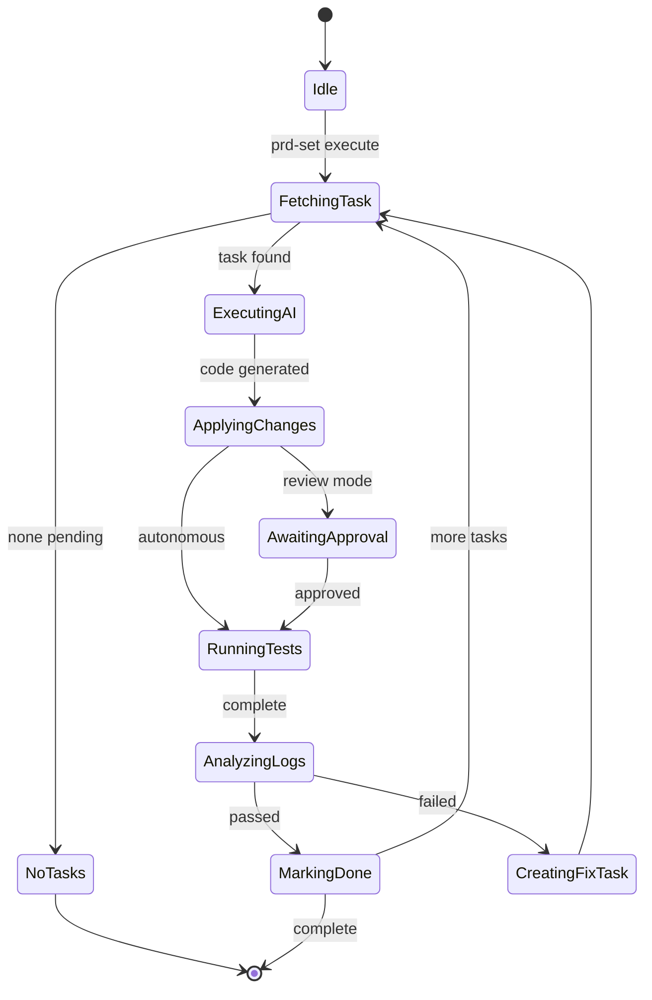

# Dev-Loop User Documentation

Complete user guide for dev-loop - the autonomous development orchestrator that transforms PRDs into validated code.

## Table of Contents

- [Overview](#overview)
- [Installation](#installation)
- [Quick Start](#quick-start)
- [Configuration](#configuration)
- [CLI Reference](#cli-reference)
- [Phase Hooks](#phase-hooks)
- [Metrics and Reporting](#metrics-and-reporting)
- [MCP Integration](#mcp-integration)
- [Architecture](#architecture)
- [Framework Plugins](#framework-plugins)
- [Cursor Integration](#cursor-integration)
- [AI-Enhanced Pattern Detection](#ai-enhanced-pattern-detection)
- [Code Quality Scanning](#code-quality-scanning)
- [Contribution Mode](#contribution-mode)
- [Best Practices](#best-practices)
- [Troubleshooting](#troubleshooting)

## Overview

Dev-loop implements a **test-driven development loop** using the Ralph pattern (fresh context per iteration):



**Key principles**:
- Every task bundles feature code + test code
- Fresh AI context per iteration (Ralph pattern)
- Learnings persist via `handoff.md` and `progress.md`
- The loop continues until all tests pass

## Installation

**Prerequisites:** Node.js 20+, AI API key (Anthropic, OpenAI, or Gemini)

```bash
npm install -g dev-loop
```

## Quick Start

```bash
# Setup
echo "ANTHROPIC_API_KEY=your_key" > .env
dev-loop init
task-master init

# Execute PRD set (loop behavior determined by PRD set schema)
dev-loop prd-set execute .taskmaster/planning/my-set/

# Single iteration (for debugging)
dev-loop run
```

## Configuration

Create `devloop.config.js`:

```javascript
module.exports = {
  ai: {
    provider: 'anthropic',              // 'anthropic' | 'openai' | 'gemini' | 'ollama' | 'cursor'
    model: 'claude-sonnet-4-20250514',
    fallback: 'openai:gpt-4o',
  },
  testing: {
    runner: 'playwright',               // 'playwright' | 'cypress'
    command: 'npm test',
    timeout: 300000,
  },
  intervention: {
    mode: 'autonomous',                 // 'autonomous' | 'review' | 'hybrid'
  },
  taskMaster: {
    tasksPath: '.taskmaster/tasks/tasks.json',
  },
  cursor: {
    requestsPath: 'files-private/cursor',
    agentName: 'DevLoopCodeGen',
    model: 'auto',
    agents: {
      enabled: true,
      autoGenerate: true,
      autoProcess: true,
      watchMode: true,
      processInterval: 2000,
      useBackgroundAgent: true,
      agentOutputFormat: 'json',
      sessionManagement: {
        enabled: true,
        maxSessionAge: 3600000,
        maxHistoryItems: 50,
        sessionsPath: '.devloop/execution-state.json', // Sessions now in unified execution-state.json
      },
    },
  },
  debug: false,
  metrics: {
    enabled: true,
    path: '.devloop/metrics.json', // Unified hierarchical metrics (prdSets, prds, phases, features, schema, parallel, insights)
    testResultsPath: '.devloop/test-results',
    reportsPath: '.devloop/reports',
    costTracking: {
      enabled: true,
      provider: 'anthropic',
    },
  },
  archive: {
    enabled: true,
    defaultPath: '.devloop/archive',
    compress: false,
    preserveStructure: true,
    pruning: {
      enabled: true,
      preserveLearningFiles: true,  // Don't archive patterns.json, observations.json, etc.
      learningFilePaths: [
        '.devloop/patterns.json',
        '.devloop/observations.json',
        '.devloop/test-results.json',
        '.devloop/prd-set-state.json',
      ],
    },
  },
  // PRD Building Configuration
  prdBuilding: {
    preProductionDir: '.taskmaster/pre-production',  // Planning documents directory
    productionDir: '.taskmaster/production',        // Generated PRD sets directory
    learningFiles: {
      enabled: true,
      patterns: '.devloop/patterns.json',
      observations: '.devloop/observations.json',
      testResults: '.devloop/test-results.json/test-results.json',
      filtering: {
        relevanceThreshold: 0.5,
        retentionDays: 180,
        lastUsedDays: 90,
      },
    },
    refinement: {
      askPrePhaseQuestions: true,
      askMidPhaseQuestions: true,
      askPostPhaseQuestions: true,
      showCodebaseInsights: true,
    },
  },
  patternLearning: { enabled: true, patternsPath: '.devloop/patterns.json' },
};
```

**Advanced Configuration:**

- **AI Pattern Detection** — See [AI-Enhanced Pattern Detection](#ai-enhanced-pattern-detection) for `aiPatterns` config
- **Code Quality Scanning** — See [Code Quality Scanning](#code-quality-scanning) for `scan` config
- **Framework Plugins** — See [Framework Plugins](#framework-plugins) for `framework` config
- **Cursor Integration** — See [Cursor Integration](#cursor-integration) for `cursor.agents` config
- **PRD Building** — See [PRD_BUILDING.md](./PRD_BUILDING.md) for `prdBuilding` config

## CLI Reference

### Core Commands

| Command | Description |
|---------|-------------|
| `dev-loop init` | Initialize project |
| `dev-loop prd-set execute <path>` | Execute PRD set (primary method) |
| `dev-loop run [--debug]` | Execute continuous workflow |
| `dev-loop status` | Current progress |
| `dev-loop pause` / `resume` | Control execution |

### Task Commands

| Command | Description |
|---------|-------------|
| `dev-loop list [--pending\|--done]` | List tasks |
| `dev-loop show <id>` | Task details |
| `dev-loop reset <id>` | Reset to pending |
| `task-master parse-prd --input=<file>` | Create tasks from PRD |
| `task-master add-task --prompt="..."` | Add single task |
| `task-master set-status --id=<id> --status=done` | Update status |

### PRD Building Commands

| Command | Description |
|---------|-------------|
| `dev-loop build-prd-set --convert <path> [options]` | Convert planning document to PRD set |
| `dev-loop build-prd-set --enhance <path> [options]` | Enhance existing PRD set |
| `dev-loop build-prd-set --create [--prompt TEXT] [options]` | Create PRD set interactively |
| `dev-loop prd-set validate <path>` | Validate PRD set structure |
| `dev-loop prd-set list` | List discovered PRD sets |
| `dev-loop prd-set status [--prd-set <id>]` | Show PRD set execution status |
| `dev-loop prd-set execute <path>` | Execute PRD set |

**Common Options:**
- `--output-dir <dir>` - Output directory (default: `.taskmaster/production`)
- `--auto-approve` - Skip interactive prompts (for CI/CD)
- `--skip-analysis` - Skip codebase analysis (faster)
- `--max-iterations <n>` - Refinement iterations (default: 3, use 0 to skip)
- `--debug` - Enable debug output

See [PRD_BUILDING.md](./PRD_BUILDING.md) for complete PRD building guide.

## Phase Hooks

Phase hooks enable framework-specific actions at phase boundaries. Define hooks in phase YAML files to automate tasks like enabling modules, running migrations, or clearing caches when phases complete.

**Example:**
```yaml
# In phase YAML file
hooks:
  onPhaseComplete:
    - type: cli_command
      cliCommand: module-enable
      args:
        module: my_module
      description: Enable module after phase completes
    - type: cli_command
      cliCommand: cache-rebuild
```

**Available hook types:**
- `cli_command`: Framework-specific CLI commands (Drupal drush, Django manage.py)
- `shell`: Arbitrary shell commands
- `callback`: Custom callback functions

**Framework commands:**
| Framework | Commands |
|-----------|----------|
| Drupal | `module-enable`, `cache-rebuild`, `config-import` |
| Django | `migrate`, `collectstatic`, `makemigrations` |
| React | `build`, `test`, `lint` |

See [PHASE_HOOKS.md](./PHASE_HOOKS.md) for complete phase hooks guide.

### Debugging Commands

| Command | Description |
|---------|-------------|
| `dev-loop diagnose [<id>]` | Analyze failures |
| `dev-loop trace <id>` | Execution trace |
| `dev-loop logs [--follow]` | View logs |
| `dev-loop metrics [--summary]` | Debug metrics |
| `dev-loop validate` | Check config/environment |
| `dev-loop validate-prd <prd-path>` | Validate PRD frontmatter |

### Metrics and Reporting Commands

| Command | Description |
|---------|-------------|
| `dev-loop metrics [--prd-set <id>] [--prd <id>] [--phase <prdId:phaseId>]` | View hierarchical metrics |
| `dev-loop metrics --compare <id1>:<id2>` | Compare two PRDs or PRD sets |
| `dev-loop metrics --trends` | Show trends over time |
| `dev-loop metrics --features` | Show feature usage metrics |
| `dev-loop metrics --schema` | Show schema operation metrics |
| `dev-loop report [--prd <id>] [--prd-set <id>] [--phase <prdId:phaseId>]` | Generate execution reports |
| `dev-loop report --latest` | Generate report for most recent PRD |
| `dev-loop report --prd-set <id>` | Generate reports for all PRDs in set |
| `dev-loop archive [--prd-name <name>] [--compress]` | Archive state files (see [ARCHIVE.md](./ARCHIVE.md) for details) |

See [METRICS.md](./METRICS.md) for detailed metrics guide and [REPORTS.md](./REPORTS.md) for report generation.

### Code Quality & AI Commands

| Command | Description |
|---------|-------------|
| `dev-loop scan [--type TYPE]` | Run code quality scans |
| `dev-loop recommend [--ai]` | Generate abstraction recommendations |
| `dev-loop feedback <id> [--accept\|--reject]` | Provide feedback on AI recommendations |

### Contribution Mode Commands

| Command | Description |
|---------|-------------|
| `dev-loop contribution start --prd <path>` | Start contribution mode |
| `dev-loop contribution status` | Check contribution mode status |
| `dev-loop contribution stop` | Stop contribution mode |
| `dev-loop contribution validate` | Validate contribution mode boundaries |
| `dev-loop contribution boundaries` | List active boundaries |

## Cursor Integration

Dev-loop uses Cursor background agents (headless execution via `cursor agent --print`) as the primary method for autonomous code generation. This enables:

- **Background agent execution** - Headless, autonomous code generation using `cursor agent --print` mode
- **Session persistence** - Context and conversation history maintained across tasks
- **100% automated execution** - No manual intervention required
- **Parallel execution support** - Multiple PRD sets and phases execute simultaneously with isolated sessions
- **Reliability features** - Timeout handling, retry logic, enhanced JSON parsing

**Configuration:**
```javascript
cursor: {
  agents: {
    enabled: true,
    autoProcess: true,
    useBackgroundAgent: true,
    sessionManagement: {
      enabled: true,
      maxSessionAge: 3600000,
      maxHistoryItems: 50,
      sessionsPath: '.devloop/cursor-sessions.json',
    },
  },
}
```

See [`../CURSOR_INTEGRATION.md`](../CURSOR_INTEGRATION.md) for complete Cursor integration guide including session management, timeout handling, retry logic, and parallel execution.

## MCP Integration

Both Task Master and Dev-Loop run as MCP servers for direct AI assistant integration.

### Setup

Create `.cursor/mcp.json`:

```json
{
  "mcpServers": {
    "task-master-ai": {
      "command": "npx",
      "args": ["-y", "task-master-ai@0.40.0"],
      "env": { "ANTHROPIC_API_KEY": "${ANTHROPIC_API_KEY}" }
    },
    "dev-loop": {
      "command": "node",
      "args": ["packages/dev-loop/dist/mcp/server.js"],
      "env": { "ANTHROPIC_API_KEY": "${ANTHROPIC_API_KEY}" }
    }
  }
}
```

### MCP Tools

**Task Master MCP** (task management):
- `parse_prd`, `add_task`, `list_tasks`, `next_task`, `get_task`, `set_status`, `expand_task`

**Dev-Loop MCP** (workflow orchestration):
- **Core**: `devloop_run`, `devloop_status`, `devloop_prd`, `devloop_list_tasks`
- **Debug**: `devloop_diagnose`, `devloop_trace`, `devloop_logs`, `devloop_metrics`
- **Control**: `devloop_pause`, `devloop_resume`, `devloop_reset`, `devloop_validate`
- **Contribution**: `devloop_contribution_start`, `devloop_contribution_status`, `devloop_contribution_stop`, `devloop_contribution_validate`, `devloop_contribution_boundaries`
- **Events**: `devloop_events_poll`, `devloop_events_latest`, `devloop_blocked_tasks`, `devloop_filtered_files`, `devloop_issues`
- **Event Monitoring**: `devloop_event_monitor_start`, `devloop_event_monitor_stop`, `devloop_event_monitor_status`, `devloop_event_monitor_configure`, `devloop_event_monitor_interventions`
- **Observation**: `devloop_pattern_detection`, `devloop_codebase_health`, `devloop_session_analysis`, `devloop_context_gap_detection`, `devloop_dependency_graph`
- **Background Agents**: `devloop_background_agent_status` (via Cursor integration)

### Common Workflows

**Start a PRD (Contribution Mode):**
```
1. devloop_contribution_start(prd: "path/to/prd.md")
2. task-master: parse_prd(input: "path/to/prd.md")
3. devloop_prd(prdPath: "path/to/prd.md", debug: true)
4. devloop_contribution_status() — monitor until complete
```

**Debug a failure:**
```
1. devloop_diagnose(taskId: "123")
2. devloop_logs(analyze: true)
3. devloop_trace(taskId: "123")
```

**Monitor events (Contribution Mode):**
```
1. devloop_event_monitor_start() — start proactive monitoring
2. devloop_events_poll() — poll for events
3. devloop_event_monitor_interventions() — view interventions
```

See [`../contributing/EVENT_STREAMING.md`](../contributing/EVENT_STREAMING.md) for event streaming guide and [`../contributing/PROACTIVE_MONITORING.md`](../contributing/PROACTIVE_MONITORING.md) for proactive monitoring guide.

## Architecture

### Workflow State Machine



### Core Components

| Component | Purpose |
|-----------|---------|
| **IterationRunner** | Fresh context execution loop (Ralph pattern) |
| **LangGraph StateGraph** | Workflow orchestration with checkpoints |
| **TaskMasterBridge** | Wrapper around task-master-ai |
| **CodeContextProvider** | Extract file signatures, imports, error context |
| **ValidationGate** | Pre-apply validation, syntax checking |
| **PatternLearningSystem** | Learn from outcomes, inject guidance |
| **EventMetricBridge** | Automatic metrics collection from events |
| **PhaseHookExecutor** | Execute framework hooks on phase completion |
| **CrossPrdCheckpointer** | Shared state across parallel PRDs |

### Provider Interfaces

| Interface | Implementations |
|-----------|-----------------|
| **AIProvider** | Anthropic, OpenAI, Gemini, Ollama |
| **TestRunner** | Playwright, Cypress |
| **LogAnalyzer** | PatternMatcher (regex), AILogAnalyzer |

### Analysis Components

For complex issues, dev-loop provides:

- **FrameworkPatternLibrary** — Framework-specific patterns (Drupal, React)
- **DebuggingStrategyAdvisor** — Classify errors, suggest investigation vs direct fix
- **ExecutionOrderAnalyzer** — Detect timing/ordering issues
- **ComponentInteractionAnalyzer** — Map component boundaries and conflicts
- **RootCauseAnalyzer** — Track partial fixes, identify systemic issues

## Framework Plugins

Dev-loop uses a plugin architecture to support different frameworks. Each plugin provides framework-specific templates, error patterns, file discovery rules, and configuration defaults.

### Built-in Plugins

| Plugin | Description | Auto-detects |
|--------|-------------|--------------|
| **drupal** | Drupal 10/11 with DDEV integration | Yes |
| **django** | Django 5+ with Docker/DRF support | Yes |
| **react** | React + TypeScript + Vite | Yes |
| **browser-extension** | Chrome/Firefox extensions with manifest V3 | Yes |
| **composite** | Multi-framework projects (auto-created) | No |
| **generic** | Fallback for any project | Fallback only |

### Auto-Detection

When `framework.type` is not specified in `devloop.config.js`, dev-loop auto-detects frameworks:

1. Checks built-in plugins (Drupal, Django, React)
2. If multiple detected → creates `CompositePlugin`
3. If single detected → uses that plugin
4. If none detected → uses `GenericPlugin`

Example: A project with both Django backend and React frontend automatically gets a `CompositePlugin` that merges both frameworks' configurations.

### Multi-Framework Projects

For projects like allthriveai (Django + React + Extension), dev-loop automatically:
- Detects all frameworks
- Creates a `CompositePlugin` with merged configurations
- Combines templates and error patterns
- Merges file discovery rules (search dirs, extensions, excludes)

**Example Configuration:**
```javascript
// devloop.config.js - optional, auto-detection works without this
module.exports = {
  framework: {
    type: 'composite', // Or let auto-detection handle it
  },
};
```

### Creating Custom Framework Plugins

#### Project-Local Plugin

Create a plugin in your project at `.devloop/frameworks/{name}/plugin.json`:

```json
{
  "name": "myframework",
  "version": "1.0.0",
  "description": "Custom framework plugin",
  "fileExtensions": ["ts", "tsx"],
  "searchDirs": ["src"],
  "excludeDirs": ["node_modules"],
  "templates": {
    "task": "templates/task.md"
  },
  "errorPatterns": {
    "MyError": "Helpful guidance for this error"
  },
  "cacheCommand": "npm run build"
}
```

#### NPM Plugin

Publish an npm package `@dev-loop/framework-{name}` that exports a `FrameworkPlugin` implementation.

See `src/frameworks/interface.ts` for full interface definition.

## AI-Enhanced Pattern Detection

Dev-loop includes AI-powered pattern detection for identifying abstraction opportunities and code quality improvements.

### Features

- **Semantic Code Analysis**: Uses embeddings to find functionally similar code blocks
- **Pattern Clustering**: Groups similar patterns across files for abstraction recommendations
- **LLM Analysis**: Deep analysis of patterns for implementation suggestions
- **Feedback Learning**: Learns from user feedback to improve future recommendations
- **Framework-Specific**: Tailored recommendations for Drupal, Django, React, and Browser Extensions

### Configuration

> **Note:** Pattern detection uses `aiPatterns` config (separate from code generation `ai` config).

```javascript
// devloop.config.js
module.exports = {
  // AI for code generation (separate from pattern detection)
  ai: {
    provider: 'anthropic',
    model: 'claude-sonnet-4-20250514',
  },

  // AI for pattern detection and abstraction recommendations
  aiPatterns: {
    enabled: true,
    provider: 'auto',  // 'anthropic' | 'openai' | 'ollama' | 'auto'
    providers: {
      anthropic: { apiKey: process.env.ANTHROPIC_API_KEY },
      openai: { apiKey: process.env.OPENAI_API_KEY },
      ollama: { baseUrl: 'http://localhost:11434' },
    },
    analysis: {
      mode: 'hybrid',           // 'embeddings-only' | 'llm-only' | 'hybrid'
      similarityThreshold: 0.85,
      minOccurrences: 3,
    },
    costs: {
      maxTokensPerScan: 100000,
      maxRequestsPerScan: 50,
      enableCaching: true,
      batchSize: 10,
    },
    learning: {
      enabled: true,
      feedbackFile: '.devloop/ai-feedback.json',
    },
  },
};
```

### Usage

```bash
# Run AI-enhanced pattern detection
dev-loop recommend --ai

# Use embeddings only (cheaper, faster)
dev-loop recommend --ai --ai-mode embeddings-only

# Full LLM analysis (more accurate, higher cost)
dev-loop recommend --ai --ai-mode llm-only

# Incremental scan (only changed files)
dev-loop recommend --ai --incremental

# Provide feedback on a recommendation
dev-loop feedback rec-123 --accept
dev-loop feedback rec-456 --reject --notes "Pattern is intentional"
```

### Abstraction Types

| Framework | Recommended Abstractions |
|-----------|-------------------------|
| **Drupal** | Plugins, config schemas, entity types, fields, services |
| **Django** | Base serializers, viewsets, abstract models, services |
| **React** | Custom hooks, HOCs, context providers, utility functions |
| **Browser Extension** | Message handlers, content script utilities, background services |

### Cost Controls

- **Token limits**: Set maximum tokens per scan
- **Caching**: Embeddings cached in `.devloop/embeddings.json`
- **Batching**: Efficient API calls with configurable batch sizes
- **Incremental scans**: Only analyze changed files

## Code Quality Scanning

Dev-loop includes framework-aware code quality scanning for static analysis, security, and tech debt detection.

### Configuration

```javascript
// devloop.config.js
module.exports = {
  scan: {
    enabled: true,
    schedule: 'manual',           // 'manual' | 'pre-commit' | 'nightly'
    tools: {
      staticAnalysis: true,
      duplicateDetection: true,
      security: true,
      complexity: false,
      techDebt: true,
    },
    thresholds: {
      maxDuplicateLines: 10,
      maxComplexity: 15,
      failOnSecurityVulnerability: true,
    },
    output: {
      path: '.devloop/scan-results',
      formats: ['json', 'markdown'],  // Also supports 'sarif'
    },
    taskCreation: {
      enabled: false,             // Auto-create tasks from findings
      minSeverity: 'warning',     // 'info' | 'warning' | 'error'
      groupBy: 'rule',            // 'file' | 'rule' | 'severity'
    },
  },
};
```

### Usage

```bash
# Run all enabled scans
dev-loop scan

# Run specific scan type
dev-loop scan --type static-analysis
dev-loop scan --type security
dev-loop scan --type tech-debt

# Output to specific format
dev-loop scan --format sarif
```

### Framework-Specific Tools

Each framework plugin provides its own code quality tools:

| Framework | Static Analysis | Security | Duplicate Detection |
|-----------|-----------------|----------|---------------------|
| **Drupal** | PHPStan, PHPCS | Security Advisories | PHPCPD |
| **Django** | mypy, pylint | Bandit, Safety | - |
| **React** | ESLint, TypeScript | npm audit | jscpd |
| **Browser Extension** | ESLint, TypeScript | CSP validation | jscpd |

## Contribution Mode

Contribution mode enables two-agent architecture for contributing to dev-loop itself. The outer agent enhances dev-loop while the inner agent implements project code.

**Quick Overview:**
- **Outer Agent (You)**: Enhances dev-loop, manages tasks, monitors progress
- **Inner Agent (Dev-Loop)**: Implements project code according to PRD requirements
- **Execution**: IterationRunner executes tasks with fresh context per iteration
- **Monitoring**: Event streaming and proactive monitoring tools available

**Outer agent responsibilities:**
1. Run `devloop_contribution_start`
2. Create/update tasks via Task Master
3. Monitor via `devloop_contribution_status` or event streaming
4. If inner agent stuck: enhance `node_modules/dev-loop/` code
5. Build, commit, push dev-loop changes
6. Validate improvements via metrics

**What to add to dev-loop vs create as task:**

| Scenario | Action |
|----------|--------|
| One-off bug fix | Create task |
| Repeated pattern | Add to PatternLearningSystem |
| Missing context | Enhance CodeContextProvider |
| Better prompts | Update templates |

**Keep dev-loop framework-agnostic.** Project-specific behavior goes in:
- `devloop.config.js` — Hooks, log sources
- `.taskmaster/templates/` — PRD templates
- Project rules (CLAUDE.md, .cursorrules) — Injected into prompts

See [`../contributing/README.md`](../contributing/README.md) and [`../contributing/CONTRIBUTION_MODE.md`](../contributing/CONTRIBUTION_MODE.md) for complete contribution mode guide.

## File Structure

```
project/
├── devloop.config.js           # Dev-loop config
├── .env                        # API keys
├── .taskmaster/
│   ├── tasks/tasks.json        # Task definitions
│   └── docs/                   # PRDs
├── .devloop/
│   ├── metrics.json            # Execution metrics
│   └── patterns.json           # Learned patterns
├── tests/playwright/           # Test specs
└── test-results/               # Artifacts, screenshots
```

## Best Practices

1. Bundle features with tests
2. Run tests after each change
3. Check logs with every test run
4. Take screenshots liberally
5. Create atomic fix tasks
6. Commit working states
7. Verify AI changes with `git diff`
8. Use `dev-loop validate-prd` before activating PRDs

## Troubleshooting

| Issue | Fix |
|-------|-----|
| Test timeout | Fix wait strategy, increase timeout |
| AI not implementing | Check API key and config |
| Form not advancing | Wait for button text/URL change |
| Flaky tests | Add explicit waits, retry logic |
| PRD validation errors | Check frontmatter against schema |

## Metrics and Reporting

Dev-loop collects comprehensive metrics at multiple hierarchical levels (PRD Set → PRD → Phase → Task) and generates detailed execution reports.

### Key Features

- **Hierarchical Metrics**: Track metrics at PRD Set, PRD, Phase, and Task levels
- **Cost Tracking**: Automatic cost calculation based on provider and token usage
- **Feature Tracking**: Monitor which PRD features are used and their performance
- **Schema Tracking**: Track schema operations (create, update, delete, validate, parse)
- **Test Results**: Track test pass/fail rates and identify flaky tests
- **Error Analysis**: Categorize errors and identify common patterns
- **Reports**: Generate comprehensive reports in JSON, Markdown, or HTML formats

### Documentation

- **[METRICS.md](./METRICS.md)** - Comprehensive metrics guide with CLI commands
- **[REPORTS.md](./REPORTS.md)** - Report generation guide

## See Also

- [AI Agent Guide](../ai/README.md) - For AI agents creating PRDs
- [HANDOFF.md](../../HANDOFF.md) - Implementation handoff
- [Task Master AI](https://www.npmjs.com/package/task-master-ai) - Task management

## License

MIT
